# Validar a entrega {#validating-the-delivery}

Quando uma entrega for criada e configurada, você deverá validá-la antes de enviá-la para o target principal.

Para fazer isso:

1. **Analisar o delivery**: esta etapa permite preparar as mensagens para a entrega. [Saiba mais](#analyzing-the-delivery).

   As regras aplicadas durante a análise são apresentadas [nesta seção](#validation-process-with-typologies). Os modos de validação disponíveis estão detalhados na seção [Alterar o modo de aprovação](#changing-the-approval-mode).

1. **Enviar provas**: esta etapa permite controlar o conteúdo, as URLs, a personalização, etc. Saiba mais em [Enviar uma prova](steps-validating-the-delivery.md#sending-a-proof) e [Definir um target de prova específico](steps-defining-the-target-population.md#defining-a-specific-proof-target).

>[!IMPORTANT]
>
>As duas etapas acima DEVEM SER executadas após cada modificação no conteúdo da mensagem.

## Analisar a entrega {#analyzing-the-delivery}

A análise é o estágio em que a população do target é calculada e o conteúdo da entrega é preparado. Uma vez concluído, a entrega estará pronta para ser enviada.

### Iniciar a análise {#launching-the-analysis}

1. Para iniciar a análise da entrega, clique em **[!UICONTROL Send]**.
1. Selecione **[!UICONTROL Deliver as soon as possible]**.

   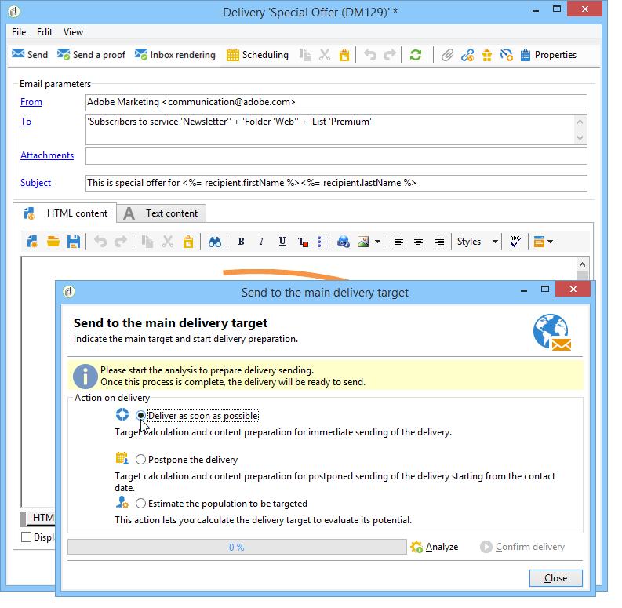

1. Clique em **[!UICONTROL Analyze]** para iniciar a análise manualmente.

   A barra de progresso mostra o progresso da análise.

   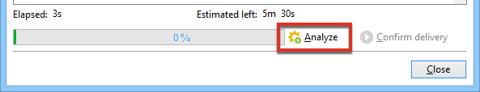

   >[!NOTE]
   >
   >As regras de validação usadas durante a análise são descritas na seção [Processo de validação com tipologias](steps-validating-the-delivery.md#validation-process-with-typologies).

1. É possível interromper a análise a qualquer momento, basta clicar em **[!UICONTROL Stop]**.

   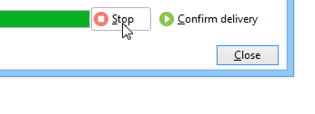

   Não será enviada nenhuma mensagem durante a fase de preparo. Portanto, é possível iniciar ou cancelar a análise sem riscos.

   >[!IMPORTANT]
   >
   >Durante a execução, a análise congela a entrega (ou a prova). Qualquer modificação na entrega (ou na prova) deve ser seguida de outra análise antes de se tornar aplicável.

1. Aguarde até que a análise seja concluída.

   Ao concluir a análise, a seção superior da janela indica se o preparo da entrega está concluído ou se ocorreram erros. Todas as etapas de validação, avisos e erros são listados. Os ícones coloridos mostram o tipo de mensagem:
   * O ícone azul indica uma mensagem informativa.
   * O ícone amarelo indica um erro de processamento não crítico.
   * O ícone vermelho indica um erro crítico que impede o envio da entrega.

   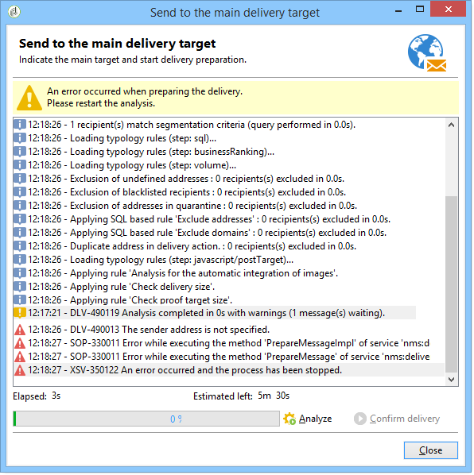

1. Clique em **[!UICONTROL Close]** para corrigir os erros, se houver.

1. Depois de fazer as alterações, reinicie a análise clicando em **[!UICONTROL Analyze]**.

Depois de verificar o resultado da análise, é possível clicar em **[!UICONTROL Confirm delivery]** para enviar a mensagem para o público-alvo especificado. Uma mensagem de confirmação permite iniciar a entrega.

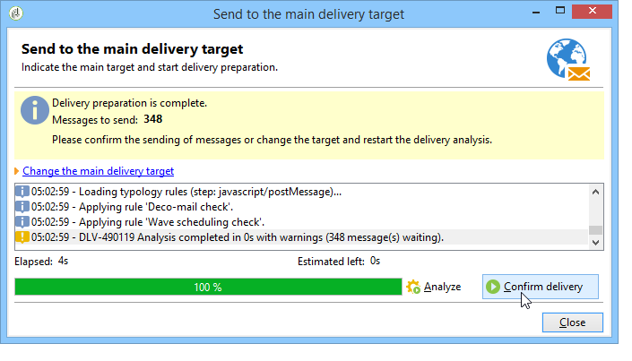

>[!NOTE]
>
>Clique no link **[!UICONTROL Change the main delivery target]** se o número de mensagens para enviar não corresponder à sua configuração. Isso permite que você altere a definição da população do target e reinicie a análise.

### Configurações de análise {#analysis-parameters}

A guia **[!UICONTROL Analysis]** das propriedades da entrega permite definir um conjunto de informações sobre o preparo de mensagens durante a fase de análise.

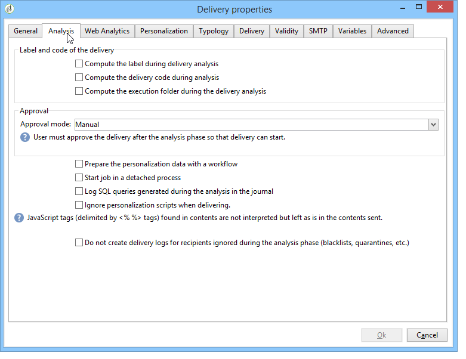

Essa guia fornece acesso às seguintes opções:

* **[!UICONTROL Label and code of the delivery]**: as opções referentes a esta seção são usadas para calcular os valores desses campos durante a fase de análise da entrega. O campo **[!UICONTROL Compute the execution folder during the delivery analysis]** calcula o nome da pasta que conterá essa ação de entrega durante a fase de análise.
* **[!UICONTROL Approval mode]** : esse campo permite a definição da entrega manual ou automática quando a análise é concluída. Os modos de validação são apresentados na seção [Alterar o modo de aprovação](#changing-the-approval-mode).
* **[!UICONTROL Prepare the delivery parts in the database]** : essa opção permite melhorar o desempenho da análise da entrega. Para obter mais informações, consulte [esta seção](#improving-delivery-analysis).
* **[!UICONTROL Prepare the personalization data with a workflow]** : essa opção permite preparar os dados de personalização contidos na entrega em um fluxo de trabalho automático, o que pode resultar em um aumento significativo no desempenho de execução da personalização. Para obter mais informações, consulte [Otimizar a personalização](personalization-fields.md#optimizing-personalization).
* **[!UICONTROL Start job in a detached process]** : essa opção permite iniciar a análise da entrega em um processo separado. A função de análise usa o processo do servidor de aplicativos Adobe Campaign (Web nlserver) por padrão. Ao selecionar essa opção, você garante que a análise será concluída mesmo no caso de falha do servidor de aplicativos.
* **[!UICONTROL Log SQL queries generated during the analysis in the journal]**: essa opção adiciona os logs de consulta SQL ao journal de entrega durante a fase de análise.
* **[!UICONTROL Ignore personalization scripts during sending]**: essa opção permite ignorar a interpretação das diretivas JavaScript encontradas no conteúdo HTML. Eles serão exibidos como nos conteúdos entregues. Essas diretivas são introduzidas com a tag **&lt;%=**.

### Melhorar o desempenho da análise de entrega {#improving-delivery-analysis}

Para acelerar o preparo da entrega, é possível marcar a opção **[!UICONTROL Prepare the delivery parts in the database]** antes de iniciar a análise.

Ao habilitar esta opção, o preparo da entrega é executado diretamente no banco de dados, o que pode acelerar significativamente a análise.

Atualmente, essa opção está disponível somente quando as seguintes condições são atendidas:

* A entrega deve ser um email. Por enquanto, os outros canais não são compatíveis.
* O mid-sourcing ou roteamento externo não deve ser usado, apenas o tipo de roteamento de entrega em massa. É possível verificar o roteamento usado na guia **[!UICONTROL General]** do **[!UICONTROL Delivery properties]**.
* Não é possível direcionar uma população proveniente de um arquivo externo. Para uma única entrega, clique no link **[!UICONTROL To]** do **[!UICONTROL Email parameters]** e verifique se a opção **[!UICONTROL Defined in the database]** está selecionada. Para uma entrega usada em um fluxo de trabalho, verifique se os destinatários estão **[!UICONTROL Specified by the inbound event(s)]** na guia **[!UICONTROL Delivery]**.
* É necessário o uso de um banco de dados PostgreSQL.

### Configurar a prioridade da análise {#analysis-priority-}

Quando a entrega é parte de uma campanha, a guia **[!UICONTROL Advanced]** oferece uma opção adicional. Isso permite organizar a ordem de processamento das entregas na mesma campanha.

Antes de enviar, cada entrega é analisada. A duração da análise depende do arquivo de extração de entrega. Quanto mais significativo for o tamanho do arquivo, mais tempo levará a análise, fazendo com que as entregas aguardem.

As opções para **[!UICONTROL Message preparation by the scheduler]** permitem priorizar a análise de entrega em um fluxo de trabalho da campanha.

Se uma entrega for muito grande, é melhor atribuir uma prioridade baixa para evitar o atraso na análise de outras entregas do fluxo de trabalho.

>[!NOTE]
>
>Para garantir que as análises de entrega maiores não retardem o progresso dos fluxos de trabalho, você poderá agendar suas execuções marcando **[!UICONTROL Schedule execution for a time of low activity]**.

## Enviar uma prova {#sending-a-proof}

Para detectar possíveis erros na configuração da mensagem, a Adobe recomenda configurar um ciclo de validação de entrega. Verifique se o conteúdo é aprovado com a frequência necessária enviando provas para testar os destinatários. Uma prova deve ser enviada toda vez que uma alteração for feita, para aprovar o conteúdo.

>[!NOTE]
>
>Os modos de validação disponíveis estão detalhados em [Alterar o modo de aprovação](steps-validating-the-delivery.md#changing-the-approval-mode).

Para enviar uma prova, siga as etapas abaixo:

1. Verifique se o target de prova foi configurado conforme descrito em [Definir um target de prova específico](steps-defining-the-target-population.md#defining-a-specific-proof-target).

1. Clique em **[!UICONTROL Send a proof]** na barra superior do assistente de entrega.

   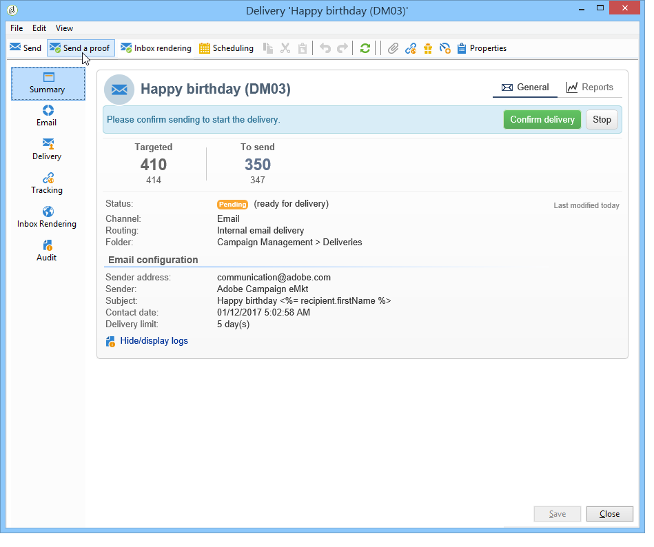

1. Inicie a análise de mensagem. Consulte [Analisar a entrega](steps-validating-the-delivery.md#analyzing-the-delivery).
1. Agora você pode enviar a entrega (consulte [Enviar a entrega](steps-sending-the-delivery.md)).

   Quando a entrega for enviada, a prova será exibida na lista de entrega e será automaticamente criada e numerada. Ela poderá ser editada se você quiser acessar seu conteúdo e propriedades. Para obter mais informações, consulte esta [página](about-delivery-monitoring.md).

   

   >[!NOTE]
   >
   >Se vários formatos forem criados para a entrega (HTML e Texto), você poderá escolher o formato das mensagens a serem enviadas aos destinatários da prova na seção inferior da janela.

   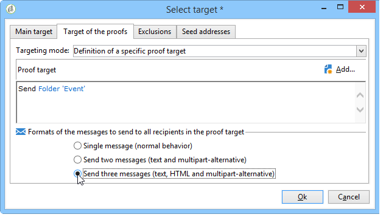

Talvez você queira modificar o conteúdo da entrega como resultado de qualquer comentário feito pelo grupo de validação que recebe a prova. Depois de fazer suas alterações, você deverá reiniciar a análise e enviar outra prova. Cada nova prova é numerada e registrada no journal de entrega.

Depois que a entrega for analisada, você poderá ver as várias provas enviadas por meio da subguia **[!UICONTROL Proofs]** do log (guia **[!UICONTROL Audit]**).

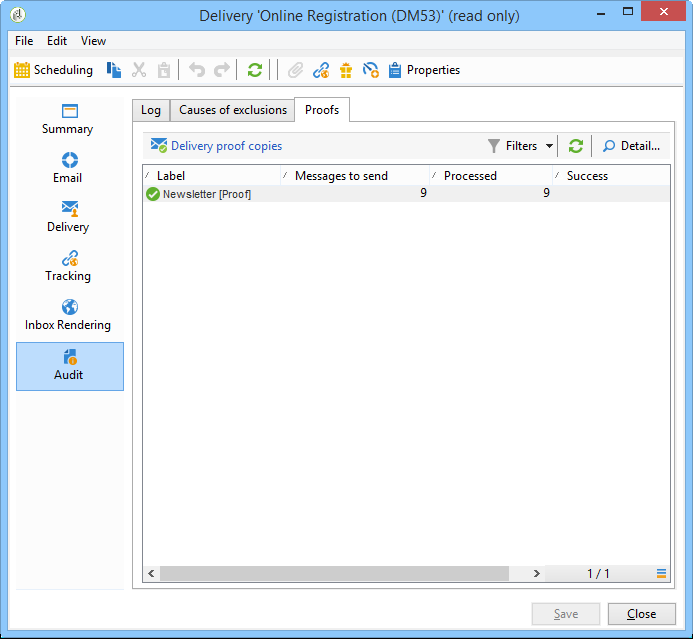

Você deverá enviar quantas provas forem necessárias até que o conteúdo da entrega esteja finalizado. Depois disso, você poderá enviar a entrega para o target principal e fechar o ciclo de validação.

A guia **[!UICONTROL Advanced]** das propriedades de entrega permite definir as propriedades da prova. Quando necessário, você poderá substituir as regras de exclusão de destinatário.

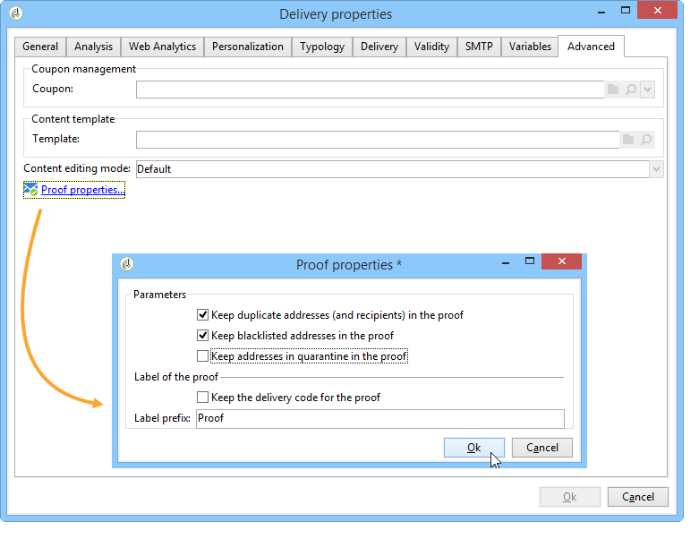

As seguintes opções estão disponíveis:

* A primeira opção permite que você mantenha as duplicatas da prova.
* As duas opções a seguir permitem manter em quarentena os destinatários que estão nas listas de bloqueio e de endereços. Consulte a descrição dessas opções para o target principal em [Personalizar configurações de exclusão](steps-defining-the-target-population.md#customizing-exclusion-settings). Diferentemente do target de uma entrega, em que esses endereços são excluídos por padrão, eles serão mantidos por padrão para o target de uma prova.
* A opção **[!UICONTROL Keep the delivery code for the proof]** permite que você forneça o mesmo código de entrega que o definido para a entrega com a qual ele está relacionado. Esse código é especificado na primeira etapa do assistente de entrega.
* Por padrão, o sujeito da prova tem o prefixo “Proof #”, onde # é o número da prova. É possível alterar esse prefixo no campo **[!UICONTROL Label prefix]**.

## Processo de validação com tipologias {#validation-process-with-typologies}

Antes de enviar qualquer mensagem, você deverá analisar a campanha para aprovar seu conteúdo e configuração. As regras de verificação aplicadas durante a fase de análise são definidas em uma **tipologia**. Por padrão, para emails, a análise cobre os seguintes pontos:

* Aprovando o objeto
* Aprovando as URLs e imagens
* Aprovação dos rótulos do URL
* Aprovando o link de cancelamento de subscrição
* Verificando o tamanho das provas
* Verificando o período de validade
* Verificando a programação de ondas

A tipologia a ser aplicada para cada entrega é selecionada na guia **[!UICONTROL Typologies]** nos parâmetros de entrega.

Você pode exibir e editar as regras de aprovação, o conteúdo, a ordem de execução e a descrição completa através do nó **[!UICONTROL Administration > Campaign execution > Typology management > Typology rules]**.

Você poderá criar novas regras e definir novas tipologias a partir desse nó. No entanto, essas tarefas são reservadas para usuários expert que conhecem JavaScript.

Para saber mais sobre regras de tipologia, consulte [esta página](../../campaign-opt/using/about-campaign-typologies.md).

Para editar a tipologia atual, clique no ícone **[!UICONTROL Edit link]** à direita do campo **[!UICONTROL Typology]**.

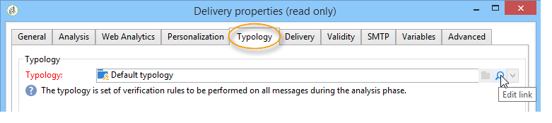

A guia **[!UICONTROL Rule]** fornece uma lista das regras de tipologia para serem aplicadas. Selecione uma regra e clique no ícone **[!UICONTROL Detail...]** para exibir sua configuração:

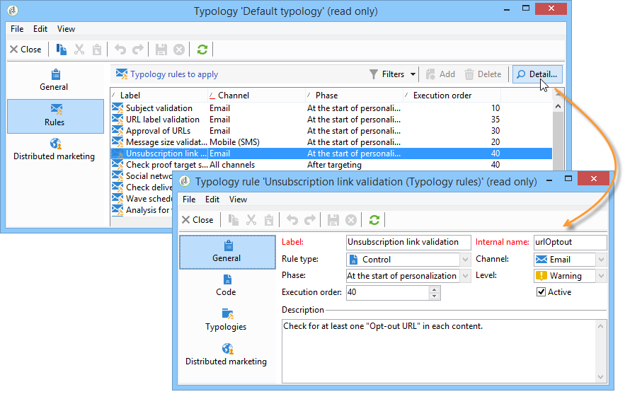

>[!NOTE]
>
>As tipologias do tipo **[!UICONTROL Arbitration]** são usadas dentro da estrutura de gerenciamento de regras de pressão. Para obter mais informações, consulte [esta seção](../../mrm/using/about-marketing-resource-management.md).

## Alterar o modo de aprovação {#changing-the-approval-mode}

A guia **[!UICONTROL Analysis]** das propriedades de entrega permite selecionar o modo de validação. Se os avisos forem gerados durante a análise (ex.: se certos caracteres estiverem acentuados no assunto da entrega etc.), você poderá configurar a entrega para definir se ela ainda deverá ou não ser executada. Por padrão, o usuário deverá confirmar o envio de mensagens no final da fase de análise: essa é a validação **manual**.

Selecione outro modo de aprovação na lista suspensa no campo apropriado.

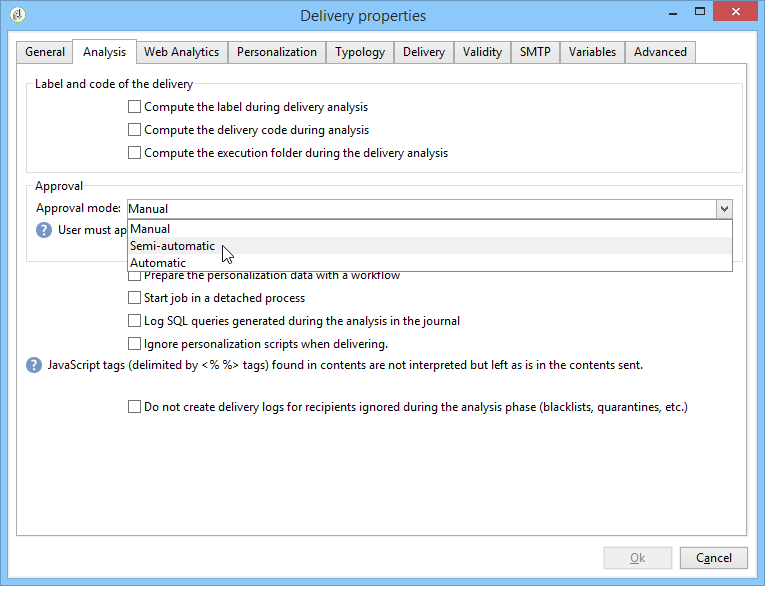

Os seguintes modos de aprovação estão disponíveis:

* **[!UICONTROL Manual]**: no final da fase de análise, o usuário deverá confirmar a entrega para começar a enviar. Para fazer isso, clique no botão **[!UICONTROL Start]** para iniciar a entrega.
* **[!UICONTROL Semi-automatic]**: o envio começa automaticamente se a fase de análise não gerar mensagens de advertência.
* **[!UICONTROL Automatic]**: o envio começa automaticamente no fim da fase de análise, independentemente do resultado.
