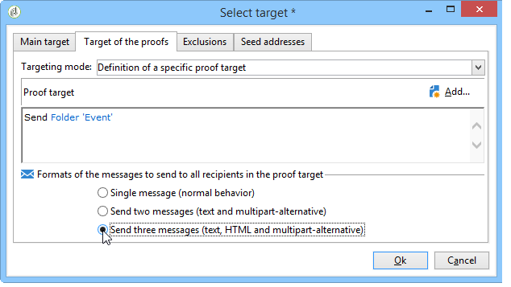

# Validando o dleivery {#validating-the-delivery}

Quando um delivery for criado e configurado, você deverá validá-lo antes de enviá-lo para o target principal.

Para fazer isso:

1. **Analyze the delivery**: esta etapa permite preparar as mensagens para entregar. Consulte [Análise do delivery](#analyzing-the-delivery).

   As regras aplicadas durante a análise são apresentadas na seção [Processo de validação com tipologias](#validation-process-with-typologies). Os modos de validação disponíveis estão detalhados na seção[Alteração do modo de aprovação](#changing-the-approval-mode).

1. **Send proofs**: esta etapa permite aprovar conteúdo, URLs, campos de personalização, etc. Consulte [Envio de uma prova](../../delivery/using/steps-validating-the-delivery.md#sending-a-proof) e [Definição de um target de prova](../../delivery/using/steps-defining-the-target-population.md#defining-a-specific-proof-target).

>[!IMPORTANT]
>
>Essas duas etapas devem ser executadas necessariamente após cada modificação no conteúdo da mensagem.

## Análise do delivery {#analyzing-the-delivery}

A análise é a fase na qual a população do target é calculada e o conteúdo de delivery é preparado. Uma vez concluído, o delivery estará pronto para ser enviado.

### Início da análise {#launching-the-analysis}

1. Para iniciar a análise do delivery, clique em **[!UICONTROL Send]**.
1. Selecione **[!UICONTROL Deliver as soon as possible]**.

   

1. Clique em **[!UICONTROL Analyze]** para iniciar a análise manualmente.

   A barra de progresso mostra o progresso da análise.

   

   >[!NOTE]
   >
   >As regras de validação usadas durante a análise são descritas na seção [Processo de validação com tipologias](../../delivery/using/steps-validating-the-delivery.md#validation-process-with-typologies).

1. É possível interromper a análise a qualquer momento, basta clicar em **[!UICONTROL Stop]**.

   

   Não será enviada nenhuma mensagem durante a fase de preparo. Portanto, é possível iniciar ou cancelar a análise sem riscos.

   >[!IMPORTANT]
   >
   >Durante a execução, a análise congela o delivery (ou a prova). Qualquer modificação no delivery (ou na prova) deve ser seguida de outra análise antes de se tornar aplicável.

1. Aguarde até que a análise seja concluída.

   Ao concluir a análise, a seção superior da janela indica se o preparo do delivery está concluído ou se ocorreram erros. Todas as etapas de validação, avisos e erros são listados. Os ícones coloridos mostram o tipo de mensagem:
   * O ícone azul indica uma mensagem informativa.
   * O ícone amarelo indica um erro de processamento não crítico.
   * O ícone vermelho indica um erro crítico que impede o envio do delivery.
   

1. Clique em **[!UICONTROL Close]** para corrigir os erros, se houver.

1. Depois de fazer as alterações, reinicie a análise clicando em **[!UICONTROL Analyze]**.

Depois de verificar o resultado da análise, é possível clicar em **[!UICONTROL Confirm delivery]** para enviar a mensagem para o público-alvo especificado. Uma mensagem de confirmação permite iniciar o delivery.

>[!NOTE]
>
>Clique no link **[!UICONTROL Change the main delivery target]** se o número de mensagens para enviar não corresponder à sua configuração. Isso permite que você altere a definição da população do target e reinicie a análise.

### Parâmetros de análise {#analysis-parameters}

A guia **[!UICONTROL Analysis]** das propriedades do delivery permite definir um conjunto de informações sobre o preparo de mensagens durante a fase de análise.

Essa guia fornece acesso às seguintes opções:

* **[!UICONTROL Label and code of the delivery]**: as opções referentes a esta seção são usadas para calcular os valores desses campos durante a fase de análise do delivery. O campo **[!UICONTROL Compute the execution folder during the delivery analysis]** calcula o nome da pasta que conterá essa ação de delivery durante a fase de análise.
* **[!UICONTROL Approval mode]** : esse campo permite a definição do delivery manual ou automática quando a análise é concluída. Os modos de validação são apresentados na seção [Alteração do modo de aprovação](#changing-the-approval-mode).
* **[!UICONTROL Prepare the delivery parts in the database]** : essa opção permite melhorar o desempenho da análise do delivery. Para obter mais informações, consulte [esta seção](#improving-delivery-analysis).
* **[!UICONTROL Prepare the personalization data with a workflow]** : 
essa opção permite preparar os dados de personalização contidos no delivery em um fluxo de trabalho automático, o que pode resultar em um aumento significativo no desempenho para executar a personalização. Para obter mais informações, consulte [Otimização da personalização](../../delivery/using/personalization-fields.md#optimizing-personalization).
* **[!UICONTROL Start job in a detached process]** : essa opção permite iniciar a análise do delivery em um processo separado. A função de análise usa o processo do servidor de aplicativos Adobe Campaign (Web nlserver) por padrão. Ao selecionar essa opção, você garante que a análise será concluída mesmo no caso de falha do servidor de aplicativos.
* **[!UICONTROL Log SQL queries generated during the analysis in the journal]**: essa opção adiciona os logs de consulta SQL ao journal de delivery durante a fase de análise.
* **[!UICONTROL Ignore personalization scripts during sending]**: essa opção permite ignorar a interpretação das diretivas JavaScript encontradas no conteúdo HTML. Eles serão exibidos como nos conteúdos entregues. Essas diretivas são introduzidas com a tag **&lt;%=**.

### Melhora no desempenho da análise do delivery {#improving-delivery-analysis}

Para acelerar o preparo do delivery, é possível marcar a opção **[!UICONTROL Prepare the delivery parts in the database]** antes de iniciar a análise.

Ao ativar esta opção, o preparo do delivery é executado diretamente no banco de dados, o que pode acelerar significativamente a análise.

Atualmente, essa opção está disponível somente quando as seguintes condições são atendidas:
* O delivery deve ser um email. Por enquanto, os outros canais não são compatíveis.
* O mid-sourcing ou roteamento externo não deve ser usado, apenas o tipo de roteamento de delivery em massa. É possível verificar o roteamento usado na guia **[!UICONTROL General]** do **[!UICONTROL Delivery properties]**.
* Não é possível direcionar uma população proveniente de um arquivo externo. Para uma única entrega, clique no link **[!UICONTROL To]** do **[!UICONTROL Email parameters]** e verifique se a opção **[!UICONTROL Defined in the database]** está selecionada. Para um delivery usado em um fluxo de trabalho, verifique se os destinatários estão **[!UICONTROL Specified by the inbound event(s)]** na guia **[!UICONTROL Delivery]**.
* É necessário o uso de um banco de dados PostgreSQL.

### Configurar a prioridade da análise {#analysis-priority-}

Quando o delivery é parte de uma campanha, a guia **[!UICONTROL Advanced]** oferece uma opção adicional. Isso permite organizar a ordem de processamento dos deliveries na mesma campanha.

Antes de enviar, cada delivery é analisado. A duração da análise depende do arquivo de extração de delivery. Quanto mais significativo for o tamanho do arquivo, mais tempo levará a análise, fazendo com que os deliveries aguardem.

As opções para **[!UICONTROL Message preparation by the scheduler]** permitem priorizar a análise de delivery em um workflow da campanha.

Se um delivery for muito grande, é melhor atribuir uma prioridade baixa a ele para evitar o atraso na análise de outros deliveries do workflow.

>[!NOTE]
>
>Para garantir que as análises de delivery maiores não retardem o progresso dos workflows, você poderá agendar suas execuções marcando **[!UICONTROL Schedule execution for a time of low activity]**.

## Envio de uma prova {#sending-a-proof}

Para detectar possíveis erros na configuração da mensagem, a Adobe recomenda configurar um ciclo de validação de entrega. Verifique se o conteúdo é aprovado com a frequência necessária enviando provas para testar os destinatários. Uma prova deve ser enviada toda vez que uma alteração for feita, para aprovar o conteúdo.

>[!NOTE]
>
>* Os modos de validação disponíveis estão detalhados em [Alterar o modo de aprovação](../../delivery/using/steps-validating-the-delivery.md#changing-the-approval-mode).
>* A configuração do target de prova é explicada em [Definição de um target de prova específico](../../delivery/using/steps-defining-the-target-population.md#defining-a-specific-proof-target).
>

Para enviar uma prova, siga as etapas abaixo:

1. Verifique se o target de prova foi configurado conforme descrito em [Definição de um target de prova específico](../../delivery/using/steps-defining-the-target-population.md#defining-a-specific-proof-target).
1. Clique em **[!UICONTROL Send a proof]** na barra superior do assistente do delivery.

   

1. Iniciar análise de mensagem. Consulte [Análise de delivery](../../delivery/using/steps-validating-the-delivery.md#analyzing-the-delivery).
1. Agora você pode enviar o delivery (consulte [Envio do delivery](../../delivery/using/steps-sending-the-delivery.md)).

   Quando o delivery for enviado, a prova será exibida na lista de delivery e será automaticamente criada e numerada. Ela poderá ser editada se você quiser acessar seu conteúdo e propriedades. Para obter mais informações, consulte esta [página](../../delivery/using/monitoring-a-delivery.md#delivery-dashboard).

   

   >[!NOTE]
   >
   >Se vários formatos forem criados para o delivery (HTML e Texto), você poderá escolher o formato das mensagens a serem enviadas aos recipients da prova na seção inferior da janela.

   

Talvez você queira modificar o conteúdo do delivery como resultado de qualquer comentário feito pelo grupo de validação que recebe a prova. Depois de fazer suas alterações, você deverá reiniciar a análise e enviar outra prova. Cada nova prova é numerada e registrada no journal de delivery.

Depois que o delivery for analisado, você poderá ver as várias provas enviadas por meio da subguia **[!UICONTROL Proofs]** do log (guia **[!UICONTROL Audit]**).

Você deverá enviar quantas provas forem necessárias até que o conteúdo do delivery esteja finalizado. Depois disso, você poderá enviar o delivery para o target principal e fechar o ciclo de validação.

A guia **[!UICONTROL Advanced]** das propriedades de delivery permite definir as propriedades da prova. Quando necessário, você poderá substituir as regras de exclusão de recipient.

As seguintes opções estão disponíveis:

* A primeira opção permite que você mantenha as duplicatas da prova.
* Ambas as opções a seguir permitem manter recipient que estão na lista de blocos e endereços na quarentena. Consulte a descrição dessas opções para o target principal em [Personalizar configurações de exclusão](../../delivery/using/steps-defining-the-target-population.md#customizing-exclusion-settings). Diferentemente do target de um delivery, onde esses endereços são excluídos por padrão, eles serão mantidos por padrão para o target de uma prova.
* A opção **[!UICONTROL Keep the delivery code for the proof]** permite que você forneça o mesmo código de delivery que o definido para o delivery com o qual ele está relacionado. Este código é especificado na primeira etapa do assistente de delivery.
* Por padrão, o assunto da prova tem o prefixo &#39;Proof #&#39;, onde # é o número da prova. É possível alterar esse prefixo no campo **[!UICONTROL Label prefix]**.

## Processo de validação com tipologias {#validation-process-with-typologies}

Antes de enviar qualquer mensagem, você deverá analisar a campanha para aprovar seu conteúdo e configuração. As regras de verificação aplicadas durante a fase de análise são definidas em uma **tipologia**. Por padrão, para emails, a análise cobre os seguintes pontos:

* Aprovando o objeto
* Aprovando as URLs e imagens
* Aprovação dos rótulos do URL
* Aprovando o link de cancelamento de subscrição
* Verificando o tamanho das provas
* Verificando o período de validade
* Verificando a programação de ondas

A tipologia a ser aplicada para cada delivery é selecionada na guia **[!UICONTROL Typologies]** nos parâmetros de delivery.

Você pode exibir e editar as regras de aprovação, o conteúdo, a ordem de execução e a descrição completa através do nó **[!UICONTROL Administration > Campaign execution > Typology management > Typology rules]**.

Você poderá criar novas regras e definir novas tipologias a partir desse nó. No entanto, essas tarefas são reservadas para usuários expert que conhecem JavaScript.

Para obter mais informações sobre regras de tipologia, consulte [Sobre tipologias da campanha](../../campaign/using/about-campaign-typologies.md).

Para editar a tipologia atual, clique no ícone **[!UICONTROL Edit link]** à direita do campo **[!UICONTROL Typology]**.

A guia **[!UICONTROL Rule]** fornece uma lista das regras de tipologia para serem aplicadas. Selecione uma regra e clique no ícone **[!UICONTROL Detail...]** para exibir sua configuração:

>[!NOTE]
>
>As tipologias do tipo **[!UICONTROL Arbitration]** são usadas dentro da estrutura de gerenciamento de regras de pressão. Para obter mais informações, consulte [esta seção](../../campaign/using/about-marketing-resource-management.md).

## Alterando o modo de aprovação {#changing-the-approval-mode}

A guia **[!UICONTROL Analysis]** das propriedades de delivery permite selecionar o modo de validação. Se os avisos forem gerados durante a análise (ex.: se certos caracteres estiverem acentuados no assunto da entrega etc.), você poderá configurar o delivery para definir se ele ainda deverá ou não ser executado. Por padrão, o usuário deverá confirmar o envio de mensagens no final da fase de análise: essa é a validação **manual**.

Selecione outro modo de aprovação na lista suspensa no campo apropriado.

Os seguintes modos de aprovação estão disponíveis:

* **[!UICONTROL Manual]**: no final da fase de análise, o usuário deverá confirmar o delivery para começar a enviar. Para fazer isso, clique no botão **[!UICONTROL Start]** para iniciar o delivery.
* **[!UICONTROL Semi-automatic]**: o envio começa automaticamente se a fase de análise não gerar mensagens de advertência.
* **[!UICONTROL Automatic]**: o envio começa automaticamente no fim da fase de análise, independentemente do resultado.
