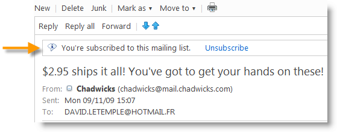

# Recomendações técnicas{#technical-recommendations}

Várias técnicas, configurações e ferramentas que podem ser usadas para melhorar a taxa de entrega estão listadas abaixo.

## Configuração {#configuration}

### DNS reverso {#reverse-dns}

O Adobe Campaign verifica se um DNS reverso é fornecido para um endereço IP e que isso seja apontado corretamente ao IP.

Um ponto importante na configuração da rede é verificar se um DNS reverso correto está definido para cada um dos endereços IP de mensagens de saída. Isso significa que, para determinado endereço IP, há um registro de DNS reverso (registro PTR) com um DNS correspondente (registro A) fazendo looping para o endereço IP inicial.

A escolha de domínio para um DNS reverso tem impacto ao lidar com determinados ISPs. A AOL, em particular, aceita apenas loops de comentários com um endereço no mesmo domínio que o DNS reverso (consulte [Loop de comentários](#feedback-loop)).

Uma ferramenta está disponível para verificar a configuração de um domínio: [https://mxtoolbox.com/SuperTool.aspx](https://mxtoolbox.com/SuperTool.aspx).

### Regras MX {#mx-rules}

As regras MX (Mail eXchanger) são as regras que gerenciam a comunicação entre um servidor de envio e um servidor de recebimento.

Mais precisamente, eles são usados para controlar a velocidade na qual o MTA da campanha (agente de transferência de mensagens) envia emails para cada domínio de email individual ou ISP (por exemplo, hotmail.com, comcast.net). Normalmente, essas regras se baseiam nos limites publicados pelos ISPs (por exemplo, não incluir mais de 20 mensagens por cada conexão SMTP).

Para obter mais informações sobre gestão MX, consulte [esta seção](../../installation/using/email-deliverability.md#mx-configuration).

### TLS {#tls}

TLS (Transport Layer Security) é um protocolo de criptografia que pode ser usado para proteger a conexão entre dois servidores de email e proteger o conteúdo de um email de ser lido por qualquer pessoa que não seja os destinatários pretendidos.

## Autenticação {#authentication}

### SPF {#spf}

O SPF (Sender Policy Framework) é um padrão de autenticação de email que permite ao proprietário de um domínio especificar quais servidores de email podem enviar emails em nome desse domínio. Este padrão usa o domínio no cabeçalho &quot;Return-Path&quot; do email (também conhecido como o endereço &quot;Envelope From&quot;).

Uma ferramenta está disponível para verificar um registro SPF: [https://www.kitterman.com/spf/validate.html](https://www.kitterman.com/spf/validate.html)

O SPF é uma técnica que, até certo ponto, permite que você verifique se o nome de domínio usado em um email não foi falsificado. Quando uma mensagem é recebida de um domínio, o servidor DNS do domínio é consultado. A resposta é um registro curto (o registro SPF) que detalha quais servidores estão autorizados a enviar emails desse domínio. Partindo do princípio que somente o proprietário do domínio tem o meio de alterar esse registro, podemos considerar que essa técnica não permite que o endereço do remetente seja falsificado, pelo menos não a parte à direita do &quot;@&quot;.

Na [especificação RFC 4408](https://www.rfc-editor.org/info/rfc4408) final, dois elementos da mensagem são usados para determinar o domínio considerado como remetente: o domínio especificado pelo comando SMTP &quot;HELO&quot; (ou &quot;EHLO&quot;) e o domínio especificado pelo endereço do cabeçalho &quot;Return-Path&quot; (ou &quot;MAIL FROM&quot;), que também é o endereço de devolução. As diferentes considerações possibilitam levar em conta apenas um desses valores; recomendamos garantir que ambas as fontes especifiquem o mesmo domínio.

A verificação do SPF fornece uma avaliação da validade do domínio do remetente:

* **None**: Não foi possível executar nenhuma avaliação,
* **Neutral**: O domínio consultado não habilita a avaliação,
* **Pass**: O domínio é considerado autêntico,
* **Fail**: O domínio é falso e a mensagem deve ser rejeitada,
* **SoftFail**: O domínio provavelmente é falso, mas a mensagem não deve ser rejeitada exclusivamente com base neste resultado,
* **TempError**: Um erro temporário interrompeu a avaliação. A mensagem pode ser rejeitada,
* **PermError**: Os registros SPF do domínio são inválidos.

Vale observar que os registros feitos no nível dos servidores DNS podem levar até 48 horas para serem levados em conta. Esse atraso depende da frequência com que os caches DNS dos servidores receptores são atualizados.

### DKIM {#dkim}

A autenticação DKIM (DomainKeys Identified Mail) é uma sucessora do SPF e usa criptografia de chave pública que permite ao servidor de email de recebimento verificar se uma mensagem foi enviada pela pessoa ou entidade pela qual alega ter sido enviada e se o conteúdo da mensagem foi alterado entre o momento em que foi originalmente enviada (e o DKIM &quot;assinado&quot;) e o momento em que foi recebida. Normalmente, esse padrão usa o domínio no cabeçalho &quot;From&quot; ou &quot;Sender&quot;. Para garantir o nível de segurança do DKIM, o 1024b é o tamanho de criptografia recomendado pelas Práticas Recomendadas. As chaves DKIM inferiores não serão consideradas válidas pela maioria dos provedores de acesso.

O DKIM vem de uma combinação dos princípios de autenticação do DomainKeys, Yahoo! e Cisco Identified Internet Mail, e é usado para verificar a autenticidade do domínio emissor e garantir a integridade da mensagem.

O DKIM substituiu a autenticação **DomainKeys** .

O uso de DKIM requer alguns pré-requisitos:

* **Segurança**: a criptografia é um elemento essencial do DKIM e, para garantir o nível de segurança do DKIM desde 2013, 1024b é o tamanho de criptografia sugerido pelas práticas recomendadas. As chaves DKIM inferiores não serão consideradas válidas pela maioria dos provedores de acesso.
* **Reputação**: a reputação baseia-se no IP e/ou no domínio, mas um seletor de DKIM menos transparente também é um elemento essencial para ser levado em conta. Escolher o seletor é importante: evite manter o seletor “padrão” que poderia ser usado por qualquer pessoa e, portanto, tem uma reputação muito fraca. Você deve implementar um seletor diferente para **comunicações de retenção versus aquisições** e para autenticação.
* A **declaração de opção do Adobe Campaign**: no Adobe Campaign, a chave privada DKIM é baseada em um seletor DKIM e um domínio. No momento, não é possível criar várias chaves privadas para o mesmo domínio/subdomínio com seletores diferentes. Não é possível definir qual domínio/subdomínio do seletor deve ser usado para a autenticação em nenhuma plataforma ou email. A plataforma selecionará alternativamente uma das chaves privadas, o que significa que a autenticação tem uma grande chance de falha.

>[!NOTE]
>
>* Se você configurou o DomainKeys para a instância do Adobe Campaign, basta selecionar **dkim** nas [regras de gerenciamento do domínio](../../delivery/using/understanding-delivery-failures.md#domain-management). Caso contrário, siga as mesmas etapas de configuração (chave privada/pública) do DomainKeys.
>* Não é necessário ativar DomainKeys e DKIM para o mesmo domínio, pois DKIM é uma versão aprimorada do DomainKeys.
>* Os domínios a seguir validam atualmente o DKIM: AOL, Gmail.


>[!IMPORTANT]
>
>Para instalações hospedadas ou híbridas, se você atualizou para o [MTA aprimorado](https://helpx.adobe.com/campaign/kb/acc-campaign-enhanced-mta.html), a assinatura de autenticação de email do DKIM é feita pelo MTA aprimorado para todas as mensagens em todos os domínios.

### DMARC {#dmarc}

DMARC (Domain-based Message Authentication, Reporting and Conformance) é a forma mais recente de autenticação de email e depende da autenticação SPF e DKIM para determinar se um email é aprovado ou reprovado. O DMARC é único e eficiente de duas maneiras muito importantes:

* Conformidade - permite que o remetente instrua os ISPs sobre o que fazer com qualquer mensagem que não seja autenticada (por exemplo, não aceitar).
* Relatório - fornece ao remetente um relatório detalhado mostrando todas as mensagens que falharam na autenticação DMARC, juntamente com o domínio &quot;From&quot; e o endereço IP usados para cada uma. Isso permite que uma empresa identifique emails legítimos que estejam falhando na autenticação e precise de algum tipo de &quot;correção&quot; (por exemplo, adicionar endereços IP ao registro SPF), bem como as fontes e a prevalência de tentativas de phishing em seus domínios de email.

O DMARC pode se beneficiar dos relatórios gerados por [250ok](https://250ok.com/).

<!--#### Configuring the application {#configuring-the-application}

To define the domain used for the HELO command, edit the instance's configuration file (conf/config-instance.xml) and define a "localDomain" attribute as follows:

```
<serverConf>
  <shared>
    <dnsConfig localDomain="mydomain.net"/>
  </shared>
</serverConf>
```

The MAIL FROM domain is the domain used in technical bounce messages. This address is defined in the deployment wizard or via the NmsEmail_DefaultErrorAddr option.

#### DNS configuration {#dns-configuration}

An SPF record can currently be defined on a DNS server as a TXT type record (code 16) or an SPF type record (code 99). An SPF record takes the form of a character string. For example:

```
v=spf1 ip4:12.34.56.78/32 ip4:12.34.56.79/32 ~all
```

defines the 2 IP addresses 12.34.56.78 and 12.34.56.79 as authorized to send emails for the domain. **~all** means that any other address should be interpreted as a SoftFail.

Recommendations for defining an SPF record:

* Add **~all** (SoftFail) or **-all** (Fail) at the end to reject all servers other than those defined. Without this, servers will be able to forge this domain (with a Neutral evaluation).
* Do not add **ptr** (openspf.org recommends against this as costly and unreliable).-->

## Loop de comentários {#feedback-loop}

Um loop de cometários funciona declarando no nível do ISP determinado endereço de email para um intervalo de endereços IP usados para enviar mensagens. O ISP enviará para esta caixa de entrada, de maneira semelhante ao que é feito para mensagens devolvidas, essas mensagens são relatadas por recipients como spam. A plataforma deve estar configurada para bloquear futuros deliveries para os usuários que reclamaram. É importante deixar de entrar em contato com eles, mesmo que não tenham usado o link de opt out adequado. É com base nestas queixas que um FSI acrescentará um endereço IP à sua lista de bloqueios. Dependendo do ISP, uma taxa de reclamações de cerca de 1% resultará no bloqueio de um endereço IP.

No momento, um padrão está sendo projetado para definir o formato de mensagens de loop de comentários: o [ARF (Abuse Feedback Reporting Format)](https://tools.ietf.org/html/rfc6650).

A implementação de um loop de comentários para uma instância requer:

* Uma caixa de entrada dedicada à instância, que pode ser a caixa de entrada de devolução
* Endereços IP de envio dedicados à instância

A implementação de um loop de comentários simples no Adobe Campaign usa a funcionalidade de mensagem de devolução. A caixa de entrada do loop de comentários é usada como uma caixa de entrada de devolução e uma regra é definida para detectar essas mensagens. Os endereços de email dos recipients que relataram a mensagem como spam serão adicionados à lista de quarentena.

* Criar ou modificar uma regra para emails devolvidos, **Feedback_loop**, em **[!UICONTROL Administration > Campaign Management > Non deliverables Management > Mail rule sets]** com o motivo **Recusado** e o tipo **Difícil**.
* Se uma caixa de entrada tiver sido definida especialmente para o loop de comentários, defina os parâmetros para acessá-la criando uma nova conta externa para emails devolvidos em **[!UICONTROL Administration > Platform > External accounts]**.

O mecanismo fica operacional imediatamente para processar as notificações de reclamação. Para garantir que essa regra funcione corretamente, você pode desativar temporariamente as contas para que elas não coletem essas mensagens e verificar manualmente o conteúdo da caixa de entrada do loop de comentários. No servidor, execute os seguintes comandos:

```
nlserver stop inMail@instance,
nlserver inMail -instance:instance -verbose.
```

Se você for forçado a usar um único endereço de loop de comentários para várias instâncias, será necessário:

* Replicar as mensagens recebidas em quantas caixas de entrada houver instâncias,
* Selecionar cada caixa de entrada para uma única instância,
* Configure as instâncias de modo que elas só processem as mensagens que lhes dizem respeito: as informações da instância são incluídas no cabeçalho Message-ID de mensagens enviadas pelo Adobe Campaign e, portanto, também estão localizadas nas mensagens de loop de comentários. Basta especificar o parâmetro **checkInstanceName** no arquivo de configuração da instância (por padrão, a instância não é verificada e isso pode fazer com que alguns endereços sejam colocados em quarentena incorretamente):

   ```
   <serverConf>
     <inMail checkInstanceName="true"/>
   </serverConf>
   ```

O serviço de Deliverability do Adobe Campaign gerencia sua subscrição para serviços de loop de comentários para os seguintes ISPs: AOL, BlueTime, Comcast, Cox, EarthLink, FastMail, Gmail, Hotmail, HostedEmail, Libero, Mail.ru, MailTrust, OpenSRS, QQ, RoadRunner, Synacor, Telenor, Terra, UnitedOnline, USA, XS4ALL, Yahoo, Yandex, Zoho.

## List-Unsubscribe {#list-unsubscribe}

### Sobre o List-Unsubscribe {#about-list-unsubscribe}

Adicionar um cabeçalho SMTP chamado **List-Unsubscribe** é obrigatório para garantir o gerenciamento ideal de deliverability.

Esse cabeçalho pode ser usado como um ícone alternativo para o ícone &quot;Denunciar como SPAM&quot;. Ele será exibido como um link de unsubscription na interface de email.

Usar essa funcionalidade ajuda a proteger sua reputação e os comentários serão executados como unsubscription.

>[!NOTE]
>
>Essa funcionalidade está disponível no Build 6831.

Para usar o List-Unsubscribe, você deverá inserir uma linha de comando semelhante à seguinte:

```
List-Unsubscribe: mailto: client@newsletter.example.com?subject=unsubscribe?body=unsubscribe
```

>[!IMPORTANT]
>
>O exemplo acima é baseado na tabela do recipient. Se a implementação do banco de dados for feita a partir de outra tabela, reescreva a linha de comando com as informações corretas.

A linha de comando a seguir pode ser usada para criar um **List-Unsubscribe** dinâmico:

```
List-Unsubscribe: mailto: %=errorAddress%?subject=unsubscribe%=message.mimeMessageId%
```

O Gmail, o Outlook.com e o Microsoft Outlook são compatíveis com esse método e um botão de cancelamento de subscrição está disponível diretamente nas suas interfaces. Essa técnica reduz as taxas de reclamação.




É possível implementar o **List-Unsubscribe** ao:

* adicionar diretamente a linha de comando no template do delivery - consulte [esta seção](#adding-a-command-line-in-a-delivery-template),
* ou criar uma regra de tipologia, consulte [esta seção](#creating-a-typology-rule).

### Adição de uma linha de comando em um template do delivery {#adding-a-command-line-in-a-delivery-template}

A linha de comando deve ser incluída na seção adicional do cabeçalho SMTP do email.

Essa adição pode ser feita em cada email ou nos templates do delivery existentes. Você também poderá criar um novo template do delivery que inclua essa funcionalidade.

### Criação de uma regra de tipologia {#creating-a-typology-rule}

A regra deverá conter o script que gera a linha de comando e deverá ser incluída no cabeçalho do email.

>[!NOTE]
>
>Recomendamos a criação de uma regra de tipologia: a funcionalidade List-Unsubscribe será adicionada automaticamente em cada email.

1. List-Unsubscribe: &lt;mailto:unsubscribe@domain.com>

   Clicar no link de **cancelamento de subscrição** abrirá o cliente de email padrão do usuário. Essa regra de tipologia deverá ser adicionada em uma tipologia usada para criar emails.

1. List-Unsubscribe: `<https://domain.com/unsubscribe.jsp>`

   Clicar no link de **cancelamento de subscrição** redireciona o usuário para o formulário de unsubscription.

   Exemplo:

   

## Otimização de email {#email-optimization}

### SMTP {#smtp}

O SMTP (Simple Mail Transfer Protocol) é um protocolo padrão da Internet para transmissão de email.

Os erros SMTP que não são verificados por uma regra são listados na pasta **[!UICONTROL Administration]** > **[!UICONTROL Campaign Management]** > **[!UICONTROL Non deliverables Management]** > **[!UICONTROL Delivery log qualification]**. Essas mensagens de erro são interpretadas por padrão como erros de software inacessíveis. Os erros mais comuns devem ser identificados e uma regra correspondente adicionada em **[!UICONTROL Administration]** > **[!UICONTROL Campaign Management]** > **[!UICONTROL Non deliverables Management]** > **[!UICONTROL Mail rule sets]** se você quiser qualificar corretamente o feedback dos servidores SMTP. Sem isso, a plataforma executará tentativas desnecessárias (caso de usuários desconhecidos) ou colocará alguns recipients em quarentena de forma equivocada após determinado número de testes.

### IPs dedicados {#dedicated-ips}

A Adobe fornece uma estratégia de IP dedicada para cada cliente com um IP ampliado para criar uma reputação e otimizar o desempenho de delivery.

## Certificação IP {#ip-certification}

A certificação IP é um programa de práticas recomendadas de envio que ajuda a garantir que os e-mails sejam recebidos sem serem bloqueados por filtros antisspam ou outros sistemas de bloqueio de e-mail.

Atualmente, dois provedores oferecem certificação IP: Return Path e Certified Senders Alliance.

Os remetentes certificados são adicionados a listas de permissões de email usadas por provedores globais de caixa de correio e empresas de segurança de email. Essas listas de permissões comerciais são baseadas em um sistema que permite que o remetente ignore filtros antisspam ou receba pontos incrementais à medida que ele entra no sistema.

O programa [Return Path Certification](https://www.validity.com/products/returnpath/certification/) oferece vários benefícios, incluindo:

* Um aumento mensurável no posicionamento da caixa de entrada nos principais provedores de caixa de correio, como Microsoft, AOL, Yahoo, Gmail, Comcast, Orange, Mail.ru e outros
* Idoneidade e tratamento favoráveis em filtros críticos como Cloudmark, SpamAssassin e Cisco Ironport
* Uma equipe de conformidade dedicada ao monitoramento 24 horas por dia, 7 dias por semana, fornecendo alertas de segurança e trabalhando com você na solução de quaisquer problemas
* Dados do provedor de caixa de correio que fornecem informações detalhadas sobre KPIs, inserção e desempenho de certificação
* Aquecimento de IP simplificado e mais rápido, incluindo maior reputação e reconhecimento ao migrar ou obter um novo endereço IP

A certificação da [Certified Senders Alliance](https://certified-senders.org/certification-process/) oferece, entre outros benefícios:

* Certificação de remetentes de emails comerciais que podem cumprir altos padrões de qualidade
* Melhoria no delivery e deliverability de emails comerciais para aumentar a taxa de inserção da caixa de entrada e reduzir a filtragem de spam
* Proteção contra os riscos legais e financeiros através do pleno cumprimento das normas legais
* Proteção da reputação através de avisos antecipados do CSA Complaints Office e de relatórios diários de captura de spam

Os ISPs são livres para usar esses serviços e o número de ISPs pode variar dependendo da lista de permissões.

No entanto, como cada vez mais ISPs criam seus filtros anti-spam com base no comportamento de cada proprietário da caixa de entrada, em vez de analisar o conteúdo da mensagem propriamente dita, o uso da certificação IP não pode ser uma garantia de inserção da caixa de entrada ou até mesmo do delivery.
