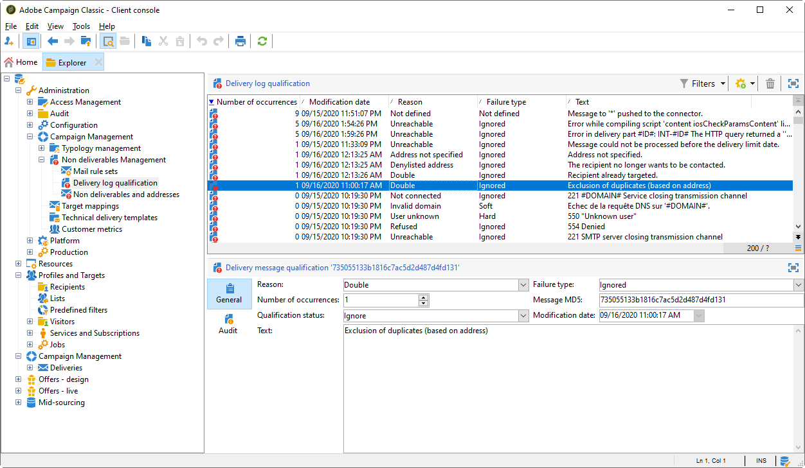

# Compreensão de falhas de entrega{#understanding-delivery-failures}

## Sobre falhas de delivery {#about-delivery-failures}

Quando uma mensagem (email, SMS, notificação por push) não pode ser enviada a um perfil, o servidor remoto envia automaticamente uma mensagem de erro, que é recebida pela plataforma do Adobe Campaign, que determina se o endereço de email ou o número de telefone deve ir para a quarentena. Consulte [Gerenciamento de emails de devolução](#bounce-mail-management).

>[!NOTE]
>
>Mensagens de erro de **email** (ou &quot;rejeições&quot;) são qualificadas pelo MTA aprimorado (rejeições síncronas) ou pelo processo inMail (rejeições assíncronas).
>
>**Mensagens de erro de SMS (ou &quot;SR&quot; para &quot;Relatório de Status&quot;) são qualificadas pelo processo MTA.**

Quando uma mensagem é enviada, os logs do delivery permitem visualizar o status do delivery de cada perfil, o tipo de falha e o motivo associados.

As mensagens também podem ser excluídas durante a preparação do delivery se um endereço estiver em quarentena ou se um perfil for incluído na lista de bloqueios. As mensagens excluídas são listadas no painel de delivery.

**Tópicos relacionados:**

* [Histórico e logs da entrega](delivery-dashboard.md#delivery-logs-and-history)
* [Status de falha](delivery-performances.md#failed-status)
* [Tipos e motivos de falha de entrega](#delivery-failure-types-and-reasons)

## Tipos e motivos de falha de entrega {#delivery-failure-types-and-reasons}

Há três tipos de erros quando uma mensagem falha. Cada tipo de erro determina se um endereço será enviado para a quarentena. Para obter mais informações, consulte [Condições para enviar um endereço para quarentena](understanding-quarantine-management.md#conditions-for-sending-an-address-to-quarantine)

* **Hard**: um erro &quot;grave&quot; indica um endereço inválido. Isto envolve uma mensagem de erro que declara explicitamente que o endereço é inválido, como &quot;Unknown user&quot;.
* **Soft**: pode ser um erro temporário ou que não pode ser categorizado, como: &quot;Domínio inválido&quot; ou &quot;Caixa de entrada cheia&quot;.
* **Ignored**: é um erro que é conhecido como temporário, como &quot;Out of office&quot;, ou um erro técnico, por exemplo, se o tipo de remetente for &quot;postmaster&quot;.

Os possíveis motivos para uma falha de delivery são:

<table> 
 <tbody> 
  <tr> 
   <td> Rótulo de erro </td> 
   <td> Tipo de erro </td> 
   <td> Valor técnico </td> 
   <td> Descrição </td> 
  </tr> 
  <tr> 
   <td> Conta desabilitada </td> 
   <td> Suave/Grave </td> 
   <td> 4 </td> 
   <td> A conta vinculada ao endereço não está mais ativa. Quando o Fornecedor de Acesso à Internet (IAP) detecta um longo período de inatividade, ele pode fechar a conta do usuário. Os deliveries ao endereço do usuário serão impossíveis. Se a conta estiver temporariamente desabilitada devido a seis meses de inatividade e ainda puder ser ativada, o status Com erros será atribuído e a conta terá nova tentativa até que o contador de erro atinja 5. Se o erro indicar que a conta está desativada permanentemente, ela será enviada diretamente à quarentena.  </td> 
  </tr> 
  <tr> 
   <td> Endereço em quarentena </td> 
   <td> Grave </td> 
   <td> 9 </td> 
   <td> O endereço foi colocado em quarentena.  </td> 
  </tr> 
  <tr> 
   <td> Endereço não especificado </td> 
   <td> Grave </td> 
   <td> 7 </td> 
   <td> Nenhum endereço é fornecido para o recipient.  </td> 
  </tr> 
  <tr> 
   <td> Endereço Bad-quality </td> 
   <td> Ignored </td> 
   <td> 14 </td> 
   <td> A classificação de qualidade deste endereço é muito baixa.  </td> 
  </tr> 
  <tr> 
   <td> Endereço na lista de bloqueios </td> 
   <td> Grave </td> 
   <td> 8 </td> 
   <td> O endereço foi adicionado à lista de bloqueios no momento do envio. Esse status é usado para importar dados de listas externas e sistemas externos para a lista de quarentena do Adobe Campaign.  </td> 
  </tr> 
  <tr> 
   <td> Endereço de controle </td> 
   <td> Ignorado </td> 
   <td> 127 </td> 
   <td> O endereço do recipient faz parte do grupo de controle.  </td> 
  </tr> 
  <tr> 
   <td> Duplo </td> 
   <td> Ignorado </td> 
   <td> 10 </td> 
   <td> O endereço do recipient já estava nesse delivery.  </td> 
  </tr> 
  <tr> 
   <td> Erro ignorado </td> 
   <td> Ignorado </td> 
   <td> 25 </td> 
   <td> O endereço está na lista de permissões. O erro é então ignorado e um email será enviado.  </td> 
  </tr> 
  <tr> 
   <td> Excluído após arbitragem </td> 
   <td> Ignorado </td> 
   <td> 12 </td> 
   <td> O recipient foi excluído por uma regra de tipologia de 'arbitragem' de campanha.  </td> 
  </tr> 
  <tr> 
   <td> Excluído por uma regra SQL </td> 
   <td> Ignorado </td> 
   <td> 11 </td> 
   <td> O recipient foi excluído por uma regra de tipologia de campanha do tipo "SQL".  </td> 
  </tr> 
  <tr> 
   <td> Domínio inválido </td> 
   <td> Suave </td> 
   <td> 2 </td> 
   <td> O domínio do endereço de email está incorreto ou não existe mais. Este perfil será alvo novamente até que a contagem de erros chegue a 5. Após isso, o registro será definido como Status de Quarentena e não haverá nenhuma tentativa nova.  </td> 
  </tr> 
  <tr> 
   <td> Caixa de entrada cheia </td> 
   <td> Suave </td> 
   <td> 5 </td> 
   <td> A caixa de entrada deste usuário está cheia e não pode receber mais mensagens. Este perfil será alvo novamente até que a contagem de erros chegue a 5. Após isso, o registro será definido como Status de Quarentena e não haverá nenhuma tentativa nova.  Esse tipo de erro é gerenciado por um processo de limpeza, o endereço é definido como um status válido após 30 dias.  Aviso: para que o endereço seja removido automaticamente da lista de endereços em quarentena, o workflow técnico de limpeza do banco de dados deve ser iniciado.  </td> 
  </tr> 
  <tr> 
   <td> Não conectado </td> 
   <td> Ignorado </td> 
   <td> 6 </td> 
   <td> O telefone celular do recipient está desligado ou não conectado à rede quando a mensagem é enviada.  </td> 
  </tr> 
  <tr> 
   <td> Não definido </td> 
   <td> Não definido </td> 
   <td> 0 </td> 
   <td> O endereço está em qualificação porque o erro ainda não foi incrementado. Esse tipo de erro ocorre quando uma nova mensagem de erro é enviada pelo servidor: pode ser um erro isolado, mas se ocorrer novamente, o contador de erros aumentará, o que alertará as equipes técnicas. Em seguida, eles podem realizar a análise de mensagens e qualificar esse erro, por meio do nó Administration / Campainha Management / Non deliverables Management na estrutura da árvore.  </td> 
  </tr> 
  <tr> 
   <td> Não se qualifica para as ofertas </td> 
   <td> Ignorado </td> 
   <td> 16 </td> 
   <td> O recipient não foi qualificado para as ofertas no delivery.  </td> 
  </tr> 
  <tr> 
   <td> Recusado </td> 
   <td> Suave/Grave </td> 
   <td> 20 </td> 
   <td> O endereço foi colocado em quarentena devido a um feedback de segurança como um relatório de spam. De acordo com o erro, haverá nova tentativa ao endereço até que o contador de erros atinja 5, ou ele será enviado diretamente para a quarentena.  </td> 
  </tr> 
  <tr> 
   <td> Target limitado em tamanho </td> 
   <td> Ignorado </td> 
   <td> 17 </td> 
   <td> O tamanho máximo de delivery foi atingido para o recipient.  </td> 
  </tr> 
  <tr> 
   <td> Endereço não qualificado </td> 
   <td> Ignorado </td> 
   <td> 15 </td> 
   <td> O endereço postal não foi qualificado.  </td> 
  </tr> 
  <tr> 
   <td> Inacessível </td> 
   <td> Suave/Grave </td> 
   <td> 3 </td> 
   <td> Ocorreu um erro na cadeia de delivery de mensagens. Pode ser um incidente na retransmissão SMTP, um domínio que está temporariamente inacessível, etc. De acordo com o erro, haverá nova tentativa ao endereço até que o contador de erros atinja 5, ou ele será enviado diretamente para a quarentena.  </td> 
  </tr> 
  <tr> 
   <td> Usuário desconhecido </td> 
   <td> Grave </td> 
   <td> 1 </td> 
   <td> O endereço não existe. Não haverá mais tentativas de delivery para este perfil.  </td> 
  </tr> 
 </tbody> 
</table>

## Tentativas após uma falha temporária de delivery {#retries-after-a-delivery-temporary-failure}

Se uma mensagem falhar devido a um erro **suave** ou **grave** que é temporário, novas tentativas serão executadas durante a validade do delivery.

>[!NOTE]
>
>Mensagens não enviadas temporariamente podem ser relacionadas a um erro **Soft** ou **Ignored**, mas não a um erro **Hard** (consulte [Tipos e motivos de falha de delivery](#delivery-failure-types-and-reasons)).

>[!IMPORTANT]
>
>Para instalações hospedadas ou híbridas, se você atualizou para o [MTA aprimorado](sending-with-enhanced-mta.md), as configurações de tentativas de delivery não são mais usadas pelo Campaign. As tentativas de rejeição temporária e o tempo entre elas são determinados pelo MTA aprimorado com base no tipo e na gravidade das respostas de rejeição que vêm do domínio de email da mensagem.

Para instalações no local e instalações hospedadas/híbridas usando o MTA herdado do Campaign, para modificar a duração de um delivery, vá para os parâmetros avançados do delivery ou template do delivery e especifique a duração desejada no campo correspondente. Consulte [Definição do período de validade](steps-sending-the-delivery.md#defining-validity-period).

A configuração padrão permite cinco tentativas em intervalos de uma hora, seguidas por uma nova tentativa por dia, por quatro dias. O número de tentativas pode ser alterado globalmente (entre em contato com o administrador técnico da Adobe) ou para cada delivery ou template do delivery (consulte [Configuração de tentativas](steps-sending-the-delivery.md#configuring-retries)).

## Erros síncronos e assíncronos {#synchronous-and-asynchronous-errors}

Uma mensagem pode falhar imediatamente (erro síncrono), ou posteriormente, após ser enviada (erro assíncrono).

* Erro síncrono: o servidor de email remoto contatado pelo servidor de delivery do Adobe Campaign retornou imediatamente uma mensagem de erro, o delivery não tem permissão para ser enviado ao servidor do perfil. O Adobe Campaign qualifica cada erro para determinar se os endereços de email devem ou não estar em quarentena. Consulte [Qualificação de email de devolução](#bounce-mail-qualification).
* Erro assíncrono: um email de devolução ou um Relatório de Status foi reenviado posteriormente pelo servidor receptor. Este email é carregado em uma caixa de entrada técnica que o aplicativo usa para rotular mensagens com um erro. Podem ocorrer erros assíncronos até uma semana depois do envio.

   >[!NOTE]
   >
   >A configuração da caixa de entrada de devolução é detalhada [nesta seção](../../installation/using/deploying-an-instance.md#managing-bounced-emails).

   O [loop de comentários](https://experienceleague.adobe.com/docs/deliverability-learn/deliverability-best-practice-guide/transition-process/infrastructure.html?lang=pt-BR#feedback-loops) funciona como emails de devolução. Quando um usuário classifica um email como spam, você pode configurar regras de email no Adobe Campaign para bloquear todos os deliveries a esse usuário. Mensagens enviadas para usuários que classificaram um email como spam são automaticamente redirecionadas para uma caixa de email especificamente criada para essa finalidade. Os endereços desses usuários são incluídos na lista de bloqueios mesmo sem um clique no link de cancelamento de assinatura. Os endereços são incluídos na lista de bloqueios na tabela de quarentena (**NmsAddress**) e não na tabela de recipient (**NmsRecipient**).

   >[!NOTE]
   >
   >A gestão de reclamações é detalhada na seção de [Gestão de Deliverability](about-deliverability.md) .

## Gestão de emails de devolução {#bounce-mail-management}

A plataforma do Adobe Campaign permite gerenciar falhas de delivery de email por meio da funcionalidade de rejeição de mensagens.

Quando um email não pode ser entregue a um recipient, o servidor remoto de mensagens retorna automaticamente uma mensagem de erro (email de rejeição) a uma caixa de entrada técnica projetada para essa finalidade.

Para instalações no local e instalações hospedadas/híbridas que usam o MTA herdado do Campaign, as mensagens de erro são coletadas pela plataforma do Adobe Campaign e qualificadas pelo processo do InMail para enriquecer a lista das regras de gerenciamento de email.

>[!IMPORTANT]
>
>Para instalações hospedadas ou híbridas, se você atualizou para o [MTA aprimorado](sending-with-enhanced-mta.md), a maioria das regras de gerenciamento de email não é mais usada. Para obter mais informações, consulte [esta seção](#email-management-rules).

### Qualificação de email de rejeição {#bounce-mail-qualification}

>[!IMPORTANT]
>
>Para instalações hospedadas ou híbridas, se você atualizou para o [MTA aprimorado](sending-with-enhanced-mta.md):
>
>* As qualificações de rejeição na tabela **[!UICONTROL Delivery log qualification]** não são mais usadas para mensagens de erro de falha de delivery **síncrona.** O MTA aprimorado determinará o tipo de rejeição e a qualificação e enviará essas informações para o Campaign.
   >
   >
* As rejeições **assíncronas** ainda são qualificadas pelo processo do InMail por meio das regras **[!UICONTROL Inbound email]**. Para obter mais informações, consulte as [Regras de gerenciamento de email](#email-management-rules).
   >
   >
* Para instâncias que usarem o MTA aprimorado **sem Webhooks/EFS**, as regras de **[!UICONTROL Inbound email]** também serão usadas para processar os emails rejeitados síncronos provenientes do MTA aprimorado, usando o mesmo endereço de email usado para os emails rejeitados assíncronos.

Para instalações no local e instalações hospedadas/híbridas usando o MTA herdado do Campaign, quando o delivery de um email falha, o servidor de delivery do Adobe Campaign recebe uma mensagem de erro do servidor de mensagens ou do servidor DNS remoto. A lista de erros é formada por cadeias de caracteres contidas na mensagem retornada pelo servidor remoto. Tipos de falhas e motivos são atribuídos a cada mensagem de erro.

Essa lista está disponível por meio do nó **[!UICONTROL Administration > Campaign Management > Non deliverables Management > Delivery log qualification]**. Ela contém todas as regras usadas pelo Adobe Campaign para qualificar as falhas de delivery. Ele é infinita e é regularmente atualizada pelo Adobe Campaign e também pode ser gerenciada pelo usuário.

A mensagem retornada pelo servidor remoto na primeira ocorrência desse tipo de erro é exibida na coluna **[!UICONTROL First text]** da tabela **[!UICONTROL Delivery log qualification]**. Se essa coluna não for exibida, clique no botão **[!UICONTROL Configure list]** na parte inferior direita da lista para selecioná-la.

O Adobe Campaign filtra essa mensagem para excluir o conteúdo variável (como IDs, datas, endereços de email, números de telefone etc.) e exibe o resultado filtrado na coluna **[!UICONTROL Text]**. As variáveis são substituídas por **`#xxx#`**, exceto os endereços que são substituídos por **`*`**.

Esse processo permite reunir todas as falhas do mesmo tipo e evitar várias entradas para erros semelhantes na tabela de qualificação do log de delivery.

>[!NOTE]
>
>O campo **[!UICONTROL Number of occurrences]** exibe o número de ocorrências da mensagem na lista. É limitado a 100 mil ocorrências. Você pode editar o campo, se desejar como, por exemplo, redefini-lo.

Os emails de devolução podem ter o seguinte status de qualificação:

* **[!UICONTROL To qualify]**: o email de devolução não pôde ser qualificado. A qualificação deve ser atribuída à equipe de Deliverability para garantir uma plataforma eficiente de deliverability. Contanto que não seja qualificado, o email de devolução não é usado para enriquecer a lista de regras de gestão de email.
* **[!UICONTROL Keep]**: o email de devolução foi qualificado e será usado pelo workflow **Refresh for deliverability** para ser comparado às regras de gerenciamento de email existentes e enriquecer a lista.
* **[!UICONTROL Ignore]**: o e-mail de rejeição é ignorado pelo MTA do Campaign, o que significa que essa rejeição nunca fará com que o endereço do destinatário seja colocado em quarentena. Ele não será usado pelo workflow **Atualizar para entrega** e não será enviado para instâncias do cliente.

>[!NOTE]
>
>No caso de uma interrupção de um ISP, os emails enviados pelo Campaign serão marcados incorretamente como rejeições. Para corrigir isso, você precisa atualizar a qualificação de rejeição. Para obter mais informações, consulte [esta seção](update-bounce-qualification.md).

### Regras de gerenciamento de email {#email-management-rules}

>[!IMPORTANT]
>
>Para instalações hospedadas ou híbridas, se você atualizou para o [MTA aprimorado](sending-with-enhanced-mta.md), a maioria das regras de gerenciamento de email não é mais usada. Para obter mais detalhes, consulte as seções abaixo.

As regras de email são acessadas pelo nó **[!UICONTROL Administration > Campaign Management > Non deliverables Management > Mail rule sets]**. As regras de gestão de email são exibidas na parte inferior da janela.

>[!NOTE]
>
>Os parâmetros padrão da plataforma são configurados no assistente de implantação. Para obter mais informações, consulte [esta seção](../../installation/using/deploying-an-instance.md).

As regras padrão são as seguintes.

>[!IMPORTANT]
>
>* O servidor de delivery (MTA) deve ser reiniciado se os parâmetros forem alterados.
>* A modificação ou a criação de regras de gestão é somente para usuários avançados.

#### Email de entrada {#inbound-email}

>[!IMPORTANT]
>
>Para instalações hospedadas ou híbridas, se você tiver atualizado para o [MTA aprimorado](sending-with-enhanced-mta.md) e se a instância tiver a funcionalidade **Webhooks/EFS**, as regras **[!UICONTROL Inbound email]** não serão mais usadas para mensagens de erro de falha síncrona do delivery. Para obter mais informações, consulte [esta seção](#bounce-mail-qualification).

Para instalações locais e instalações hospedadas/híbridas que usam o MTA do Campaign herdado, essas regras contêm a lista de strings de caracteres que podem ser retornadas por servidores remotos e que permitem qualificar o erro (**Permanente**, **Temporário** ou **Ignorado**).

Quando um email falha, o servidor remoto retorna uma mensagem de devolução ao endereço especificado nos parâmetros da plataforma. O Adobe Campaign compara o conteúdo de cada email de rejeição nas cadeias de caracteres da lista de regras e o atribui a um dos três [tipos de erro](#delivery-failure-types-and-reasons).

>[!NOTE]
>
>O usuário pode criar suas próprias regras. Ao importar um pacote e ao atualizar dados por meio do workflow **Atualizar para deliverability**, as regras criadas pelo usuário são substituídas.

Para obter mais informações sobre qualificação de envio de emails, consulte [esta seção](#bounce-mail-qualification).

#### Gerenciamento de domínio {#domain-management}

>[!IMPORTANT]
>
>Para instalações hospedadas ou híbridas, se você atualizou para o [MTA aprimorado](sending-with-enhanced-mta.md), as regras do **[!UICONTROL Domain management]** não são mais usadas. A assinatura de autenticação de email **DKIM (DomainKeys Identified Mail)** é feita pelo MTA aprimorado para todas as mensagens com todos os domínios. Ele não faz logon com a **ID do remetente**, **DomainKeys** ou **S/MIME**, a menos que especificado de outra forma no nível MTA aprimorado.

Para instalações lno local e instalações hospedadas/híbridas que usam o MTA legado do Campaign, o servidor de mensagens do Adobe Campaign aplica uma única regra de **Gerenciamento de domínio** a todos os domínios.

<!---->

* Você pode escolher se ativa ou não determinados padrões de identificação e chaves de criptografia para verificar o nome do domínio, como **ID do remetente**, **DomainKeys**, **DKIM**, e **S/MIME**.
* Os parâmetros de **retransmissão SMTP** permitem configurar o endereço IP e a porta de um servidor de retransmissão para um determinado domínio. Para obter mais informações, consulte [esta seção](../../installation/using/configuring-campaign-server.md#smtp-relay).

Se suas mensagens forem exibidas no Outlook com **[!UICONTROL on behalf of]** no endereço do remetente, verifique se não está assinando seus emails com a **ID do remetente**, que é o padrão de autenticação de email proprietário desatualizado da Microsoft. Se a opção **[!UICONTROL Sender ID]** estiver ativada, desmarque a caixa correspondente e entre em contato com o [Atendimento ao cliente da Adobe](https://helpx.adobe.com/br/enterprise/admin-guide.html). Sua capacidade de entrega não será afetada.

#### Gerenciamento de MX {#mx-management}

>[!IMPORTANT]
>
>Para instalações hospedadas ou híbridas, se você atualizou para o [MTA aprimorado](sending-with-enhanced-mta.md), as regras de taxa de trasferência do delivery **[!UICONTROL MX management]** não são mais usadas. O MTA aprimorado usa regras de MX próprias que permitem personalizar a taxa de transferência por domínio com base na sua própria reputação histórica de email e no feedback em tempo real proveniente dos domínios em que você está enviando emails.

Para instalações no local e instalações hospedadas/híbridas usando o MTA herdado do Campaign:

* As regras de gestão MX são usadas para regular o fluxo de emails de saída para um domínio específico. Eles exemplificam as mensagens de devolução e bloqueiam o envio sempre que apropriado.

* O servidor de mensagens do Adobe Campaign aplica regras específicas aos domínios e, em seguida, as regras do caso geral representado por um asterisco na lista de regras.

* Para configurar regras de gerenciamento MX, basta definir um limite e selecionar determinados parâmetros SMTP. Uma **cota** é um limite calculado como uma porcentagem de erro além do qual todas as mensagens em um domínio específico estão bloqueadas. Por exemplo, no caso geral, para um mínimo de 300 mensagens, o envio de emails é bloqueado por três horas se a taxa de erro atingir 90%.

Para obter mais informações sobre gestão MX, consulte [esta seção](../../installation/using/email-deliverability.md#mx-configuration).
