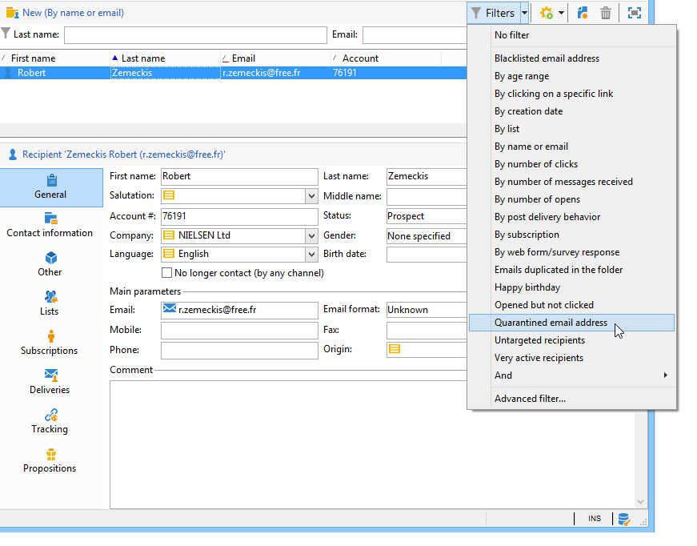

# Noções básicas sobre gestão de quarentena{#understanding-quarantine-management}

## Sobre a quarentena {#about-quarantines}

O Adobe Campaign gerencia uma lista de endereços em quarentena. Os destinatários cujo endereço está em quarentena são excluídos por padrão durante a análise de entrega e não serão direcionados. Um endereço de e-mail pode ser colocado em quarentena, por exemplo, quando a caixa de correio está cheia ou se o endereço não existe. Em qualquer caso, o procedimento de quarentena está em conformidade com as regras específicas descritas abaixo.

>[!NOTE]
>
>Esta seção se aplica aos canais online: email, SMS, notificação por push.

### Otimização do seu delivery por meio da quarentena {#optimizing-your-delivery-through-quarantines}

The profiles whose email addresses or phone number are in quarantine are automatically excluded during message preparation (see [Identifying quarantined addresses for a delivery](#identifying-quarantined-addresses-for-a-delivery)). Isso irá acelerar os deliveries, pois a taxa de erro tem um efeito significativo na velocidade do delivery.

Alguns provedores de acesso à Internet consideram automaticamente emails como spam se a taxa de endereços inválidos for muito alta. A quarentena permite evitar a inclusão na blacklist por esses provedores.

Além disso, a quarentena ajuda a reduzir os custos de envio do SMS, excluindo números de telefone incorretos dos deliveries. Para obter mais informações sobre as práticas recomendadas para proteger e otimizar seus deliveries, consulte [esta página](https://docs.campaign.adobe.com/doc/AC/getting_started/EN/deliveryBestPractices.html).

### Quarentena versus blacklist {#quarantine-vs-blacklisting}

A **quarentena** se aplica somente a um endereço, não ao próprio perfil. Isso significa que, se dois perfis tiverem o mesmo endereço de email, eles serão afetados se o endereço estiver em quarentena.

Da mesma forma, um perfil cujo endereço de email está em quarentena poderia atualizar seu perfil e inserir um novo endereço e pode ser alvo de ações de delivery novamente.

A inclusão na **Blacklist**, por outro lado, resultará no perfil não sendo mais alvo por qualquer delivery, por exemplo, depois de unsubscription (recusa).

>[!NOTE]
>
>Quando um usuário responde a uma mensagem SMS com uma palavra-chave como &quot;PARAR&quot; para não participar dos deliveries de SMS, seu perfil não é incluído na blacklist como no processo de recusa de email. O número de telefone do perfil é enviado para quarentena, para que o usuário continue recebendo mensagens de email.

## Identificação de endereços em quarentena {#identifying-quarantined-addresses}

Os endereços em quarentena podem ser listados para um delivery específico ou para a plataforma inteira.

### Identificação de endereços em quarentena para um delivery {#identifying-quarantined-addresses-for-a-delivery}

Quarantined addresses for a specific delivery are listed during the delivery preparation phase, in the delivery logs of the delivery dashboard (see [Delivery logs and history](../../delivery/using/monitoring-a-delivery.md#delivery-logs-and-history)).

### Identificação de endereços em quarentena para toda a plataforma {#identifying-quarantined-addresses-for-the-entire-platform}

Os administradores podem listar os endereços em quarentena para a plataforma inteira a partir do **[!UICONTROL Administration > Campaign Management > Non deliverables Management > Non deliverables and addresses]** nó.

>[!NOTE]
>
>Este menu lista os elementos colocados em quarentena para os canais de **email**, **SMS** e **notificação por push** .

As seguintes informações estão disponíveis para cada endereço:


>[!NOTE]
>
>O aumento no número em quarentena é um efeito normal, relacionado ao &quot;desgaste&quot; do banco de dados. Por exemplo, se o tempo de vida de um endereço de email for considerado três anos e a tabela de recipients aumentar em 50% todo ano, o aumento da quarentena poderá ser calculado da seguinte maneira:
>
>Fim do Ano 1: (1*0.33)/(1+0.5)=22%.
Fim do Ano 2: ((1.22*0.33)+0.33)/(1.5+0.75)=32.5%.

### Identificação de endereços em quarentena nos relatórios de delivery {#identifying-quarantined-addresses-in-delivery-reports}

Os seguintes relatórios fornecem informações sobre os endereços em quarentena:

* For each delivery, the **[!UICONTROL Delivery summary]** report shows the number of addresses in quarantine in the delivery target. Ele exibe:

   * O número de endereços colocados em quarentena durante a análise de delivery,

   * O número de endereços colocados em quarentena após a ação de delivery.

* The **[!UICONTROL Non-deliverables and bounces]** report displays information about the addresses in quarantine, the types of error encountered, etc., and a failure breakdown by domain.

Você pode visualizar essas informações para todos os deliveries da plataforma (**Página inicial>Relatórios**) ou para um delivery específica. Você também pode criar relatórios personalizados e selecionar as informações a serem exibidas.

### Identificação de endereços em quarentena para um recipient {#identifying-quarantined-addresses-for-a-recipient}

Você pode consultar o status do endereço de email de qualquer recipient. Para fazer isso, selecione o perfil do destinatário e clique na **[!UICONTROL Deliveries]** guia. Para todos os deliveries para esse recipient, você pode descobrir se o endereço falhou, estava em quarentena durante a análise, etc. Para cada pasta, é possível exibir apenas os recipients cujo endereço de email está em quarentena. Para fazer isso, use o filtro de **[!UICONTROL Quarantined email address]** aplicativo.



### Remoção de um endereço em quarentena {#removing-a-quarantined-address}

If you need to remove an address from quarantine, change its status manually to **[!UICONTROL Valid]**.


If you change the status to **[!UICONTROL Whitelisted]**, the address will be targeted systematically each time even if an error is encountered.

>[!CAUTION]
Os endereços na blacklist não são considerados pelo sistema de quarentena e não são alvos, mesmo que você altere o status do endereço.

Você também pode alterar o número de erros e o período entre erros. Para fazer isso, altere as configurações do assistente de implantação (Configurações avançadas/canal de email). Para obter mais informações sobre o assistente de implantação, consulte [esta seção](../../installation/using/deploying-an-instance.md).

## Condições para colocar um endereço na quarentena {#conditions-for-sending-an-address-to-quarantine}

O Adobe Campaign gerencia a quarentena de acordo com o tipo de falha de entrega e o motivo atribuído durante a qualificação de mensagens de erro (consulte [Rejeitar qualificação](../../delivery/using/understanding-delivery-failures.md#bounce-mail-qualification)de mensagens de email) e os tipos e motivos [de falha de](../../delivery/using/understanding-delivery-failures.md#delivery-failure-types-and-reasons)entrega.

* **Erro ignorado**: os erros ignorados não enviam um endereço para quarentena.
* **Erro grave**: o endereço de email correspondente é enviado imediatamente para quarentena.
* **Erro suave**: erros suaves não enviam um endereço imediatamente para quarentena, mas incrementam um contador de erros. Quando o contador de erros atinge o limite da cota, o endereço vai para a quarentena. Na configuração padrão, a cota é definida em cinco erros, onde dois erros são significativos se ocorrerem pelo menos em 24 horas de distância. O endereço é colocado em quarentena no sexto erro. O limite do contador de erros pode ser modificado. Para obter mais informações, consulte [Tentativas após uma falha](../../delivery/using/understanding-delivery-failures.md#retries-after-a-delivery-temporary-failure)temporária de entrega.

   Quando um delivery é bem-sucedido após uma tentativa, o contador de erros do endereço anterior à quarentena é reinicializado. O status do endereço é alterado para **Válido** e excluído da lista de quarentena após dois dias pelo workflow de **limpeza do banco de dados** .

Se um usuário qualificar um email como um spam (**Loop de feedback**), a mensagem será automaticamente redirecionada para uma caixa de entrada técnica gerenciada pela Adobe. O endereço de email do usuário é enviado automaticamente para quarentena.

In the list of quarantined addresses, the **[!UICONTROL Error reason]** field indicates why the selected address was placed in quarantine. A quarentena no Adobe Campaign diferencia maiúsculas de minúsculas. Certifique-se de importar endereços de email em letras minúsculas, para que não sejam redirecionados posteriormente.


## Notificação por push em quarentena {#push-notification-quarantines}

O mecanismo de quarentena para notificações por push é globalmente igual ao processo geral. Consulte [Sobre quarentena](#about-quarantines). No entanto, certos erros são gerenciados de forma diferente para notificações por push. Por exemplo, para determinados erros suaves, nenhuma tentativa é executada no mesmo delivery. As especificidades para notificação por push estão listadas abaixo. O mecanismo de tentativa (número de tentativas, frequência) é igual ao dos emails.

Os itens colocados em quarentena são tokens de dispositivo.

### Quarentena do iOS {#ios-quarantine}

**Para iOS - conector binário**

Para cada notificação, o Adobe Campaign recebe os erros síncronos e assíncronos do servidor APNS. Para os seguintes erros síncronos, o Adobe Campaign gera erros suaves:

* Payload length issues: no retry, the failure reason is **[!UICONTROL Unreachable]**.
* Certificate expiration issues: no retry, the failure reason is **[!UICONTROL Unreachable]**.
* Connection lost during the delivery: retry performed, the failure reason is **[!UICONTROL Unreachable]**.
* Problema de configuração de serviço (certificado inválido, senha de certificado inválida, sem certificado): sem tentativa, o motivo da falha é **[!UICONTROL Unreachable]**.

O servidor APNS notifica de forma assíncrona o Adobe Campaign que um token de dispositivo teve o registrado cancelado (quando o aplicativo móvel foi desinstalado pelo usuário). The **[!UICONTROL mobileAppOptOutMgt]** workflow runs every 6 hours to contact the APNS feedback services to update the **AppSubscriptionRcp** table. Para todos os tokens desativados, o campo **Desativado** é definido como **Verdadeiro** e a subscrição vinculada a esse token de dispositivo será excluída automaticamente de deliveries futuros.

**Para iOS - conector HTTP/2**

O protocolo http/2 permite um feedback direto e status para cada delivery push. If the http/2 protocol connector is used, the feedback service is no longer called by the **[!UICONTROL mobileAppOptOutMgt]** workflow. Os tokens não registrados são tratados de forma diferente entre o conector binário do iOS e o conector http/2 do iOS. Um token é considerado não registrado quando um aplicativo móvel é desinstalado ou reinstalado.

Em sincronia, se o APNS retornar um status &quot;não registrado&quot; para uma mensagem, o token do target será colocado imediatamente em quarentena.

<table> 
 <tbody> 
  <tr> 
   <td> <strong>Cenário</strong><br /> </td> 
   <td> <strong>Status</strong><br /> </td> 
   <td> <strong>Mensagem de erro</strong><br /> </td> 
   <td> <strong>Tipo de falha</strong><br /> </td> 
   <td> <strong>Motivo da falha</strong><br /> </td> 
   <td> <strong>Tentativa</strong><br /> </td> 
  </tr> 
  <tr> 
   <td> Dispositivo alvo ligado<br /> </td> 
   <td> Ok<br /> </td> 
   <td> </td> 
   <td> </td> 
   <td> </td> 
   <td> </td> 
  </tr> 
  <tr> 
   <td> Dispositivo alvo desligado<br /> </td> 
   <td> Ok<br /> </td> 
   <td> </td> 
   <td> </td> 
   <td> </td> 
   <td> </td> 
  </tr> 
  <tr> 
   <td> O usuário desabilita notificações para o aplicativo<br /> </td> 
   <td> Ok<br /> </td> 
   <td> </td> 
   <td> </td> 
   <td> </td> 
   <td> </td> 
  </tr> 
  <tr> 
   <td> Fase de análise/criação de mensagens - carga muito grande<br /> </td> 
   <td> Falha<br /> </td> 
   <td> Carga muito longa<br /> </td> 
   <td> Suave<br /> </td> 
   <td> Recusado<br /> </td> 
   <td> Não<br /> </td> 
  </tr> 
  <tr> 
   <td> Fase de análise/criação de mensagens – problema inesperado de formato de conteúdo<br /> </td> 
   <td> Falha<br /> </td> 
   <td> Várias mensagens de erro de acordo com o erro<br /> </td> 
   <td> Suave<br /> </td> 
   <td> Indefinido<br /> </td> 
   <td> Não<br /> </td> 
  </tr> 
  <tr> 
   <td> Problema de certificado (senha, corrupção, etc.) e teste de conexão com o problema APNS<br /> </td> 
   <td> Falha<br /> </td> 
   <td> Várias mensagens de erro de acordo com o erro<br /> </td> 
   <td> Suave<br /> </td> 
   <td> Recusado<br /> </td> 
   <td> Não<br /> </td> 
  </tr> 
  <tr> 
   <td> Conexão de rede perdida durante o envio<br /> </td> 
   <td> Falha<br /> </td> 
   <td> Erro de conexão<br /> </td> 
   <td> Indefinido<br /> </td> 
   <td> Inacessível<br /> </td> 
   <td> Sim<br /> </td> 
  </tr> 
  <tr> 
   <td> Rejeição da mensagem APNS: Cancelar o registro<br /> do usuário removeu o aplicativo ou o token expirou<br /> </td> 
   <td> Falha<br /> </td> 
   <td> Registro cancelado<br /> </td> 
   <td> Grave<br /> </td> 
   <td> Usuário desconhecido<br /> </td> 
   <td> Não<br /> </td> 
  </tr> 
  <tr> 
   <td> rejeição de mensagem APNS: todos os outros erros<br /> </td> 
   <td> Falha<br /> </td> 
   <td> A causa de rejeição do erro será exibida na mensagem de erro<br /> </td> 
   <td> Suave<br /> </td> 
   <td> Recusado<br /> </td> 
   <td> Não<br /> </td> 
  </tr> 
 </tbody> 
</table>

### Quarentena do Android {#android-quarantine}

**Para Android V1**

A cada notificação, o Adobe Campaign recebe os erros síncronos diretamente do servidor FCM. O Adobe Campaign os trata instantaneamente e gera erros graves ou suaves, de acordo com a gravidade do erro, e tentativas podem ser executadas:

* Comprimento de carga excedido, problema de conexão, problema de disponibilidade de serviço: tentativa executava, erro suave, o motivo da falha é **[!UICONTROL Refused]**.
* Device quota exceeded: no retry, soft error, failure reason is **[!UICONTROL Refused]**.
* Token inválido ou não registrado, erro inesperado, problema da conta do remetente: sem tentativa, erro grave, o motivo de falha é **[!UICONTROL Refused]**.

The **[!UICONTROL mobileAppOptOutMgt]** workflow runs every 6 hours to update the **AppSubscriptionRcp** table. Para os tokens declarados não registrados ou não mais válidos, o campo **Desativado** é definido como **Verdadeiro** e a subscrição vinculada a esse token de dispositivo será excluída automaticamente dos deliveries futuros.

Durante a análise de delivery, todos os dispositivos excluídos do target são automaticamente adicionados à tabela **excludeLogAppSubRcp** .

>[!NOTE]
Para clientes que usam o conector Baidu, aqui estão os diferentes tipos de erros:
* Connection issue at the beginning of the delivery: failure type **[!UICONTROL Undefined]**, failure reason **[!UICONTROL Unreachable]**, retry is performed.
* Connection lost during a delivery: soft error, failure reason **[!UICONTROL Refused]**, retry is performed.
* Synchronous error returned by Baidu during the sending: hard error, failure reason **[!UICONTROL Refused]**, no retry is performed.

O Adobe Campaign contata o servidor Baidu a cada 10 minutos para recuperar o status da mensagem enviada e atualiza os broadlogs. Se uma mensagem for declarada como enviada, o status da mensagem nos broadlogs será definido como **[!UICONTROL Received]**. If Baidu declares an error, the status is set to **[!UICONTROL Failed]**.

**Para Android V2**

O mecanismo de quarentena do Android V2 usa o mesmo processo que o Android V1, o mesmo se aplica à atualização de assinaturas e exclusões. Para obter mais informações, consulte a seção [Android V1](#android-quarantine)

<table> 
 <tbody> 
  <tr> 
   <td> <strong>Cenário</strong><br /> </td> 
   <td> <strong>Status</strong><br /> </td> 
   <td> <strong>Mensagem de erro</strong><br /> </td> 
   <td> <strong>Tipo de falha</strong><br /> </td> 
   <td> <strong>Motivo da falha</strong><br /> </td> 
   <td> <strong>Tentativa</strong><br /> </td> 
  </tr> 
  <tr> 
   <td> Fase de análise/criação de mensagens: palavras-chave ilegais usadas nos campos personalizados<br /> </td> 
   <td> Falha<br /> </td> 
   <td> The following keywords cannot be used: {1}<br /> </td> 
   <td> Suave<br /> </td> 
   <td> </td> 
   <td> Não<br /> </td> 
  </tr> 
  <tr> 
   <td> Fase de análise/criação de mensagens: carga muito grande<br /> </td> 
   <td> Falha<br /> </td> 
   <td> A notificação é muito pesada: {1} bits, enquanto apenas {2} estão autorizados<br /> </td> 
   <td> Suave<br /> </td> 
   <td> Recusado<br /> </td> 
   <td> Não<br /> </td> 
  </tr> 
  <tr> 
   <td> Conexão de rede perdida durante o envio<br /> </td> 
   <td> Falha<br /> </td> 
   <td> No response from the Firebase Cloud Messaging service on the address: {1}<br /> </td> 
   <td> Suave<br /> </td> 
   <td> Inacessível<br /> </td> 
   <td> Sim<br /> </td> 
  </tr> 
  <tr> 
   <td> FCM message rejection: The FCM server is temporarily unavailable (for example with timeouts). <br /> </td> 
   <td> Falha<br /> </td> 
   <td> O serviço Firebase Cloud Messaging está temporariamente indisponível<br /> </td> 
   <td> Suave<br /> </td> 
   <td> Inacessível<br /> </td> 
   <td> Sim<br /> </td> 
  </tr> 
  <tr> 
   <td> Rejeição da mensagem FCM: Erro ao autenticar a conta do remetente<br /> </td> 
   <td> Falha<br /> </td> 
   <td> Falha ao identificar a conta do desenvolvedor, verifique seu ID e senha<br /> </td> 
   <td> Suave<br /> </td> 
   <td> Recusado<br /> </td> 
   <td> Não<br /> </td> 
  </tr> 
  <tr> 
   <td> Rejeição da mensagem FCM: Cota do dispositivo excedida<br /> </td> 
   <td> Falha<br /> </td> 
   <td> </td> 
   <td> Suave<br /> </td> 
   <td> Recusado<br /> </td> 
   <td> Sim<br /> </td> 
  </tr> 
  <tr> 
   <td> Rejeição da mensagem FCM: Registro inválido / não registrado<br /> </td> 
   <td> Falha<br /> </td> 
   <td> </td> 
   <td> Grave<br /> </td> 
   <td> Usuário desconhecido<br /> </td> 
   <td> Não<br /> </td> 
  </tr> 
  <tr> 
   <td> Rejeição da mensagem FCM: Todos os outros erros<br /> </td> 
   <td> Falha<br /> </td> 
   <td> O servidor do Firebase Cloud Messaging retornou um código de erro inesperado: {1} </td> 
   <td> </td> 
   <td> Recusado<br /> </td> 
   <td> Não<br /> </td> 
  </tr> 
 </tbody> 
</table>

## SMS em quarantena {#sms-quarantines}

**Para conectores padrão**

O mecanismo de quarentena para mensagens SMS é globalmente igual ao processo geral. Consulte [Sobre quarentena](#about-quarantines). As especificidades para SMS estão listadas abaixo.

>[!NOTE]
The **[!UICONTROL Delivery log qualification]** table does not apply to the **Extended generic SMPP** connector.

<table> 
 <tbody> 
  <tr> 
   <td> <strong>Cenário</strong><br /> </td> 
   <td> <strong>Status</strong><br /> </td> 
   <td> <strong>Mensagem de erro</strong><br /> </td> 
   <td> <strong>Tipo de falha</strong><br /> </td> 
   <td> <strong>Motivo da falha</strong><br /> </td> 
  </tr> 
  <tr> 
   <td> Enviado para o provedor<br /> </td> 
   <td> Sent<br /> </td> 
   <td> </td> 
   <td> </td> 
   <td> </td> 
  </tr> 
  <tr> 
   <td> Recebido no celular<br /> </td> 
   <td> Recebido<br /> </td> 
   <td> </td> 
   <td> </td> 
   <td> </td> 
  </tr> 
  <tr> 
   <td> Erro retornado pelo provedor<br /> </td> 
   <td> Falha<br /> </td> 
   <td> Erro ao receber dados (SR ou MO)<br /> </td> 
   <td> Suave<br /> </td> 
   <td> Inacessível<br /> </td> 
  </tr> 
  <tr> 
   <td> Confirmação MT inválida<br /> </td> 
   <td> Falha<br /> </td> 
   <td> Erro '{1}' ao processar quadro de confirmação para enviar query<br /> </td> 
   <td> Suave<br /> </td> 
   <td> Inacessível<br /> </td> 
  </tr> 
  <tr> 
   <td> Erro ao enviar o MT<br /> </td> 
   <td> Falha<br /> </td> 
   <td> Erro ao enviar mensagens<br /> </td> 
   <td> Suave<br /> </td> 
   <td> Inacessível<br /> </td> 
  </tr> 
 </tbody> 
</table>

**Para o conector SMPP genérico estendido**

Ao usar o protocolo SMPP para enviar mensagens SMS, a gestão de erros é tratada de forma diferente. Para obter mais informações sobre o conector SMPP genérico estendido, consulte [esta página](../../delivery/using/sms-channel.md#creating-an-smpp-external-account).

O conector SMPP recupera dados da mensagem SR (Relatório do Status) que é retornada usando expressões regulares (regexes) para filtrar seu conteúdo. Esses dados são então comparados com as informações encontradas na **[!UICONTROL Delivery log qualification]** tabela (disponível no menu **[!UICONTROL Administration]** > **[!UICONTROL Campaign Management]** > **[!UICONTROL Non deliverables Management]** ).

Antes de um novo tipo de erro ser qualificado, o motivo da falha é sempre definido como **Refused** por padrão.

>[!NOTE]
Os tipos de falha e os motivos para falha são os mesmos dos emails. See [Delivery failure types and reasons](../../delivery/using/understanding-delivery-failures.md#delivery-failure-types-and-reasons).
Peça ao seu provedor uma lista de códigos e status de erros para definir os tipos apropriados de falhas e os motivos para falha na tabela de qualificação de log de delivery.

Exemplo de uma mensagem gerada:

```
SR Generic DELIVRD 000|#MESSAGE#
```

* Todas as mensagens de erro começam com **SR** para distinguir códigos de erro de SMS de códigos de erro de email.
* The second part (**Generic** in this example) of the error message refers to the name of the SMSC implementation such as defined in the **[!UICONTROL SMSC implementation name]** field of the SMS external account. Consulte [esta página](../../delivery/using/sms-channel.md#creating-an-smpp-external-account).

   Como o mesmo código de erro pode ter um significado diferente para cada provedor, esse campo permite que você saiba qual provedor gerou o código de erro. Você pode então encontrar o erro na documentação do provedor relevante.

* A terceira parte (**DELIVRD** neste exemplo) da mensagem de erro corresponde ao código de status recuperado do SR usando a extração de status regex definido na conta externa do SMS.

   This regex is specified in the **[!UICONTROL SMSC specificities]** tab of the external account. Consulte [esta página](../../delivery/using/sms-channel.md#creating-an-smpp-external-account).

   

   Por padrão, o regex extrai o campo **stat:** conforme definido pela seção **Apêndice B** da **especificação 3.4 SMPP**.

* A quarta parte (**000** neste exemplo) da mensagem de erro corresponde ao código de erro extraído do SR usando a extração de código de erro regex definida na conta externa do SMS.

   This regex is specified in the **[!UICONTROL SMSC specificities]** tab of the external account. Consulte [esta página](../../delivery/using/sms-channel.md#creating-an-smpp-external-account).

   Por padrão, o regex extrai o campo **err:** conforme definido pela seção **Apêndice B** da **especificação 3.4 SMPP**.

* Everything that comes after the pipe symbol (|) is only displayed in the **[!UICONTROL First text]** column of the **[!UICONTROL Delivery log qualification]** table. Este conteúdo é sempre substituído por **#MESSAGE#** após a mensagem ser normalizada. Esse processo evita ter várias entradas para erros semelhantes e é igual ao dos emails. Para obter mais informações, consulte Qualificação [de](../../delivery/using/understanding-delivery-failures.md#bounce-mail-qualification)envio de e-mails.

O conector SMPP genérico estendido aplica uma heurística para encontrar valores padrão adequados: se o status começar com **DELIV**, é considerado um sucesso porque ele corresponde aos status comuns **DELIVRD** ou **DELIVERED** usados pela maioria dos provedores. Qualquer outro status gera uma falha grave.
