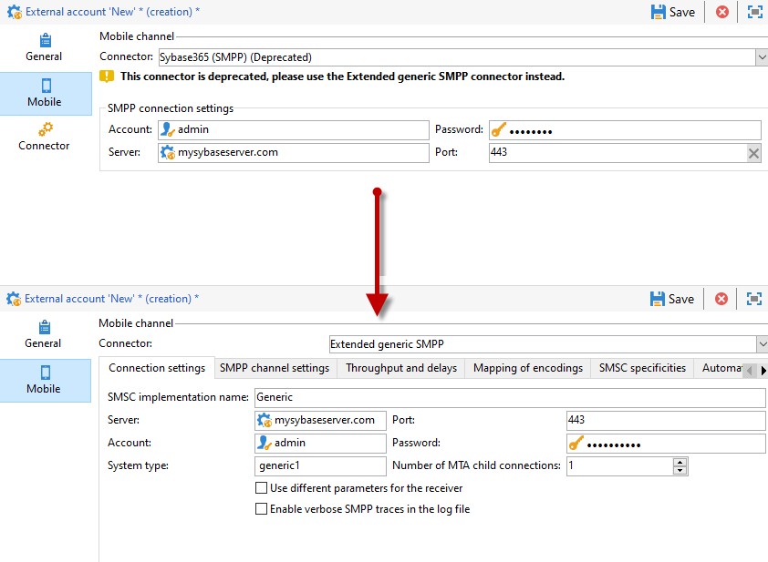

# Migrar conector SMS incompatível para o conector SMPP genérico estendido{#unsupported-connector-migration}

A partir da versão 20.2, os conectores herdados serão descontinuados. Este documento ajudará você a migrar conectores que ainda estão sendo executados no sistema antigo para o conector SMPP recomendado.

>[!CAUTION]
>
>Essa migração não é obrigatória, mas é recomendada pela Adobe e garantirá que você esteja executando a versão mais recente compatível do software.

## Sobre conectores SMS {#about-sms-connectors}

Os seguintes conectores foram descontinuados a partir da versão 20.2:

* **[!UICONTROL Generic SMPP]** (SMPP versão 3.4 com suporte para modo binário)
* **[!UICONTROL Sybase365]** (SAP SMS 365)
* **[!UICONTROL CLX Communications]**
* **[!UICONTROL Tele2]**
* **[!UICONTROL O2]**
* **[!UICONTROL iOS]**

Os recursos obsoletos ainda estão disponíveis e são compatíveis, mas não serão aprimorados. Recomendamos o uso do conector **[!UICONTROL Extended generic SMPP]**.

Para obter mais informações sobre recursos obsoletos e removidos, consulte esta [página](../../rn/using/deprecated-features.md).

Os conectores SMS antigos estão usando o conector SMS Java que sobrecarrega o processo da Web. A migração para o novo conector **[!UICONTROL Extended Generic SMPP]** moverá essa carga para o MTA compatível.

## Migração para o conector SMPP genérico estendido {#migrating-extended-generic-smpp}

>[!CAUTION]
>
>Mesmo que você possa transpor os parâmetros, a configuração do conector **[!UICONTROL Extended Generic SMPP]** exige que você converse com seu provedor, que fornecerá as informações necessárias para preencher o restante dos parâmetros. Para obter mais informações, consulte esta [página](sms-protocol.md).

Primeiro, será necessário criar uma nova conta externa do **[!UICONTROL Extended Generic SMPP]** e depois transpor alguns parâmetros. Você pode encontrar as etapas detalhadas nesta [página](sms-set-up.md#creating-an-smpp-external-account).

Agora é necessário preencher os parâmetros da guia **[!UICONTROL Mobile]** da conta externa do **[!UICONTROL Extended Generic SMPP]** recém-criada de acordo com o conector anterior.

### Do conector genérico {#from-generic-connector}

Ao escolher o conector **[!UICONTROL Generic]**, você deve ter um conector JavaScript personalizado que se adapte a cada situação.

Se souber que esse conector já está usando o protocolo SMPP, você poderá migrar para o conector **[!UICONTROL Extended Generic SMPP]**. Caso contrário, verifique se o seu provedor aceita o protocolo SMPP e configure um novo conector com a ajuda de um consultor.

No conector **[!UICONTROL Generic]**, é possível transpor para a conta do **[!UICONTROL Extended SMPP]** recém-criada:

Na guia **[!UICONTROL Connection Settings]**:

* **[!UICONTROL Account]**
* **[!UICONTROL Password]**
* **[!UICONTROL Server]**
* **[!UICONTROL Port]**

### Do conector SMPP genérico {#from-generic-smpp-connector}

No conector **[!UICONTROL Generic SMPP]**, é possível transpor para a conta do **[!UICONTROL Extended SMPP]** recém-criada:

Na guia **[!UICONTROL Connection Settings]**:

* **[!UICONTROL Account]**
* **[!UICONTROL Password]**
* **[!UICONTROL Server]**
* **[!UICONTROL Port]**
* **[!UICONTROL System Type]**

Na guia **[!UICONTROL SMPP Channel Settings]**:

* **[!UICONTROL Source number]**
* **[!UICONTROL Source NPI]**
* **[!UICONTROL Destination NPI]**
* **[!UICONTROL Source TON]**
* **[!UICONTROL Destination TON]**

Na guia **[!UICONTROL Mapping of Encoding]**:

* **[!UICONTROL Outbound SMS coding]**

Na guia **[!UICONTROL SMSC specificities]**:

* **[!UICONTROL Coding when sending]** corresponde a **[!UICONTROL ID Format in MT acknowledgement]**
* **[!UICONTROL Coding when receiving]** corresponde a **[!UICONTROL ID Format in the SR]**

### Do conector Sybase365 {#from-sybase}

No conector **[!UICONTROL Sybase365]**, é possível transpor para a conta do **[!UICONTROL Extended SMPP]** recém-criada:

Na guia **[!UICONTROL Connection Settings]**:

* **[!UICONTROL Account]**
* **[!UICONTROL Password]**
* **[!UICONTROL Server]**
* **[!UICONTROL Port]**
* **[!UICONTROL System Type]**

### Do conector CLX {#from-clx}

No conector **[!UICONTROL CLX]**, é possível transpor para a conta do **[!UICONTROL Extended SMPP]** recém-criada:

Na guia **[!UICONTROL Connection Settings]**:

* **[!UICONTROL Account]**
* **[!UICONTROL Password]**
* **[!UICONTROL Server]**
* **[!UICONTROL Port]**
* **[!UICONTROL System Type]**

Na guia **[!UICONTROL SMPP Channel Settings]**:

* **[!UICONTROL Source number]**

Na guia **[!UICONTROL SMSC specificities]**:

* **[!UICONTROL Coding when sending]** corresponde a **[!UICONTROL ID Format in MT acknowledgement]**
* **[!UICONTROL Coding when receiving]** corresponde a **[!UICONTROL ID Format in the SR]**

### Do conector Tele2 {#from-tele2}

No conector **[!UICONTROL Tele2]**, é possível transpor para a conta do **[!UICONTROL Extended SMPP]** recém-criada:

Na guia **[!UICONTROL Connection Settings]**:

* **[!UICONTROL Account]**
* **[!UICONTROL Password]**
* **[!UICONTROL Server]**
* **[!UICONTROL Port]**
* **[!UICONTROL System Type]**

Na guia **[!UICONTROL SMPP Channel Settings]**:

* **[!UICONTROL Source number]**
* **[!UICONTROL Source NPI]**
* **[!UICONTROL Destination NPI]**
* **[!UICONTROL Source TON]**

Na guia **[!UICONTROL Mapping of Encoding]**:

* **[!UICONTROL Outbound SMS coding]**

### Do conector O2 {#from-O2}

No conector **[!UICONTROL O2]**, é possível transpor para a conta do **[!UICONTROL Extended SMPP]** recém-criada:

Na guia **[!UICONTROL Connection Settings]**:

* **[!UICONTROL Account]**
* **[!UICONTROL Password]**
* **[!UICONTROL Server]**
* **[!UICONTROL Port]**
* **[!UICONTROL System Type]**

Na guia **[!UICONTROL SMPP Channel Settings]**:

* **[!UICONTROL Source number]**
* **[!UICONTROL Source NPI]**
* **[!UICONTROL Destination NPI]**
* **[!UICONTROL Source TON]**
* **[!UICONTROL Destination TON]**
