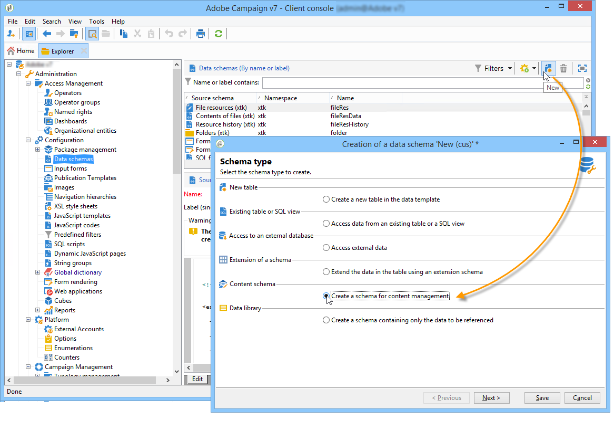

# Caso de uso: criação de gerenciamento de conteúdo{#use-case-creating-content-management}


Para criar a gestão de conteúdo no Adobe Campaign, as seguintes etapas são necessárias:

* [Etapa 1 – Análise do conteúdo a ser produzido](#step-1---analyzing-the-content-to-be-produced),
* [Etapa 2 – Criação do schema de dados](#step-2---creating-the-data-schema),
* [Etapa 3 – Criação do formulário de entrada](#step-3---creating-the-input-form),
* [Etapa 4 – Criação do template de construção](#step-4---creating-the-construction-template),
* [Etapa 5 – Criação do template de publicação](#step-5---creating-the-publication-template),
* [Etapa 6 - Criação de conteúdo](#step-6---creating-contents).

## Etapa 1 – Análise do conteúdo a ser produzido {#step-1---analyzing-the-content-to-be-produced}

Antes de começar, é preciso realizar uma análise precisa do conteúdo a ser produzido: identificar os elementos a serem exibidos, estudar as restrições vinculadas a eles, definir um tipo para cada elemento etc. Também é preciso diferenciar elementos estáticos e variáveis.

Por exemplo, para criar um boletim informativo em HTML com o seguinte tipo de conteúdo:


Este boletim informativo contém três tipos de elementos:

1. Elementos variáveis, cujo conteúdo é inserido ou selecionado pelo usuário por meio de um formulário de entrada durante a criação do delivery.

   

1. Campos de personalização inseridos dinamicamente com base nas informações salvas no banco de dados (nome e sobrenome do recipient nesse caso).

   

1. Elementos estáticos, que são os mesmos para todos os boletins informativos.

   

Os vários elementos deste boletim são reunidos com base nas regras definidas em um template JavaScript que faz referência a todos os elementos a serem inseridos e define seu layout.

Esses elementos são criados por um schema dedicado que especifica os seguintes elementos para cada conteúdo: nome, rótulo, tipo, tamanho e quaisquer outras informações relevantes para o processamento no Adobe Campaign.

## Etapa 2 – Criação do esquema de dados {#step-2---creating-the-data-schema}

Um schema de dados é um documento XML associado ao conteúdo. Ele descreve a estrutura XML dos dados nesse conteúdo.

>[!NOTE]
>
>Para saber mais sobre como criar e configurar schemas de dados no Adobe Campaign, consulte [esta seção](../../configuration/using/about-schema-edition.md).
>
>Os elementos de configuração específicos para o gerenciamento de conteúdo são detalhados em [Schemas de dados](data-schemas.md).

Para criar um schema de dados, siga as etapas abaixo:

1. Abra o navegador do Adobe Campaign e selecione o nó **[!UICONTROL Administration > Configuration > Data schemas]**.

   Clique no ícone **[!UICONTROL New]** localizado acima da lista de schemas de dados.

1. Selecione a opção **[!UICONTROL Create a schema]** para gerenciamento de conteúdo e clique em **[!UICONTROL Next]**.

   

1. Insira o nome e o rótulo do schema nos campos apropriados. Se necessário, você pode adicionar uma descrição e vincular uma imagem específica.

   

   Clique em **[!UICONTROL Next]** para validar.

1. Insira o conteúdo do schema na janela **[!UICONTROL Edit schema]**.

   Use o botão **[!UICONTROL Insert]** para criar o conteúdo do schema.

   

   Para obter mais informações, consulte [Edição de schemas](data-schemas.md#editing-schemas).

   Para cada elemento referenciado no conteúdo, é necessário selecionar um tipo correspondente.

   Neste exemplo, o conteúdo identificado, seu formato e seu tipo são:

<table> 
 <thead> 
  <tr> 
   <th> <strong>Conteúdo</strong> <br /> </th> 
   <th> <strong>Formato</strong> <br /> </th> 
   <th> <strong>Tipo</strong> <br /> </th> 
   <th> <strong>Rótulo</strong> <br /> </th> 
  </tr> 
 </thead> 
 <tbody> 
  <tr> 
   <td> Título<br /> </td> 
   <td> Atributo<br /> </td> 
   <td> Cadeia de caracteres<br /> </td> 
   <td> Título<br /> </td> 
  </tr> 
  <tr> 
   <td> Subtítulo<br /> </td> 
   <td> Atributo<br /> </td> 
   <td> Cadeia de caracteres<br /> </td> 
   <td> Nome<br /> </td> 
  </tr> 
  <tr> 
   <td> Data do evento<br /> </td> 
   <td> Atributo<br /> </td> 
   <td> Data<br /> </td> 
   <td> Data<br /> </td> 
  </tr> 
  <tr> 
   <td> Parágrafo de introdução<br /> </td> 
   <td> Elemento<br /> </td> 
   <td> HTML<br /> </td> 
   <td> Visão geral<br /> </td> 
  </tr> 
  <tr> 
   <td> Foto do autor<br /> </td> 
   <td> Atributo<br /> </td> 
   <td> Cadeia de caracteres<br /> </td> 
   <td> URL<br /> </td> 
  </tr> 
  <tr> 
   <td> Autor<br /> </td> 
   <td> Elemento<br /> </td> 
   <td> Memorando<br /> </td> 
   <td> Autor<br /> </td> 
  </tr> 
  <tr> 
   <td> Logotipo do cabeçalho (armazenado nos recursos públicos do Adobe Campaign)<br /> </td> 
   <td> Atributo<br /> </td> 
   <td> Link<br /> </td> 
   <td> Imagem<br /> </td> 
  </tr> 
 </tbody> 
</table>

O schema conterá as seguintes informações:

```
<element label="Invitation" name="invitation" template="ncm:content" xmlChildren="true">
    <compute-string expr="@name"/>
    <attribute label="Title" length="40" name="title" type="string"/>
    <element label="Presentation" name="presentation" type="html"/>
    <attribute label="Date" name="date" type="date"/>
    <attribute label="Name" length="10" name="name" type="string"/>
    <attribute label="URL" name="url" type="string"/>
    <element label="Author" name="author" type="memo"/>
    <element label="Image" name="image" target="xtk:fileRes" type="link"/>
  </element>
```

1. Clique em **[!UICONTROL Save]** para criar o schema de dados.

## Etapa 3 – Criação do formulário de entrada {#step-3---creating-the-input-form}

O formulário de entrada permite editar uma instância de conteúdo por meio de uma interface de entrada do console do cliente do Adobe Campaign.

A descrição de um formulário é um documento XML estruturado que está de acordo com a gramática do schema de formulários &quot;xtk:form&quot;.

>[!NOTE]
>
>Para obter mais informações sobre como criar e configurar formulários no Adobe Campaign, consulte [esta seção](../../configuration/using/identifying-a-form.md).
>
>Os elementos de configuração específicos para o gerenciamento de conteúdo são detalhados em [Formulários de entrada](input-forms.md).

Para criar um formulário de entrada para gestão de conteúdo, siga as etapas abaixo:

1. Abra o navegador do Adobe Campaign e selecione o nó **[!UICONTROL Administration > Configuration > Input forms]**.

   Clique no ícone **[!UICONTROL New]** acima da lista de formulários.

1. Insira o nome do formulário e o rótulo vinculado ao formulário, e depois selecione o tipo **[!UICONTROL Content management]**.

   

   >[!NOTE]
   >
   >Para permitir que ambos os elementos sejam compatíveis automaticamente, recomendamos o uso do mesmo nome do schema dos dados vinculados. Use o botão **[!UICONTROL Insert]** acima da zona de entrada para adicionar campos do schema vinculado ao formulário.

   

1. Na seção central do editor, especifique os campos que deseja exibir no formulário de entrada.

   Neste exemplo, teremos o seguinte tipo de informação:

   ```
    <input xpath="@title"/>
     <input xpath="@date"/>
     <input xpath="presentation"/>
     <input xpath="@name"/>
     <input xpath="@url"/>
     <input xpath="author"/>
     <input img="nl:sryimage.png" newEntityFormChoice="true" xpath="image">
       <sysFilter>
         <condition expr="@isImage = true"/>
       </sysFilter>
     </input>
   ```

   A guia **[!UICONTROL Preview]** permite verificar a renderização do formulário enquanto você o edita:

   

1. Clique em **[!UICONTROL Save]** para criar o formulário de entrada.

## Etapa 4 – Criação do modelo de construção {#step-4---creating-the-construction-template}

A linguagem XSLT permite transformar um documento XML em outro documento de saída. Essa transformação é descrita em XML em um documento chamado folha de estilos.

Neste exemplo, queremos usar um template JavaScript para definir a construção de dados e modo de layout no documento gerado.

>[!NOTE]
>
>As restrições vinculadas à criação do documento (template JavaScript ou XSL) são detalhadas em [Formatação](formatting.md).

Para usar um template JavaScript no Adobe Campaign, siga as etapas abaixo:

1. Abra o navegador do Adobe Campaign e selecione o nó **[!UICONTROL Administration > Configuration > JavaScript Templates]**.

   Clique no ícone **[!UICONTROL New]** acima da lista de templates.

1. Insira um nome de template e selecione o schema que você criou para a gestão de conteúdo.
1. Importe o conteúdo definido que deseja exibir na mensagem.

   Adicione os elementos variáveis, respeitando a sintaxe detalhada nos [Templates JavaScript](formatting.md#javascript-templates).

   Para exibir o conteúdo mostrado no nosso exemplo, o template JavaScript deve conter os seguintes elementos:

   ```
   <html>
   <% eval(xtk.javascript.load("xac:perso").data); %>
   <head>
     <title>Invitation to an exceptional dedication session</title>
   </head>
   <body link="#0E59AE" vlink="#0E59AE" alink="#0E59AE" style="background-color:white;">
       <table width="546" border="0" align="center" cellpadding="0" cellspacing="0" style="border-left: solid 1px gray;border-top: solid 1px gray;border-right: solid 1px gray;">
         <tr>
           <td colspan="3">
             <%= generateImgTag(content.@["image-id"]) %>
           </td>
         </tr>
       </table>
       <table width="546" border="0" align="center" cellpadding="0" cellspacing="0" style="border-left: solid 1px gray;border-right: solid 1px gray;">
         <tr>
           <td>
             <table border="0" cellspacing="0" cellpadding="5">
               <tr>
                 <td width="10"> </td>
                 <td style="padding-top:2em; padding-bottom:2em;" width="730" align="middle">
                   <b>
                     <font style="font-family:Verdana, Arial, Helvetica, sans-serif; font-size:14px; color:#800080;">
                       <span style="FONT-VARIANT: small-caps"><%= content.@title %> - <%= content.@name %></span>
                     </font>
                   </b>
                 </td>
                 <td width="10"> </td>
               </tr>
               <tr>
                 <td width="10"> </td>
                 <td style="padding-top:1em; padding-bottom:1em;" width="730">
                   <font style="font-family:Verdana, Arial, Helvetica, sans-serif; font-size:11px; color:#666666;">
                     Hello <%= perso('recipient.firstName') %> <%= perso('recipient.lastName') %>,
                     <p>
                       <%= content.presentation %>
                     </p>               
                     <center>
                       <b><%= formatDate(content.@date, "%2D %Bl %4Y") %></b> come to our Book Fair and meet our favorite authors and illustrators.<br>
                       <br>
                       <a href="https://www.site.web.com/registration" target="_blank"><b>REGISTER</b></a>
                     </center>
                   </font>
                 </td>
                 <td width="10"> </td>
               </tr>
               <tr>
                 <td width="10"> </td>
                 <td style="padding-top:1em; padding-bottom:1em;" width="730">
                   <font style="font-family:Verdana, Arial, Helvetica, sans-serif; font-size:11px; color:#666666;">
                    " width="70" height="70">
                     <b><%= content.author %></b>, will be signing their book between 2
   and 5:30PM.
                   </font>
                 </td>
                 <td width="10"> </td>
               </tr>            
                   <tr>
                 <td width="10"> </td>
                 <td width="730">
                   <font style="font-family:Verdana, Arial, Helvetica, sans-serif; font-size:11px; color:#666666;">                  
                 </td>
                 <td width="10"> </td>
               </tr>           
               <tr>
                 <td width="10"> </td>
                 <td>
                   <font style="font-family:Verdana, Arial, Helvetica, sans-serif; font-size:11px; color:#666666;">
                     <center>
                       <p>
                         <a href="https://www.site.web.com/program" target="_blank"><span style="FONT-VARIANT: small-caps"><b>Program</b></span></a>
                          | 
                         <a href="https://www.site.web.com/information" target="_blank"><span style="FONT-VARIANT: small-caps"><b>Useful information</b></span></a>
                          | 
                       <a href="https://www.site.web.com/registration" target="_blank"><span style="FONT-VARIANT: small-caps"><b>Register</b></span></a></p>
                       </center>
                     </font>
                   </td>
                   <td width="10"> </td>
                 </tr>
               </table>
               <br>
             </td>
           </tr>
         </table>
   </body>
   </html>
   ```

   A chamada de uma função no início de um template permite configurar uma chamada para dados de personalização obtidos do banco de dados do Adobe Campaign (nesse caso: recipient.firstName e recipient.lastName), para que possa ser interpretado quando usado em um delivery. Para obter mais informações, consulte [Inclusão de um template JavaScript](formatting.md#including-a-javascript-template).

   Neste exemplo, a função conterá o seguinte código:

   ```
   function perso(strPerso)
   {
     var strStart = '<' + '%' + '=';
     var strEnd = '%' + '>';
     return strStart + strPerso + strEnd;
   }
     function bloc(strPerso)
   {
     var strStart = '<' + '%' + '@ include view="';
     var strEnd = '" %' + '>';
     return strStart + strPerso + strEnd;
   }
   ```

   Para que o template JavaScript seja válido, essa função deve ser criada antes do nó **[!UICONTROL JavaScript codes]** na estrutura da árvore, conforme abaixo:

   

## Etapa 5 — criação do modelo de publicação {#step-5---creating-the-publication-template}

A próxima etapa envolve criar um template de publicação de conteúdo para vincular o schema, o formulário e o template de criação de conteúdo. Esse template de publicação pode ter vários formatos de saída.

>[!NOTE]
>
>Para obter mais informações sobre publicação de conteúdo, consulte [Templates de publicação](publication-templates.md).

Neste exemplo, as etapas são as seguintes:

1. Crie um novo template de publicação através do nó **[!UICONTROL Administration > Configuration > Publication templates]** .
1. Insira um nome e um rótulo, depois selecione o schema e o formulário a ser usado.
1. Em seguida, digite o nome do template e escolha o modo de renderização que deve ser aplicado. Este é um tipo de renderização **[!UICONTROL JavaScript]** baseado no template criado acima.

   

   >[!NOTE]
   >
   >A opção **[!UICONTROL DOM interface]** é marcada por padrão e isso significa que esse documento não estará acessível se a sintaxe E4X for usada. A interface DOM deve ser usada quando esta opção é marcada e é a sintaxe recomendada.
   >
   >Ainda é possível usar a sintaxe E4X. Neste caso, desmarque esta opção.

   Utilize o botão **[!UICONTROL Add]** para criar outros templates de transformação.

1. Clique em **[!UICONTROL Save]** para criar o template de publicação.

## Etapa 6 - Criação de conteúdo {#step-6---creating-contents}

Agora é possível criar conteúdo com base nesse template de publicação.

>[!NOTE]
>
>Para obter mais informações sobre como criar conteúdo, consulte [Uso de um template de conteúdo](using-a-content-template.md).

### Criação de conteúdo no assistente de entrega {#creating-content-in-the-delivery-wizard}

Para criar conteúdo diretamente nas entregas, siga as etapas abaixo:

1. Comece fazendo referência ao template de publicação por meio da guia **[!UICONTROL Advanced]** das propriedades do delivery.

   

   Uma guia adicional é incluída ao assistente do delivery para definir o conteúdo através do formulário de gestão de conteúdo.

1. Insira as informações da variável do seu boletim informativo.

   

1. Clique na guia **[!UICONTROL HTML preview]** para exibir a renderização. Você precisa selecionar um recipient para testar a personalização.

   
