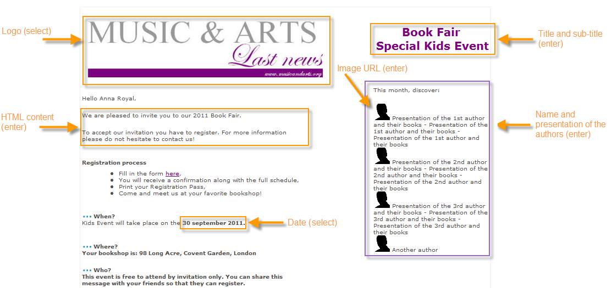
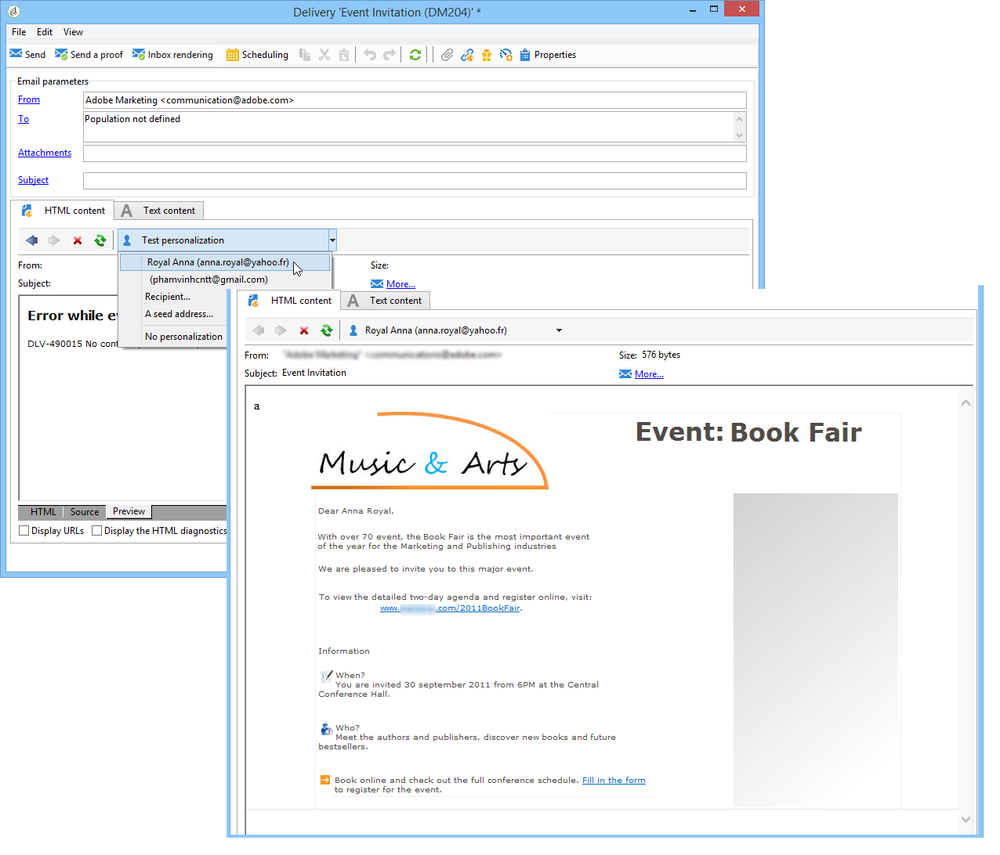

# Caso de uso: criação de gestão de conteúdo{#use-case-creating-content-management}

Para criar a gestão de conteúdo no Adobe Campaign, as seguintes etapas são necessárias:

* [Etapa 1 – Análise do conteúdo a ser produzido](#step-1---analyzing-the-content-to-be-produced),
* [Etapa 2 – Criação do schema de dados](#step-2---creating-the-data-schema),
* [Etapa 3 – Criação do formulário de entrada](#step-3---creating-the-input-form),
* [Etapa 4 – Criação do template de construção](#step-4---creating-the-construction-template),
* [Etapa 5 – Criação do template de publicação](#step-5---creating-the-publication-template),
* [Etapa 6 - Criação de conteúdo](#step-6---creating-contents).

## Etapa 1 – Análise do conteúdo a ser produzido {#step-1---analyzing-the-content-to-be-produced}

Antes de começar, é preciso realizar uma análise precisa do conteúdo a ser produzido: identificar os elementos a serem exibidos, estudar as restrições vinculadas a eles, definir um tipo para cada elemento etc. Também é preciso diferenciar elementos estáticos e variáveis.

Por exemplo, para criar um boletim informativo em HTML com o seguinte tipo de conteúdo:


Este boletim informativo contém três tipos de elementos:

1. Elementos variáveis, cujo conteúdo é inserido ou selecionado pelo usuário por meio de um formulário de entrada durante a criação do delivery.

   

1. Campos de personalização inseridos dinamicamente com base nas informações salvas no banco de dados (nome e sobrenome do recipient nesse caso).

   

1. Elementos estáticos, que são os mesmos para todos os boletins informativos.

   

Os vários elementos deste boletim são reunidos com base nas regras definidas em um template JavaScript que faz referência a todos os elementos a serem inseridos e define seu layout.

Esses elementos são criados por um schema dedicado que especifica os seguintes elementos para cada conteúdo: nome, rótulo, tipo, tamanho e quaisquer outras informações relevantes para o processamento no Adobe Campaign.

## Etapa 2 – Criação do schema de dados {#step-2---creating-the-data-schema}

Um schema de dados é um documento XML associado ao conteúdo. Ele descreve a estrutura XML dos dados nesse conteúdo.

>[!NOTE]
>
>Para saber mais sobre como criar e configurar schemas de dados no Adobe Campaign, consulte [esta seção](../../configuration/using/about-schema-edition.md).
>
>Configuration elements specific to content management are detailed in [Data schemas](../../delivery/using/data-schemas.md).

Para criar um schema de dados, siga as etapas abaixo:

1. Open the Adobe Campaign Explorer and select the **[!UICONTROL Administration > Configuration > Data schemas]** node.

   Click the **[!UICONTROL New]** icon located above the list of data schemas.

1. Selecione a **[!UICONTROL Create a schema]** opção para o gerenciamento de conteúdo e clique em **[!UICONTROL Next]**.

   

1. Insira o nome e o rótulo do schema nos campos apropriados. Se necessário, você pode adicionar uma descrição e vincular uma imagem específica.

   

   Click **[!UICONTROL Next]** to validate.

1. Enter the content of the schema in the **[!UICONTROL Edit schema]** window.

   Use the **[!UICONTROL Insert]** button to create the schema content.

   

   For more on this, refer to [Editing schemas](../../delivery/using/data-schemas.md#editing-schemas).

   Para cada elemento referenciado no conteúdo, é necessário selecionar um tipo correspondente.

   Neste exemplo, o conteúdo identificado, seu formato e seu tipo são:

<table> 
 <thead> 
  <tr> 
   <th> <strong>Conteúdo</strong><br /> </th> 
   <th> <strong>Formato</strong><br /> </th> 
   <th> <strong>Tipo</strong> <br /> </th> 
   <th> <strong>Etiqueta</strong><br /> </th> 
  </tr> 
 </thead> 
 <tbody> 
  <tr> 
   <td> Título<br /> </td> 
   <td> Atributo<br /> </td> 
   <td> Cadeia de caracteres<br /> </td> 
   <td> Título<br /> </td> 
  </tr> 
  <tr> 
   <td> Subtítulo<br /> </td> 
   <td> Atributo<br /> </td> 
   <td> Cadeia de caracteres<br /> </td> 
   <td> Nome<br /> </td> 
  </tr> 
  <tr> 
   <td> Data do evento<br /> </td> 
   <td> Atributo<br /> </td> 
   <td> Data<br /> </td> 
   <td> Data<br /> </td> 
  </tr> 
  <tr> 
   <td> Parágrafo de introdução<br /> </td> 
   <td> Elemento<br /> </td> 
   <td> HTML<br /> </td> 
   <td> Visão geral<br /> </td> 
  </tr> 
  <tr> 
   <td> Foto do autor<br /> </td> 
   <td> Atributo<br /> </td> 
   <td> Cadeia de caracteres<br /> </td> 
   <td> URL<br /> </td> 
  </tr> 
  <tr> 
   <td> Autor<br /> </td> 
   <td> Elemento<br /> </td> 
   <td> Memorando<br /> </td> 
   <td> Autor<br /> </td> 
  </tr> 
  <tr> 
   <td> Logotipo do cabeçalho (armazenado nos recursos públicos do Adobe Campaign)<br /> </td> 
   <td> Atributo<br /> </td> 
   <td> Link<br /> </td> 
   <td> Imagem<br /> </td> 
  </tr> 
 </tbody> 
</table>

O schema conterá as seguintes informações:

```
<element label="Invitation" name="invitation" template="ncm:content" xmlChildren="true">
    <compute-string expr="@name"/>
    <attribute label="Title" length="40" name="title" type="string"/>
    <element label="Presentation" name="presentation" type="html"/>
    <attribute label="Date" name="date" type="date"/>
    <attribute label="Name" length="10" name="name" type="string"/>
    <attribute label="URL" name="url" type="string"/>
    <element label="Author" name="author" type="memo"/>
    <element label="Image" name="image" target="xtk:fileRes" type="link"/>
  </element>
```

1. Click **[!UICONTROL Save]** to create the data schema.

## Etapa 3 – Criação do formulário de entrada {#step-3---creating-the-input-form}

O formulário de entrada permite editar uma instância de conteúdo por meio de uma interface de entrada do console do cliente do Adobe Campaign.

A descrição de um formulário é um documento XML estruturado que está de acordo com a gramática do schema de formulários &quot;xtk:form&quot;.

>[!NOTE]
>
>Para obter mais informações sobre como criar e configurar formulários no Adobe Campaign, consulte [esta seção](../../configuration/using/identifying-a-form.md).
>
>Configuration elements specific to content management are detailed in [Input forms](../../delivery/using/input-forms.md).

Para criar um formulário de entrada para gestão de conteúdo, siga as etapas abaixo:

1. Open the Adobe Campaign Explorer and select the **[!UICONTROL Administration > Configuration > Input forms]** node.

   Click the **[!UICONTROL New]** icon above the list of forms.

1. Enter the name of the form and the label linked to the form, then select the **[!UICONTROL Content management]** type.

   

   >[!NOTE]
   >
   >Para permitir que ambos os elementos sejam compatíveis automaticamente, recomendamos o uso do mesmo nome do schema dos dados vinculados. Use the **[!UICONTROL Insert]** button above the input zone to add fields from the schema linked to the form.

   

1. Na seção central do editor, especifique os campos que deseja exibir no formulário de entrada.

   Neste exemplo, teremos o seguinte tipo de informação:

   ```
    <input xpath="@title"/>
     <input xpath="@date"/>
     <input xpath="presentation"/>
     <input xpath="@name"/>
     <input xpath="@url"/>
     <input xpath="author"/>
     <input img="nl:sryimage.png" newEntityFormChoice="true" xpath="image">
       <sysFilter>
         <condition expr="@isImage = true"/>
       </sysFilter>
     </input>
   ```

   The **[!UICONTROL Preview]** tab lets you check the rendering of the form while you are editing it:

   

1. Click **[!UICONTROL Save]** to create the input form.

## Etapa 4 – Criação do template de construção {#step-4---creating-the-construction-template}

A linguagem XSLT permite transformar um documento XML em outro documento de saída. Essa transformação é descrita em XML em um documento chamado folha de estilos.

Neste exemplo, queremos usar um template JavaScript para definir a construção de dados e modo de layout no documento gerado.

>[!NOTE]
>
>Constraints linked to document building (JavaScript or XSL template) are detailed in [Formatting](../../delivery/using/formatting.md).

Para usar um template JavaScript no Adobe Campaign, siga as etapas abaixo:

1. Open the Adobe Campaign Explorer and select the **[!UICONTROL Administration > Configuration > JavaScript Templates]** node.

   Click the **[!UICONTROL New]** icon above the list of templates.

1. Insira um nome de template e selecione o schema que você criou para a gestão de conteúdo.
1. Importe o conteúdo definido que deseja exibir na mensagem.

   Add the variable elements while respecting the syntax detailed in [JavaScript templates](../../delivery/using/formatting.md#javascript-templates).

   Para exibir o conteúdo mostrado no nosso exemplo, o template JavaScript deve conter os seguintes elementos:

   ```
   <html>
   <% eval(xtk.javascript.load("xac:perso").data); %>
   <head>
     <title>Invitation to an exceptional dedication session</title>
   </head>
   <body link="#0E59AE" vlink="#0E59AE" alink="#0E59AE" style="background-color:white;">
       <table width="546" border="0" align="center" cellpadding="0" cellspacing="0" style="border-left: solid 1px gray;border-top: solid 1px gray;border-right: solid 1px gray;">
         <tr>
           <td colspan="3">
             <%= generateImgTag(content.@["image-id"]) %>
           </td>
         </tr>
       </table>
       <table width="546" border="0" align="center" cellpadding="0" cellspacing="0" style="border-left: solid 1px gray;border-right: solid 1px gray;">
         <tr>
           <td>
             <table border="0" cellspacing="0" cellpadding="5">
               <tr>
                 <td width="10"> </td>
                 <td style="padding-top:2em; padding-bottom:2em;" width="730" align="middle">
                   <b>
                     <font style="font-family:Verdana, Arial, Helvetica, sans-serif; font-size:14px; color:#800080;">
                       <span style="FONT-VARIANT: small-caps"><%= content.@title %> - <%= content.@name %></span>
                     </font>
                   </b>
                 </td>
                 <td width="10"> </td>
               </tr>
               <tr>
                 <td width="10"> </td>
                 <td style="padding-top:1em; padding-bottom:1em;" width="730">
                   <font style="font-family:Verdana, Arial, Helvetica, sans-serif; font-size:11px; color:#666666;">
                     Hello <%= perso('recipient.firstName') %> <%= perso('recipient.lastName') %>,
                     <p>
                       <%= content.presentation %>
                     </p>               
                     <center>
                       <b><%= formatDate(content.@date, "%2D %Bl %4Y") %></b> come to our Book Fair and meet our favorite authors and illustrators.<br>
                       <br>
                       <a href="https://www.site.web.com/registration" target="_blank"><b>REGISTER</b></a>
                     </center>
                   </font>
                 </td>
                 <td width="10"> </td>
               </tr>
               <tr>
                 <td width="10"> </td>
                 <td style="padding-top:1em; padding-bottom:1em;" width="730">
                   <font style="font-family:Verdana, Arial, Helvetica, sans-serif; font-size:11px; color:#666666;">
                    " width="70" height="70">
                     <b><%= content.author %></b>, will be signing their book between 2
   and 5:30PM.
                   </font>
                 </td>
                 <td width="10"> </td>
               </tr>            
                   <tr>
                 <td width="10"> </td>
                 <td width="730">
                   <font style="font-family:Verdana, Arial, Helvetica, sans-serif; font-size:11px; color:#666666;">                  
                 </td>
                 <td width="10"> </td>
               </tr>           
               <tr>
                 <td width="10"> </td>
                 <td>
                   <font style="font-family:Verdana, Arial, Helvetica, sans-serif; font-size:11px; color:#666666;">
                     <center>
                       <p>
                         <a href="https://www.site.web.com/program" target="_blank"><span style="FONT-VARIANT: small-caps"><b>Program</b></span></a>
                          | 
                         <a href="https://www.site.web.com/information" target="_blank"><span style="FONT-VARIANT: small-caps"><b>Useful information</b></span></a>
                          | 
                       <a href="https://www.site.web.com/registration" target="_blank"><span style="FONT-VARIANT: small-caps"><b>Register</b></span></a></p>
                       </center>
                     </font>
                   </td>
                   <td width="10"> </td>
                 </tr>
               </table>
               <br>
             </td>
           </tr>
         </table>
   </body>
   </html>
   ```

   A chamada de uma função no início de um template permite configurar uma chamada para dados de personalização obtidos do banco de dados do Adobe Campaign (nesse caso: recipient.firstName e recipient.lastName), para que possa ser interpretado quando usado em um delivery. Para obter mais informações, consulte [Inclusão de um modelo](../../delivery/using/formatting.md#including-a-javascript-template)JavaScript.

   Neste exemplo, a função conterá o seguinte código:

   ```
   function perso(strPerso)
   {
     var strStart = '<' + '%' + '=';
     var strEnd = '%' + '>';
     return strStart + strPerso + strEnd;
   }
     function bloc(strPerso)
   {
     var strStart = '<' + '%' + '@ include view="';
     var strEnd = '" %' + '>';
     return strStart + strPerso + strEnd;
   }
   ```

   In order for the JavaScript template to be valid, this function must be created beforehand from the **[!UICONTROL JavaScript codes]** node in the tree structure, as below:

   

## Etapa 5 – Criação do template de publicação {#step-5---creating-the-publication-template}

A próxima etapa envolve criar um template de publicação de conteúdo para vincular o schema, o formulário e o template de criação de conteúdo. Esse template de publicação pode ter vários formatos de saída.

>[!NOTE]
>
>For more on content publication templates, refer to [Publication templates](../../delivery/using/publication-templates.md).

Neste exemplo, as etapas são as seguintes:

1. Crie um novo modelo de publicação por meio do **[!UICONTROL Administration > Configuration > Publication templates]** nó.
1. Insira um nome e um rótulo, depois selecione o schema e o formulário a ser usado.
1. Em seguida, digite o nome do template e escolha o modo de renderização que deve ser aplicado. Here, we have a **[!UICONTROL JavaScript]** type rendering based on the template created above.

   

   >[!NOTE]
   >
   >The **[!UICONTROL DOM interface]** option is checked by default and this means that this document will not be accessible if you use the E4X syntax. A interface DOM deve ser usada quando esta opção é marcada e é a sintaxe recomendada.
   >
   >Ainda é possível usar a sintaxe E4X. Neste caso, desmarque esta opção.

   Use the **[!UICONTROL Add]** button to create other transformation templates.

1. Click **[!UICONTROL Save]** to create the publication template.

## Etapa 6 - Criação de conteúdo {#step-6---creating-contents}

Agora é possível criar conteúdo com base nesse template de publicação.

>[!NOTE]
>
>Para obter mais informações sobre como criar conteúdo, consulte [Uso de um modelo](../../delivery/using/using-a-content-template.md)de conteúdo.

### Criação de conteúdo no assistente do delivery {#creating-content-in-the-delivery-wizard}

Para criar conteúdo diretamente nos deliveries, siga as etapas abaixo:

1. Start by referencing the publication template via the **[!UICONTROL Advanced]** tab of the delivery properties.

   

   Uma guia adicional é incluída ao assistente do delivery para definir o conteúdo através do formulário de gestão de conteúdo.

1. Insira as informações da variável do seu boletim informativo.

   

1. Click the **[!UICONTROL HTML preview]** tab to view the rendering. Você precisa selecionar um recipient para testar a personalização.

   
