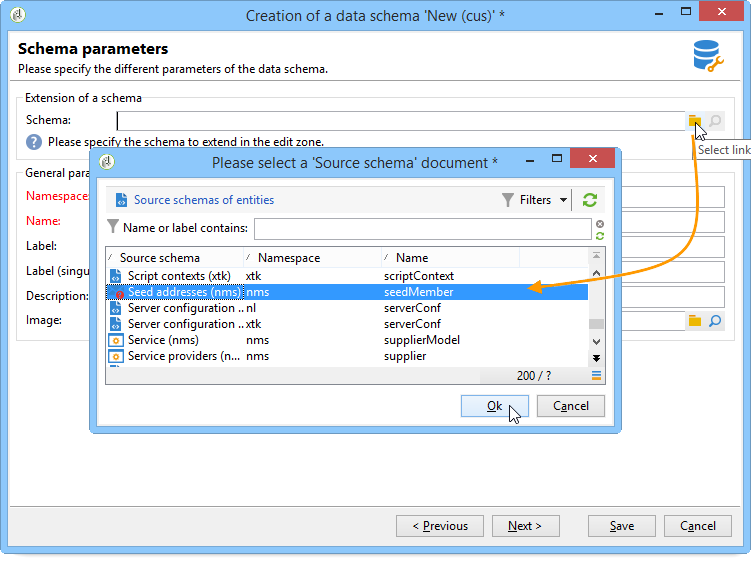
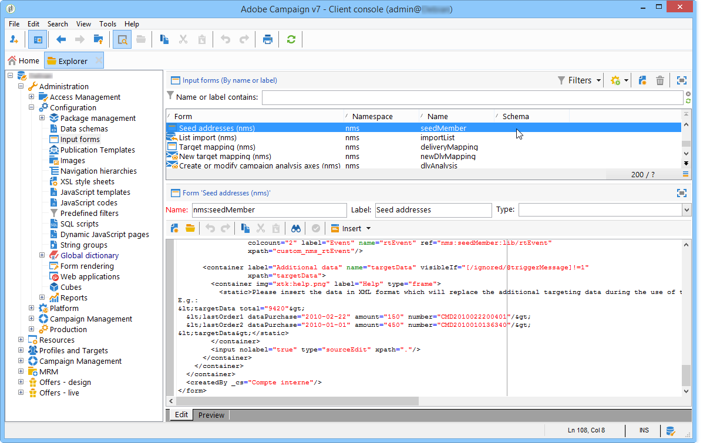
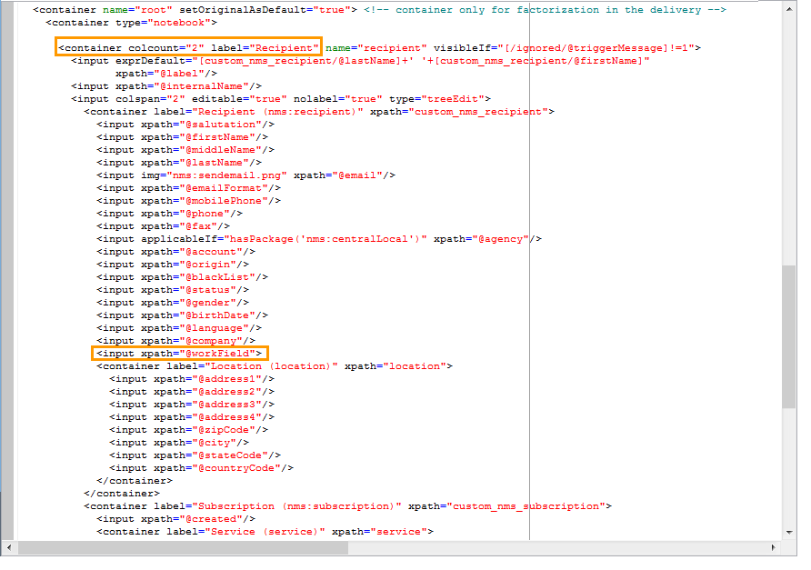
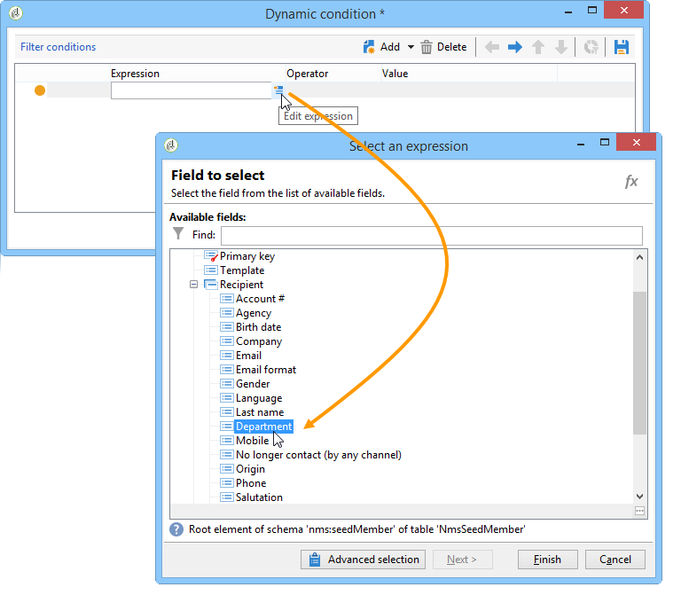

# Caso de uso: selecionar seed addresses de acordo com critérios{#use-case-selecting-seed-addresses-on-criteria}


Na estrutura de um delivery ou campanha, o link **[!UICONTROL Edit the dynamic condition...]** permite escolher seed addresses com base em critérios de seleção específicos.

Nesse caso de uso, o site **Minha biblioteca online** gostaria de personalizar seus boletins informativos de acordo com as preferências de seus clientes.

Em conjunto com o departamento de compras, o usuário responsável pelos deliveries criou um boletim informativo para assinantes que compraram romances policiais.

Para compartilhar o resultado final de sua colaboração com eles, o gerente de delivery decide adicionar seus colegas do departamento de compras ao delivery como seed addresses. A utilização de uma condição dinâmica permite economizar tempo na configuração e na atualização de endereços.

Para usar a condição dinâmica, você deve ter:

* um delivery pronto para ser enviado,
* seed addresses com um valor comum. Esse valor pode ser um campo existente no Adobe Campaign. Neste exemplo, os seed addresses compartilham o valor &quot;Compra&quot; no campo &quot;Departamento&quot;, que não está presente no aplicativo por padrão.

## Etapa 1 - Criar um delivery  {#step-1---creating-a-delivery}

As etapas para criar um delivery estão detalhadas na seção [Criar um delivery por email](creating-an-email-delivery.md).

Neste exemplo, o gerenciador de delivery criou o boletim informativo e selecionou os recipients.


## Etapa 2 - Criar um valor comum {#step-2---creating-a-common-value}

Para criar um valor comum como no nosso exemplo (departamento de compras), primeiro você deve estender o **esquema de dados** de seus seed addresses e editar o formulário de entrada associado.

### Estender o esquema de dados {#extending-the-data-schema}

Para obter mais detalhes sobre extensões de esquema, consulte [esta seção](../../configuration/using/data-schemas.md).

1. No nó **[!UICONTROL Administration > Configuration > Data schemas]**, clique no ícone **[!UICONTROL New]**.
1. Na janela **[!UICONTROL Creation of a data schema]**, selecione a opção **[!UICONTROL Extension of a schema]** e clique em **[!UICONTROL Next]**.

   

1. Selecione o schema de origem **[!UICONTROL Seed addresses]**, insira **doc** como o **[!UICONTROL Namespace]** e clique em **[!UICONTROL Ok]**.

   

1. Clique em **[!UICONTROL Save]**.
1. Na janela de edição do schema, copie as linhas abaixo e cole na área indicada na captura de tela.

   ```
     <element name="common">
       <element label="Recipient" name="custom_nms_recipient">
         <attribute label="Department" length="80" name="workField" template="nms:recipient:recipient/@company"
                    type="string" userEnum="workField"/>
       </element>
     </element>
   ```

   

   Em seguida, copie as linhas a seguir e as cole no elemento **[!UICONTROL Seed to insert in the export files]**.

   ```
       <element aggregate="doc:seedMember:common">
     </element>
   ```

   

   Nesse caso, você está especificando que uma nova lista discriminada chamada **[!UICONTROL Department]** foi criada na tabela de seed addresses e é baseada no template de enumeração **[!UICONTROL @company]** padrão (rotulada com o nome **Company** no formulário de seed address).

1. Clique em **[!UICONTROL Save]**.
1. Na seção **[!UICONTROL Tools > Advanced]** selecione a opção **[!UICONTROL Update database structure]**.

   

1. Quando o assistente de atualização for exibido, clique no botão **[!UICONTROL Next]** para acessar a janela de edição de tabelas: as alterações realizadas no schema de dados de seed address exigem uma atualização de estrutura.

   

1. Siga o assistente até chegar à página para executar a atualização. Clique no botão **[!UICONTROL Start]**.

   

   Você pode fechar o assistente após o término da atualização.

1. Desconecte e reconecte o Adobe Campaign. As alterações feitas no schema de dados do seed address agora estão em vigor. Para ficarem visíveis na tela do seed address, você deve atualizar o **[!UICONTROL Input form]** associado. Consulte a seção [Atualizar o formulário de entrada](#updating-the-input-form).

#### Estender o esquema de dados de uma tabela vinculada {#extending-the-data-schema-from-a-linked-table}

O esquema de dados de seed addresses pode usar valores de uma tabela vinculada ao esquema de dados do recipient – Recipient (nms).

Por exemplo, o usuário gostaria de integrar a **[!UICONTROL Internet Extension]** localizada na tabela **[!UICONTROL Country]**, que está vinculada ao schema de recipients.


Portanto, ele deve estender o schema de dados dos seed addresses como detalhado na seção . No entanto, as linhas de código a serem integradas na **etapa 4** são as seguintes:

```
<element name="country">
      <attribute label="Internet Extension" length="2" name="iana" type="string"/>
      <attribute label="Country ISO" length="2" name="countryIsoA2" type="string"/>
    </element>
```


Eles indicam:

* que o usuário deseja criar um novo elemento chamado **[!UICONTROL Internet Extension]**,
* que este elemento vem da tabela **[!UICONTROL Country]**.

>[!CAUTION]
>
>No nome da tabela vinculada, você deve especificar o **xpath-dst** da tabela vinculada.
>
>Isso pode ser encontrado no elemento **[!UICONTROL Country]** na tabela de recipients.


O usuário pode então seguir a partir da **etapa 5** da seção e atualizar o **[!UICONTROL Input form]** dos seed addresses.

Consulte a seção [Atualizar o formulário de entrada](#updating-the-input-form).

#### Atualizar o formulário de entrada {#updating-the-input-form}

1. No nó **[!UICONTROL Administration > Configuration > Input forms]**, localize o formulário de entrada dos seed addresses.

   

1. Edite o formulário e insira a seguinte linha no container **[!UICONTROL Recipient]**:

   ```
   <input xpath="@workField"/>
   ```

   

1. Salve as alterações.
1. Abra um seed address. O campo **[!UICONTROL Department]** aparece na tabela **[!UICONTROL Recipient]**.

   

1. Edite os seed addresses que deseja utilizar para o delivery e insira **Compras** como o valor no campo **[!UICONTROL Department]**.

## Etapa 3 – Definir a condição {#step-3---defining-the-condition}

Agora você pode especificar a condição dinâmica dos seed addresses para o delivery. Para fazer isso:

1. Abra um delivery.

   

1. Clique no link **[!UICONTROL To]** e depois na guia **[!UICONTROL Seed addresses]** para acessar o link **[!UICONTROL Edit the dynamic condition...]**.

   

1. Selecione a expressão que permite escolher os seed addresses desejados. Aqui o usuário seleciona a expressão **[!UICONTROL Department (@workField)]**.

   

1. Selecione o valor desejado. Neste exemplo, o usuário seleciona o departamento de **Compras** da lista suspensa de valores.

   

   >[!NOTE]
   >
   >A extensão de schema criada anteriormente vem do schema de **recipients.** Os valores exibidos na tela acima vêm de uma enumeração do schema do **recipient** .

1. Clique em **[!UICONTROL Ok]**.

   O query é exibido na janela **[!UICONTROL Select target]**.

   

1. Clique em **[!UICONTROL Ok]** para aprovar o query.
1. Analise seu e clique na guia **[!UICONTROL Delivery]** Delivery para acessar os logs de delivery.

   Os seed addresses do departamento de compras são exibidos como delivery pendente, como os dos recipients ou outros seed addresses.

   

1. Clique no botão **[!UICONTROL Send]** para iniciar o delivery.

   Os membros do departamento de compras fazem parte dos seed addresses que receberão o delivery na caixa de entrada do email.

   
