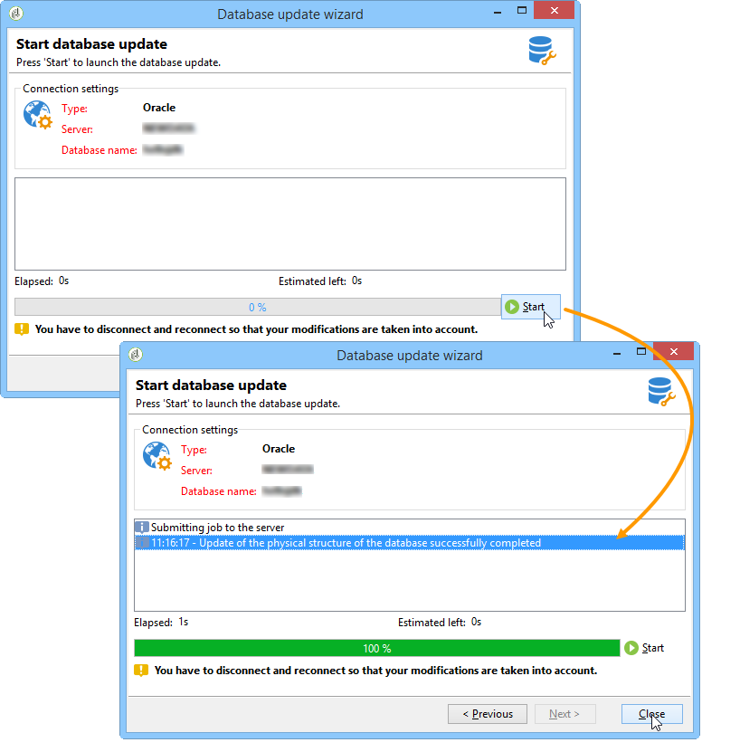
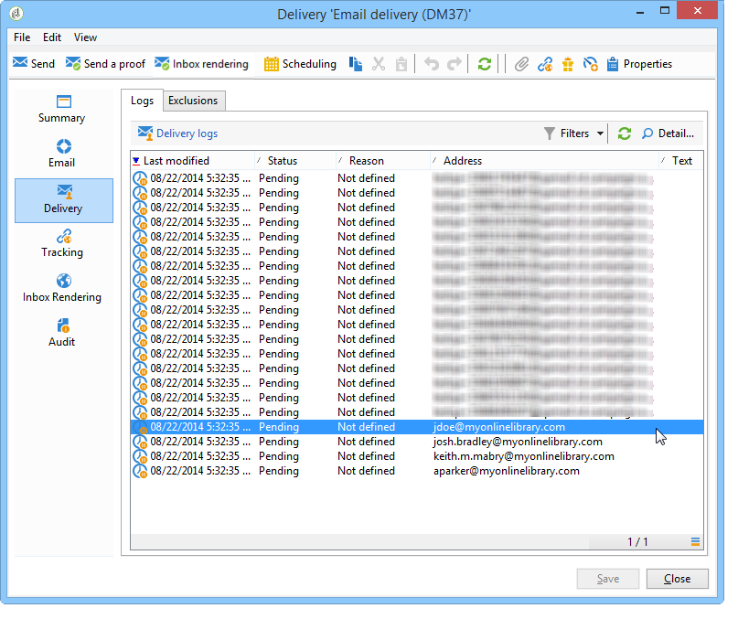

# Caso de uso: seleção de seed addresses com critérios{#use-case-selecting-seed-addresses-on-criteria}

In the framework of a delivery or a campaign, the **[!UICONTROL Edit the dynamic condition...]** link lets you choose seed addresses based on specific selection criteria.

Nesse caso de uso, o site **Minha biblioteca online** gostaria de personalizar seus boletins informativos de acordo com as preferências de seus clientes.

Em conjunto com o departamento de compras, o usuário responsável pelos deliveries criou um boletim informativo para assinantes que compraram romances policiais.

Para compartilhar o resultado final de sua colaboração com eles, o gerenciador de delivery decide adicionar seus colegas do departamento de compras ao delivery como seed addresses. A utilização de uma condição dinâmica permite economizar tempo na configuração e na atualização de endereços.

Para usar a condição dinâmica, você deve ter:

* um delivery pronto para ser enviado,
* seed addresses com um valor comum. Esse valor pode ser um campo existente no Adobe Campaign. Neste exemplo, os seed addresses compartilham o valor &quot;Compra&quot; no campo &quot;Departamento&quot;, que não está presente no aplicativo por padrão.

## Etapa 1 - Criação de um delivery {#step-1---creating-a-delivery}

As etapas para criar uma entrega são detalhadas na seção [Criação de uma entrega](../../delivery/using/creating-an-email-delivery.md) de email.

Neste exemplo, o gerenciador de delivery criou o boletim informativo e selecionou os recipients.


## Etapa 2 - Criação de um valor comum {#step-2---creating-a-common-value}

Para criar um valor comum como no nosso exemplo (departamento de compras), primeiro deve-se estender o **schema de dados** de seus seed addresses e editar o formulário de entrada associado.

### Extensão do schema de dados {#extending-the-data-schema}

Para obter mais detalhes sobre extensões de schema, consulte o [Guia de configuração](../../configuration/using/data-schemas.md).

1. No **[!UICONTROL Administration > Configuration > Data schemas]** nó, clique no **[!UICONTROL New]** ícone.
1. Na **[!UICONTROL Creation of a data schema]** janela, selecione a **[!UICONTROL Extension of a schema]** opção e clique em **[!UICONTROL Next]**.

   

1. Selecione o esquema **[!UICONTROL Seed addresses]** de origem, digite **doc** como o **[!UICONTROL Namespace]** e clique em **[!UICONTROL Ok]**.

   

1. Clique em **[!UICONTROL Save]**.
1. Na janela de edição do schema, copie as linhas abaixo e cole na área indicada na captura de tela.

   ```
     <element name="common">
       <element label="Recipient" name="custom_nms_recipient">
         <attribute label="Department" length="80" name="workField" template="nms:recipient:recipient/@company"
                    type="string" userEnum="workField"/>
       </element>
     </element>
   ```

   

   Em seguida, copie as linhas a seguir e cole-as sob o **[!UICONTROL Seed to insert in the export files]** elemento.

   ```
       <element aggregate="doc:seedMember:common">
     </element>
   ```

   

   In this case, you are specifying that a new enumeration named **[!UICONTROL Department]** has been created in the seed address table, and it is based on the standard **[!UICONTROL @company]** enumeration template (labeled under the name **Company** in the seed address form).

1. Clique em **[!UICONTROL Save]**.
1. No **[!UICONTROL Tools > Advanced]** menu, selecione a **[!UICONTROL Update database structure]** opção.

   

1. When the update wizard is displayed, click the **[!UICONTROL Next]** button to access the Edit tables window: changes carried out in the seed address data schema require a structure update.

   

1. Siga o assistente até chegar à página para executar a atualização. Clique no botão **[!UICONTROL Start]**.

   

   Você pode fechar o assistente após o término da atualização.

1. Desconecte e reconecte o Adobe Campaign. As alterações feitas no schema de dados do seed address agora estão em vigor. In order for them to be visible from the seed address screen, you must update the associated **[!UICONTROL Input form]**. Consulte a seção [Atualização do formulário](#updating-the-input-form) de entrada.

#### Extensão do schema de dados de uma tabela vinculada {#extending-the-data-schema-from-a-linked-table}

O schema de dados de seed addresses pode usar valores de uma tabela vinculada ao schema de dados do recipient – Recipient (nms).

For example, the user would like to integrate the **[!UICONTROL Internet Extension]** found in the **[!UICONTROL Country]** table that is linked to the recipients schema.


Portanto, ele deve estender o schema de dados dos seed addresses como detalhado na seção . No entanto, as linhas de código a serem integradas na **etapa 4** são as seguintes:

```
<element name="country">
      <attribute label="Internet Extension" length="2" name="iana" type="string"/>
      <attribute label="Country ISO" length="2" name="countryIsoA2" type="string"/>
    </element>
```


Eles indicam:

* that the user wants to create a new element named **[!UICONTROL Internet Extension]**,
* that this element comes from the **[!UICONTROL Country]** table.

>[!CAUTION]
>
>No nome da tabela vinculada, você deve especificar o **xpath-dst** da tabela vinculada.
>
>This can be found in the **[!UICONTROL Country]** element in the recipients table.


The user can then follow from **step 5** of the section, and update the **[!UICONTROL Input form]** of the seed addresses.

Consulte a seção [Atualização do formulário](#updating-the-input-form) de entrada.

#### Atualização do formulário de entrada {#updating-the-input-form}

1. In the **[!UICONTROL Administration > Configuration > Input forms]** node, find the seed addresses input form.

   

1. Edit the form and insert the following line in the **[!UICONTROL Recipient]** container.

   ```
   <input xpath="@workField"/>
   ```

   

1. Salve as alterações.
1. Abra um seed address. O **[!UICONTROL Department]** campo é exibido na **[!UICONTROL Recipient]** tabela.

   

1. Edit the seed addresses that you want to use for the delivery and enter **Purchasing** as the value in the **[!UICONTROL Department]** field.

## Etapa 3 – Definição da condição {#step-3---defining-the-condition}

Agora você pode especificar a condição dinâmica dos seed addresses para o delivery. Para fazer isso:

1. Abra um delivery.

   

1. Clique no **[!UICONTROL To]** link e na guia **[!UICONTROL Seed addresses]** para acessar o **[!UICONTROL Edit the dynamic condition...]** link.

   

1. Selecione a expressão que permite escolher os seed addresses desejados. Aqui, o usuário seleciona a **[!UICONTROL Department (@workField)]** expressão.

   

1. Selecione o valor desejado. Neste exemplo, o usuário seleciona o departamento de **Compras** da lista suspensa de valores.

   

   >[!NOTE]
   >
   >A extensão de schema criada anteriormente vem do schema de **recipients.** Os valores exibidos na tela acima vêm de uma enumeração do schema do **recipient** .

1. Clique em **[!UICONTROL Ok]**.

   The query is displayed in the **[!UICONTROL Select target]** window.

   

1. Clique em **[!UICONTROL Ok]** para aprovar a consulta.
1. Analyze your delivery then click on the **[!UICONTROL Delivery]** tab to access the delivery logs.

   Os seed addresses do departamento de compras são exibidos como delivery pendente, como os dos recipients ou outros seed addresses.

   

1. Click the **[!UICONTROL Send]** button to start the delivery.

   Os membros do departamento de compras fazem parte dos seed addresses que receberão o delivery na caixa de entrada do email.

   
