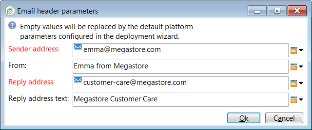

# Usar modelos {#use-templates}

Os templates do delivery oferecem mais eficiência ao fornecer cenários prontos para os tipos mais comuns de atividades. Com modelos, os profissionais de marketing podem implantar novas campanhas com personalização mínima em um período de tempo menor.

Saiba mais sobre templates do delivery [nesta seção](creating-a-delivery-template.md).

## Introdução a modelos de entrega {#gs-templates}

Um [template do delivery](creating-a-delivery-template.md) permite definir uma única vez um conjunto de propriedades técnicas e funcionais que atendam às suas necessidades e que possam ser reutilizadas para delivery futuros. Você pode economizar tempo e padronizar deliveries quando necessário.

Quando você gerencia várias marcas no Adobe Campaign, a Adobe recomenda ter um subdomínio por marca. Por exemplo, um banco pode ter vários subdomínios correspondentes a cada uma de suas agências regionais. Se um banco for proprietário do domínio bluebank.com, seus subdomínios podem ser @ny.bluebank.com, @ma.bluebank.com, @ca.bluebank.com, etc. Ter um template do delivery por subdomínio permite usar sempre os parâmetros pré-configurados certos para cada marca, o que evita erros e economiza tempo.

**Dica**: para evitar erros de configuração, recomendamos duplicar um modelo nativo e alterar suas propriedades em vez de criar um novo modelo.

## Configurar endereços

* O endereço do remetente é obrigatório para o envio de um email.

* Alguns ISPs (provedores de serviço de internet) verificam a validade do endereço do remetente antes de aceitarem mensagens.

* Um endereço formado incorretamente pode resultar na rejeição pelo servidor de recebimento. Você precisa ter certeza de que o endereço informado está correto.

* O endereço deve identificar explicitamente o remetente. O domínio deve ser de propriedade e registrado pelo remetente.

* A Adobe recomenda a criação de contas de email que correspondam aos endereços especificados para delivery e respostas. Verifique com o administrador do sistema de mensagens.

Para configurar endereços na interface do Campaign, siga os passos abaixo:

1. No [template do delivery](creating-a-delivery-template.md), clique no link **[!UICONTROL From]**. Na janela **[!UICONTROL Email header parameters]**, preencha os seguintes campos:

   

1. No campo **[!UICONTROL Sender address]**, verifique se o domínio de endereço é o mesmo que o subdomínio que você delegou à Adobe. Você pode alterar a parte anterior a “@&#39;” mas não o endereço do domínio.

1. No campo **[!UICONTROL From]**, use um nome facilmente identificável pelos recipients, como o nome da sua marca, para aumentar a taxa de abertura dos deliveries. Para melhorar ainda mais a experiência do recipient, você pode adicionar o nome de uma pessoa, por exemplo “Emma da Megastore”.

1. Nos campos **[!UICONTROL Reply address text]**, o endereço do remetente é usado por padrão para respostas. No entanto, a Adobe recomenda o uso de um endereço real, como o atendimento ao cliente da sua marca. Nesse caso, se um recipient enviar uma resposta, o atendimento ao cliente poderá resolvê-lo.

### Configurar um grupo de controle

Depois que o delivery é enviado, você pode comparar o comportamento dos recipients excluídos com os recipients que receberam o delivery. Você pode então medir a eficiência de suas campanhas. Saiba mais sobre grupos de controle [nesta seção](../../campaign/using/marketing-campaign-deliveries.md#defining-a-control-group).

Para configurar um grupo de controle, clique no link **[!UICONTROL To]**. Na janela **[!UICONTROL Select target]**, selecione a guia **[!UICONTROL Control group]**. Você pode extrair uma fatia do público-alvo, por exemplo, uma amostra aleatória de 5%.

## Usar tipologias para aplicar filtros ou regras de controle

Uma tipologia contém regras de verificação aplicadas durante a fase de análise, antes de enviar qualquer mensagem.

Na guia **[!UICONTROL Typology]** das propriedades do template, altere a tipologia padrão de acordo com suas necessidades.

Por exemplo, para controlar melhor o tráfego de saída, você pode definir quais endereços IP podem ser usados, estabelecendo uma afinidade por subdomínio e criando uma tipologia por afinidade. As afinidades são definidas no arquivo de configuração da instância. Entre em contato com o administrador do Adobe Campaign.

Para obter mais informações sobre tipologias, consulte [esta seção](../../campaign-opt/using/about-campaign-typologies.md).
