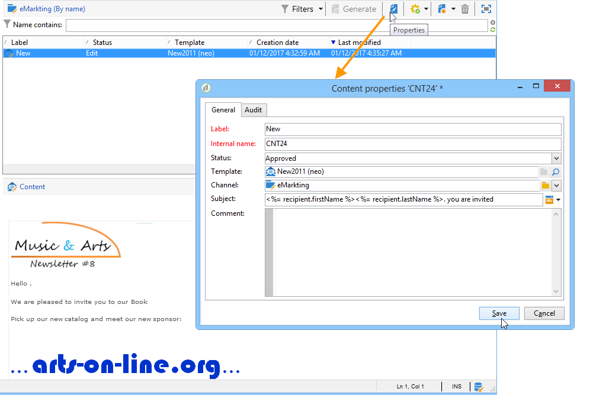

# Usar um modelo de conteúdo{#using-a-content-template}

## Sobre modelos de conteúdo {#about-content-templates}

Os templates de conteúdo podem ser referenciados e usados nas remessas diretamente. Consulte [Criação de um delivery via gestão de conteúdo](#creating-a-delivery-via-content-management)

Eles também podem ser usados para criar instâncias de conteúdo. Depois de criadas, essas instâncias estão prontas para serem entregues (consulte [Delivery de uma instância de conteúdo](#delivering-a-content-instance)) ou exportadas (consulte [Criação de uma instância de conteúdo](#creating-a-content-instance)).

## Criação de uma entrega via gerenciamento de conteúdo {#creating-a-delivery-via-content-management}

É possível referenciar um template de conteúdo em um delivery tendo em conta o uso de campos de entrada para inserir conteúdo. Uma guia adicional é incluída no assistente do delivery para definir o conteúdo do delivery.

O layout será aplicado automaticamente com base nas configurações selecionadas. Para visualizá-lo, clique em **[!UICONTROL HTML preview]** (ou **[!UICONTROL Text preview]**) e selecione um recipient para testar os elementos de personalização.

Para obter mais informações, consulte o exemplo de implementação completa: [Criação de conteúdo no assistente de entrega](use-case--creating-content-management.md#creating-content-in-the-delivery-wizard).

## Criação de uma instância de conteúdo {#creating-a-content-instance}

É possível criar conteúdo diretamente na árvore do Adobe Campaign para ser usado em workflows, exportado ou inserido diretamente em novos deliveries.

Siga as etapas abaixo:

1. Selecione o nó **[!UICONTROL Resources > Contents]** da árvore, clique com o botão direito do mouse e escolha **[!UICONTROL Properties]**.

   

1. Selecione os templates de publicação que estarão ativos para esta pasta.

   

1. Agora você pode criar novo conteúdo usando o botão **[!UICONTROL New]** acima da lista de conteúdo.

   

1. Insira os campos no formulário.

   

1. Em seguida, clique na guia **[!UICONTROL HTML preview]** para exibir a renderização. Os campos de personalização obtidos do banco de dados não são inseridos aqui.

   

1. Uma vez criado, o conteúdo será adicionado à lista de conteúdos disponíveis. Clique no link **[!UICONTROL Properties]** para alterar seu rótulo, status ou visualizar seu histórico.

   

1. Se necessário, quando o conteúdo for aprovado, ele poderá ser gerado usando o botão apropriado na barra de ferramentas.

   

   >[!NOTE]
   >
   >Você pode autorizar a geração de conteúdos não aprovados. Para fazer isso, altere a opção relevante no template de publicação. Para obter mais informações, consulte [Criação e configuração do template](publication-templates.md#creating-and-configuring-the-template).

   O conteúdo HTML e texto é gerado por padrão na pasta da **publicação** da instância do Adobe Campaign. Você pode alterar a pasta da publicação graças à opção **NcmPublishingDir**.

## Entrega de uma instância de conteúdo {#delivering-a-content-instance}

Para criar e entregar uma instância de conteúdo, um template do delivery precisa ser vinculado ao template de publicação usado para gerar esse conteúdo. Para obter mais informações, consulte [Delivery](publication-templates.md#delivery).

Além disso, a pasta de armazenamento de conteúdo deve ser dedicada ao conteúdo obtido deste template de publicação (quando uma pasta de conteúdo permite gerar vários tipos de conteúdo, os deliveries não podem ser criados automaticamente).

Para criar automaticamente um baseado no conteúdo selecionado, clique no ícone **[!UICONTROL Delivery]** Delivery e escolha o template.

O conteúdo de texto e HTML é inserido automaticamente.
