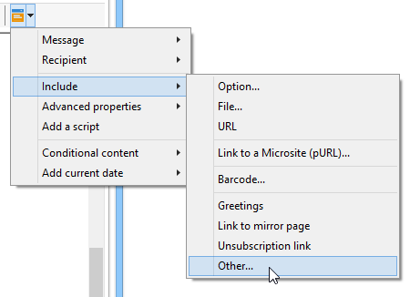

# Marketing viral e social{#viral-and-social-marketing}

## Sobre marketing viral {#about-viral-marketing}

O Adobe Campaign permite que você configure ferramentas para incentivar o marketing viral.

Isso permite que os recipients de delivery ou os visitantes do site compartilhem informações com a rede: desde adicionar um link ao seu perfil do Facebook ou do Twitter até enviar uma mensagem para um amigo.

>[!CAUTION]
>
>Para que os links adicionados funcionem corretamente, a página de espelho correspondente deve estar disponível. Para fazer isso, inclua o link para a página espelho no delivery.

## Redes sociais: compartilhando um link {#social-networks--sharing-a-link}

Para permitir que os recipients de entrega compartilhem o conteúdo das mensagens com membros de sua rede, você precisa incluir o bloco de personalização correspondente.

>[!NOTE]
>
>Por padrão, esse link não é oferecido na lista de blocos. Você pode acessá-lo clicando em **[!UICONTROL Other...]** e selecionando o bloco **[!UICONTROL Social network sharing links]**. 

A renderização será da seguinte forma:

Quando o recipient clicar no ícone de uma das redes sociais exibidas, ele será automaticamente redirecionado para sua conta e poderá compartilhar o conteúdo da mensagem por meio de um link. Isso permitirá aos membros de sua rede acessarem a comunicação.

>[!NOTE]
>
>Este bloco de personalização contém todos os links (para envio e compartilhamento de mensagens com todas as redes sociais). Ele poderá ser alterado para atender às suas necessidades. No entanto, a configuração é reservada para usuários avançados. Para editar o bloco de personalização correspondente, vá para o nó **[!UICONTROL Resources > Campaign management > Personalization blocks]** da árvore do Adobe Campaign.

## Marketing viral: encaminhar para um amigo {#viral-marketing--forward-to-a-friend}

Um serviço viral permite que ações do tipo por-indicação sejam executadas: essas ações permitem que você encaminhe uma mensagem para um amigo. O perfil do(s) indicado(s) é armazenado temporariamente no banco de dados (em uma tabela dedicada). As mensagens encaminhadas incluem um link para o indicado assinar: caso assine, ele será adicionado ao banco de dados do Adobe Campaign.

O encaminhamento de mensagens é baseado nos mesmos princípios que os links de rede social.

Aplique as seguintes etapas:

1. Adicione o bloco de personalização **[!UICONTROL Social network sharing links]** ao corpo da mensagem original.
1. O recipient da mensagem pode clicar no ícone de **[!UICONTROL Email]** para enviar esta mensagem para um ou mais amigos.

   

   Um formulário de referência permite inserir os endereços de email dos indicados.

   

   A mensagem é enviada a eles quando o recipient principal clicar no botão **[!UICONTROL Next]**.

   >[!NOTE]
   >
   >O conteúdo dessa mensagem pode ser personalizado para atender às suas necessidades. Ela é criada com base no modelo **[!UICONTROL Transfer of original message]**, que é armazenado no nó **[!UICONTROL Administration > Campaign management > Technical delivery templates]**.
   >
   >Também é possível alterar o formulário de encaminhamento de mensagens disponibilizado para o referenciador. Para fazer isso, é necessário alterar o aplicativo web **Viral form** armazenado no nó **[!UICONTROL Resources > Online > Web applications]**.

1. Na mensagem encaminhada, um link permite que o indicado salve o perfil no banco de dados. Um formulário de entrada é fornecido para essa finalidade.

   

   >[!NOTE]
   >
   >Essa configuração pode ser adaptada. Para fazer isso, você precisa modificar o aplicativo web de **Recipient subscription** armazenado no nó **[!UICONTROL Resources > Online > Web applications]**.
   >
   >Para obter mais informações sobre aplicativos web, consulte [esta seção](../../web/using/about-web-applications.md).

   Depois de validar, uma mensagem de confirmação será enviada para ele: só será registrado para sempre uma vez que ativar o link na mensagem de confirmação. Essa mensagem é criada com base no modelo **[!UICONTROL Registration confirmation]**, que é armazenado no nó **[!UICONTROL Administration > Campaign management > Technical delivery templates]**.

   O indicado é adicionado à pasta **Recipients** do banco de dados e é inscrito (por padrão) ao serviço de informação do **Boletim informativo**.

## Rastreamento de compartilhamento em rede social {#tracking-social-network-sharing}

O compartilhamento e o acesso a informações compartilhadas são rastreados. Essas informações coletadas pelo Adobe Campaign podem ser acessadas em dois lugares:

* na guia **[!UICONTROL Tracking]** do delivery (ou individualmente para cada recipient):

   

* em um relatório dedicado **[!UICONTROL Sharing to social networks]**:

   

