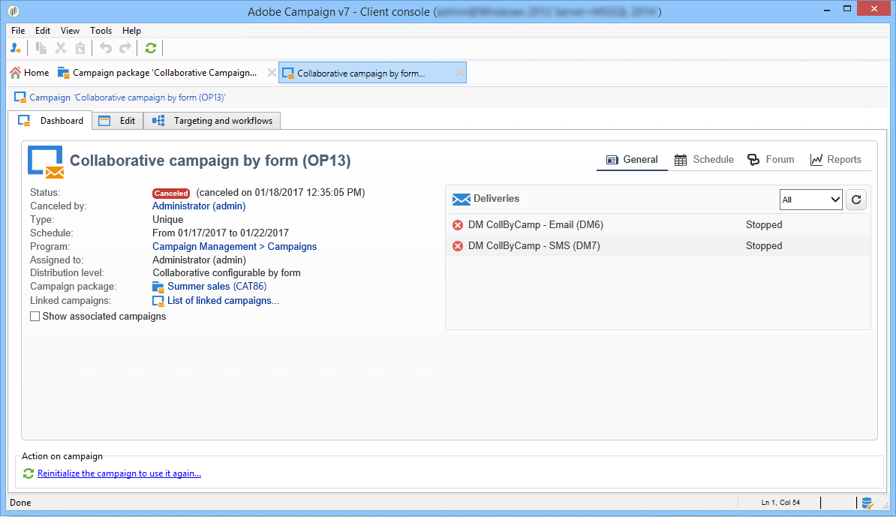

# Rastrear uma campanha{#tracking-a-campaign}

Os operadores de entidade central podem rastrear pedidos de campanha na lista de pacotes de campanha.

Isso permite:

* [Pacotes de filtro](#filter-packages),
* [Edição de pacotes](#edit-packages),
* [Cancelamento de um pacote](#cancel-a-package),
* [Reinicializar um pacote](#reinitializing-a-package).

## Pacotes de filtro {#filter-packages}

Na guia **[!UICONTROL Campaigns]**, é possível exibir a lista de **[!UICONTROL Campaign packages]** que reagrupa todas as campanhas de marketing distribuído existentes. É possível filtrar essa lista para exibir somente as campanhas publicadas, atrasadas, pendentes de aprovação etc. Para fazer isso, clique nos links na seção superior desta exibição ou use o link **[!UICONTROL Filter list]** e selecione o status do pacote da campanha a ser exibido.

## Edição de pacotes {#edit-packages}

A página **[!UICONTROL Campaign packages]** permite visualizar o resumo de cada pacote.

Este resumo mostra as seguintes informações: rótulo, tipo de campanha, bem como o nome da campanha da qual foi criada e a pasta.

Clique no nome do pacote para editá-lo. Você também pode visualizar pedidos por suas entidades locais e pelo seus status.

Essas informações também estão disponíveis na visualização **[!UICONTROL Campaign orders]**, que lista todas as ordens.

O operador central pode editar o pedido. Há duas maneiras de fazer isso:

1. O operador pode clicar no nome do pedido para editá-lo: isso exibe o detalhe do pedido.

   

   A guia **[!UICONTROL Edit > General]** permite visualizar informações inseridas pela entidade local quando solicita a campanha.

   

1. O operador pode clicar no rótulo do pacote de campanha para editá-lo e alterar determinadas configurações.

   

## Cancelamento de um pacote {#cancel-a-package}

A entidade central pode cancelar um pacote de campanha a qualquer momento.

Clique em **[!UICONTROL Cancel]** no **[!UICONTROL Dashboard]** do pacote de campanha.

O campo **[!UICONTROL Comment]** permite justificar o cancelamento.

Para **campanhas locais**, cancelar um pacote o remove da lista de campanhas de marketing disponíveis.

Para **campanhas colaborativas**, cancelar um pacote inicia várias ações:

1. Quaisquer pedidos relacionados a este pacote serão cancelados,

   

1. A campanha de referência é cancelada e todos os processos ativos (workflows, entregas) são interrompidos,

   

1. Uma notificação é enviada a todas as entidades locais relacionadas.

   

Os pacotes cancelados ainda podem ser acessados e reiniciados pela entidade central (veja abaixo) se necessário. Eles só serão oferecidas às entidades locais quando forem aprovados e iniciados. O processo de reinicialização de pacote é mostrado abaixo.

## Reinicializar um pacote {#reinitializing-a-package}

Os pacotes de campanha que já foram publicados podem ser reiniciados, modificados e disponibilizados às entidades locais.

1. Selecione o pacote desejado.
1. Clique no link **[!UICONTROL Reinitialize the package to reuse it]** e clique em **[!UICONTROL OK]**.

   

1. Clique em **[!UICONTROL Save]** para aprovar o pacote reinicialização.

   

1. O status do pacote muda para **[!UICONTROL Being edited]**. Modifique, aprove e publique ele novamente para restaurá-lo na lista de pacotes de campanha.

>[!NOTE]
>
>Você também pode reinicializar pacotes de campanha cancelados.
