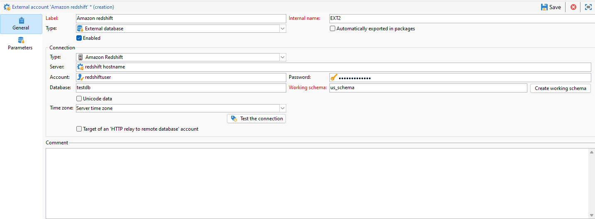

# Configuração do acesso ao Amazon Redshift {#configure-access-to-redshift}

Use a opção Campaign **Federated Data Access** (FDA) para processar informações armazenadas em bancos de dados externos. Siga as etapas abaixo para configurar o acesso ao Amazon Redshift.

1. Configurar o [banco de dados do Amazon Redshift](#configuring-redshift)
1. Configurar o Amazon Redshift [conta externa](#redshift-external) no Campaign

## Amazon Redshift no Linux {#redshift-linux}

Para configurar o [!DNL Amazon Redshift] no Linux, siga as etapas abaixo:

1. Antes da instalação do ODBC, verifique se os seguintes pacotes estão instalados na distribuição Linux:

   * Para Red Hat/CentOS:

     ```
      yum update
      yum upgrade
      yum install -y grep sed tar wget perl curl
     ```

   * Para Debian:

     ```
      apt-get update
      apt-get upgrade
      apt-get install -y grep sed tar wget perl curl
     ```

1. Antes de executar o script, você pode ter acesso a mais informações com a opção `--help`:

   ```
   cd /usr/local/neolane/nl6/bin/fda-setup-scripts/
   ./redshift_odbc-setup.sh --help
   ```

1. Acesse o diretório onde o script está localizado e execute o script a seguir como um usuário root:

   ```
     cd /usr/local/neolane/nl6/bin/fda-setup-scripts
     ./redshift_odbc-setup.sh
   ```

1. Após instalar os drivers ODBC, é necessário reiniciar o Campaign Classic. Para fazer isso, execute o seguinte comando:

   ```
   systemctl stop nlserver.service
   systemctl start nlserver.service
   ```

1. No Campaign, você pode configurar a conta externa do [!DNL Amazon Redshift]. Para obter mais informações sobre como configurar sua conta externa, consulte [esta seção](#redshift-external).

## Conta externa do Amazon Redshift {#redshift-external}

A conta externa [!DNL Amazon Redshift] permite conectar a instância do Campaign ao banco de dados externo do Amazon Redshift.

1. No Campaign Classic, configure a conta externa do [!DNL Amazon Redshift]. No **[!UICONTROL Explorer]**, clique em **[!UICONTROL Administration]** / **[!UICONTROL Platform]** / **[!UICONTROL External accounts]**.

1. Clique em **[!UICONTROL New]**.

1. Selecione **[!UICONTROL External database]** como sua conta externa **[!UICONTROL Type]**.

1. Para configurar a conta externa do **[!UICONTROL Amazon Redshift]**, você deve especificar:

   * **[!UICONTROL Type]**: Amazon Redshift

   * **[!UICONTROL Server]**: Nome do DNS

   * **[!UICONTROL Account]**: Nome do usuário

   * **[!UICONTROL Password]**: Senha da conta do usuário

   * **[!UICONTROL Database]**: nome do banco de dados, se não estiver especificado no DSN. Pode ficar em branco, se estiver especificado no DSN

   * **[!UICONTROL Working schema]**: Nome do esquema de trabalho. [Saiba mais](https://docs.aws.amazon.com/redshift/latest/dg/r_Schemas_and_tables.html)

   * **[!UICONTROL Time zone]**: Fuso horário do servidor

   

1. Clique em **[!UICONTROL Save]**.
