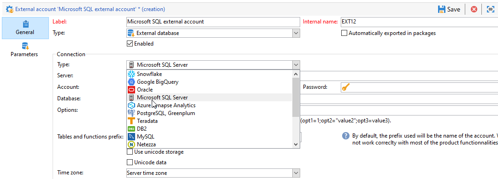

# Configuração do acesso ao Microsoft SQL Server {#configure-fda-sql}


Usar a campanha **Federated Data Access** (FDA) opção para processar informações armazenadas em um banco de dados externo do Microsoft SQL Server. Siga as etapas abaixo para configurar o acesso ao [!DNL Microsoft SQL Server].

1. Configurar [!DNL Microsoft SQL Server] em [CentOS](#sql-centos).
1. Configurar [!DNL Microsoft SQL Server] em [Linux](#sql-linux).
1. Configurar [!DNL Microsoft SQL Server] em [Windows](#sql-windows).
1. Configure o [!DNL Microsoft SQL Server] [conta externa](#sql-external) no Campaign

## Microsoft SQL Server no CentOS {#sql-centos}

>[!NOTE]
>
> [!DNL Microsoft SQL Server] O está disponível no CentOS 7 e 6.

Para configurar [!DNL Microsoft SQL Server] No CentOS, siga as etapas abaixo:

1. Baixe e instale o driver SQL ODBC com o seguinte comando:

   ```
   sudo su
   curl https://packages.microsoft.com/config/rhel/7/prod.repo > /etc/yum.repos.d/mssql-release.repo
   exit
   sudo yum remove unixODBC-utf16 unixODBC-utf16-devel #to avoid conflicts
   sudo ACCEPT_EULA=Y yum install msodbcsql
   ```

1. No Adobe Campaign, você pode configurar as [!DNL Microsoft SQL Server] conta externa. Para obter mais informações sobre como configurar a conta externa, consulte [nesta seção](#sql-external).

## Microsoft SQL Server no Linux {#sql-linux}

>[!NOTE]
>
> Se você estiver executando uma versão mais antiga do Adobe Campaign (anterior à 7.2.1), é necessário instalar o `unix ODBC drivers`.

1. Baixe o driver MS ODBC em [esta página](https://packages.microsoft.com/ubuntu/16.04/prod/pool/main/m/msodbcsql17/).

1. Execute o seguinte comando como usuário root:

   ```
   # install the mssql odbc that was downloaded
   dpkg -i msodbcsql17_17.7.1.1-1_amd64.deb
   # accept the license terms
   ```

1. No Adobe Campaign, você pode configurar as [!DNL Microsoft SQL Server] conta externa. Para obter mais informações sobre como configurar a conta externa, consulte [nesta seção](#sql-external).

## Microsoft SQL Server no Windows {#sql-windows}

Para configurar [!DNL Microsoft SQL Server] no Windows:

1. No Windows, clique em **[!UICONTROL Control Panel]** &#39;>&#39; **[!UICONTROL System and Security]** &#39;>&#39; **[!UICONTROL Administrative Tools]**&#39;>&#39; **[!UICONTROL ODBC Data Sources (64-bit)]**.

1. No **[!UICONTROL ODBC Data Sources (64-bit)]** nova janela, clique em **[!UICONTROL Add...]**.

1. Verifique se o SQL Server Native Client v11 está listado no **[!UICONTROL Create New Data Source]** janela.

1. Se o SQL Server Native Client não estiver listado, você poderá baixá-lo em [esta página](https://www.microsoft.com/en-my/download/details.aspx?id=36434).

1. No Adobe Campaign, você pode configurar as [!DNL Microsoft SQL Server] conta externa. Para obter mais informações sobre como configurar a conta externa, consulte [nesta seção](#sql-external).

## Conta externa do Microsoft SQL Server {#sql-external}

É necessário criar um [!DNL Microsoft SQL Server] conta externa para conectar a instância do Campaign à [!DNL Microsoft SQL Server] banco de dados externo.

1. Do Campaign **[!UICONTROL Explorer]**, clique em **[!UICONTROL Administration]** &#39;>&#39; **[!UICONTROL Platform]** &#39;>&#39; **[!UICONTROL External accounts]**.

1. Clique em **[!UICONTROL New]**.

1. Selecione **[!UICONTROL External database]** como sua conta externa **[!UICONTROL Type]**.

1. Em **[!UICONTROL Configuration]**, selecione [!DNL Microsoft SQL Server] do **[!UICONTROL Type]** menu suspenso.

   

1. Configure o **[!UICONTROL Microsoft SQL Server]** autenticação de conta externa:

   * **[!UICONTROL Server]**: O URL do [!DNL Microsoft SQL Server] servidor.

   * **[!UICONTROL Account]**: Nome do usuário.

   * **[!UICONTROL Password]**: Senha da conta do usuário.

   * **[!UICONTROL Database]**: Nome do banco de dados (opcional).

   * **[!UICONTROL Timezone]**: Fuso horário definido em [!DNL Microsoft SQL Server]. [Saiba mais](https://docs.microsoft.com/en-us/sql/t-sql/functions/current-timezone-transact-sql?view=sql-server-ver15)

1. Clique na guia **[!UICONTROL Parameters]** e depois no botão **[!UICONTROL Deploy functions]** para criar as funções.

   >[!NOTE]
   >
   >Para que todas as funções estejam disponíveis, você precisa criar as funções Adobe Campaign SQL no banco de dados remoto. Para obter mais informações, consulte esta [página](../../configuration/using/adding-additional-sql-functions.md).

1. Clique em **[!UICONTROL Save]** quando a configuração for concluída.

O conector é compatível com as seguintes opções:

| Opção | Descrição |
|---|---|
| Autenticação | Tipo de autenticação compatível com o conector. Valor com suporte atual: AtiveDirectoryMSI. <br> Para obter mais informações, consulte o exemplo 8 de [Documentação do Microsoft](https://docs.microsoft.com/en-us/sql/connect/odbc/using-azure-active-directory?view=sql-server-ver15#example-connection-strings). |
| Criptografar | Especifica se as conexões usam a criptografia TLS na rede. Os valores possíveis são **sim/obrigatório (18.0 e posterior)**, **não/opcional (18.0 e posterior)**, e **estrito (18.0 e posterior)**. O valor padrão está definido como **sim** na versão 18.0 e posterior e **não** em versões anteriores. <br>Para obter mais informações, consulte [Documentação do Microsoft](https://docs.microsoft.com/en-us/sql/connect/odbc/dsn-connection-string-attribute?view=azure-sqldw-latest#encrypt). |
| TrustServerCertificate | Permite a criptografia usando um certificado de servidor autoassinado, quando usado com **Criptografar**. <br>Valores aceitos: **sim** ou **não** (valor padrão, o que significa que o certificado do servidor será validado). |
