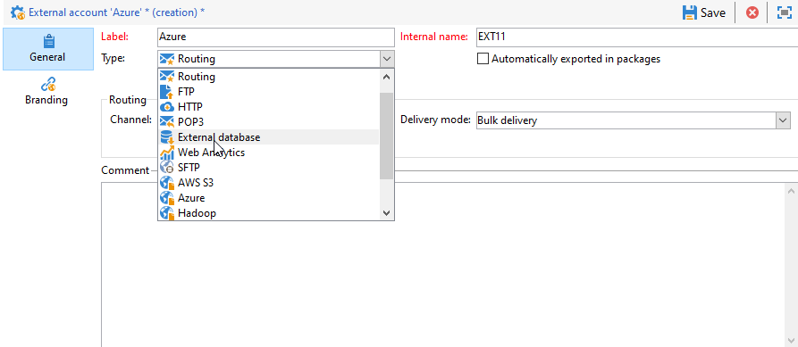

# Configurar o acesso ao Azure Synapse {#configure-access-to-azure-synapse}


Use a opção Campaign [Federated Data Access](../../installation/using/about-fda.md) (FDA) para processar informações armazenadas em um banco de dados externo. Siga as etapas abaixo para configurar o acesso ao Microsoft Azure synapse Analytics.

1. Configurar o Azure synapse em [CentOS](#azure-centos), [Windows](#azure-windows) ou [Debian](#azure-debian)
1. Configure o Azure synapse [external account](#azure-external) no Campaign

## Azure Synapse no CentOS {#azure-centos}

>[!CAUTION]
>
>* Você precisará de privilégios raiz para instalar um driver ODBC.
>* Os drivers Red Hat Enterprise ODBC fornecidos pela Microsoft também podem ser usados com o CentOS para conexão com o SQL Server.
>* A versão 13.0 funcionará com o Red Hat 6 e 7.


Para configurar o Azure synapse no CentOS, siga as etapas abaixo:

1. Primeiro, instale o driver ODBC. Você pode encontrá-lo nesta [página](https://www.microsoft.com/pt-BR/download/details.aspx?id=50420).

   >[!NOTE]
   >
   >É uma exclusividade da versão 13 do driver ODBC.

   ```
   sudo su
   curl https://packages.microsoft.com/config/rhel/6/prod.repo > /etc/yum.repos.d/mssql-release.repo
   exit
   # Uninstall if already installed Unix ODBC driver
   sudo yum remove unixODBC-utf16 unixODBC-utf16-devel #to avoid conflicts
   
   sudo ACCEPT_EULA=Y yum install msodbcsql
   
   sudo ACCEPT_EULA=Y yum install mssql-tools
   echo 'export PATH="$PATH:/opt/mssql-tools/bin"' >> ~/.bash_profile
   echo 'export PATH="$PATH:/opt/mssql-tools/bin"' >> ~/.bashrc
   source ~/.bashrc
   
   # the Microsoft driver expects unixODBC to be here /usr/lib64/libodbc.so.1, so add soft links to the '.so.2' files
   cd /usr/lib64
   sudo ln -s libodbccr.so.2   libodbccr.so.1
   sudo ln -s libodbcinst.so.2 libodbcinst.so.1
   sudo ln -s libodbc.so.2     libodbc.so.1
   
   # Set the path for unixODBC
   export ODBCINI=/usr/local/etc/odbc.ini
   export ODBCSYSINI=/usr/local/etc
   source ~/.bashrc
   
   #Add a DSN information to /etc/odbc.ini
   sudo vi /etc/odbc.ini
   
   #Add the following:
   [Azure Synapse Analytics]
   Driver      = ODBC Driver 13 for SQL Server
   Description = Azure Synapse Analytics DSN
   Trace       = No
   Server      = [insert your server here]
   ```

1. Se necessário, você pode instalar cabeçalhos de desenvolvimento unixODBC executando o seguinte comando:

   ```
   sudo yum install unixODBC-devel
   ```

1. Depois de instalar os drivers, você pode testar e verificar o driver ODBC e consultar o banco de dados, se necessário. Execute o seguinte comando:

   ```
   /opt/mssql-tools/bin/sqlcmd -S yourServer -U yourUserName -P yourPassword -q "your query" # for example -q "select 1"
   ```

1. No Campaign, você pode configurar a conta externa [!DNL Azure Synapse]. Para obter mais informações sobre como configurar a conta externa, consulte [esta seção](#azure-external).

1. Como o Azure Synapse Analytics se comunica por meio da porta TCP 1433, é necessário abrir essa porta no firewall. Use o seguinte comando:

   ```
   firewall-cmd --permanent --add-rich-rule='rule family="ipv4" source address="[server_ip_here]/32" port port="1433" protocol="tcp" accept'
   # you can ping your hostname and the ping command will translate the hostname to IP address which you can use here
   ```

   >[!NOTE]
   >
   >Para permitir a comunicação com o Azure Synapse Analytics, será necessário adicionar seu IP público à lista de permissões. Para fazer isso, consulte a [documentação do Azure](https://docs.microsoft.com/pt-BR/azure/sql-database/sql-database-firewall-configure#use-the-azure-portal-to-manage-server-level-ip-firewall-rules).

1. No caso de iptables, execute o seguinte comando:

   ```
   iptables -A OUTPUT -p tcp -d [server_hostname_here] --dport 1433 -j ACCEPT
   ```

## Azure Synapse no Windows {#azure-windows}

>[!NOTE]
>
>É uma exclusividade da versão 13 do driver ODBC, mas o Adobe Campaign Classic também pode usar os drivers do SQL Server Native Client 11.0 e 10.0.

Para configurar o Azure Synapse no Windows:

1. Primeiro, instale o driver ODBC da Microsoft. Você pode encontrá-lo em [this page](https://www.microsoft.com/en-us/download/details.aspx?id=50420).

1. Escolha os seguintes arquivos para instalar:

   ```
   your_language\your_architecture\msodbcsql.msi (i.e: English\X64\msodbcsql.msi)
   ```

1. Depois que o driver ODBC estiver instalado, você poderá testá-lo se necessário. Para obter mais informações, consulte esta [página](https://docs.microsoft.com/pt-BR/sql/connect/odbc/windows/system-requirements-installation-and-driver-files?view=sql-server-ver15#installing-microsoft-odbc-driver-for-sql-server).

1. No Campaign Classic, você pode configurar a conta externa do [!DNL Azure Synapse]. Para obter mais informações sobre como configurar a conta externa, consulte [esta seção](#azure-external).

1. Como o Azure Synapse Analytics se comunica por meio da porta TCP 1433, é necessário abrir essa porta no Windows Defender Firewall. Para saber mais, consulte a [documentação do Windows](https://docs.microsoft.com/pt-BR/windows/security/threat-protection/windows-firewall/create-an-outbound-program-or-service-rule).

## Azure Synapse no Debian {#azure-debian}

**Pré-requisitos:**

* Você precisará de privilégios raiz para instalar um driver ODBC.
* O Curl é necessário para instalar o pacote msodbcsql. Se ele não estiver instalado, execute o seguinte comando:

   ```
   sudo apt-get install curl
   ```

Para configurar o Azure Synapse no Debian:

1. Primeiro, instale o driver ODBC da Microsoft para o SQL Server. Use os seguintes comandos para instalar o driver ODBC 13.1 para o SQL Server:

   ```
   sudo su
   curl https://packages.microsoft.com/keys/microsoft.asc | apt-key add -
   curl https://packages.microsoft.com/config/debian/8/prod.list > /etc/apt/sources.list.d/mssql-release.list
   exit
   sudo apt-get update
   sudo ACCEPT_EULA=Y apt-get install msodbcsql
   ```

1. Se você receber um erro **&quot;O driver do método /usr/lib/apt/methods/https não foi encontrado&quot;** ao chamar a **atualização sudo apt-get**, execute o comando:

   ```
   sudo apt-get install apt-transport-https ca-certificates
   ```

1. Agora é necessário instalar as ferramentas do mssql com os seguintes comandos. As ferramentas do mssq são necessárias para usar o utilitário programa de cópia em massa (ou BCP) e para executar queries.

   ```
   sudo ACCEPT_EULA=Y apt-get install mssql-tools
   echo 'export PATH="$PATH:/opt/mssql-tools/bin"' >> ~/.bash_profile
   echo 'export PATH="$PATH:/opt/mssql-tools/bin"' >> ~/.bashrc
   source ~/.bashrc
   ```

1. Se necessário, você pode instalar cabeçalhos de desenvolvimento unixODBC executando o seguinte comando:

   ```
   sudo yum install unixODBC-devel
   ```

1. Depois de instalar os drivers, você pode testar e verificar o driver ODBC e consultar o banco de dados, se necessário. Execute o seguinte comando:

   ```
   /opt/mssql-tools/bin/sqlcmd -S yourServer -U yourUserName -P yourPassword -q "your query" # for example -q "select 1"
   ```

1. No Campaign Classic, você pode configurar a conta externa do [!DNL Azure Synapse]. Para obter mais informações sobre como configurar a conta externa, consulte [esta seção](#azure-external).

1. Para configurar iptables no Debian para garantir a conexão com o Azure Synapse Analytics, habilite a porta TCP 1433 de saída para seu nome de host com o seguinte comando:

   ```
   iptables -A OUTPUT -p tcp -d [server_hostname_here] --dport 1433 -j ACCEPT
   ```

   >[!NOTE]
   >
   >Para permitir a comunicação com o Azure Synapse Analytics, será necessário adicionar seu IP público à lista de permissões. Para fazer isso, consulte a [documentação do Azure](https://docs.microsoft.com/en-us/azure/sql-database/sql-database-firewall-configure#use-the-azure-portal-to-manage-server-level-ip-firewall-rules).


## Conta externa do Azure synapse {#azure-external}

A conta externa do [!DNL Azure Synapse] permite conectar a instância do Campaign ao banco de dados externo do Azure Synapse.

Para criar sua conta externa [!DNL Azure Synapse] siga as etapas abaixo:

1. Em Campanha **[!UICONTROL Explorer]**, clique em **[!UICONTROL Administration]** &#39;>&#39; **[!UICONTROL Platform]** &#39;>&#39; **[!UICONTROL External accounts]**.

1. Clique em **[!UICONTROL New]**.

1. Selecione **[!UICONTROL External database]** como sua conta externa **[!UICONTROL Type]**.

   

1. Para configurar a conta externa do [!DNL Azure Synapse], você deve especificar:

   * **[!UICONTROL Type]**: Azure Synapse Analytics

   * **[!UICONTROL Server]**: o URL do servidor Azure Synapse

   * **[!UICONTROL Account]**: Nome do usuário

   * **[!UICONTROL Password]**: Senha da conta do usuário

   * **[!UICONTROL Database]**: Nome do banco de dados
