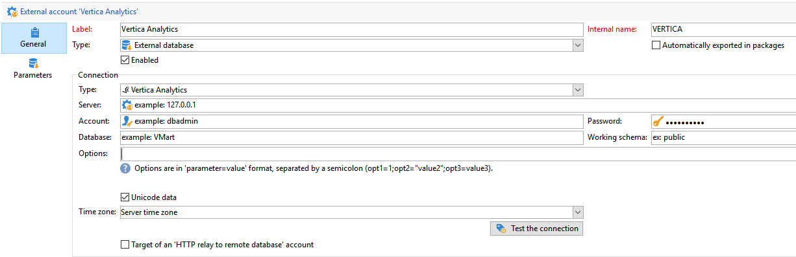

# Configuração do acesso ao Vertica analytics {#configure-fda-vertica}


Usar a campanha **Federated Data Access** (FDA) para processar informações armazenadas em um banco de dados externo. Siga as etapas abaixo para configurar o acesso ao [!DNL Vertica Analytics].

1. Configurar [!DNL Vertica Analytics] em [CentOS](#vertica-centos), [Windows](#vertica-windows) ou [Debian](#vertica-debian)
1. Configure o [!DNL Vertica Analytics] [conta externa](#vertica-external) no Campaign


## Verticas analytics no CentOS {#vertica-centos}

Para configurar [!DNL Vertica Analytics] No CentOS, siga as etapas abaixo:

1. Baixe os drivers ODBC para o [!DNL Vertica Analytics]. [Clique aqui](https://www.vertica.com/download/vertica/client-drivers/) e faça o download do RPM de Linux mais recente.

1. Em seguida, é necessário instalar o unixODBC com o seguinte comando:

   ```
   yum search unixODBC
   yum install unixODBC.x86_64
   ```

1. Se você tiver instalado o [!DNL Vertica Analytics] Servidor, um driver ODBC já estará instalado. Nesse caso, atualize a unidade da seguinte maneira:

   ```
   #Switch to root
   sudo su
   
   #Install the package (add --force to update it)
   rpm -Uvh vertica-client-x.x.x-x.x86_64.rpm [--force]
   
   #Open odbcinst.ini
   vi /etc/odbcinst.ini
   
   #Add a section for Vertica Analytics and save
   [VerVertica Analyticstica]
   Description = Vertica Analytics ODBC Driver
   Driver = /opt/vertica/lib64/libverticaodbc.so
   
   #Open odbc.ini
   vi /etc/odbc.ini
   
   #Add your DSN in ODBC Data Sources section, for example:
   [ODBC Data Sources]
   VMart = "VMart database on Vertica Analytics"
   
   #Add a DSN definition section below, for example:
   [VMart]
   Description = Vmart Database
   Driver = Vertica Analytics
   Database = VMart
   Servername = # The name of the server where Vertica Analytics is installed. Use localhost if Vertica Analytics is installed on the same machine.
   UID = dbadmin
   PWD = <password>
   Port = 5433
   
   #Cleanup
   #Remove the ODBC package
   rm vertica-client-x.x.x-x.x86_64.rpm
   ```

1. No Adobe Campaign, você pode configurar as [!DNL Vertica Analytics] conta externa. Para obter mais informações sobre como configurar a conta externa, consulte [nesta seção](#vertica-external).

## Verticas analytics no Windows {#vertica-windows}

1. Instale o [driver ODBC para Windows](https://www.vertica.com/download/vertica/client-drivers/). Para instalar o driver para Windows, será necessário habilitar o .NET Framework 3.5 ou o assistente de instalação tentará habilitá-lo e baixá-lo automaticamente.

1. Configure o driver ODBC no Windows. Para obter mais informações, consulte [esta página](https://www.vertica.com/docs/9.2.x/HTML/Content/Authoring/ConnectingToVertica/ClientODBC/SettingUpADSN.htm)

1. No Adobe Campaign, você pode configurar as [!DNL Vertica Analytics] conta externa. Para obter mais informações sobre como configurar a conta externa, consulte [nesta seção](#vertical-external).

## Verticas analytics no Debian {#vertica-debian}

1. Baixe os drivers ODBC para o [!DNL Vertica Analytics]. [Clique aqui](https://sfc-repo.snowflakecomputing.com/odbc/linux/latest/index.html) para iniciar o download.

1. Em seguida, é necessário instalar o unixODBC com o seguinte comando:

   ```
   apt-get install unixODBC
   ```

1. Se você tiver instalado o [!DNL Vertica Analytics] Servidor, um driver ODBC já estará instalado. Nesse caso, atualize a unidade da seguinte maneira:

   ```
   #Switch to root
   sudo su
   
   #Move or copy the downloaded file and change to /root
   mv vertica_9.3..xx_odbc_x86_64_linux.tar.gz /
   cd /
   
   #Uncompress the file you downloaded
   tar vzxf vertica_9.3..xx_odbc_x86_64_linux.tar.gz
   
   #Remove the tar.gz since it is not needed anymore
   rm vertica_9.3..xx_odbc_x86_64_linux.tar.gz
   
   #Open odbcinst.ini
   vi /etc/odbcinst.ini
   
   #Add a section for Vertica Analytics and save
   [Vertica Analytics]
   Description = Vertica Analytics ODBC Driver
   Driver = /opt/vertica/lib64/libverticaodbc.so
   
   #Open odbc.ini
   vi /etc/odbc.ini
   
   #Add your DSN in ODBC Data Sources section, for example:
   [ODBC Data Sources]
   VMart = "VMart database on Vertica Analytics"
   
   #Add a DSN definition section below, for example:
   [VMart]
   Description = Vmart Database
   Driver = Vertica Analytics
   Database = VMart
   Servername = # The name of the server where Vertica Analytics is installed. Use localhost if Vertica Analytics is installed on the same machine.
   UID = dbadmin
   PWD = <password>
   Port = 5433
   ```

1. No Adobe Campaign, você pode configurar as [!DNL Vertica Analytics] conta externa. Para obter mais informações sobre como configurar a conta externa, consulte [nesta seção](#vertica-external).

## Conta externa do Vertica analytics {#vertica-external}

É necessário criar um [!DNL Vertica Analytics] conta externa para conectar a instância do Campaign à [!DNL Vertica Analytics] banco de dados externo.

1. Do Campaign **[!UICONTROL Explorer]**, clique em **[!UICONTROL Administration]** &#39;>&#39; **[!UICONTROL Platform]** &#39;>&#39; **[!UICONTROL External accounts]**.

1. Clique em **[!UICONTROL New]**.

1. Selecione **[!UICONTROL External database]** como sua conta externa **[!UICONTROL Type]**.

1. Para configurar a conta externa do **[!UICONTROL Vertica Analytics]**, você deve especificar:

   * **[!UICONTROL Type]**: [!DNL Vertica Analytics]

   * **[!UICONTROL Server]**: URL do servidor [!DNL Vertica Analytics]

   * **[!UICONTROL Account]**: Nome do usuário

   * **[!UICONTROL Password]**: Senha da conta do usuário

   * **[!UICONTROL Database]**: Nome do banco de dados

   

O conector é compatível com as seguintes opções:

| Opção | Descrição |
|---|---|
| TimeZoneName | É vazio por padrão, o que significa que o fuso horário do sistema do servidor de aplicativos Campaign Classic é usado. A opção pode ser usada para forçar o parâmetro da sessão TIMEZONE. |

