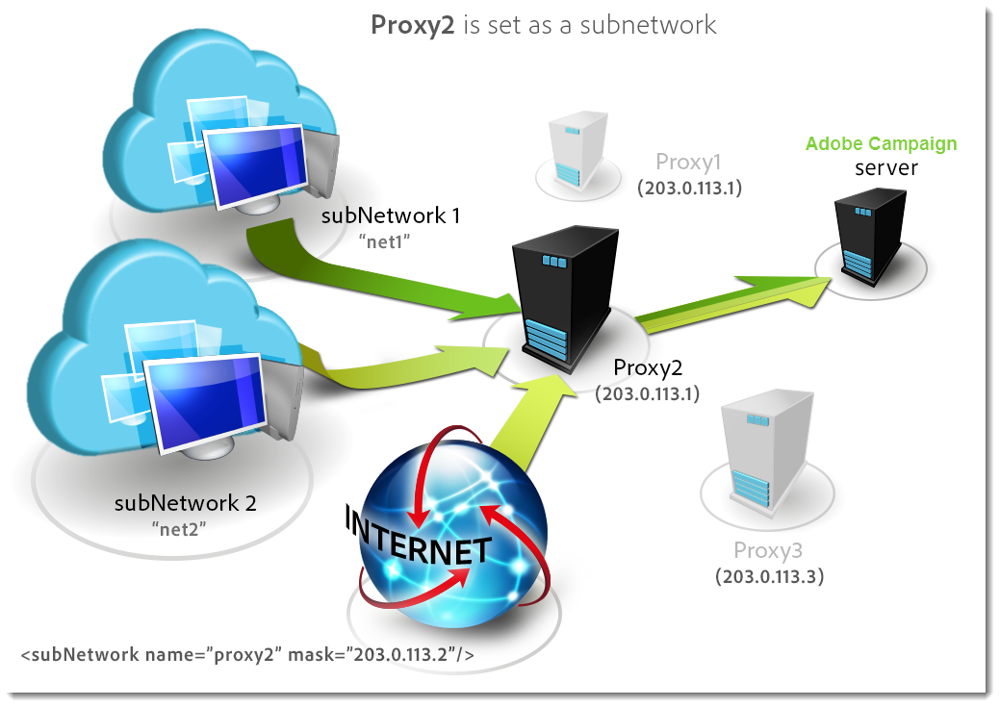

# Configuração do servidor do Campaign{#configuring-campaign-server}

A seção abaixo detalha as configurações do lado do servidor que podem ser executadas para atender às suas necessidades e às suas especificidades de ambiente.

>[!IMPORTANT]
>
>Essas configurações devem ser executadas pelos administradores e apenas para modelos de hospedagem **local** .
>
>Para implantações **hospedadas** , as configurações do lado do servidor podem ser configuradas somente por Adobe. No entanto, algumas configurações podem ser configuradas dentro do Painel de controle do Campaign (por exemplo, gerenciamento de lista de permissões IP ou permissões de URL).

Para obter mais informações, consulte esta seção.

* [Documentação do Painel de controle do Campaign](https://docs.adobe.com/content/help/pt-BR/control-panel/using/control-panel-home.translate.html)
* [Modelos de hospedagem](../../installation/using/hosting-models.md)
* [Matriz de capacidade local e hospedada do Campaign Classic](../../installation/using/capability-matrix.md)
* [Etapas de configuração de modelos híbridos e hospedados](../../installation/using/hosting-models.md)

Os arquivos de configuração do Campaign Classic são armazenados na pasta **conf** da pasta de instalação do Adobe Campaign. A configuração é distribuída por dois arquivos:

* **serverConf.xml**: configuração geral para todas as instâncias. Este arquivo combina os parâmetros técnicos do servidor Adobe Campaign: eles são compartilhados por todas as instâncias. A descrição de alguns desses parâmetros é detalhada abaixo. Os diferentes nós e parâmetros e listados nesta [seção](../../installation/using/the-server-configuration-file.md).
* **config-`<instance>`.xml** (onde a **instância** é o nome da instância): configuração específica da instância. Se você compartilhar seu servidor entre várias instâncias, insira os parâmetros específicos de cada instância em seu arquivo relevante.

## Definição de zonas de segurança {#defining-security-zones}

### Sobre zonas de segurança {#about-security-zones}

Cada operador precisa estar vinculado a uma zona para fazer logon em uma instância e o IP do operador deve ser incluído nos endereços ou conjuntos de endereços definidos na zona de segurança. A configuração da zona de segurança é realizada no arquivo de configuração do servidor Adobe Campaign.

Os operadores estão vinculados a uma zona de segurança a partir de seu perfil no console ( **[!UICONTROL Administration > Access management > Operators]** nó). Saiba como vincular zonas a operadores de Campanha [nesta seção](#linking-a-security-zone-to-an-operator).

### Criação de zonas de segurança {#creating-security-zones}

Uma zona é definida por:

* um ou mais intervalos de endereços IP (IPv4 e IPv6)
* um nome técnico vinculado a cada intervalo de endereços IP

As zonas de segurança são interbloqueadas, o que significa que a definição de uma nova zona dentro de outra zona reduz o número de operadores que podem fazer logon nela e, ao mesmo tempo, aumenta os direitos atribuídos a cada operador.

As zonas devem ser definidas durante a configuração do servidor, no arquivo **serverConf.xml** . Todos os parâmetros disponíveis no **serverConf.xml** estão listados nesta [seção](../../installation/using/the-server-configuration-file.md).

Cada zona define direitos, como:

* Conexão HTTP em vez de HTTPS
* Exibição de erros (erros de Java, JavaScript, C++ etc.)
* Relatório e pré-visualização do webApp
* Autenticação via logon/senha
* Modo de conexão não seguro

>[!NOTE]
>
>**Cada operador deve estar vinculado a uma zona**. Se o endereço IP do operador pertencer ao intervalo definido pela zona, o operador poderá fazer logon na instância.\
>O endereço IP do operador pode ser definido em várias zonas. Nesse caso, o operador recebe o **conjunto** de direitos disponíveis para cada zona.

O arquivo **serverConf.xml** predefinido inclui três zonas: **public, VPN e LAN**.

>[!NOTE]
>
>**A configuração predefinida é segura**. No entanto, antes de migrar de uma versão anterior do Adobe Campaign, pode ser necessário reduzir temporariamente a segurança para migrar e aprovar as novas regras.

Exemplo de como definir uma zona no arquivo **serverConf.xml** :

```
<securityZone allowDebug="false" allowHTTP="false" label="Public Network" name="public">
<subNetwork label="All addresses" mask="*" name="all"/>

<securityZone allowDebug="true" allowHTTP="false" label="Private Network (VPN)"
              name="vpn" showErrors="true">

  <securityZone allowDebug="true" allowEmptyPassword="true" allowHTTP="true"
                allowUserPassword="false" label="Private Network (LAN)" name="lan"
                sessionTokenOnly="true" showErrors="true">
    <subNetwork label="Lan 1" mask="192.168.0.0/16" name="lan1"/>
    <subNetwork label="Lan 2" mask="172.16.0.0/12" name="lan2"/>
    <subNetwork label="Lan 3" mask="10.0.0.0/8" name="lan3"/>
    <subNetwork label="Localhost" mask="127.0.0.1/16" name="locahost"/>
    <subNetwork label="Lan (IPv6)" mask="fc00::/7" name="lan6"/>
    <subNetwork label="Localhost (IPv6)" mask="::1/128" name="localhost6"/>
  </securityZone>

</securityZone>
</securityZone>
```

Todos os direitos que definem uma zona são os seguintes:

* **allowDebug**: permite que um WebApp seja executado no modo &quot;debug&quot;
* **allowEmptyPassword**: autoriza uma conexão com uma instância sem senha
* **allowHTTP**: uma sessão pode ser criada sem usar o protocolo HTTPS
* **allowUserPassword**: o token de sessão pode ter o seguinte formato &quot;`<login>/<password>`&quot;
* **sessionTokenOnly**: o token de segurança não é necessário no URL da conexão
* **showErrors**: os erros no lado do servidor são encaminhados e exibidos

>[!IMPORTANT]
>
>Em uma definição de zona, cada atributo com o valor **verdadeiro** reduz a segurança.

Ao usar o Centro de mensagens, se houver várias instâncias de execução, será necessário criar uma zona de segurança adicional com o atributo **sessionTokenOnly** definido como **true**, na qual apenas os endereços IP necessários serão adicionados. Para obter mais informações sobre como configurar instâncias, consulte [este documento](../../message-center/using/creating-a-shared-connection.md).

### Práticas recomendadas para zonas de segurança {#best-practices-for-security-zones}

Na definição da zona de segurança da **lan** , é possível adicionar uma máscara de endereço IP que defina o acesso técnico. Esta adição permitirá o acesso a todas as instâncias hospedadas no servidor.

```
<securityZone allowDebug="true" allowEmptyPassword="false" allowHTTP="true"
                    allowUserPassword="false" label="Private Network (LAN)" name="lan"
                    sessionTokenOnly="true" showErrors="true">
        <subNetwork label="Lan 1" mask="192.168.0.0/16" name="lan1"/>
        <subNetwork label="Lan 2" mask="172.16.0.0/12" name="lan2"/>
        <subNetwork label="Lan 3" mask="10.0.0.0/8" name="lan3"/>
        <subNetwork label="Localhost" mask="127.0.0.1/16" name="locahost"/>
        <subNetwork label="Lan (IPv6)" mask="fc00::/7" name="lan6"/>
        <subNetwork label="Localhost (IPv6)" mask="::1/128" name="localhost6"/>
  
        <!-- Customer internal IPs -->
        <subNetwork id="internalNetwork" mask="a.b.c.d/xx"/>

      </securityZone>
```

Recomendamos definir intervalos de endereços IP diretamente no arquivo de configuração dedicado à instância para operadores que acessam somente uma instância específica.

No **`config-<instance>.xml`** arquivo:

```
  <securityZone name="public">
   ...
    <securityZone name="vpn">
      <subNetwork id="cus1" mask="a.b.c.d/xx"/>
```

### Sub-redes e proxies numa zona de segurança {#sub-networks-and-proxies-in-a-security-zone}

O parâmetro **proxy** pode ser usado em um elemento **subNetwork** para especificar o uso do proxy em uma zona de segurança.

Quando um proxy é referenciado e uma conexão entra por meio desse proxy (visível pelo cabeçalho HTTP X-Forwarded-For), a zona verificada é a dos clientes do proxy e não a do proxy.

>[!IMPORTANT]
>
>Se um proxy estiver configurado e for possível substituí-lo (ou se não existir), o endereço IP que será testado poderá ser falsificado.
>
>Além disso, os relés agora são gerados como proxies. Portanto, você pode adicionar o endereço IP 127.0.0.1 à lista de proxies na configuração da sua zona de segurança.
>
>Por exemplo: &quot; `<subnetwork label="Lan 1" mask="192.168.0.0/16" name="lan1" proxy="127.0.0.1,10.100.2.135" />`&quot;.

Vários casos podem ocorrer:

* Uma subrede é referenciada diretamente na zona de segurança e nenhum proxy é configurado: os usuários da sub-rede podem se conectar diretamente ao servidor Adobe Campaign.

   

* Um proxy é especificado para uma subrede na zona de segurança: os usuários dessa sub-rede podem acessar o servidor Adobe Campaign por meio desse proxy.

   

* Um proxy está incluído em uma sub-rede de zona de segurança: os usuários que têm acesso por meio desse proxy, independentemente de sua origem, podem acessar o servidor Adobe Campaign.

   

Os endereços IP dos proxy que provavelmente terão acesso ao servidor Adobe Campaign devem ser inseridos tanto na sub-rede **`<subnetwork>`** em causa como na de primeiro nível **`<subnetwork name="all"/>`**. Por exemplo, aqui para um proxy cujo endereço IP é 10.131.146.102:

```
<securityZone allowDebug="false" allowHTTP="false" label="Public Network" 
                      name="public">
    <subNetwork label="All addresses" mask="*" name="all"
                      proxy="10.131.146.102,127.0.0.1, ::1"/>

    <securityZone allowDebug="true" allowHTTP="false" label="Private Network (VPN)" 
                      name="vpn" showErrors="true">
        <securityZone allowDebug="true" allowEmptyPassword="false" allowHTTP="true" 
                      allowUserPassword="false" label="Private Network (LAN)" 
                      name="lan" sessionTokenOnly="true" showErrors="true">
            <subNetwork label="Lan proxy" mask="10.131.193.182" name="lan3" 
                      proxy="10.131.146.102,127.0.0.1, ::1"/>
            <subNetwork label="Lan 1" mask="192.168.0.0/16" name="lan1" 
                      proxy="127.0.0.1, ::1"/>

        </securityZone>
    </securityZone>
</securityZone>
```

### Vincular uma zona de segurança a um operador {#linking-a-security-zone-to-an-operator}

Uma vez definidas as zonas, cada operador deve estar vinculado a uma delas para poder fazer logon em uma instância e o endereço IP do operador deve ser incluído nos endereços ou no intervalo de endereços referenciados na zona.

A configuração técnica das zonas é realizada no arquivo de configuração do Servidor de Campanhas: **serverConf.xml**.

Antes disso, você deve fazer o start configurando a **[!UICONTROL Security zone]** lista discriminada predefinida para vincular um rótulo ao nome interno da zona definida no arquivo **serverConf.xml** .

Essa configuração é feita no explorador de Campanhas:

1. Clique no nó **[!UICONTROL Administration > Platform > Enumerations]**.
1. Selecione a lista discriminada do **[!UICONTROL Security zone (securityZone)]** sistema.

   

1. Para cada zona de segurança definida no arquivo de configuração do servidor, clique no **[!UICONTROL Add]** botão.
1. No **[!UICONTROL Internal name]** campo, digite o nome da zona definida no arquivo **serverConf.xml** . Corresponde ao atributo **@name** do `<securityzone>` elemento. Insira o rótulo vinculado ao nome interno no **** campo Labelfield.

   

1. Clique em OK e salve as modificações.

Depois que as zonas forem definidas e a **[!UICONTROL Security zone]** lista discriminada for configurada, será necessário vincular cada operador a uma zona de segurança:

1. Clique no nó **[!UICONTROL Administration > Access management > Operators]**.
1. Selecione o operador ao qual você deseja vincular uma zona de segurança e clique na **[!UICONTROL Edit]** guia.
1. Vá para a guia **[!UICONTROL Access rights]** e clique no **[!UICONTROL Edit access parameters...]** link.

   

1. Selecione uma zona na lista **[!UICONTROL Authorized connection zone]** suspensa

   

1. Clique **[!UICONTROL OK]** e salve as modificações para aplicar essas alterações.

## Configuração do Tomcat {#configuring-tomcat}

### Porta padrão para Tomcat {#default-port-for-tomcat}

Quando a porta de escuta 8080 do servidor Tomcat já estiver ocupada com outro aplicativo necessário para sua configuração, é necessário substituir a porta 8080 por uma gratuita (8090, por exemplo). Para alterá-lo, edite o arquivo **server.xml** salvo no diretório **/tomcat-7/conf** da pasta de instalação do Adobe Campaign.

Em seguida, modifique a porta das páginas de relé JSP. Para fazer isso, altere o arquivo **serverConf.xml** salvo no diretório **/conf** do diretório de instalação do Adobe Campaign. Todos os parâmetros disponíveis no **serverConf.xml** estão listados nesta [seção](../../installation/using/the-server-configuration-file.md).

```
<serverConf>
   ...
   <web controlPort="8005" httpPort="8090"...
   <url ... targetUrl="http://localhost:8090"...
```

### Mapeamento de uma pasta no Tomcat {#mapping-a-folder-in-tomcat}

Para definir configurações específicas do cliente, você pode criar um arquivo **user_contextos.xml** na pasta **/tomcat-7/conf** , que também contém o arquivo **contextos.xml** .

Esse arquivo conterá o seguinte tipo de informação:

```
 <Context path='/foo' docBase='../customers/foo'   crossContext='true' debug='0' reloadable='true' trusted='false'/>
```

Se necessário, essa operação pode ser reproduzida no lado do servidor.

## Personalização de parâmetros de delivery {#personalizing-delivery-parameters}

Os parâmetros do delivery são definidos no arquivo de configuração **serverConf.xml** . Todos os parâmetros disponíveis no **serverConf.xml** estão listados nesta [seção](../../installation/using/the-server-configuration-file.md).

A configuração geral do servidor e os comandos estão detalhados na configuração [do servidor de](../../installation/using/campaign-server-configuration.md)Campanha.

Você também pode executar as configurações a seguir, dependendo de suas necessidades e configurações.

### Relé SMTP {#smtp-relay}

O módulo MTA atua como um agente de transferência de correio nativo para transmissão SMTP (porta 25).

No entanto, é possível substituí-lo por um servidor relé se a sua política de segurança o exigir. Nesse caso, o throughput global será o relay (desde que o throughput do servidor relé inferior ao da Adobe Campaign).

Nesse caso, esses parâmetros são definidos configurando-se o servidor SMTP na **`<relay>`** seção. Você deve especificar o endereço IP (ou host) do servidor SMTP usado para transferir correio e sua porta associada (25 por padrão).

```
<relay address="192.0.0.3" port="25"/>
```

>[!IMPORTANT]
>
>Esse modo operacional implica limitações graves nos delivery, pois pode reduzir bastante a throughput devido ao desempenho intrínseco do servidor de retransmissão (latência, largura de banda...). Além disso, a capacidade de qualificar erros de delivery síncronos (detectados pela análise do tráfego SMTP) será limitada e o envio não será possível se o servidor relé não estiver disponível.

### Processos secundários MTA {#mta-child-processes}

É possível controlar a população de processos secundários (maxSpareServers por padrão 2) para otimizar o desempenho da transmissão de acordo com a potência da CPU dos servidores e os recursos de rede disponíveis. Essa configuração deve ser feita na **`<master>`** seção de configuração MTA em cada computador individual.

```
<master dataBasePoolPeriodSec="30" dataBaseRetryDelaySec="60" maxSpareServers="2" minSpareServers="0" startSpareServers="0">
```

Consulte também Otimização [do envio de](../../installation/using/email-deliverability.md#email-sending-optimization)email.

### Gerenciamento de tráfego SMTP de saída com afinidade {#managing-outbound-smtp-traffic-with-affinities}

>[!IMPORTANT]
>
>A configuração da afinidade precisa ser coerente de um servidor para outro. Recomendamos que você entre em contato com a Adobe para obter a configuração da afinidade, já que as alterações de configuração devem ser replicadas em todos os servidores de aplicativos que executam o MTA.

Você pode melhorar o tráfego SMTP de saída por meio de afinidades com endereços IP.

Para fazer isso, siga as etapas abaixo:

1. Digite as afinidades na **`<ipaffinity>`** seção do arquivo **serverConf.xml** .

   Uma afinidade pode ter vários nomes diferentes: para separá-los, utilize o **;** caractere.

   Exemplo:

   ```
    IPAffinity name="mid.Server;WWserver;local.Server">
             <IP address="XX.XXX.XX.XX" heloHost="myserver.us.campaign.net" publicId="123" excludeDomains="neo.*" weight="5"/
   ```

   Para visualização dos parâmetros relevantes, consulte o arquivo **serverConf.xml** .

1. Para ativar a seleção de afinidade nas listas suspensas, é necessário adicionar os nomes das afinidades na lista discriminada **IPAffinity** .

   

   >[!NOTE]
   >
   >Listas discriminadas são detalhadas [neste documento](../../platform/using/managing-enumerations.md).

   Você pode selecionar a afinidade a ser usada, como mostrado abaixo para tipologias:

   

   >[!NOTE]
   >
   >Você também pode consultar a configuração [do servidor de](../../installation/using/email-deliverability.md#delivery-server-configuration)Delivery.

## Permissões de URL {#url-permissions}

A lista padrão de URLs que podem ser chamados por códigos JavaScript (workflows, etc.) pelas instâncias do Campaign Classic é limitada. Esses são os URLs que permitem que as instâncias funcionem corretamente.

Por padrão, as instâncias não têm permissão para se conectar a URLs externos. No entanto, é possível adicionar URLs externos à lista de URLs autorizados, para que sua instância possa se conectar a eles. Dessa forma, você pode conectar as instâncias do Campaign a sistemas externos, como servidores ou sites SFTP para habilitar a transferência de arquivos e/ou dados.

Depois de adicionado, o URL é referenciado no arquivo de configuração da instância (serverConf.xml).

A maneira de gerenciar permissões de URL depende do modelo de hospedagem:

* **Híbrido** ou **local**: adicione os URLs a serem permitidos no arquivo **** serverConf.xml. A seção seguinte contém informações detalhadas.
* **Hospedado**: adicione os URLs para permitir por meio do **Painel de controle do Campaign**. Para obter mais informações, consulte a [documentação específica](https://docs.adobe.com/content/help/pt-BR/control-panel/using/instances-settings/url-permissions.html).

Com modelos de hospedagem **Híbrido** e **Local** , o administrador precisa fazer referência a um novo **urlPermission** no arquivo **serverConf.xml** . Todos os parâmetros disponíveis no **serverConf.xml** estão listados nesta [seção](../../installation/using/the-server-configuration-file.md).

Existem três modos de proteção de conexão:

* **Bloqueio**: todos os URLs que não pertencem à lista de permissões são bloqueados, com uma mensagem de erro. Este é o modo padrão depois de um pós-upgrade.
* **Permissivo**: todos os URLs que não pertencem à lista de permissões são permitidos.
* **Aviso**: todos os URLs que não pertencem à lista de permissões são permitidos, mas o intérprete JS emite um aviso, para que o administrador possa coletá-los. Este modo adiciona mensagens de aviso JST-310027.

```
<urlPermission action="warn" debugTrace="true">
  <url dnsSuffix="abc.company1.com" urlRegEx=".*" />
  <url dnsSuffix="def.partnerA_company1.com" urlRegEx=".*" />
  <url dnsSuffix="xyz.partnerB_company1.com" urlRegEx=".*" />
</urlPermission>
```

>[!IMPORTANT]
>
>Por padrão, o cliente dos novos clientes usa o modo **de** bloqueio. Se for necessário permitir um novo URL, eles devem entrar em contato com o administrador para adicioná-lo à lista de permissões.
>
>Existing customers coming from a migration can use the **warning mode** for a while. Enquanto isso, eles precisam analisar o tráfego de saída antes de autorizar os URLs. Depois que a lista de URLs autorizados for definida, eles devem entrar em contato com o administrador para adicionar os URLs à lista de permissões e ativar o modo **de** bloqueio.

## Segurança de página dinâmica e relés {#dynamic-page-security-and-relays}

By default, all dynamic pages are automatically related to the **local** Tomcat server of the machine whose Web module has started. Essa configuração é inserida na **`<url>`** seção da configuração de retransmissão de query para o arquivo **ServerConf.xml** . Todos os parâmetros disponíveis no **serverConf.xml** estão listados nesta [seção](../../installation/using/the-server-configuration-file.md).

Retransmitir a execução da página dinâmica em um servidor **remoto** ; se o módulo da Web não estiver ativado no computador. Para fazer isso, você deve substituir o **localhost** pelo nome do computador remoto para JSP e JSSP, Aplicação web, relatórios e strings.

Para obter mais informações sobre os vários parâmetros disponíveis, consulte o arquivo de configuração **serverConf.xml** .

Para páginas JSP, a configuração padrão é:

```
<url relayHost="true" relayPath="true" targetUrl="http://localhost:8080" urlPath="*.jsp"/>
```

A Adobe Campaign usa as seguintes páginas JSP:

* /nl/jsp/**soaprouter.jsp**: console do cliente e conexões de serviços da Web (APIs SOAP),
* /nl/jsp/**m.jsp**: mirrores page,
* /nl/jsp/**logon.jsp**: acesso baseado na Web aos relatórios e à implantação do console do cliente,
* /nl/jsp/**s.jsp** : Utilização de marketing viral (patrocinador e redes sociais).

Os JSSPs usados para o Canal do aplicativo móvel são os seguintes:

* nms/mobile/1/registerIOS.jssp
* nms/mobile/1/registerAndroid.jssp

**Exemplo:**

É possível evitar conexões de computadores clientes do lado de fora. Para isso, basta restringir a execução do **soaprouter.jsp** e autorizar apenas a execução de mirrores page, links virais, formulários da Web e recursos públicos.

Os parâmetros são os seguintes:

```
<url IPMask="<IP_addresses>" deny=""     hostMask="" relayHost="true"  relayPath="true"  targetUrl="http://localhost:8080" timeout="" urlPath="*.jsp"/>
<url IPMask="<IP_addresses>" deny=""     hostMask="" relayHost="true"  relayPath="true"  targetUrl="http://localhost:8080" timeout="" urlPath="*.jssp"/> 
<url IPMask=""               deny=""     hostMask="" relayHost="true" relayPath="true" targetUrl="http://localhost:8080" timeout="" urlPath="m.jsp"/>
<url IPMask=""               deny=""     hostMask="" relayHost="true" relayPath="true" targetUrl="http://localhost:8080" timeout="" urlPath="s.jsp"/>
<url IPMask=""               deny=""     hostMask="" relayHost="true" relayPath="true" targetUrl="http://localhost:8080" timeout="" urlPath="webForm.jsp"/>
<url IPMask=""               deny=""     hostMask="" relayHost="true"  relayPath="true"  targetUrl="http://localhost:8080" timeout="" urlPath="/webApp/pub*"/>
<url IPMask=""               deny=""     hostMask="" relayHost="true"  relayPath="true"  targetUrl="http://localhost:8080" timeout="" urlPath="/jssp/pub*"/>
<url IPMask=""               deny=""     hostMask="" relayHost="true"  relayPath="true"  targetUrl="http://localhost:8080" timeout="" urlPath="/strings/pub*"/>
<url IPMask=""               deny=""     hostMask="" relayHost="true"  relayPath="true"  targetUrl="http://localhost:8080" timeout="" urlPath="/interaction/pub*"/>
<url IPMask=""               deny="true" hostMask="" relayHost="false" relayPath="false" targetUrl="http://localhost:8080" timeout="" urlPath="*.jsp"/>
<url IPMask=""               deny="true" hostMask="" relayHost="false" relayPath="false" targetUrl="http://localhost:8080" timeout="" urlPath="*.jssp"/>
```

Neste exemplo, o **`<IP_addresses>`** valor coincide com a lista de endereços IP (separados por vírgulas) autorizados a usar o módulo de retransmissão para essa máscara.

>[!NOTE]
>
>Os valores devem ser adaptados de acordo com a sua configuração e as suas restrições de rede, especialmente se tiverem sido desenvolvidas configurações específicas para a sua instalação.

## Restrição de comandos externos autorizados {#restricting-authorized-external-commands}

>[!NOTE]
>
>A configuração a seguir é necessária somente para instalações locais.

A partir do build 8780, os administradores técnicos podem restringir a lista de comandos externos autorizados que podem ser usados no Adobe Campaign.

Para fazer isso, é necessário criar um arquivo de texto com a lista de comandos que você deseja impedir de usar, por exemplo:

```
ln
dd
openssl
curl
wget
python
python3
perl
ruby
sh
```

>[!IMPORTANT]
>
>Esta lista não é exaustiva.

No nó **exec** do arquivo de configuração do servidor, é necessário fazer referência ao arquivo criado anteriormente no atributo **blacklistFile** .

**Somente** para Linux: no arquivo de configuração do servidor, reordenamos que você especifique um usuário dedicado à execução de comandos externos para aprimorar a configuração de segurança. Esse usuário é definido no nó **exec** do arquivo de configuração. Todos os parâmetros disponíveis no **serverConf.xml** estão listados nesta [seção](../../installation/using/the-server-configuration-file.md).

>[!NOTE]
>
>Se nenhum usuário for especificado, todos os comandos serão executados no contexto do usuário da instância do Adobe Campaign. O usuário deve ser diferente do usuário que está executando o Adobe Campaign.

Por exemplo:

```
<serverConf>
 <exec user="theUnixUser" blacklistFile="/pathtothefile/blacklist"/>
</serverConf>
```

Este usuário precisa ser adicionado à lista sudoer do operador Adobe Campaign &#39;neolane&#39;.

>[!IMPORTANT]
>
>Você não deve usar um sudo personalizado. É necessário instalar um sudo padrão no sistema.

## Gerenciamento de cabeçalhos HTTP {#managing-http-headers}

Por padrão, todos os cabeçalhos HTTP não são retransmitidos. Você pode adicionar cabeçalhos específicos nas respostas enviadas por retransmissão. Para fazer isso:

1. Vá para o arquivo **serverConf.xml** . Todos os parâmetros disponíveis no **serverConf.xml** estão listados nesta [seção](../../installation/using/the-server-configuration-file.md).
1. No **`<relay>`** nó, vá para a lista de cabeçalhos HTTP retransmitidos.
1. Adicione um **`<responseheader>`** elemento com os seguintes atributos:

   * **name**: nome do cabeçalho
   * **valor**: nome do valor.

   Por exemplo:

   ```
   <responseHeader name="Strict-Transport-Security" value="max-age=16070400; includeSubDomains"/>
   ```

## Rastreamento redundante {#redundant-tracking}

Quando vários servidores são usados para redirecionamento, eles devem poder se comunicar entre si por meio de chamadas SOAP para compartilhar informações dos URLs a serem redirecionados. No momento do start do delivery, é possível que nem todos os servidores de redirecionamento estejam disponíveis; por conseguinte, podem não ter o mesmo nível de informação.

>[!NOTE]
>
>Ao usar a arquitetura padrão ou corporativa, o servidor de aplicativos principal deve estar autorizado a carregar informações de rastreamento em cada computador.

Os URLs dos servidores redundantes devem ser especificados na configuração de redirecionamento, por meio do arquivo **serverConf.xml** . Todos os parâmetros disponíveis no **serverConf.xml** estão listados nesta [seção](../../installation/using/the-server-configuration-file.md).

**Exemplo:**

```
<spareserver enabledIf="$(hostname)!='front_srv1'" id="1" url="http://front_srv1:8080" />
<spareserver enabledIf="$(hostname)!='front_srv2'" id="2" url="http://front_srv2:8080" />
```

A propriedade **enableIf** é opcional (vazia por padrão) e permite ativar a conexão somente se o resultado for verdadeiro; Isso permite obter uma configuração idêntica em todos os servidores de redirecionamento.

Para obter o nome do host do computador, execute o seguinte comando: **nome do host -s**.

## Gerenciamento de recursos públicos {#managing-public-resources}

Recursos públicos são apresentados em [Gerenciamento de recursos públicos](../../installation/using/deploying-an-instance.md#managing-public-resources).

Eles são armazenados no diretório **/var/res/instance** do diretório de instalação do Adobe Campaign.

O URL correspondente é: **http://server/res/instance** onde **instância** é o nome da instância de rastreamento.

Você pode especificar outro diretório adicionando um nó ao arquivo **conf-`<instance>`.xml** para configurar o armazenamento no servidor. Isso significa adicionar as seguintes linhas:

```
<serverconf>
  <shared>
    <dataStore hosts="media*" lang="fra">
      <virtualDir name="images" path="/var/www/images"/>
     <virtualDir name="publicFileRes" path="$(XTK_INSTALL_DIR)/var/res/$(INSTANCE_NAME)/"/>
    </dataStore>
  </shared>
</serverconf>
```

Nesse caso, o novo URL para os recursos públicos fornecido na parte superior da janela do assistente de implantação deve apontar para essa pasta.

## Workflows e afinidades de alta disponibilidade {#high-availability-workflows-and-affinities}

Você pode configurar vários servidores de fluxo de trabalho (wfserver) e distribuí-los em duas ou mais máquinas. Se você escolher esse tipo de arquitetura, configure o modo de conexão dos balanceadores de carga de acordo com o acesso da Adobe Campaign.

Para obter acesso da Web, selecione o modo de balanceador **de** carga para limitar os tempos de conexão.

Ao acessar pelo console do Adobe Campaign, escolha **hash** ou modo **ip** fixo. Isso permite manter a conexão entre o cliente rico e o servidor e impedir que uma sessão de usuário seja interrompida durante uma operação de importação ou exportação, por exemplo.

Você pode optar por forçar a execução de um fluxo de trabalho ou de uma atividade de fluxo de trabalho em uma máquina específica. Para fazer isso, você deve definir uma ou mais afinidades para o fluxo de trabalho ou a atividade em questão.

1. Crie as afinidades do fluxo de trabalho ou da atividade inserindo-as no **[!UICONTROL Affinity]** campo.

   Você pode escolher livremente os nomes das afinidades. No entanto, certifique-se de não usar espaços ou sinais de pontuação. Se você usar servidores diferentes, especifique nomes diferentes.

   

   

   A lista suspensa contém afinidades usadas anteriormente. Ele é concluído ao longo do tempo com os diferentes valores digitados.

1. Abra o arquivo **nl6/conf/config-`<instance>.xml`** .
1. Modifique a linha que corresponde ao **[!UICONTROL wfserver]** módulo da seguinte forma:

   ```
   <wfserver autoStart="true" affinity="XXX,"/>
   ```

   Se você definir várias afinidades, elas devem ser separadas por vírgulas sem espaços:

   ```
   <wfserver autoStart="true" affinity="XXX,YYY,"/>
   ```

   A vírgula que segue o nome da afinidade é necessária para a execução de workflows para os quais nenhuma afinidade é definida.

   Se desejar executar somente workflows para os quais uma afinidade está definida, não adicione uma vírgula ao final da lista das afinidades. Por exemplo, modifique a linha da seguinte maneira:

   ```
   <wfserver autoStart="true" affinity="XXX"/>
   ```

## Reinicialização automática do processo {#automatic-process-restart}

Por padrão, os diferentes processos do Adobe Campaign são reiniciados automaticamente às 6h (hora do servidor) todos os dias.

No entanto, você pode alterar essa configuração.

Para fazer isso, vá para o arquivo **serverConf.xml** , localizado no repositório **conf** da instalação. Todos os parâmetros disponíveis no **serverConf.xml** estão listados nesta [seção](../../installation/using/the-server-configuration-file.md).

Cada processo configurado neste arquivo tem um atributo **processRestartTime** . Você pode modificar o valor desse atributo para adaptar a hora de reinicialização de cada processo de acordo com suas necessidades.

>[!IMPORTANT]
>
>Não exclua este atributo. Todos os processos devem ser reiniciados todos os dias.

## Limitação de arquivos carregáveis {#limiting-uploadable-files}

Um novo atributo **uploadWhiteList** permite restringir os tipos de arquivos disponíveis para upload no servidor Adobe Campaign.

Esse atributo está disponível no elemento **dataStore** do arquivo **serverConf.xml** . Todos os parâmetros disponíveis no **serverConf.xml** estão listados nesta [seção](../../installation/using/the-server-configuration-file.md).

O valor padrão desse atributo é **.+** e permite carregar qualquer tipo de arquivo.

Para limitar os formatos possíveis, é necessário substituir o valor do atributo por uma expressão regular java válida. É possível digitar vários valores separando-os por uma vírgula.

Por exemplo: **uploadWhiteList=&quot;.*.png,.*.jpg&quot;** permitirá que você carregue formatos PNG e JPG no servidor. Nenhum outro formato será aceito.

>[!IMPORTANT]
>
>No Internet Explorer, o caminho de arquivo completo deve ser verificado pela expressão normal.

## Configuração de conexão proxy {#proxy-connection-configuration}

Se precisar conectar o servidor de Campanha ao exterior por meio de um proxy (usando uma atividade de fluxo de trabalho de transferência de arquivos, por exemplo), é necessário configurar a seção proxyConfig do serverConf por meio de um comando. As seguintes conexões proxy são possíveis: HTTP, HTTPS, FTP, SFTP. Todos os parâmetros disponíveis no **serverConf.xml** estão listados nesta [seção](../../installation/using/the-server-configuration-file.md).

>[!NOTE]
>
>A partir do 20.2, os parâmetros do protocolo HTTP e HTTPS não estarão mais disponíveis. As informações a seguir ainda mencionam esses parâmetros, já que eles permanecem disponíveis para compilações anteriores, incluindo o 9032.
>
>Os proxy SOCKS não são suportados.

Use o seguinte comando:

```
nlserver config -setproxy:[protocol]/[serverIP]:[port]/[login][:‘https’|'http’]
```

os parâmetros de protocolo podem ser &quot;http&quot;, &quot;https&quot; ou &quot;ftp&quot;.

Se você estiver configurando o FTP na mesma porta que o tráfego HTTP/HTTPS, poderá usar o seguinte:

```
nlserver config -setproxy:http/198.51.100.0:8080/user
```

As opções &quot;http&quot; e &quot;https&quot; só são usadas quando o parâmetro de protocolo é &quot;ftp&quot; e indicam se o tunelamento na porta especificada será executado em HTTPS ou em HTTP.

Se você usar uma porta diferente para o tráfego FTP/SFTP e HTTP/HTTPS no servidor proxy, deverá definir o parâmetro de protocolo &quot;ftp&quot;.


Por exemplo:

```
nlserver config -setproxy:ftp/198.51.100.0:8080/user:’http’
```

Em seguida, insira a senha.

As conexões HTTP são definidas no parâmetro proxyHTTP:

```
<proxyConfig enabled=“1” override=“localhost*” useSingleProxy=“0”>
<proxyHTTP address=“198.51.100.0" login=“user” password=“*******” port=“8080”/>
</proxyConfig>
```

As conexões HTTPS são definidas no parâmetro proxyHTTPS:

```
<proxyConfig enabled=“1" override=“localhost*” useSingleProxy=“0">
<proxyHTTPS address=“198.51.100.0” login=“user” password=“******” port=“8080"/>
</proxyConfig>
```

As conexões FTP/FTPS são definidas no parâmetro proxyFTP:

```
<proxyConfig enabled=“1" override=“localhost*” useSingleProxy=“0">
<proxyFTP address=“198.51.100.0” login=“user” password=“******” port=“5555" https=”true”/>
</proxyConfig>
```

Se você usar o mesmo proxy para vários tipos de conexão, somente o proxyHTTP será definido com useSingleProxy definido como &quot;1&quot; ou &quot;true&quot;.

Se você tiver conexões internas que devem passar pelo proxy, adicione-as ao parâmetro override.

Se desejar desativar temporariamente a conexão proxy, defina o parâmetro ativado como &quot;false&quot; ou &quot;0&quot;.
