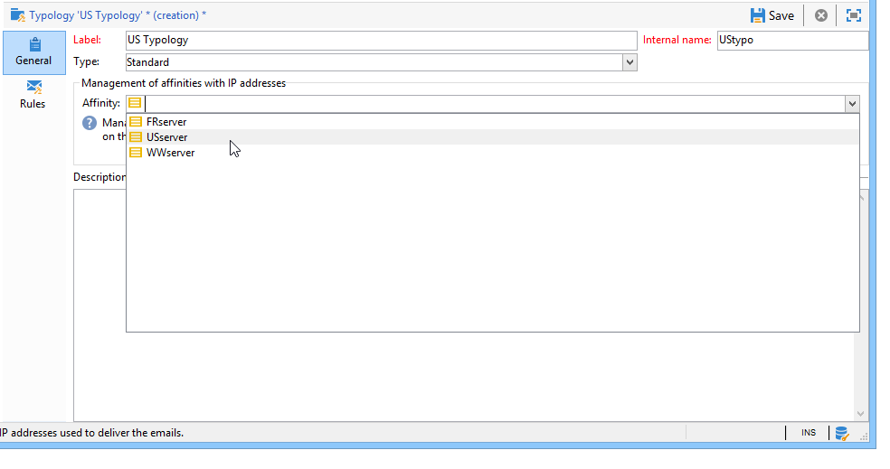

# Configuração do servidor do Campaign{#configuring-campaign-server}

A seção abaixo detalha as configurações do lado do servidor que podem ser executadas para atender às suas necessidades e especificidades de ambiente.

Essas configurações devem ser executadas pelos administradores e somente para modelos de hospedagem **No local**.

Para implantações **Hospedadas**, as configurações do lado do servidor podem ser configuradas somente pelo Adobe. No entanto, algumas configurações podem ser configuradas no Painel de controle do Campaign (por exemplo, gerenciamento de lista de permissões de IP ou permissões de URL).

>[!NOTE]
>
>O Painel de controle do Campaign é acessível a todos os usuários administradores. As etapas para conceder acesso de Administrador a um usuário estão detalhadas [nesta seção](https://experienceleague.adobe.com/docs/control-panel/using/discover-control-panel/managing-permissions.html?lang=pt-BR#discover-control-panel).
>
>Observe que sua instância deve ser hospedada no AWS e atualizada com a build mais recente do [Gold Standard](../../rn/using/gs-overview.md) ou a build mais recente do GA (21.1)](../../rn/using/latest-release.md). [ Saiba como verificar sua versão em [this section](../../platform/using/launching-adobe-campaign.md#getting-your-campaign-version). Para verificar se sua instância está hospedada no AWS, siga as etapas detalhadas em [this page](https://experienceleague.adobe.com/docs/control-panel/using/faq.html).

Para obter mais informações, consulte esta seção.

* [Documentação do Painel de controle do Campaign](https://docs.adobe.com/content/help/pt-BR/control-panel/using/control-panel-home.translate.html)
* [Modelos de hospedagem](../../installation/using/hosting-models.md)
* [Matriz de recursos no local e hospedada do Campaign Classic](../../installation/using/capability-matrix.md)
* [Etapas de configuração de modelos híbridos e hospedados](../../installation/using/hosting-models.md)

Os arquivos de configuração do Campaign Classic são armazenados na pasta **conf** da pasta de instalação do Adobe Campaign. A configuração é distribuída por dois arquivos:

* **serverConf.xml**: configuração geral para todas as instâncias. Este arquivo combina os parâmetros técnicos do servidor do Adobe Campaign: eles são compartilhados por todas as instâncias. A descrição de alguns desses parâmetros é detalhada abaixo. Os diferentes nós e parâmetros e listados nesta [seção](../../installation/using/the-server-configuration-file.md).
* **config-`<instance>`.xml**  (onde  **** instâncias é o nome da instância): configuração específica da instância. Se você compartilhar seu servidor entre várias instâncias, insira os parâmetros específicos para cada instância em seu arquivo relevante.

## Configuração do Tomcat {#configuring-tomcat}

### Porta padrão para Tomcat {#default-port-for-tomcat}

Quando a porta de escuta 8080 do servidor Tomcat já estiver ocupada com outro aplicativo necessário para sua configuração, é necessário substituir a porta 8080 por uma gratuita (8090 por exemplo). Para alterá-lo, edite o arquivo **server.xml** salvo no diretório **/tomcat-8/conf** da pasta de instalação do Adobe Campaign.

Em seguida, modifique a porta das páginas de retransmissão JSP. Para fazer isso, altere o arquivo **serverConf.xml** salvo no diretório **/conf** do diretório de instalação do Adobe Campaign. Todos os parâmetros disponíveis no **serverConf.xml** são listados nesta [seção](../../installation/using/the-server-configuration-file.md).

```
<serverConf>
   ...
   <web controlPort="8005" httpPort="8090"...
   <url ... targetUrl="http://localhost:8090"...
```

### Mapear uma pasta no Tomcat {#mapping-a-folder-in-tomcat}

Para definir configurações específicas do cliente, você pode criar um arquivo **user_contexts.xml** na pasta **/tomcat-8/conf**, que também contém o arquivo **contexts.xml**.

Esse arquivo conterá o seguinte tipo de informação:

```
 <Context path='/foo' docBase='../customers/foo'   crossContext='true' debug='0' reloadable='true' trusted='false'/>
```

Se necessário, essa operação pode ser reproduzida no lado do servidor.

## Personalização de parâmetros de delivery {#personalizing-delivery-parameters}

Os parâmetros de delivery são definidos no arquivo de configuração **serverConf.xml**. Todos os parâmetros disponíveis no **serverConf.xml** são listados nesta [seção](../../installation/using/the-server-configuration-file.md).

A configuração geral do servidor e os comandos são detalhados em [Configuração do servidor do Campaign](../../installation/using/campaign-server-configuration.md).

Você também pode executar as seguintes configurações, dependendo das suas necessidades e configurações.

### Retransmissão SMTP {#smtp-relay}

O módulo MTA atua como um agente de transferência de email nativo para transmissão SMTP (porta 25).

No entanto, é possível substituí-lo por um servidor de retransmissão se a política de segurança o exigir. Nesse caso, a taxa de transferência global será a de retransmissão (desde que a taxa de transferência do servidor de retransmissão seja inferior à da Adobe Campaign).

Nesse caso, esses parâmetros são definidos configurando o servidor SMTP na seção **`<relay>`**. Você deve especificar o endereço IP (ou host) do servidor SMTP usado para transferir emails e sua porta associada (25 por padrão).

```
<relay address="192.0.0.3" port="25"/>
```

>[!IMPORTANT]
>
>Esse modo operacional implica limitações graves nos deliveries, pois pode reduzir bastante a taxa de transferência devido aos desempenhos intrínsecos do servidor de retransmissão (latência, bandwith...). Além disso, a capacidade de qualificar erros de delivery síncronos (detectados pela análise do tráfego SMTP) será limitada e o envio não será possível se o servidor de retransmissão não estiver disponível.

### Processos filho MTA {#mta-child-processes}

É possível controlar a população de processos-filho (maxSpareServers por padrão 2) para otimizar o desempenho da transmissão de acordo com a potência da CPU dos servidores e os recursos de rede disponíveis. Essa configuração deve ser feita na seção **`<master>`** da configuração MTA em cada computador individual.

```
<master dataBasePoolPeriodSec="30" dataBaseRetryDelaySec="60" maxSpareServers="2" minSpareServers="0" startSpareServers="0">
```

Consulte também [Otimização do envio de email](../../installation/using/email-deliverability.md#email-sending-optimization).

### Gerenciamento do tráfego SMTP de saída com afinidades {#managing-outbound-smtp-traffic-with-affinities}

>[!IMPORTANT]
>
>A configuração de afinidade precisa ser coerente de um servidor para outro. Recomendamos que você entre em contato com o Adobe para obter a configuração de afinidade, pois as alterações de configuração devem ser replicadas em todos os servidores de aplicativos que executam o MTA.

Você pode melhorar o tráfego SMTP de saída por meio de afinidades com endereços IP.

Para fazer isso, siga as etapas abaixo:

1. Insira as afinidades na seção **`<ipaffinity>`** do arquivo **serverConf.xml**.

   Uma afinidade pode ter vários nomes diferentes: para separá-los, use o caractere **;**.

   Exemplo:

   ```
    IPAffinity name="mid.Server;WWserver;local.Server">
             <IP address="XX.XXX.XX.XX" heloHost="myserver.us.campaign.net" publicId="123" excludeDomains="neo.*" weight="5"/
   ```

   Para visualizar os parâmetros relevantes, consulte o arquivo **serverConf.xml**.

1. Para ativar a seleção de afinidade nas listas suspensas, é necessário adicionar os nomes de afinidade na enumeração **IPAffinity**.

   

   >[!NOTE]
   >
   >As enumerações são detalhadas em [this document](../../platform/using/managing-enumerations.md).

   Você pode selecionar a afinidade a ser usada, conforme mostrado abaixo para tipologias:

   

   >[!NOTE]
   >
   >Você também pode consultar [Configuração do servidor de delivery](../../installation/using/email-deliverability.md#delivery-server-configuration).

## Permissões de URL {#url-permissions}

A lista padrão de URLs que podem ser chamados por códigos JavaScript (workflows, etc.) pelas instâncias do Campaign Classic é limitada. Esses são os URLs que permitem que as instâncias funcionem corretamente.

Por padrão, as instâncias não têm permissão para se conectar a URLs externos. No entanto, é possível adicionar URLs externos à lista de URLs autorizados para que sua instância possa se conectar a eles. Dessa forma, você pode conectar as instâncias do Campaign a sistemas externos, como servidores ou sites SFTP para habilitar a transferência de arquivos e/ou dados.

Depois de adicionado, o URL é referenciado no arquivo de configuração da instância (serverConf.xml).

A maneira de gerenciar permissões de URL depende do modelo de hospedagem:

* **** Hybridor  **no local**: adicione os URLs para permitir no arquivo  **serverConf.xml**. Informações detalhadas estão disponíveis na seção abaixo.
* **Hospedado**: adicione os URLs para permitir por meio do  **Painel de controle do Campaign**. Para obter mais informações, consulte a [documentação específica](https://docs.adobe.com/content/help/pt-BR/control-panel/using/instances-settings/url-permissions.html).

   >[!NOTE]
   >
   >O Painel de controle do Campaign é acessível a todos os usuários administradores. As etapas para conceder acesso de Administrador a um usuário estão detalhadas [nesta seção](https://experienceleague.adobe.com/docs/control-panel/using/discover-control-panel/managing-permissions.html?lang=en#discover-control-panel).
   >
   >Observe que sua instância deve ser hospedada no AWS e atualizada com a build mais recente [Gold Standard](../../rn/using/gs-overview.md). Saiba como verificar sua versão em [this section](../../platform/using/launching-adobe-campaign.md#getting-your-campaign-version). Para verificar se sua instância está hospedada no AWS, siga as etapas detalhadas em [this page](https://experienceleague.adobe.com/docs/control-panel/using/faq.html).

Com os modelos de hospedagem **Hybrid** e **No local**, o administrador precisa fazer referência a um novo **urlPermission** no arquivo **serverConf.xml**. Todos os parâmetros disponíveis no **serverConf.xml** são listados nesta [seção](../../installation/using/the-server-configuration-file.md).

Existem três modos de proteção de conexão:

* **Bloqueio**: todos os URLs fora da lista de permissões são bloqueados, com uma mensagem de erro. Este é o modo padrão depois de um pós-upgrade.
* **Permissivo**: todos os URLs fora da lista de permissões são permitidos.
* **Aviso**: todos os URLs que não pertencem à lista de permissões são permitidos, mas o interpretador JS emite um aviso para que o administrador possa coletá-los. Esse modo adiciona mensagens de aviso JST-310027.

```
<urlPermission action="warn" debugTrace="true">
  <url dnsSuffix="abc.company1.com" urlRegEx=".*" />
  <url dnsSuffix="def.partnerA_company1.com" urlRegEx=".*" />
  <url dnsSuffix="xyz.partnerB_company1.com" urlRegEx=".*" />
</urlPermission>
```

>[!IMPORTANT]
>
>Por padrão, o cliente de novos clientes usa o **modo de bloqueio**. Se for necessário permitir um novo URL, eles devem entrar em contato com o administrador para adicioná-lo à  de lista de permissões.
>
>Os clientes existentes provenientes de uma migração podem usar o **modo de aviso** por algum tempo. Enquanto isso, eles precisam analisar o tráfego de saída antes de autorizar os URLs. Uma vez definida a lista de URLs autorizados, eles devem entrar em contato com o administrador para adicionar os URLs à lista de permissões e ativar o **modo de bloqueio**.

## Segurança de página dinâmica e retransmissões {#dynamic-page-security-and-relays}

Por padrão, todas as páginas dinâmicas são automaticamente relacionadas ao servidor Tomcat **local** da máquina cujo módulo Web foi iniciado. Essa configuração é inserida na seção **`<url>`** da configuração de retransmissão de consulta para o arquivo **ServerConf.xml**. Todos os parâmetros disponíveis no **serverConf.xml** são listados nesta [seção](../../installation/using/the-server-configuration-file.md).

Para retransmitir a execução da página dinâmica em um servidor **remoto**; se o módulo Web não estiver ativado no computador. Para fazer isso, você deve substituir o **localhost** pelo nome do computador remoto para JSP e JSSP, aplicações Web, relatórios e strings.

Para obter mais informações sobre os vários parâmetros disponíveis, consulte o arquivo de configuração **serverConf.xml**.

Para páginas JSP, a configuração padrão é:

```
<url relayHost="true" relayPath="true" targetUrl="http://localhost:8080" urlPath="*.jsp"/>
```

O Adobe Campaign usa as seguintes páginas JSP:

* /nl/jsp/**soaprouter.jsp**: console do cliente e conexões de serviços da Web (APIs SOAP),
* /nl/jsp/**m.jsp**: mirror pages,
* /nl/jsp/**logon.jsp**: Acesso baseado na Web a relatórios e à implantação do console do cliente,
* /nl/jsp/**s.jsp** : Utilização de marketing viral (patrocínio e redes sociais).

Os JSSPs usados para o Canal de aplicativo móvel são os seguintes:

* nms/mobile/1/registerIOS.jssp
* nms/mobile/1/registerAndroid.jssp

**Exemplo:**

É possível evitar conexões de máquina cliente de fora. Para fazer isso, basta restringir a execução de **soaprouter.jsp** e autorizar apenas a execução de mirror pages, links virais, formulários web e recursos públicos.

Os parâmetros são os seguintes:

```
<url IPMask="<IP_addresses>" deny=""     hostMask="" relayHost="true"  relayPath="true"  targetUrl="http://localhost:8080" timeout="" urlPath="*.jsp"/>
<url IPMask="<IP_addresses>" deny=""     hostMask="" relayHost="true"  relayPath="true"  targetUrl="http://localhost:8080" timeout="" urlPath="*.jssp"/> 
<url IPMask=""               deny=""     hostMask="" relayHost="true" relayPath="true" targetUrl="http://localhost:8080" timeout="" urlPath="m.jsp"/>
<url IPMask=""               deny=""     hostMask="" relayHost="true" relayPath="true" targetUrl="http://localhost:8080" timeout="" urlPath="s.jsp"/>
<url IPMask=""               deny=""     hostMask="" relayHost="true" relayPath="true" targetUrl="http://localhost:8080" timeout="" urlPath="webForm.jsp"/>
<url IPMask=""               deny=""     hostMask="" relayHost="true"  relayPath="true"  targetUrl="http://localhost:8080" timeout="" urlPath="/webApp/pub*"/>
<url IPMask=""               deny=""     hostMask="" relayHost="true"  relayPath="true"  targetUrl="http://localhost:8080" timeout="" urlPath="/jssp/pub*"/>
<url IPMask=""               deny=""     hostMask="" relayHost="true"  relayPath="true"  targetUrl="http://localhost:8080" timeout="" urlPath="/strings/pub*"/>
<url IPMask=""               deny=""     hostMask="" relayHost="true"  relayPath="true"  targetUrl="http://localhost:8080" timeout="" urlPath="/interaction/pub*"/>
<url IPMask=""               deny="true" hostMask="" relayHost="false" relayPath="false" targetUrl="http://localhost:8080" timeout="" urlPath="*.jsp"/>
<url IPMask=""               deny="true" hostMask="" relayHost="false" relayPath="false" targetUrl="http://localhost:8080" timeout="" urlPath="*.jssp"/>
```

Neste exemplo, o valor **`<IP_addresses>`** coincide com a lista de endereços IP (separados por vírgulas) autorizados a usar o módulo de retransmissão para essa máscara.

>[!NOTE]
>
>Os valores devem ser adaptados de acordo com a sua configuração e as suas restrições de rede, especialmente se tiverem sido desenvolvidas configurações específicas para a sua instalação.

## Restrição de comandos externos autorizados {#restricting-authorized-external-commands}

>[!NOTE]
>
>A configuração a seguir é necessária apenas para instalações locais.

A partir do build 8780, os administradores técnicos podem restringir a lista de comandos externos autorizados que podem ser usados no Adobe Campaign.

Para fazer isso, é necessário criar um arquivo de texto com a lista de comandos que você deseja impedir de usar, por exemplo:

```
ln
dd
openssl
curl
wget
python
python3
perl
ruby
sh
```

>[!IMPORTANT]
>
>Esta lista não é exaustiva.

No nó **exec** do arquivo de configuração do servidor, é necessário fazer referência ao arquivo criado anteriormente no atributo **blacklistFile**.

**Somente** para Linux: no arquivo de configuração do servidor, recomendamos que você especifique um usuário dedicado à execução de comandos externos para aprimorar sua configuração de segurança. Esse usuário é definido no nó **exec** do arquivo de configuração. Todos os parâmetros disponíveis no **serverConf.xml** são listados nesta [seção](../../installation/using/the-server-configuration-file.md).

>[!NOTE]
>
>Se nenhum usuário for especificado, todos os comandos serão executados no contexto de usuário da instância do Adobe Campaign. O usuário deve ser diferente do usuário que executa o Adobe Campaign.

Por exemplo:

```
<serverConf>
 <exec user="theUnixUser" blacklistFile="/pathtothefile/blacklist"/>
</serverConf>
```

Esse usuário precisa ser adicionado à lista de subdomínios do operador &quot;neolane&quot; do Adobe Campaign.

>[!IMPORTANT]
>
>Você não deve usar um sudo personalizado. É necessário instalar um sudo padrão no sistema.

## Gerenciamento de cabeçalhos HTTP {#managing-http-headers}

Por padrão, todos os cabeçalhos HTTP não são retransmitidos. Você pode adicionar cabeçalhos específicos nas respostas enviadas por retransmissão. Para fazer isso:

1. Vá para o arquivo **serverConf.xml**. Todos os parâmetros disponíveis no **serverConf.xml** são listados nesta [seção](../../installation/using/the-server-configuration-file.md).
1. No nó **`<relay>`**, vá para a lista de cabeçalhos HTTP retransmitidos.
1. Adicione um elemento **`<responseheader>`** com os seguintes atributos:

   * **name**: nome do cabeçalho
   * **valor**: nome do valor.

   Por exemplo:

   ```
   <responseHeader name="Strict-Transport-Security" value="max-age=16070400; includeSubDomains"/>
   ```

## Rastreamento redundante {#redundant-tracking}

Quando vários servidores são usados para redirecionamento, eles devem ser capazes de se comunicar entre si por meio de chamadas SOAP para compartilhar informações dos URLs a serem redirecionados. No momento da inicialização do delivery, é possível que nem todos os servidores de redirecionamento estejam disponíveis; por conseguinte, podem não ter o mesmo nível de informação.

>[!NOTE]
>
>Ao usar a arquitetura padrão ou empresarial, o servidor de aplicativos principal deve ser autorizado a carregar informações de rastreamento em cada computador.

As URLs dos servidores redundantes devem ser especificadas na configuração de redirecionamento, por meio do arquivo **serverConf.xml**. Todos os parâmetros disponíveis no **serverConf.xml** são listados nesta [seção](../../installation/using/the-server-configuration-file.md).

**Exemplo:**

```
<spareserver enabledIf="$(hostname)!='front_srv1'" id="1" url="http://front_srv1:8080" />
<spareserver enabledIf="$(hostname)!='front_srv2'" id="2" url="http://front_srv2:8080" />
```

A propriedade **enableIf** é opcional (vazia por padrão) e permite habilitar a conexão somente se o resultado for verdadeiro; Isso permite obter uma configuração idêntica em todos os servidores de redirecionamento.

Para obter o nome do host do computador, execute o seguinte comando: **hostname -s**.

## Gerenciamento de recursos públicos {#managing-public-resources}

Os recursos públicos são apresentados em [Gerenciamento de recursos públicos](../../installation/using/deploying-an-instance.md#managing-public-resources).

Eles são armazenados no diretório **/var/res/instance** do diretório de instalação do Adobe Campaign.

O URL correspondente é: **http://server/res/instance** onde **instance** é o nome da instância de rastreamento.

Você pode especificar outro diretório adicionando um nó ao arquivo **conf-`<instance>`.xml** para configurar o armazenamento no servidor. Isso significa adicionar as seguintes linhas:

```
<serverconf>
  <shared>
    <dataStore hosts="media*" lang="fra">
      <virtualDir name="images" path="/var/www/images"/>
     <virtualDir name="publicFileRes" path="$(XTK_INSTALL_DIR)/var/res/$(INSTANCE_NAME)/"/>
    </dataStore>
  </shared>
</serverconf>
```

Nesse caso, o novo URL para os recursos públicos fornecidos na parte superior da janela do assistente de implantação deve apontar para essa pasta.

## Fluxos de trabalho e afinidades de alta disponibilidade {#high-availability-workflows-and-affinities}

Você pode configurar vários servidores de workflow (wfserver) e distribuí-los em duas ou mais máquinas. Se você escolher esse tipo de arquitetura, configure o modo de conexão dos balanceadores de carga de acordo com o acesso do Adobe Campaign.

Para acessar a partir da Web, selecione o modo **balanceador de carga** para limitar os tempos de conexão.

Se acessar por meio do console do Adobe Campaign, escolha **hash** ou **modo ip fixo**. Isso permite manter a conexão entre o cliente avançado e o servidor e impedir que uma sessão de usuário seja interrompida durante uma operação de importação ou exportação, por exemplo.

Você pode optar por forçar a execução de um workflow ou de uma atividade de workflow em uma máquina específica. Para fazer isso, é necessário definir uma ou mais afinidades para o workflow ou atividade relacionada.

1. Crie as afinidades do workflow ou da atividade inserindo-as no campo **[!UICONTROL Affinity]** .

   Você pode escolher livremente os nomes de afinidade. No entanto, não use espaços ou marcas de pontuação. Se você usar servidores diferentes, especifique nomes diferentes.

   

   

   A lista suspensa contém afinidades anteriormente usadas. Ele é concluído ao longo do tempo com os diferentes valores inseridos.

1. Abra o arquivo **nl6/conf/config-`<instance>.xml`**.
1. Modifique a linha que corresponde ao módulo **[!UICONTROL wfserver]** da seguinte maneira:

   ```
   <wfserver autoStart="true" affinity="XXX,"/>
   ```

   Se você definir várias afinidades, elas devem ser separadas por vírgulas sem espaços:

   ```
   <wfserver autoStart="true" affinity="XXX,YYY,"/>
   ```

   A vírgula que segue o nome da afinidade é necessária para a execução de workflows para os quais nenhuma afinidade é definida.

   Se quiser executar apenas workflows para os quais uma afinidade é definida, não adicione uma vírgula no final da lista de suas afinidades. Por exemplo, modifique a linha da seguinte maneira:

   ```
   <wfserver autoStart="true" affinity="XXX"/>
   ```

## Reinicialização automática do processo {#automatic-process-restart}

Por padrão, os diferentes processos do Adobe Campaign são reiniciados automaticamente às 6:00 (hora do servidor) todos os dias.

No entanto, é possível alterar essa configuração.

Para fazer isso, vá para o arquivo **serverConf.xml**, localizado no repositório **conf** da sua instalação. Todos os parâmetros disponíveis no **serverConf.xml** são listados nesta [seção](../../installation/using/the-server-configuration-file.md).

Cada processo configurado neste arquivo tem um atributo **processRestartTime**. Você pode modificar o valor desse atributo para adaptar o tempo de reinicialização de cada processo de acordo com suas necessidades.

>[!IMPORTANT]
>
>Não exclua este atributo. Todos os processos devem ser reiniciados todos os dias.

## Limitação de arquivos carregáveis {#limiting-uploadable-files}

Um novo atributo **uploadWhiteList** permite restringir os tipos de arquivo disponíveis para upload no servidor Adobe Campaign.

Esse atributo está disponível no elemento **dataStore** do arquivo **serverConf.xml**. Todos os parâmetros disponíveis no **serverConf.xml** são listados nesta [seção](../../installation/using/the-server-configuration-file.md).

O valor padrão deste atributo é **.+** e permite carregar qualquer tipo de arquivo.

Para limitar os formatos possíveis, você deve substituir o valor do atributo por uma expressão Java regular válida. É possível inserir vários valores separando-os por vírgula.

Por exemplo: **uploadWhiteList=&quot;.*.png,*.jpg&quot;** permitirá carregar os formatos PNG e JPG no servidor. Nenhum outro formato será aceito.

>[!IMPORTANT]
>
>No Internet Explorer, o caminho de arquivo completo deve ser verificado pela expressão regular.

## Configuração da conexão proxy {#proxy-connection-configuration}

Você pode conectar o servidor do Campaign a um sistema externo por meio de um proxy, usando uma atividade de workflow de **Transferência de arquivo** por exemplo. Para isso, é necessário configurar a seção **proxyConfig** do arquivo **serverConf.xml** por meio de um comando específico. Todos os parâmetros disponíveis no **serverConf.xml** são listados nesta [seção](../../installation/using/the-server-configuration-file.md).

As seguintes conexões de proxy são possíveis: HTTP, HTTPS, FTP, SFTP. Observe que, a partir da versão 20.2 do Campaign, os parâmetros do protocolo HTTP e HTTPS são **não estão mais disponíveis**. Esses parâmetros ainda são mencionados abaixo, pois permanecem disponíveis em builds anteriores - incluindo 9032.

>[!CAUTION]
>
>Somente o modo de autenticação básico é compatível. A autenticação NTLM não é suportada.
>
>Não há suporte para proxies SOCKS.


Você pode usar o seguinte comando:

```
nlserver config -setproxy:[protocol]/[serverIP]:[port]/[login][:‘https’|'http’]
```

os parâmetros de protocolo podem ser &quot;http&quot;, &quot;https&quot; ou &quot;ftp&quot;.

Se você estiver configurando o FTP na mesma porta que o tráfego HTTP/HTTPS, poderá usar o seguinte:

```
nlserver config -setproxy:http/198.51.100.0:8080/user
```

As opções &quot;http&quot; e &quot;https&quot; só são usadas quando o parâmetro do protocolo é &quot;ftp&quot; e indicam se o tunelamento na porta especificada será executado por HTTPS ou por HTTP.

Se você usar portas diferentes para tráfego FTP/SFTP e HTTP/HTTPS por servidor proxy, deverá definir o parâmetro de protocolo &quot;ftp&quot;.


Por exemplo:

```
nlserver config -setproxy:ftp/198.51.100.0:8080/user:’http’
```

Em seguida, digite a senha.

As conexões HTTP são definidas no parâmetro proxyHTTP:

```
<proxyConfig enabled=“1” override=“localhost*” useSingleProxy=“0”>
<proxyHTTP address=“198.51.100.0" login=“user” password=“*******” port=“8080”/>
</proxyConfig>
```

As conexões HTTPS são definidas no parâmetro proxyHTTPS:

```
<proxyConfig enabled=“1" override=“localhost*” useSingleProxy=“0">
<proxyHTTPS address=“198.51.100.0” login=“user” password=“******” port=“8080"/>
</proxyConfig>
```

As conexões FTP/FTPS são definidas no parâmetro proxyFTP:

```
<proxyConfig enabled=“1" override=“localhost*” useSingleProxy=“0">
<proxyFTP address=“198.51.100.0” login=“user” password=“******” port=“5555" https=”true”/>
</proxyConfig>
```

Se você usar o mesmo proxy para vários tipos de conexão, somente o proxyHTTP será definido com useSingleProxy definido como &quot;1&quot; ou &quot;true&quot;.

Se você tiver conexões internas que devem passar pelo proxy, adicione-as no parâmetro override .

Se quiser desativar temporariamente a conexão proxy, defina o parâmetro ativado como &quot;false&quot; ou &quot;0&quot;.
