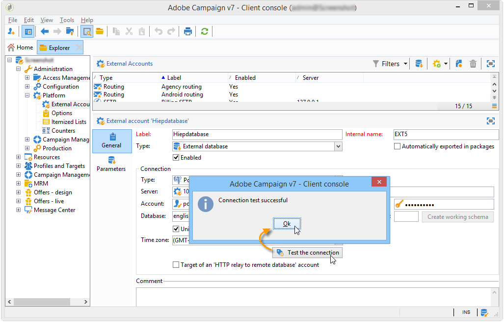
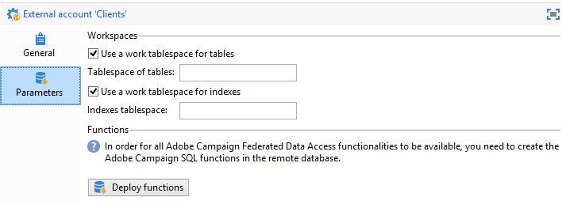
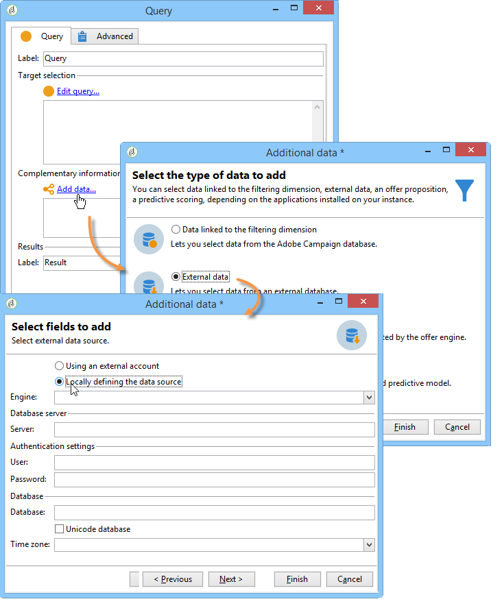
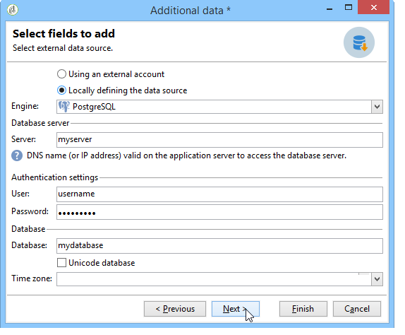
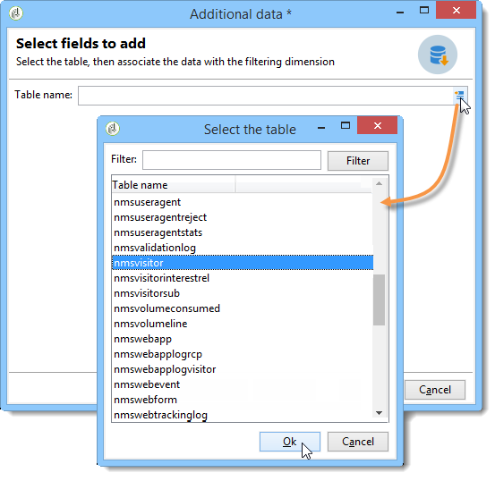
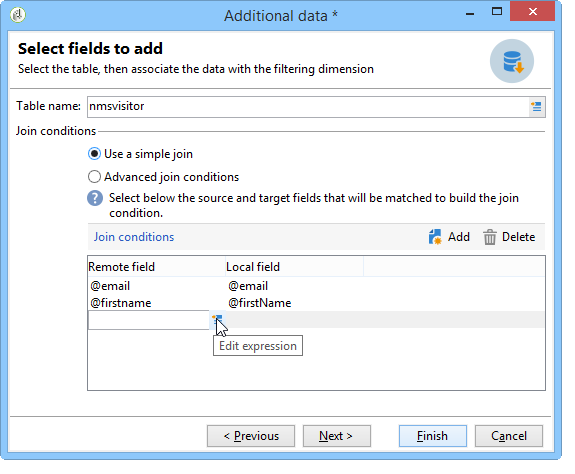
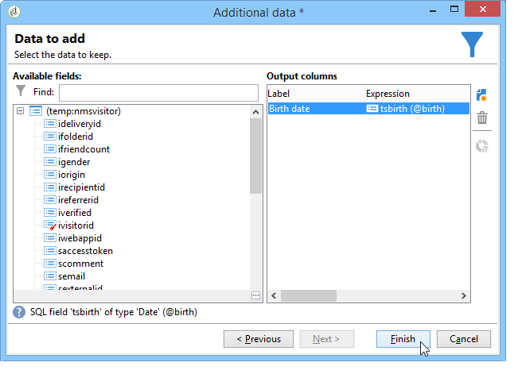

# Conexão com o banco de dados {#connecting-to-the-database}

Para habilitar uma conexão com o banco de dados externo, você deve indicar os parâmetros de conexão, ou seja, a fonte de dados direcionada e o nome da tabela com os dados que exigem carregamento.

>[!CAUTION]
>
>O usuário do Adobe Campaign precisa de direitos específicos para o banco de dados externo e o servidor de aplicativos do Adobe Campaign para processar dados de um banco de dados externo. Para obter mais informações, consulte a seção [Direitos de acesso ao banco de dados remoto](../../installation/using/remote-database-access-rights.md).
>
>Para evitar mau funcionamento, os operadores que acessam dados compartilhados remotos devem trabalhar em espaços separados.

## Criação de uma conexão compartilhada {#creating-a-shared-connection}

Para habilitar uma conexão com um banco de dados externo compartilhado, desde que essa conexão esteja ativa, o banco de dados pode ser acessado pelo Adobe Campaign.

1. A configuração deve ser definida com antecedência pelo nó **[!UICONTROL Administration > Platform > External accounts]**.
1. Clique no botão **[!UICONTROL New]** e selecione o tipo **[!UICONTROL External database]**.
1. Defina os parâmetros **[!UICONTROL Connection]** do banco de dados externo.

   Para conexões com um banco de dados de tipo **ODBC**, o campo **[!UICONTROL Server]** deve conter o nome da fonte de dados ODBC e não o nome do servidor. Além disso, algumas configurações adicionais podem ser necessárias, dependendo dos bancos de dados usados. Consulte a seção [Configurações específicas por tipo de banco de dados](../../installation/using/configure-fda.md).

1. Quando os parâmetros forem inseridos, clique no botão **[!UICONTROL Test the connection]** para aprová-los.

   

1. Se necessário, desmarque a opção **[!UICONTROL Enabled]** para desabilitar o acesso a esse banco de dados sem excluir sua configuração.
1. Para permitir que o Adobe Campaign acesse esse banco de dados, você deve implantar as funções SQL. Clique na guia **[!UICONTROL Parameters]** e depois no botão **[!UICONTROL Deploy functions]**.

   

Você pode definir espaços de tabela de trabalho específicos para as tabelas e para o índice na guia **[!UICONTROL Parameters]**.

## Como criar uma conexão temporária {#creating-a-temporary-connection}

Você pode definir diretamente uma conexão com um banco de dados externo a partir de atividades do fluxo de trabalho. Nesse caso, ele estará em um banco de dados externo local, reservado para ser usado em um fluxo de trabalho atual, ou seja, não será salvo nas contas externas. Esse tipo de conexão específica pode ser criada em atividades diferentes do fluxo de trabalho, particularmente as atividades **[!UICONTROL Query]**, o **[!UICONTROL Data loading (RDBMS)]**, a atividade **[!UICONTROL Enrichment]** ou a atividade **[!UICONTROL Split]**.

>[!CAUTION]
>
>Esse tipo de configuração não é recomendado, mas pode ser utilizado periodicamente para coletar dados. No entanto, você deve criar uma conta externa, conforme apresentada na seção [Criação de uma conexão compartilhada](#creating-a-shared-connection).

Por exemplo, na atividade de consulta, as etapas para criar uma conexão periódica com um banco de dados externo são as seguintes:

1. Clique em **[!UICONTROL Add data...]** e selecione as opções **[!UICONTROL External data]**.
1. Selecione a opção **[!UICONTROL Locally defining the data source]**.

   

1. Selecione o mecanismo de banco de dados do Target na lista suspensa. Digite o nome do servidor e forneça os parâmetros de autenticação.

   Especifique também o nome do banco de dados externo.

   

   Clique no botão **[!UICONTROL Next]**.

1. Selecione a tabela onde os dados estão armazenados.

   Você pode inserir o nome da tabela diretamente no campo correspondente ou clicar no ícone edição para acessar a lista das tabelas do banco de dados.

   

1. Clique no botão **[!UICONTROL Add]** para definir um ou vários campos de reconciliação entre os dados do banco de dados externo e os do banco de dados do Adobe Campaign. Os ícones **[!UICONTROL Edit expression]** do **[!UICONTROL Remote field]** e **[!UICONTROL Local field]** fornecem acesso à lista de campos de cada uma das tabelas.

   

1. Se necessário, especifique uma condição de filtragem e o modo de classificação de dados.
1. Selecione os dados adicionais a serem coletados no banco de dados externo. Para fazer isso, clique duas vezes nos campos que deseja adicionar para exibi-los nas **[!UICONTROL Output columns]**.

   

   Clique em **[!UICONTROL Finish]** para confirmar essa configuração.

## Conexão segura {#secure-connection}

>[!NOTE]
>
>A conexão segura só está disponível para o PostgreSQL.

Você pode proteger o acesso a um banco de dados externo ao configurar uma conta FDA externa.

Para fazer isso, adicione &quot;**:ssl**&quot; depois do endereço e do endereço do servidor da porta usada. Por exemplo: **192.168.0.52:4501:ssl**.

Os dados serão enviados por meio do protocolo SSL seguro.

## Configurações adicionais {#additional-configurations}

Se necessário, você pode criar o esquema para processamento de dados em um banco de dados externo. Da mesma forma, o Adobe Campaign permite definir o mapeamento nos dados em uma tabela externa. Essas configurações são gerais e não se aplicam exclusivamente aos fluxos de trabalho.

>[!NOTE]
>
>Para obter mais informações sobre como criar esquemas no Adobe Campaign e definir um novo mapeamento de dados, consulte [esta página](../../configuration/using/about-schema-edition.md).
