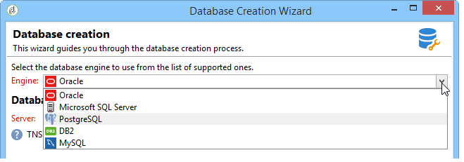
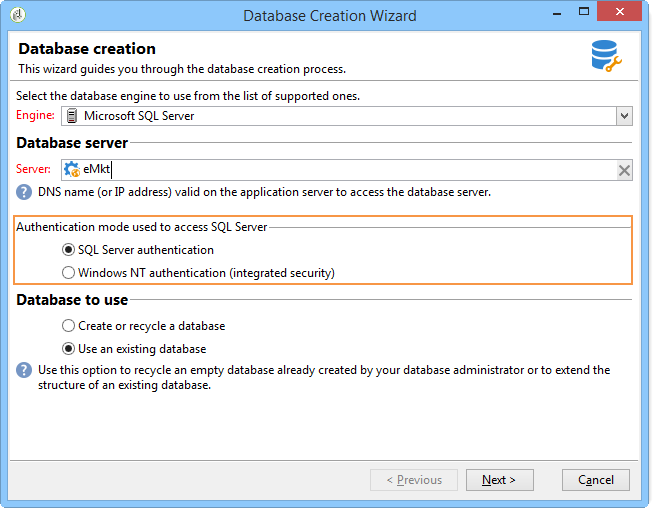

# Criação e configuração do banco de dados{#creating-and-configuring-the-database}


Ao criar um banco de dados, o Adobe Campaign fornece duas opções diferentes:

1. Criação ou reciclagem de um banco de dados: escolha essas opções se quiser criar um novo banco de dados ou reutilizar um existente. Consulte [Caso 1: Criação/reciclagem de um banco de dados](#case-1--creating-recycling-a-database).
1. Usando um banco de dados existente: escolha essa opção se um banco de dados vazio já tiver sido criado pelo administrador e desejar usá-lo; ou para estender a estrutura de um banco de dados existente. Consulte [Caso 2: Usando um banco de dados existente](#case-2--using-an-existing-database).

As etapas de configuração são detalhadas abaixo.

>[!CAUTION]
>
>Os nomes de bancos de dados, usuários e esquemas não devem começar com um número ou incluir caracteres especiais.
>
>Somente o identificador **interno** pode realizar essas operações. Para obter mais informações, consulte [esta seção](../../installation/using/configuring-campaign-server.md#internal-identifier).

## Caso 1: Criação/reciclagem de um banco de dados {#case-1--creating-recycling-a-database}

As etapas para criar um banco de dados ou reciclar uma base existente são apresentadas abaixo. Algumas configurações dependem do mecanismo de banco de dados usado:

As seguintes etapas estão envolvidas:

* [Etapa 1 - Seleção do mecanismo](#step-1---selecting-the-database-engine) de banco de dados,
* [Etapa 2 - Conexão com o servidor](#step-2---connecting-to-the-server),
* [Etapa 3 - Conexão e características do banco de dados](#step-3---connection-and-characteristics-of-the-database),
* [Etapa 4 - Pacotes para instalar](#step-4---packages-to-install),
* [Etapa 5 - Etapas](#step-5---creation-steps) de criação,
* [Etapa 6 - Criação do banco de dados](#step-6---creating-the-database).

### Etapa 1 - Seleção do mecanismo de banco de dados {#step-1---selecting-the-database-engine}

Selecione o mecanismo de banco de dados entre aqueles na lista suspensa.



Os bancos de dados compatíveis são listados no Campaign [Matriz de compatibilidade](../../rn/using/compatibility-matrix.md).

Identifique o servidor e escolha o tipo de operação a ser executada. Nesse caso, **[!UICONTROL Create or recycle a database]**.


Dependendo do mecanismo de banco de dados selecionado, as informações de identificação do servidor podem variar.

* Para um mecanismo **Oracle**, preencha o **nome TNS** definido para o servidor de aplicativos.
* Para um mecanismo **PostgreSQL** ou **DB2**, você deve especificar o nome DNS (ou endereço IP) definido no servidor de aplicativos para acessar o servidor de banco de dados.
* Para um mecanismo **Microsoft SQL Server**, você deve definir: o nome DNS (ou endereço IP) definido no servidor de aplicativos para acessar o servidor de banco de dados: **DNS** ou **DNS`\<instance>`** (modo de instância),

   >[!CAUTION]
   >
   > A partir da versão 20.3, a autenticação do Windows NT será descontinuada. **[!UICONTROL SQL Server authentication]** O agora é o único modo de autenticação disponível para o Microsoft SQL Server. [Leia mais](../../rn/using/deprecated-features.md)

   

### Etapa 2 - Conexão com o servidor {#step-2---connecting-to-the-server}

Na janela **[!UICONTROL Server access]**, defina o acesso do servidor do banco de dados.


Para fazer isso, insira o nome e a senha de uma **Administration system account** que tem permissão para acessar os bancos de dados, ou seja:

* **** para um banco de dados do Oracle,
* **** para um banco de dados do Microsoft SQL Server,
* **** postgresfor a um banco de dados PostgreSQL,
* **db2inst1** para um banco de dados DB2.

### Etapa 3 - Conexão e características do banco de dados {#step-3---connection-and-characteristics-of-the-database}

A etapa a seguir permite definir as configurações para fazer logon no banco de dados.


Você precisa definir as seguintes configurações:

* Especifique o nome do banco de dados a ser criado.

   >[!NOTE]
   >
   >Para um banco de dados DB2, o nome do banco de dados não deve exceder 8 caracteres.

* Insira a senha da conta vinculada a este banco de dados.
* Indique se o banco de dados deve estar ou não em Unicode.

   A opção **[!UICONTROL Unicode database]** permite armazenar todos os tipos de caracteres em Unicode, independentemente do idioma.

   >[!NOTE]
   >
   >Com um banco de dados do Oracle, a opção **[!UICONTROL Unicode storage]** permite usar os campos do tipo **NCLOB** e **NVARCHAR**.
   > 
   >Se você não selecionar essa opção, o conjunto de caracteres (charset) do banco de dados do Oracle deverá habilitar o armazenamento de dados em todos os idiomas (AL32UTF8 é recomendado).

* Escolha um fuso horário para o banco de dados e especifique se deseja que ele esteja em UTC (se disponível).

   Para obter mais informações, consulte [Gerenciamento de fuso horário](../../installation/using/time-zone-management.md).

### Etapa 4 - Pacotes para instalar {#step-4---packages-to-install}

Selecione os pacotes que deseja instalar.

Consulte o contrato de licença para verificar quais soluções e opções você tem direito a instalar, como &quot;Interação&quot; ou &quot;Marketing social&quot;.


### Etapa 5 - Etapas de criação {#step-5---creation-steps}

A janela **[!UICONTROL Creation steps]** permite exibir e editar o script SQL usado para criar as tabelas.


* Para um Oracle, Microsoft SQL Server ou banco de dados PostgreSQL, o administrador também pode definir os **parâmetros de armazenamento** a serem usados ao criar objetos de banco de dados.

   Esses parâmetros recebem os nomes exatos do tablespace (aviso: diferencia maiúsculas de minúsculas). Eles são armazenados respectivamente no nó **[!UICONTROL Administration > Platform > Options]** nas seguintes opções (consulte [esta seção](../../installation/using/configuring-campaign-options.md#database)):

   * **WdbcOptions_TableSpaceUser**: tabelas de usuários com base em um schema
   * **WdbcOptions_TableSpaceIndex**: índice de tabelas de usuários com base em um schema
   * **WdbcOptions_TableSpaceWork**: tabelas de trabalho sem schema
   * **WdbcOptions_TableSpaceWorkIndex**: índice de tabelas de trabalho sem schema

* Para um banco de dados do Oracle, o usuário do Adobe Campaign deve ter acesso às bibliotecas do Oracle, normalmente como membro do grupo **oinstall**.
* A opção **[!UICONTROL Set or change the administrator password]** permite inserir a senha vinculada ao operador do Adobe Campaign com direitos de administrador.

   Recomendamos definir uma senha de administrador de conta do Adobe Campaign para fins de segurança.

### Etapa 6 - Criação do banco de dados {#step-6---creating-the-database}

A etapa final do assistente permite criar o banco de dados. Clique em **[!UICONTROL Start]** para confirmar.


Depois que o banco de dados for criado, você poderá se reconectar para finalizar a configuração da instância.

Agora, você deve iniciar o assistente de implantação para concluir a configuração da instância. Consulte [Assistente de implantação](../../installation/using/deploying-an-instance.md#deployment-wizard).

As configurações de conexão do banco de dados vinculado à instância são armazenadas no arquivo **`/conf/config-<instance>.xml`** encontrado no diretório de instalação do Adobe Campaign.

Exemplo de configuração do Microsoft SQL Server no banco de dados base61 vinculado à conta &#39;campaign&#39; com sua senha criptografada:

```
<dbcnx encrypted="1" login="campaign:myBase" password="myPassword" provider="DB" server="dbServer"/>
```

## Caso 2: Uso de um banco de dados existente {#case-2--using-an-existing-database}

O banco de dados, assim como o usuário, devem ter sido criados pelo administrador do banco de dados e os direitos de acesso devem ter sido configurados corretamente.

Por exemplo, para um banco de dados do Oracle, os direitos mínimos necessários são: CONCEDER CONNECT, RECURSO E ESPAÇO DE TABELA ILIMITADO.

Para usar um banco de dados existente, as etapas de configuração são as seguintes:

* [Etapa 1 - Escolha do mecanismo](#step-1---choosing-the-database-engine) de banco de dados,
* [Etapa 2 - Configurações](#step-2---database-connection-settings) de conexão do banco de dados,
* [Etapa 3 - Pacotes para instalar](#step-3---packages-to-install),
* [Etapa 4 - Etapas](#step-4---creation-steps) de criação,
* [Etapa 5 - Criação do banco de dados](#step-5---creating-the-database).

### Etapa 1 - Escolha do mecanismo de banco de dados {#step-1---choosing-the-database-engine}

Escolha o mecanismo de banco de dados na lista suspensa.


Identifique o servidor e escolha o tipo de operação que deseja realizar. Nesse caso, **[!UICONTROL Use an existing database]**.


Dependendo do mecanismo de banco de dados selecionado, as informações de identificação do servidor podem variar.

* Para um mecanismo **Oracle**, preencha o **nome TNS** definido para o servidor de aplicativos.
* Para um mecanismo **PostgreSQL** ou **DB2**, você deve especificar o nome DNS (ou endereço IP) definido no servidor de aplicativos para acessar o servidor de banco de dados.
* Para um mecanismo **Microsoft SQL Server**, você deve definir:

   1. o nome DNS (ou endereço IP) definido no servidor de aplicativos para acessar o servidor de banco de dados,
   1. o método de segurança usado para acessar o Microsoft SQL Server: **[!UICONTROL SQL Server authentication]** ou **[!UICONTROL Windows NT authentication]**.

      

### Etapa 2 - Configurações de conexão do banco de dados {#step-2---database-connection-settings}

Na janela **[!UICONTROL Database]**, defina as configurações de conexão do banco de dados.


Você precisa definir as seguintes configurações:

* Insira o nome do banco de dados a ser usado,
* Insira o nome e a senha da conta associada a este banco de dados,

   >[!NOTE]
   >
   >Certifique-se de que o nome do esquema e do nome de usuário correspondam. A maneira recomendada de criar o banco de dados é por meio do cliente do console do Campaign.
   >Para um banco de dados do Oracle, não é necessário inserir o nome da conta.

* Indique se o banco de dados deve ser Unicode ou não.

### Etapa 3 - Pacotes para instalar {#step-3---packages-to-install}

Selecione os pacotes que deseja instalar.

Consulte o contrato de licença para verificar quais soluções e opções você tem direito a instalar, como &quot;Interação&quot; ou &quot;Leads&quot;.


### Etapa 4 - Etapas de criação {#step-4---creation-steps}

A janela **[!UICONTROL Creation steps]** permite exibir e editar o script SQL usado para criar as tabelas.


* Para bancos de dados Oracle, Microsoft SQL Server ou PostgreSQL, o administrador pode definir os **parâmetros de armazenamento** a serem usados ao criar objetos de banco de dados.
* Para um banco de dados do Oracle, o usuário do Adobe Campaign deve ter acesso às bibliotecas do Oracle, normalmente como membro do grupo **oinstall**.
* A opção **[!UICONTROL Set or change the administrator password]** permite inserir a senha vinculada ao operador do Adobe Campaign com direitos de administrador.

   Recomendamos definir uma senha de administrador de conta do Adobe Campaign para fins de segurança.

### Etapa 5 - Criação do banco de dados {#step-5---creating-the-database}

A etapa final do assistente permite criar o banco de dados. Clique em **[!UICONTROL Start]** para confirmar.


Quando a criação do banco de dados for concluída, você poderá se reconectar para finalizar a configuração da instância.

Agora, você deve iniciar o assistente de implantação para concluir a configuração da instância. Consulte [Assistente de implantação](../../installation/using/deploying-an-instance.md#deployment-wizard).

As configurações de conexão do banco de dados vinculado à instância são armazenadas no arquivo **`/conf/config-<instance>.xml`** encontrado no diretório de instalação do Adobe Campaign.

Exemplo de configuração do Microsoft SQL Server no banco de dados base61 vinculado à conta &#39;campaign&#39; com sua senha criptografada:

```
<dbcnx encrypted="1" login="campaign:myBase" password="myPassword" provider="DB" server="dbServer"/>
```
