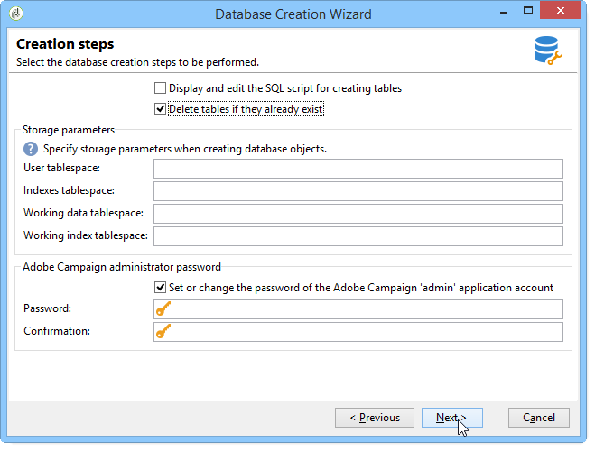

# Criação e configuração do banco de dados{#creating-and-configuring-the-database}

Quando você cria um banco de dados, a Adobe Campaign fornece duas opções diferentes:

1. Criação ou reciclagem de um banco de dados: escolha essas opções se desejar criar um novo banco de dados ou reutilizar um existente. Consulte o [Caso 1: Criação/reciclagem de um banco de dados](#case-1--creating-recycling-a-database).
1. Usando um banco de dados existente: escolha essa opção se um banco de dados vazio já tiver sido criado pelo administrador e você quiser usá-lo; ou para estender a estrutura de um banco de dados existente. Consulte o [Caso 2: Usando um banco de dados](#case-2--using-an-existing-database)existente.

As etapas de configuração são detalhadas a seguir.

>[!CAUTION]
>
>Os nomes de bancos de dados, usuários e schemas não devem start com um número ou incluir caracteres especiais.
>
>Somente o identificador **interno** pode realizar essas operações. For more on this, refer to [Internal identifier](../../installation/using/campaign-server-configuration.md#internal-identifier).

## Caso 1: Criação/reciclagem de um banco de dados {#case-1--creating-recycling-a-database}

As etapas para criar um banco de dados ou reciclar uma base existente são apresentadas abaixo. Algumas configurações dependem do mecanismo de banco de dados usado:

As seguintes etapas estão envolvidas:

* [Etapa 1 - Selecionar o mecanismo](#step-1---selecting-the-database-engine)de banco de dados,
* [Etapa 2 - Conexão com o servidor](#step-2---connecting-to-the-server),
* [Etapa 3 - Conexão e características do banco de dados](#step-3---connection-and-characteristics-of-the-database),
* [Etapa 4 - Pacotes para instalar](#step-4---packages-to-install),
* [Etapa 5 - Etapas](#step-5---creation-steps)de criação,
* [Etapa 6 - Criação do banco de dados](#step-6---creating-the-database).

### Etapa 1 - Selecionar o mecanismo de banco de dados {#step-1---selecting-the-database-engine}

Selecione o mecanismo de banco de dados entre aqueles na lista suspensa.


Os bancos de dados suportados são apresentados na seção Matriz [de compatibilidade](https://helpx.adobe.com/br/campaign/kb/compatibility-matrix.html).

Identifique o servidor e escolha o tipo de operação a ser executada. Neste caso, **[!UICONTROL Create or recycle a database]**.


Dependendo do mecanismo de banco de dados selecionado, as informações de identificação do servidor podem variar.

* Para um mecanismo **Oracle** , preencha o nome **** TNS definido para o servidor de aplicativos.
* Para um mecanismo **PostgreSQL** ou **DB2** , você deve especificar o nome DNS (ou endereço IP) definido no servidor de aplicativos para acessar o servidor de banco de dados.
* Para um mecanismo do **Microsoft SQL Server** , você deve definir:

   1. o nome DNS (ou endereço IP) definido no servidor de aplicativos para acessar o servidor de banco de dados: **DNS** ou **DNS\ `<instance>`** (modo de instância),
   1. o método de autenticação usado para acessar o Microsoft SQL Server: **[!UICONTROL SQL Server authentication]** ou **[!UICONTROL Windows NT authentication]**.

      

### Etapa 2 - Conexão com o servidor {#step-2---connecting-to-the-server}

Na **[!UICONTROL Server access]** janela, defina o acesso do servidor de banco de dados.


Para fazer isso, digite o nome e a senha de uma conta **do sistema de** administração que tenha permissão para acessar os bancos de dados, ou seja:

* **sistema** para um banco de dados Oracle,
* **sa** para um banco de dados do Microsoft SQL Server,
* **pôsteres** para um banco de dados PostgreSQL,
* **db2inst1** para um banco de dados DB2.

### Etapa 3 - Conexão e características do banco de dados {#step-3---connection-and-characteristics-of-the-database}

A etapa a seguir permite que você defina as configurações para logon no banco de dados.


É necessário definir as seguintes configurações:

* Especifique o nome do banco de dados a ser criado.

   >[!NOTE]
   >
   >Para um banco de dados DB2, o nome do banco de dados não deve exceder 8 caracteres.

* Informe a senha da conta vinculada a este banco de dados.
* Indique se o banco de dados deve ou não estar em Unicode.

   A **[!UICONTROL Unicode database]** opção permite que você armazene todos os tipos de caracteres em Unicode, independentemente do idioma.

   >[!NOTE]
   >
   >Com um banco de dados Oracle, a **[!UICONTROL Unicode storage]** opção permite usar campos do tipo **NCLOB** e **NVARCHAR** .
   > 
   >Se você não selecionar essa opção, o conjunto de caracteres (charset) do banco de dados Oracle deverá ativar o armazenamento de dados em todos os idiomas (AL32UTF8 é recomendado).

* Escolha um fuso horário para o banco de dados e especifique se deseja que ele esteja em UTC (se disponível).

   For more on this, refer to [Time zone management](../../installation/using/time-zone-management.md).

### Etapa 4 - Pacotes para instalar {#step-4---packages-to-install}

Selecione os pacotes que deseja instalar.

Consulte seu contrato de licença para verificar quais soluções e opções você tem direito de instalar, como &quot;Interação&quot; ou &quot;Marketing social&quot;.


### Etapa 5 - Etapas de criação {#step-5---creation-steps}

A **[!UICONTROL Creation steps]** janela permite exibir e editar o script SQL usado para criar as tabelas.



* Para um banco de dados Oracle, Microsoft SQL Server ou PostgreSQL, o administrador também pode definir os parâmetros **do** armazenamento a serem usados ao criar objetos de banco de dados.

   Esses parâmetros recebem os nomes exatos do tablespace (aviso: diferencia maiúsculas de minúsculas). Eles são armazenados respectivamente no **[!UICONTROL Administration > Platform > Options]** nó nas seguintes opções (consulte [](../../installation/using/configuring-campaign-options.md#database)):

   * **WdbcOptions_TableSpaceUser**: tabelas de usuários com base em um schema
   * **WdbcOptions_TableSpaceIndex**: índice de tabelas de usuários com base em um schema
   * **WdbcOptions_TableSpaceWork**: tabelas de trabalho sem schema
   * **WdbcOptions_TableSpaceWorkIndex**: índice de tabelas de trabalho sem schema

* Para um banco de dados Oracle, o usuário do Adobe Campaign deve ter acesso às bibliotecas do Oracle, normalmente como membro do grupo de **desinstalação** .
* A **[!UICONTROL Set or change the administrator password]** opção permite que você insira a senha vinculada ao operador Adobe Campaign com direitos de administrador.

   Recomendamos definir uma senha de administrador de conta da Adobe Campaign para fins de segurança.

### Etapa 6 - Criação do banco de dados {#step-6---creating-the-database}

A etapa final do assistente permite que você crie o banco de dados. Clique em **[!UICONTROL Start]** para confirmar.


Depois que o banco de dados for criado, você poderá se conectar novamente para finalizar a configuração da instância.

Agora você deve start o assistente de implantação para concluir a configuração da instância. Consulte o Assistente [de implantação](../../installation/using/deploying-an-instance.md#deployment-wizard).

As configurações de conexão do banco de dados vinculado à instância são armazenadas no arquivo **`/conf/config-<instance>.xml`** encontrado no diretório de instalação do Adobe Campaign.

Exemplo de uma configuração do Microsoft SQL Server no banco de dados base61 vinculado à conta &#39;campanha&#39; com sua senha criptografada:

```
<dbcnx encrypted="1" login="campaign:myBase" password="myPassword" provider="DB" server="dbServer"/>
```

## Caso 2: Usando um banco de dados existente {#case-2--using-an-existing-database}

O banco de dados, assim como o usuário, devem ter sido criados pelo administrador do banco de dados e os direitos de acesso configurados corretamente.

Por exemplo, para um banco de dados Oracle, os direitos mínimos necessários são: CONCEDER CONNECT, RECURSOS E ESPAÇO DE TRABALHO ILIMITADO.

Para usar um banco de dados existente, as etapas de configuração são as seguintes:

* [Etapa 1 - Escolhendo o mecanismo](#step-1---choosing-the-database-engine)de banco de dados,
* [Etapa 2 - Configurações](#step-2---database-connection-settings)de conexão do banco de dados,
* [Etapa 3 - Pacotes para instalar](#step-3---packages-to-install),
* [Etapa 4 - Etapas](#step-4---creation-steps)de criação,
* [Etapa 5 - Criação do banco de dados](#step-5---creating-the-database).

### Etapa 1 - Escolhendo o mecanismo de banco de dados {#step-1---choosing-the-database-engine}

Escolha o mecanismo de banco de dados na lista suspensa.


Identifique o servidor e escolha o tipo de operação que deseja realizar. Neste caso, **[!UICONTROL Use an existing database]**.


Dependendo do mecanismo de banco de dados selecionado, as informações de identificação do servidor podem variar.

* Para um mecanismo **Oracle** , preencha o nome **** TNS definido para o servidor de aplicativos.
* Para um mecanismo **PostgreSQL** ou **DB2** , você deve especificar o nome DNS (ou endereço IP) definido no servidor de aplicativos para acessar o servidor de banco de dados.
* Para um mecanismo do **Microsoft SQL Server** , você deve definir:

   1. o nome DNS (ou endereço IP) definido no servidor de aplicativos para acessar o servidor de banco de dados,
   1. o método de segurança usado para acessar o Microsoft SQL Server: **[!UICONTROL SQL Server authentication]** ou **[!UICONTROL Windows NT authentication]**.

      

### Etapa 2 - Configurações de conexão do banco de dados {#step-2---database-connection-settings}

Na **[!UICONTROL Database]** janela, defina as configurações de conexão do banco de dados.


É necessário definir as seguintes configurações:

* Digite o nome do banco de dados a ser usado,
* Digite o nome e a senha da conta associada ao banco de dados,

   >[!NOTE]
   >
   >Verifique se o nome do schema e do usuário correspondem. A maneira recomendada de criar o banco de dados é através do cliente do console de campanha.
   >Para um banco de dados Oracle, não é necessário informar o nome da conta.

* Indique se o banco de dados deve ser Unicode ou não.

### Etapa 3 - Pacotes para instalar {#step-3---packages-to-install}

Selecione os pacotes que deseja instalar.

Consulte seu contrato de licença para verificar quais soluções e opções você tem direito a instalar, como &quot;Interação&quot; ou &quot;Clientes potenciais&quot;.


### Etapa 4 - Etapas de criação {#step-4---creation-steps}

A **[!UICONTROL Creation steps]** janela permite exibir e editar o script SQL usado para criar as tabelas.


* Para bancos de dados Oracle, Microsoft SQL Server ou PostgreSQL, o administrador pode definir os parâmetros **de** armazenamento a serem usados ao criar objetos de banco de dados.
* Para um banco de dados Oracle, o usuário do Adobe Campaign deve ter acesso às bibliotecas do Oracle, normalmente como membro do grupo de **desinstalação** .
* A **[!UICONTROL Set or change the administrator password]** opção permite que você insira a senha vinculada ao operador Adobe Campaign com direitos de administrador.

   Recomendamos definir uma senha de administrador de conta da Adobe Campaign para fins de segurança.

### Step 5 - Creating the database {#step-5---creating-the-database}

A etapa final do assistente permite que você crie o banco de dados. Clique em **[!UICONTROL Start]** para confirmar.


Quando a criação do banco de dados estiver concluída, você poderá se reconectar para finalizar a configuração da instância.

Agora você deve start o assistente de implantação para concluir a configuração da instância. Consulte o Assistente [de implantação](../../installation/using/deploying-an-instance.md#deployment-wizard).

As configurações de conexão do banco de dados vinculado à instância são armazenadas no arquivo **`/conf/config-<instance>.xml`** encontrado no diretório de instalação do Adobe Campaign.

Exemplo de uma configuração do Microsoft SQL Server no banco de dados base61 vinculado à conta &#39;campanha&#39; com sua senha criptografada:

```
<dbcnx encrypted="1" login="campaign:myBase" password="myPassword" provider="DB" server="dbServer"/>
```

