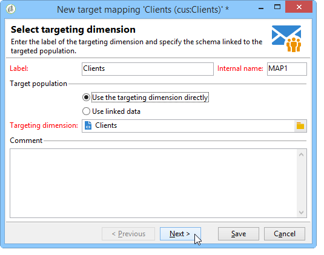
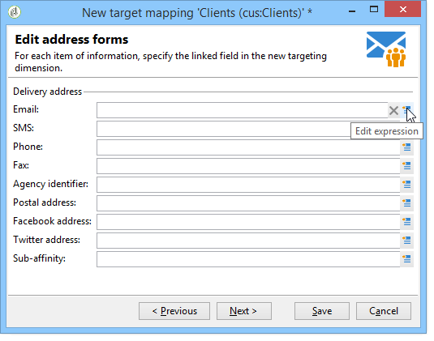

# Definir mapeamento de dados externos {#defining-data-mapping}

O Adobe Campaign permite definir o mapeamento nos dados em uma tabela externa.

Para fazer isso, após a criação do esquema da tabela externa, é possível criar um novo mapeamento de entrega para usar os dados nessa tabela como um Delivery Target.

Para fazer isso, siga as etapas abaixo:

1. Crie um novo mapeamento de entrega e escolha a dimensão de direcionamento, como o esquema que você acabou de criar, por exemplo.

   

1. Indique os campos onde as informações de entrega são armazenadas (sobrenome, nome, e-mail, endereço, etc.).

   

1. Especifique os parâmetros para armazenamento de informações, incluindo o sufixo dos esquemas de extensão para que sejam facilmente identificáveis.

   

   Você pode escolher se deseja armazenar exclusões (**excludelog**), com mensagens (**broadlog**) ou em uma tabela separada.

   Você também pode escolher se deseja gerenciar o rastreamento para esse mapeamento de entrega (**trackinglog**).

1. Em seguida, selecione as extensões a serem consideradas. O tipo de extensão depende dos parâmetros e opções da sua plataforma (visualizar seu contrato de licença).

   

   Clique no botão **[!UICONTROL Save]** para iniciar a criação de mapeamento de entrega: todas as tabelas vinculadas são criadas automaticamente com base nos parâmetros selecionados.
