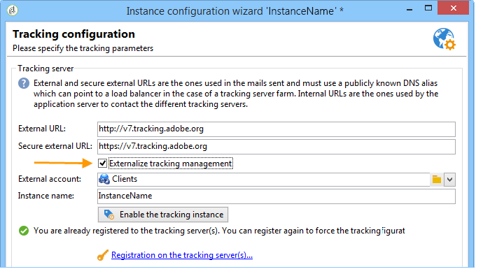
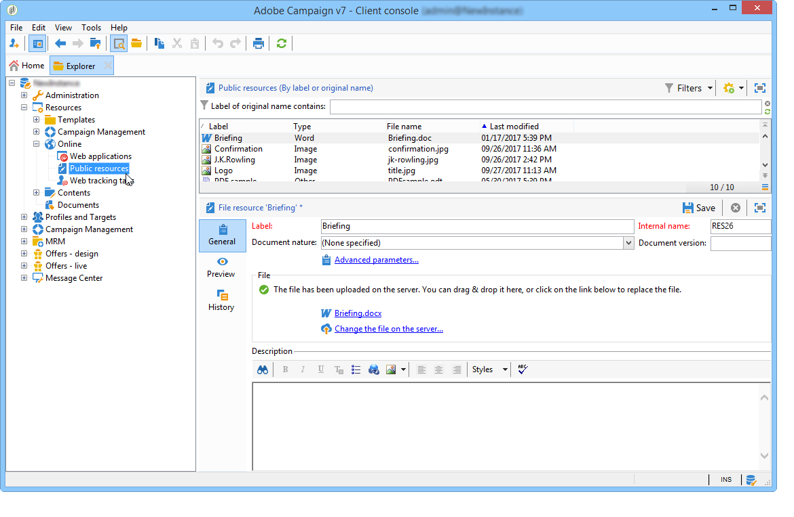

# Implantação de uma instância{#deploying-an-instance}

>[!NOTE]
>
>As configurações do lado do servidor só podem ser executadas pelo Adobe para implantações hospedadas pelo Adobe. Para saber mais sobre as diferentes implantações, consulte o [Modelos de hospedagem](../../installation/using/hosting-models.md) ou para [esta página](../../installation/using/capability-matrix.md).

## Assistente de implantação {#deployment-wizard}

O Adobe Campaign fornece um assistente gráfico, disponível no console do cliente Adobe Campaign, para definir os parâmetros da instância à qual você vai se conectar.

Para iniciar o assistente de implantação, selecione **Ferramentas > Avançado > Assistente de implantação**.


As etapas de configuração são as seguintes:

1. [Parâmetros gerais](#general-parameters)
1. [Parâmetros de canal de email](#email-channel-parameters)
1. [Gerenciamento de emails devolvidos](#managing-bounced-emails)
1. [Configuração de rastreamento](#tracking-configuration)
1. [Parâmetros do canal móvel](#mobile-channel-parameters)
1. [Configurações regionais](#regional-settings)
1. [Acesso pela Internet](#access-from-the-internet)
1. [Gerenciamento de recursos públicos](#managing-public-resources)
1. [Limpeza de dados](#purging-data)

## Parâmetros gerais {#general-parameters}

A primeira etapa do assistente de implantação permite inserir informações gerais na instância.


### Informações gerais {#general-information}

A seção inferior da janela permite selecionar as opções a serem ativadas.

* **[!UICONTROL Customer identifier used in billing]** : pode ser o nome da instância e o número da versão.
* **[!UICONTROL Common name of the customer]** : digite uma cadeia de caracteres com o nome da sua empresa. Essas informações podem ser usadas nos links de unsubscription.
* **[!UICONTROL Namespace]** : insira um identificador curto em minúsculas. O objetivo é distinguir entre sua configuração específica e a configuração de fábrica em caso de atualização. O namespace padrão é **cus** - para cliente.

### Opções técnicas {#technical-options}

A seção inferior da janela permite selecionar as opções a serem ativadas.

As seguintes opções estão disponíveis:

* **[!UICONTROL Email channel]** : para ativar o delivery de email. Consulte [Parâmetros de canal de email](#email-channel-parameters).
* **[!UICONTROL Tracking]** : Para ativar o rastreamento da população do target (aberturas e cliques). Consulte [Configuração de rastreamento](#tracking-configuration).
* **[!UICONTROL Managing bounced emails]** : para definir a conta POP usada para coletar emails de entrada. Consulte [Gerenciamento de emails devolvidos](#managing-bounced-emails).
* **[!UICONTROL LDAP integration]** : para configurar a autenticação de usuário por meio de um diretório LDAP. Consulte [Conexão por meio do LDAP](../../installation/using/connecting-through-ldap.md).

## Parâmetros de canal de email {#email-channel-parameters}

A etapa a seguir permite definir as informações a serem exibidas nos cabeçalhos da mensagem.

Esses parâmetros podem ser sobrecarregados em templates do delivery e individualmente para cada delivery (se os usuários tiverem os direitos necessários).

### Parâmetros para emails entregues {#parameters-for-delivered-emails}


Indique os seguintes parâmetros:

* **[!UICONTROL Sender name]** : insira o nome do remetente.
* **[!UICONTROL Sender address]** : insira o endereço de email do remetente.

  >[!NOTE]
  >
  > Ao enviar emails do Adobe Campaign, a variável **Endereço do remetente** a caixa de correio não é monitorada e os usuários de marketing não podem acessá-la. O Adobe Campaign também não oferece a capacidade de responder automaticamente ou encaminhar emails recebidos nessa caixa de correio.

* **[!UICONTROL Reply address text]** : insira o nome usado quando o recipient clicar no **[!UICONTROL Reply]** botão.
* **[!UICONTROL Reply address]** : insira o endereço de email que será usado quando o recipient clicar no **[!UICONTROL Reply]** no software cliente de email.

  >[!NOTE]
  >
  >O objetivo da **Endereço de resposta** é quando você deseja que o destinatário responda a um endereço diferente do **Endereço do remetente**.  Esse endereço deve ser um endereço de email válido e estar vinculado a uma caixa de correio monitorada.  Esta caixa de correio deve ser hospedada pelo cliente.  Pode ser uma caixa de entrada de suporte, por exemplo, customer-care@customer.com, em que os emails são lidos e respondidos.

* **[!UICONTROL Error address]** : insira o endereço de email das mensagens com erros. Esse é o endereço técnico usado para lidar com emails devolvidos, incluindo emails recebidos pelo servidor do Adobe Campaign devido a endereços de destino inexistentes.

  >[!NOTE]
  >
  > Esse endereço deve ser um endereço de email válido e estar vinculado a uma caixa de correio monitorada. Esta caixa de correio deve ser hospedada pelo cliente. Pode ser uma caixa de entrada de devolução, por exemplo, errors@customer.com.


Além disso, é possível especificar a variável **máscaras** autorizado para o endereço do remetente e o endereço de erro. Se necessário, essas máscaras podem ser separadas por vírgulas. Essa configuração é opcional. Quando os campos são inseridos, o Adobe Campaign verifica no momento do delivery (durante a análise, se o endereço não incluir nenhuma variável) se os endereços são válidos. Esse modo operacional garante que não sejam usados endereços que possam causar problemas de delivery. Os endereços de entrega devem ser configurados no servidor de entrega.

>[!NOTE]
>
>* Essas configurações são salvas nas opções da plataforma do Campaign. [Saiba mais](../../installation/using/configuring-campaign-options.md).
> 
>* Para configurações de várias marcas, você pode adaptar o Endereço de erro e substituir essa configuração da conta externa do Roteamento de email. [Saiba mais](../../installation/using/external-accounts.md#email-routing-external-account).
>


### Caracteres autorizados em endereços {#characters-authorized-in-addresses}

<!--This window enables you to define, for all email campaigns, the delivery and address-quality management options.-->

No banco de dados do Adobe Campaign, todos os endereços de email devem ser criados da seguinte maneira: `x@y.z`. A variável **x**, **y** e **z** Os caracteres não devem estar vazios e não devem incluir caracteres não autorizados.

Você pode definir aqui os caracteres autorizados (&#39;política de dados&#39;) no campo de email do banco de dados. Os caracteres não incluídos na lista serão proibidos e, portanto, recusados ao inserir informações na base de dados por meio da interface, através de um formulário web e também importando dados.

Duas listas estão disponíveis: **Somente europeu** ou **Somente EUA**. Outros caracteres podem ser adicionados, se necessário.

### Parâmetros de entrega {#delivery-parameters}

A variável **Parâmetros avançados...** link permite acessar opções de entrega, parâmetros vinculados a novas tentativas e quarentenas.


Essa janela permite definir, para todas as campanhas de email, as opções de delivery e de gerenciamento de qualidade de endereço.

As seguintes opções estão disponíveis:

* **[!UICONTROL Delivery duration of messages]** : além desse tempo, o delivery é interrompido (por padrão, 5 dias).
* **[!UICONTROL Online resources validity duration]** : tempo durante o qual as informações do perfil do recipient são mantidas para gerar mirror pages.
* **[!UICONTROL Exclude recipients who no longer wish to be contacted]** : quando essa opção é selecionada, em incluir na lista de bloqueios, os recipients do  não serão contatados.
* **[!UICONTROL Automatically ignore doubles]** : quando essa opção é selecionada, o delivery não será feito em endereços duplicados.

>[!NOTE]
>
>Para instalações hospedadas ou híbridas, se você atualizou para o [MTA aprimorado](../../delivery/using/sending-with-enhanced-mta.md), o **[!UICONTROL Delivery duration of the messages]** será usado somente se definido como **3,5 dias ou menos**. Se você definir um valor superior a 3,5 dias, ele não será levado em consideração.

### Tentar parâmetros novamente {#retry-parameters}

As informações sobre as recuperações são **Períodos de recuperação** e **Número de recuperações** fields: quando um recipient está inacessível, por exemplo, se a sua caixa de entrada estiver cheia, por padrão o programa tentará contatá-lo 5 vezes, com um intervalo de uma hora entre cada tentativa (durante o tempo máximo de delivery). Esses valores podem ser alterados para atender às suas necessidades.

>[!NOTE]
>
>Para instalações hospedadas ou híbridas, se você atualizou para o [MTA aprimorado](../../delivery/using/sending-with-enhanced-mta.md), os parâmetros de nova tentativa do Campaign não são mais usados. As tentativas de rejeição temporária e o intervalo de tempo entre elas são determinados pelo MTA aprimorado com base no tipo e na gravidade das respostas de rejeição que retornam do domínio de email da mensagem.

### Parâmetros de quarentena {#quarantine-parameters}

As opções de configuração para quarentenas são as seguintes:

* **[!UICONTROL Duration between two significant errors]** : digite um valor (&quot;1d&quot; por padrão: 1 dia) para definir o tempo que o aplicativo aguarda antes de incrementar o contador de erros, em caso de falha,
* **[!UICONTROL Maximum number of errors before quarantine]** : quando esse valor é atingido, o endereço de email é colocado em quarentena (por padrão, &quot;5&quot;: o endereço será colocado em quarentena no sexto erro). Isso significa que o contato será automaticamente excluído dos próximos deliveries.

## Gerenciamento de emails devolvidos {#managing-bounced-emails}

O email de devolução é extremamente importante para qualificar erros de delivery. Esses erros são categorizados no NP@I uma vez que as regras determinaram sua causa.

Esta etapa só estará disponível se a variável **Canal de email** e **Email de devolução** as opções de gerenciamento são selecionadas na primeira etapa do assistente de implantação. Consulte [Parâmetros gerais](#general-parameters).

Esse estágio permite definir configurações para gerenciar emails devolvidos.


### Conta POP usada para recuperar emails de entrada {#pop-account-used-to-retrieve-incoming-mails}

Indique os parâmetros para se conectar à conta para recuperar emails de entrada.

* **[!UICONTROL Label]** : nome que inclui todos os parâmetros fornecidos abaixo,
* **[!UICONTROL Server]** : servidor usado para recuperar emails devolvidos (emails de entrada),
* **[!UICONTROL Security]** : Se necessário, selecione **[!UICONTROL SSL]** na lista suspensa,
* **[!UICONTROL Port]** : porta do servidor (geralmente 110),
* **[!UICONTROL Account]** : nome da conta usada para emails devolvidos,
* **[!UICONTROL Password]** : Senha associada à conta.

Quando as configurações de POP forem especificadas, clique em **Teste** para garantir que estejam corretos.

### Emails rejeitados não processados {#unprocessed-bounce-mails}

As rejeições são tratadas automaticamente pelo Adobe Campaign, aplicando as regras listadas no **Administração > Campaign Management > Gerenciamento de não entregues > Qualificação do log de entrega** nó. Para obter mais informações, consulte [Gerenciamento de emails de devolução](../../delivery/using/understanding-delivery-failures.md#bounce-mail-management).

As rejeições não processadas não são exibidas na interface do Adobe Campaign. Eles são excluídos automaticamente, a menos que sejam transferidos para uma caixa de correio de terceiros usando os seguintes campos:

* **[!UICONTROL Forwarding address]** : preencha este campo para transferir para um endereço de terceiros todas as mensagens de erro (processadas ou não processadas ) coletadas pela plataforma do Adobe Campaign.
* **[!UICONTROL Address for errors]** : Preencha este campo para transferir para um endereço de terceiros somente as mensagens de erro que o processo do InMail não pôde qualificar.
* **[!UICONTROL SMTP server]** : servidor usado para enviar os emails de devolução não processados.

>[!IMPORTANT]
>
>Para encaminhar emails de devolução não processados, o Adobe recomenda apenas preencher o **[!UICONTROL Address for errors]** campo. No entanto, verifique se o endereço usado é verificado regularmente, pois isso pode sobrecarregar seu servidor de email. Entre em contato com o executivo de sua conta para obter mais informações.

## Configuração de rastreamento {#tracking-configuration}

A próxima etapa permite configurar o rastreamento da instância. A instância deve ser declarada e registrada nos servidores de rastreamento.

Essa etapa só é oferecida quando o **Canal de email** e **Rastreamento** são selecionadas na primeira página do assistente de implantação. Consulte [Parâmetros gerais](#general-parameters).

Para obter informações mais detalhadas sobre rastreamento Web (modo de rastreamento, criação e inserção de tags...), consulte [este documento](../../configuration/using/about-web-tracking.md).

### Princípio operacional {#operating-principle}

Quando você ativa o rastreamento em uma instância, os URLs nos deliveries são alterados durante o envio para ativar o rastreamento.

* As informações sobre URLs externos (seguros ou não) inseridas nesta página do assistente de implantação são usadas para criar o novo URL. Além dessas informações, o link modificado contém: os identificadores do delivery, o recipient e o URL.

  As informações de rastreamento são coletadas pela Adobe Campaign no(s) servidor(es) de rastreamento para enriquecer os perfis de recipient e os dados vinculados ao delivery ( **[!UICONTROL Tracking]** guias).

  As informações sobre URLs internos são usadas somente pelo servidor de aplicativos do Adobe Campaign para entrar em contato com o(s) servidor(es) de rastreamento.

  Para obter mais informações, consulte [Servidor de rastreamento](#tracking-server).

* Depois que os URLs forem configurados, será necessário ativar o rastreamento. Para fazer isso, a instância deve ser registrada nos servidores de rastreamento.

  Para obter mais informações, consulte [Salvar o rastreamento](#saving-tracking).

### Servidor de rastreamento {#tracking-server}


Para garantir a eficiência do rastreamento nessa instância, as seguintes informações devem ser exibidas:
<!--With Mid-sourcing architecture, you can externalize tracking management. To do this:-->

* **[!UICONTROL External URL]** e/ou **[!UICONTROL Secure external URL]** : insira o URL de redirecionamento a ser usado no email a ser enviado.
* **[!UICONTROL Internal URL(s)]** : URLs usados somente pelo servidor do Adobe Campaign para entrar em contato com o(s) servidor(es) de rastreamento para coletar logs e fazer upload dos URLs. Não é necessário associá-lo à instância.

  Se você não especificar um URL, o URL de rastreamento será usado por padrão.

Com a arquitetura Mid-sourcing, você pode externalizar o gerenciamento de rastreamento. Para fazer isso:

1. Selecione a opção **[!UICONTROL Externalize tracking management]** : permite usar um servidor mid-sourcing como servidor de rastreamento.
1. Preencha o **[!UICONTROL External account]** e **[!UICONTROL Instance name]** para poder se conectar ao servidor mid-sourcing.

   Para obter mais informações, consulte [Servidor Mid-sourcing](../../installation/using/mid-sourcing-server.md).

1. Clique em **[!UICONTROL Enable the tracking instance]** botão para aprovar a conexão com o servidor.

   

### Salvar o rastreamento {#saving-tracking}

Depois que os URLs forem preenchidos, você deverá registrar o servidor de rastreamento.

Clique no link **Registro no(s) servidor(es) de rastreamento** e selecione uma das opções disponíveis.


Há três tipos possíveis de arquitetura para implementar o rastreamento:

1. **Adicionar suporte para rastreamento em uma instância existente**

   Essa opção se aplica se a instância já tiver sido criada para outras necessidades (servidor MTA etc.) em servidores que serão usados como servidores de rastreamento.

   

   Digite a senha para o **interno** no(s) servidor(es) de redirecionamento para configurar a instância de rastreamento.

   >[!NOTE]
   >
   >Se vários servidores de rastreamento forem usados, eles deverão usar o mesmo nome e senha.

   Especifique o nome da instância e a senha.

1. **Criar uma nova instância dedicada ao rastreamento**

   Essa opção é útil quando as instâncias de rastreamento são reservadas para rastreamento e não têm outros módulos de aplicativo.

   

   Digite a senha para o **interno** no(s) servidor(es) de redirecionamento para configurar a instância de rastreamento.

   >[!NOTE]
   >
   >Se vários servidores de rastreamento estiverem configurados, todos eles deverão usar a mesma senha.

   Especifique o nome da instância, a senha e qualquer máscara DNS associada, como **[!UICONTROL Campaign*]**.

1. **Validar uma instância de rastreamento já pré-configurada para você**

   Essa opção é usada quando você não tem a senha para o **interno** conta; nesse caso, uma conta de rastreamento é pré-configurada para você no(s) servidor(es) de rastreamento. Insira a senha da conta de rastreamento do(s) servidor(es) de redirecionamento para validar a instância de rastreamento.

   

   Especifique o nome da instância que será validada.

Clique em **Aprovar** para iniciar o processo de gravação com o servidor de rastreamento.

De volta à janela anterior, uma mensagem confirma o registro no nível do servidor de rastreamento:


Os parâmetros vinculados às pesquisas de URL **não deve ser modificado** para uma instalação padrão. Para todos os outros parâmetros, entre em contato com o Adobe.

## Parâmetros do canal móvel {#mobile-channel-parameters}

A próxima etapa permite definir configurações padrão para deliveries a dispositivos móveis (SMS e WAP Push).

>[!NOTE]
>
>O canal móvel é opcional: esse estágio só aparecerá se tiver sido comprado. Verifique o contrato de licença.


### Conta padrão para entrega por SMS {#default-account-for-sms-delivery}

Insira a seguinte informação:

* **[!UICONTROL Label]** : digite um nome para esta conta de SMS/Push Wap. Por exemplo, talvez você queira usar o nome do roteador.
* Para o **[!UICONTROL Server]**, **[!UICONTROL Port]**, **[!UICONTROL Account]**, **[!UICONTROL Password]**, **[!UICONTROL Connector]**, **[!UICONTROL Send Endpoint]**, **[!UICONTROL Reception Endpoint]**, **[!UICONTROL Notification Endpoint]** campos: entre em contato com seu provedor de serviços para obter as configurações necessárias.

### Parâmetros de SMS enviados {#parameters-of-sms-sent}

No **Prioridade** lista suspensa: Selecione &quot;Normal&quot;, &quot;Alto&quot; ou &quot;Urgente&quot; para aplicá-lo às mensagens a serem enviadas.

### Parâmetros avançados {#advanced-parameters}

A variável **Parâmetros avançados...** permite acessar as opções de tentativa e quarentena.


As informações sobre tentativas estão disponíveis no **Período de novas tentativas** e **Número de novas tentativas** campos: quando um dispositivo móvel está inacessível, por padrão, o programa tentará novamente 5 vezes em intervalos de pelo menos 15 minutos (para o período máximo de delivery). Esses valores podem ser adaptados para atender às suas necessidades.

As opções de configuração para quarentenas são as seguintes:

* **[!UICONTROL Time between two significant errors]** : insira um valor padrão (por padrão, &quot;1d&quot;: dia) para definir o tempo que o aplicativo aguarda antes de incrementar o contador de erros para uma falha.
* **[!UICONTROL Maximum number of errors before quarantine]** : depois que esse valor é atingido, o número do celular é colocado em quarentena (por padrão, &quot;5&quot;: o número será colocado em quarentena após o sexto erro). Isso significa que o contato será automaticamente excluído de deliveries futuros.

## Configurações regionais {#regional-settings}

Esse estágio permite incluir preferências de política de dados.


* **[!UICONTROL Consider all phone numbers as international ones]** : quando essa opção é selecionada, o aplicativo aplica o formato internacional a números de telefone (o prefixo do país é obrigatório, pois o número de dígitos não será verificado antes da aplicação da formatação). Se esta opção não estiver selecionada, você deverá adicionar um prefixo ao número de telefone internacional com &quot;+&quot; ou &quot;00&quot;.
* **[!UICONTROL Store all phone numbers using the international format]** : essa opção só afeta **doméstico** números de telefone importados ou editados. Defina se deseja usar um formato doméstico (como 425 555 0150) ou internacional (por exemplo, +1 425 555 0150)

## Acesso pela Internet {#access-from-the-internet}

>[!IMPORTANT]
>
>Por motivos de privacidade, recomendamos usar HTTPS para todos os recursos externos.

Esta etapa permite definir URLs de acesso para páginas do Adobe Campaign expostas na Internet.

Você também deve indicar aqui as opções de publicação vinculadas aos formulários web.


### Servidores expostos na Web {#servers-exposed-on-the-web}

Use esta página para preencher os URLs do servidor para:

1. Acesse o servidor de aplicativos exposto na Internet: formulários de assinatura/unsubscription, extranet etc.
1. Acesse o servidor de aplicativos para recursos não expostos na Web: formulários, intranet, páginas de confirmação.
1. Acesse as mirror pages dos deliveries.

   Uma mirror page é uma página dinâmica que exibe o conteúdo do email. Ele é acessado por um link inserido na mensagem enviada ao recipient e pode conter elementos personalizados. A mirror page dá ao recipient a possibilidade de ler a mensagem em um navegador da Internet em vez do software de email, independentemente do formato de delivery (texto ou HTML). No entanto, as mirror pages só serão geradas para um determinado delivery se o conteúdo de HTML necessário tiver sido definido.

O Adobe Campaign permite diferenciar esses três URLs para distribuir a carga em várias plataformas.


>[!NOTE]
>
>* Essas configurações são salvas nas opções da plataforma do Campaign. [Saiba mais](../../installation/using/configuring-campaign-options.md).
>* Para configurações de várias marcas, você pode adaptar o URL da Mirror page e substituir essa configuração da conta externa de Roteamento de email. [Saiba mais](../../installation/using/configuring-campaign-options.md).


## Gerenciamento de recursos públicos {#managing-public-resources}

>[!IMPORTANT]
>
>Por motivos de privacidade, recomendamos usar HTTPS para todos os recursos externos.

Para serem vistas de fora, as imagens usadas em e-mails e recursos públicos vinculados a campanhas devem estar presentes em um servidor acessível externamente. Eles podem estar disponíveis para recipients ou operadores externos.


Para esta etapa, você precisa inserir:

1. O novo URL do recurso público. Para obter mais informações, consulte [URL de recursos públicos](#public-resources-url) seção.
1. O modo de detecção de imagem em uma entrega. Para obter mais informações, consulte [Detecção de imagem de entrega](#delivery-image-detection) seção.
1. Opções de publicação. Para obter mais informações, consulte [Modos de publicação](#publication-modes) seção.

Os recursos públicos podem ser acessados através do **Administração > Recursos > On-line > Recursos públicos** da árvore do Adobe Campaign. Eles são coletados em uma biblioteca e podem ser incluídos em emails, mas também são usados em campanhas ou tarefas e na gestão de conteúdo.



### URL de recursos públicos {#public-resources-url}

O primeiro campo permite especificar o início do URL usado para os recursos depois de serem carregados. Quando carregados, os recursos podem ser acessados por meio desse novo URL.

Em um delivery, você pode usar imagens armazenadas na biblioteca de recursos públicos ou qualquer outra imagem local ou imagem armazenada em um servidor.

* Para imagens de email, a variável **https://** server **/res/img** URL.

  Esse valor pode ser sobreposto para cada delivery.

* Para recursos públicos, o URL **https://** server **/res/** instância ****onde **instância**é o nome da instância de rastreamento.

### Detecção de imagem de entrega {#delivery-image-detection}

Em um delivery, você pode usar imagens armazenadas na biblioteca de recursos públicos ou qualquer outra imagem local ou imagem armazenada em um servidor.

O campo **Máscaras de URL** permite especificar a lista de máscaras de URL a serem ignoradas ao carregar imagens automaticamente. Por exemplo, se você usar imagens armazenadas em um site acessível externamente, em particular em um site da Internet, poderá inserir o URL do site neste campo.


É possível especificar várias máscaras de URL usando uma vírgula para separar cada uma delas.

* Para obter informações sobre como usar e gerenciar imagens em emails, consulte [nesta seção](../../delivery/using/defining-the-email-content.md#adding-images).
* No assistente do delivery, as imagens chamadas desses URLs terão o status &quot;Ignorado&quot;.

### Modos de publicação {#publication-modes}

A seção inferior do assistente permite selecionar as opções de publicação de recursos públicos e imagens.

Os seguintes modos de publicação estão disponíveis:

* Servidor(es) de rastreamento

  Os recursos serão copiados automaticamente para os diferentes servidores de rastreamento. Eles são configurados na etapa [Configuração de rastreamento](#tracking-configuration).

* Outros servidores da Adobe Campaign

  Você pode usar um ou mais servidores do Adobe Campaign nos quais os recursos serão copiados.

  No lado do servidor, para usar um servidor Adobe Campaign dedicado, você deve criar uma nova instância com o seguinte comando:

  ```
  nlserver config -addtrackinginstance:<trackingA>/<trackingA*>
  ```

  Em seguida, digite a senha.

  Os parâmetros do(s) servidor(es) dedicado(s) são **[!UICONTROL Media URL(s)]**, **[!UICONTROL Password]** e **[!UICONTROL Instance name]** campos.

  

* Script de publicação manual (somente para recursos públicos)

  

  É possível publicar as imagens usando um script:

   * É necessário criar esse script: o conteúdo depende da sua configuração.
   * O script será chamado pelo seguinte comando:

     ```
     [INSTALL]/copyToFrontal.vbs "$(XTK_INSTALL_DIR)\var\<instance>\upload\" "img1,img2,img3"
     ```

     onde `[INSTALL]` é o caminho de acesso para a pasta de instalação do Adobe Campaign.

   * No Unix, verifique se o script é executável.

Para imagens, ele deve copiá-las da pasta &quot;images&quot; especificada por meio do **NmsDelivery_ImageSubDirectory** a um ou mais servidores frontais. Esses servidores armazenarão as imagens para torná-las acessíveis por meio do novo URL configurado.

No caso de publicação em um servidor do Adobe Campaign sem um script de publicação manual, por padrão, as imagens de um delivery são armazenadas no `$(XTK_INSTALL_DIR)/var/res/img/ directory`. O URL correspondente é o seguinte: **`https://server/res/img`**.

`XTK_INSTALL_DIR)/var/res/$(INSTANCE_NAME)`. O URL correspondente é o seguinte: **`https://server/res/instance`** onde instância é o nome da instância de rastreamento.

>[!NOTE]
>
>É possível alterar o diretório de armazenamento de recursos públicos. Para obter mais informações, consulte [Gerenciamento de recursos públicos](#managing-public-resources).

### Sincronização de recursos públicos {#synchronizing-public-resources}

Essa funcionalidade permite **sincronizar recursos públicos** em vários servidores sobressalentes.

Se um recurso público não estiver presente no servidor de rastreamento ou se o recurso retornar um erro 404, o servidor de rastreamento tentará encontrar o recurso em um dos servidores sobressalentes.

A declaração e a configuração de servidores sobressalentes devem ser feitas no **serverConf.xml** arquivo. Todos os parâmetros disponíveis no **serverConf.xml** estão listados neste [seção](../../installation/using/the-server-configuration-file.md).

**Declaração**

```
<redirection>
<spareServer enabledIf="" id="" url=""/>
</redirection>
```

**Configuração**

Para cada recurso público que deve ser sincronizado, é necessário adicionar um atributo de status à `<url>` elemento na `<relay>` parte:

O atributo de status pode ter um destes três valores:

* spare: o recurso público é sincronizado

* normal: comportamento existente (sem sincronização)

* lista de bloqueios blacklist: o URL é adicionado ao arquivo se retornar um erro 404. A duração (em segundos) do URL que está na inclui na lista de bloqueios é definida por um **timeout** atributo cujo valor padrão é 60s.

A configuração pronta para uso da sincronização é:

```
(extracted from the serverConf.xml file)

<redirection P3PCompactPolicy="CAO DSP COR CURa DEVa TAIa OUR BUS IND UNI COM NAV"
databaseId="" defLogCount="30" expirationURL="" maxJobsInCache="100"
startRedirection="true" startRedirectionInModule="true" trackWebVisitors="false" trackingPassword="">
<spareServer enabledIf="" id="1" url=""/>
</redirection>

....


<relay debugRelay="false" forbiddenCharsInAuthority="?#.@/:" forbiddenCharsInPath="?#/"
           modDir="index.html" startRelay="false" startRelayInModule="true" timeout="60">
   <url IPMask="" deny="" hostMask="" relayHost="true" relayPath="true" status="normal" targetUrl="https://localhost:8080" timeout="" urlPath="/view/*"/>
      <url IPMask="" deny="" hostMask="" relayHost="true" relayPath="true" status="blacklist" targetUrl="https://localhost:8080" timeout="" urlPath="*.jsp"/>
      <url IPMask="" deny="" hostMask="" relayHost="true" relayPath="true" status="blacklist" targetUrl="https://localhost:8080" timeout="" urlPath="*.jssp"/>
      <url IPMask="" deny="" hostMask="" relayHost="true" relayPath="true" status="blacklist" targetUrl="https://localhost:8080" timeout="" urlPath="/webApp/*"/>
      <url IPMask="" deny="" hostMask="" relayHost="true" relayPath="true" status="blacklist" targetUrl="https://localhost:8080" timeout="" urlPath="/report/*"/>
      <url IPMask="" deny="" hostMask="" relayHost="true" relayPath="true" status="blacklist" targetUrl="https://localhost:8080" timeout="" urlPath="/jssp/*"/>
      <url IPMask="" deny="" hostMask="" relayHost="true" relayPath="true" status="normal" targetUrl="https://localhost:8080" timeout="" urlPath="/strings/*"/>
      <url IPMask="" deny="" hostMask="" relayHost="true" relayPath="true" status="normal" targetUrl="https://localhost:8080" timeout="" urlPath="/interaction/*"/>
      <url IPMask="" deny="" hostMask="" relayHost="true" relayPath="true" status="normal" targetUrl="https://localhost:8080" timeout="" urlPath="/barcode/*"/>

      <url IPMask="" deny="" hostMask="" relayHost="false" relayPath="false" status="spare" targetUrl="" timeout="" urlPath="/favicon.*"/>
      <url IPMask="" deny="" hostMask="" relayHost="false" relayPath="false" status="spare" targetUrl="" timeout="" urlPath="/*.html"/>
      <url IPMask="" deny="" hostMask="" relayHost="false" relayPath="false" status="spare" targetUrl="" timeout="" urlPath="/*.png"/>
      <url IPMask="" deny="" hostMask="" relayHost="false" relayPath="false" status="spare" targetUrl="" timeout="" urlPath="/*.jpg"/>

 </relay>
```

## Limpeza de dados {#purging-data}

O último estágio do assistente de implantação permite configurar a expurgação automática de dados obsoletos. Os valores são expressos em dias.


Os dados são excluídos automaticamente por meio do fluxo de trabalho Database cleanup. Para obter mais informações sobre como configurar e operar esse workflow e detalhes sobre os itens excluídos, consulte este [documento](../../production/using/database-cleanup-workflow.md).
