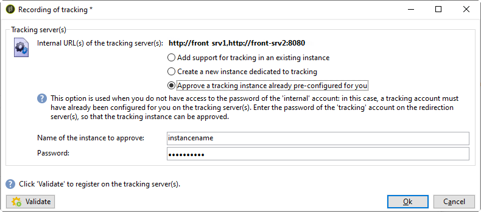

# Implantação de uma instância{#deploying-an-instance}


>[!NOTE]
>
>As configurações do lado do servidor só podem ser executadas pelo Adobe para implantações hospedadas pelo Adobe. Para saber mais sobre as diferentes implantações, consulte a seção [Modelos de hospedagem](../../installation/using/hosting-models.md) ou [esta página](../../installation/using/capability-matrix.md).

## Assistente de implantação {#deployment-wizard}

Um assistente gráfico, disponível no console do cliente Adobe Campaign, permite definir os parâmetros da instância à qual você se conectará.

Para iniciar o assistente de implantação, selecione **Tools > Advanced > Deployment wizard**.


As etapas de configuração são as seguintes:

1. [Parâmetros gerais](#general-parameters)
1. [Parâmetros de canal de email](#email-channel-parameters)
1. [Gestão de emails devolvidos](#managing-bounced-emails)
1. [Configuração de rastreamento](#tracking-configuration)
1. [Parâmetros de canal móvel](#mobile-channel-parameters)
1. [Configurações regionais](#regional-settings)
1. [Acesso através da Internet](#access-from-the-internet)
1. [Gestão dos recursos públicos](#managing-public-resources)
1. [Limpeza de dados](#purging-data)

## Parâmetros gerais {#general-parameters}

A primeira etapa do assistente de implantação permite inserir informações gerais na instância.


### Informações gerais {#general-information}

A seção inferior da janela permite selecionar as opções a serem ativadas.

* **[!UICONTROL Customer identifier used in billing]** : pode ser o nome da instância e o número da versão.
* **[!UICONTROL Common name of the customer]** : Insira uma sequência de caracteres com o nome da empresa. Essas informações podem ser usadas nos links de unsubscription.
* **[!UICONTROL Namespace]** : Insira um identificador curto em minúsculas. O objetivo é distinguir entre sua configuração específica e a configuração de fábrica no caso de uma atualização. O namespace padrão é **cus** - para cliente.

### Opções técnicas {#technical-options}

A seção inferior da janela permite selecionar as opções a serem ativadas.

As seguintes opções estão disponíveis:

* **[!UICONTROL Email channel]** : para ativar o delivery de email. Consulte [Parâmetros do canal de email](#email-channel-parameters).
* **[!UICONTROL Tracking]** : Para ativar o rastreamento da população do target (aberturas e cliques). Consulte [Configuração de rastreamento](#tracking-configuration).
* **[!UICONTROL Managing bounced emails]** : Para definir a conta POP usada para coletar emails recebidos. Consulte [Gerenciamento de emails devolvidos](#managing-bounced-emails).
* **[!UICONTROL LDAP integration]** : Para configurar a autenticação do usuário por meio de um diretório LDAP. Consulte [Conexão por meio do LDAP](../../installation/using/connecting-through-ldap.md).

## Parâmetros de canal de email {#email-channel-parameters}

A etapa a seguir permite definir as informações a serem exibidas nos cabeçalhos da mensagem.

Esses parâmetros podem ser sobrecarregados nos templates do delivery e individualmente para cada delivery (se os usuários tiverem os direitos necessários).

### Parâmetros para emails entregues {#parameters-for-delivered-emails}


Indique os seguintes parâmetros:

* **[!UICONTROL Sender name]** : Nome do remetente,
* **[!UICONTROL Sender address]** : O endereço do remetente,
* **[!UICONTROL Reply address text]** : O nome, que é personalizável, que será usado quando o recipient clicar no  **[!UICONTROL Reply]** botão em seu software cliente de email,
* **[!UICONTROL Reply address]** : O endereço de email a ser usado quando o recipient clicar no  **[!UICONTROL Reply]** botão em seu software de cliente de email,
* **[!UICONTROL Error address]** : Endereço de email de mensagens com erros. Esse é o endereço técnico usado para lidar com emails de devolução, incluindo emails recebidos pelo servidor do Adobe Campaign devido a endereços de destino inexistentes.

Além disso, você pode especificar as **máscaras** autorizadas para o endereço do remetente e o endereço de erro. Se necessário, essas máscaras podem ser separadas usando vírgulas. Essa configuração é opcional. Quando os campos são inseridos, o Adobe Campaign verifica no momento do delivery (durante a análise, se o endereço não inclui nenhuma variável) se os endereços são válidos. Esse modo operacional garante que não sejam usados endereços que possam causar problemas de delivery. Os endereços de delivery devem ser configurados no servidor de delivery.

### Caracteres autorizados em endereços {#characters-authorized-in-addresses}

<!--This window enables you to define, for all email campaigns, the delivery and address-quality management options.-->

No banco de dados do Adobe Campaign, todos os endereços de email devem ser criados da seguinte maneira: `x@y.z`. Os caracteres **x**, **y** e **z** não devem estar vazios e não devem incluir caracteres não autorizados.

Você pode definir aqui os caracteres autorizados (&#39;política de dados&#39;) no campo de email do banco de dados. Os caracteres não incluídos na lista serão proibidos e, portanto, recusados ao inserir informações no banco de dados por meio da interface, por meio de um formulário web e também ao importar dados.

Há duas listas disponíveis: **Apenas europeu** ou **Apenas EUA**. Outros caracteres podem ser adicionados, se necessário.

### Parâmetros de entrega {#delivery-parameters}

Os **Parâmetros avançados...O link** permite acessar opções de entrega, parâmetros vinculados a tentativas e quarentenas.


Essa janela permite definir, para todas as campanhas de email, as opções de gerenciamento de qualidade de delivery e endereço.

As seguintes opções estão disponíveis:

* **[!UICONTROL Delivery duration of messages]** : Além desse tempo, o delivery é interrompido (por padrão, 5 dias),
* **[!UICONTROL Online resources validity duration]** : Tempo para o qual as informações do perfil do recipient são mantidas para gerar mirror pages,
* **[!UICONTROL Exclude recipients who no longer wish to be contacted]** : Quando essa opção é selecionada, os recipients lista de bloqueios não serão contatados,
* **[!UICONTROL Automatically ignore doubles]** : Quando essa opção é selecionada, o delivery não será feito para duplicar endereços.

### Parâmetros de nova tentativa {#retry-parameters}

As informações sobre as recuperações são fornecidas nos campos **Recuperação de períodos** e **Número de recuperações**: quando um recipient está inacessível, por exemplo, se sua caixa de entrada estiver cheia, por padrão, o programa tentará entrar em contato com ele 5 vezes, com um intervalo de uma hora entre cada tentativa (durante o tempo máximo de delivery). Esses valores podem ser alterados para atender às suas necessidades.

### Parâmetros de quarentena {#quarantine-parameters}

As opções de configuração para quarentenas são as seguintes:

* **[!UICONTROL Duration between two significant errors]** : insira um valor (&quot;1d&quot; por padrão: 1 dia) para definir o tempo que o aplicativo aguarda antes de incrementar o contador de erros em caso de falha,
* **[!UICONTROL Maximum number of errors before quarantine]** : quando esse valor é atingido, o endereço de email é colocado em quarentena (por padrão, &quot;5&quot;: o endereço será colocado em quarentena no sexto erro). Isso significa que o contato será automaticamente excluído dos próximos deliveries.

## Gestão de emails devolvidos {#managing-bounced-emails}

O email de devolução é extremamente importante para qualificar erros de delivery. Esses erros são categorizados no NP@I depois que as regras determinarem sua causa.

Esta etapa só estará disponível se as opções de gerenciamento **Email channel** e **Bounce mail** estiverem selecionadas na primeira etapa do assistente de implantação. Consulte [Parâmetros gerais](#general-parameters).

Esse estágio permite definir configurações para gerenciar emails de devolução.


### Conta POP usada para recuperar emails recebidos {#pop-account-used-to-retrieve-incoming-mails}

Indique os parâmetros a serem conectados à conta para recuperar emails recebidos.

* **[!UICONTROL Label]** : Nome que inclui todos os parâmetros fornecidos a seguir,
* **[!UICONTROL Server]** : Servidor usado para recuperar email de devolução (email de entrada),
* **[!UICONTROL Security]** : Se necessário, selecione  **[!UICONTROL SSL]** na lista suspensa ,
* **[!UICONTROL Port]** : porta do servidor (geralmente 110),
* **[!UICONTROL Account]** : Nome da conta usada para emails de devolução,
* **[!UICONTROL Password]** : Senha associada à conta.

Depois que as configurações de POP forem especificadas, clique em **Test** para verificar se estão corretas.

### Emails de devolução não processados {#unprocessed-bounce-mails}

As rejeições são feitas automaticamente pelo Adobe Campaign, aplicando as regras listadas no nó **Administration > Campaign Management > Non deliverables Management > Delivery log qualification** . Para obter mais informações, consulte [Bounce mail management](../../delivery/using/understanding-delivery-failures.md#bounce-mail-management).

As rejeições não processadas não são exibidas na interface do Adobe Campaign. Eles são excluídos automaticamente, a menos que sejam transferidos para uma caixa de entrada de terceiros usando os seguintes campos:

* **[!UICONTROL Forwarding address]** : Preencha este campo para transferir para um endereço de terceiros todas as mensagens de erro (processadas ou não processadas ) coletadas pela plataforma Adobe Campaign.
* **[!UICONTROL Address for errors]** : Preencha este campo para transferir para um endereço de terceiros apenas as mensagens de erro que o processo inMail não pôde qualificar.
* **[!UICONTROL SMTP server]** : Servidor usado para enviar emails de devolução não processados.

>[!IMPORTANT]
>
>Para encaminhar emails de devolução não processados, o Adobe recomenda preencher apenas o campo **[!UICONTROL Address for errors]**. No entanto, verifique se o endereço usado é verificado regularmente, pois isso pode colocar uma carga pesada em seu servidor de email. Entre em contato com o executivo da sua conta para obter mais informações.

## Configuração de rastreamento {#tracking-configuration}

A próxima etapa permite configurar o rastreamento para a instância. A instância deve ser declarada e registrada com os servidores de rastreamento.

Esta etapa só é oferecida quando as opções **Email channel** e **Tracking** são selecionadas na primeira página do assistente de implantação. Consulte [Parâmetros gerais](#general-parameters).

Para obter informações mais detalhadas sobre o rastreamento Web (modo de rastreamento, criação e inserção de tags...), consulte [este documento](../../configuration/using/about-web-tracking.md).

### Princípio operacional {#operating-principle}

Ao ativar o rastreamento em uma instância, os URLs nos deliveries são alterados durante o envio para ativar o rastreamento.

* As informações sobre URLs externas (seguras ou não) inseridas nesta página do assistente de implantação são usadas para criar o novo URL. Além dessas informações, o link modificado contém: os identificadores do delivery, o recipient e o URL.

   As informações de rastreamento são coletadas pela Adobe Campaign no(s) servidor(es) de rastreamento para enriquecer os perfis do recipient e os dados vinculados ao delivery (guias **[!UICONTROL Tracking]** ).

   As informações sobre URLs internos são usadas somente pelo servidor de aplicativos do Adobe Campaign para entrar em contato com o(s) servidor(es) de rastreamento.

   Para obter mais informações, consulte [Servidor de rastreamento](#tracking-server).

* Depois que os URLs forem configurados, é necessário ativar o rastreamento. Para fazer isso, a instância deve ser registrada no(s) servidor(es) de rastreamento.

   Para obter mais informações, consulte [Salvar rastreamento](#saving-tracking).

### Servidor de rastreamento {#tracking-server}


Para garantir a eficiência do rastreamento nessa instância, as seguintes informações devem ser exibidas:
<!--With Mid-sourcing architecture, you can externalize tracking management. To do this:-->

* **[!UICONTROL External URL]** e/ou  **[!UICONTROL Secure external URL]** : Insira a URL de redirecionamento a ser usada no email a ser enviado.
* **[!UICONTROL Internal URL(s)]** : Os URLs usados somente pelo servidor do Adobe Campaign para entrar em contato com os servidores de rastreamento para coletar logs e fazer upload dos URLs. Não é necessário associá-lo à instância.

   Se você não especificar um URL, o URL de rastreamento será usado por padrão.

Com a arquitetura Mid-sourcing, você pode externalizar o gerenciamento de rastreamento. Para fazer isso:

1. Selecione a opção **[!UICONTROL Externalize tracking management]** : isso permite usar um servidor mid-sourcing como um servidor de rastreamento.
1. Preencha os campos **[!UICONTROL External account]** e **[!UICONTROL Instance name]** para se conectar ao servidor mid-sourcing.

   Para obter mais informações, consulte [Servidor Mid-sourcing](../../installation/using/mid-sourcing-server.md).

1. Clique no botão **[!UICONTROL Enable the tracking instance]** para aprovar a conexão com o servidor.

   

### Salvar o rastreamento {#saving-tracking}

Depois que os URLs forem preenchidos, você deverá registrar o servidor de rastreamento.

Clique no link **Registration on the tracking server(s)** e selecione uma das opções disponíveis.


Há três tipos possíveis de arquitetura para implementar o rastreamento:

1. **Adicionar suporte para rastreamento em uma instância existente**

   Essa opção se aplica se a instância já tiver sido criada para outras necessidades (servidor MTA, etc.) em servidores que serão usados como servidores de rastreamento.

   

   Insira a senha da conta **internal** no(s) servidor(es) de redirecionamento para configurar a instância de rastreamento.

   >[!NOTE]
   >
   >Se vários servidores de rastreamento forem usados, todos deverão usar o mesmo nome e senha.

   Especifique o nome da instância e a senha.

1. **Criar uma nova instância dedicada ao rastreamento**

   Essa opção é útil quando instâncias de rastreamento são reservadas para rastreamento e não têm outros módulos de aplicativo.

   

   Insira a senha da conta **internal** no(s) servidor(es) de redirecionamento para configurar a instância de rastreamento.

   >[!NOTE]
   >
   >Se vários servidores de rastreamento estiverem configurados, todos deverão usar a mesma senha.

   Especifique o nome da instância, a senha e quaisquer máscaras de DNS associadas, como **[!UICONTROL Campaign*]**.

1. **Validar uma instância de rastreamento já pré-configurada para você**

   Essa opção é usada quando você não tem a senha para a conta **internal** ; Nesse caso, uma conta de rastreamento é pré-configurada para você no(s) servidor(es) de rastreamento. Insira a senha da conta de rastreamento do(s) servidor(es) de redirecionamento para validar a instância de rastreamento.

   

   Especifique o nome da instância a ser validada.

Clique em **Aprovar** para iniciar o processo de gravação com o servidor de rastreamento.

De volta à janela anterior, uma mensagem confirma o registro no nível do servidor de rastreamento:


Os parâmetros vinculados às pesquisas de URL **não devem ser modificados** para uma instalação padrão. Para todos os outros parâmetros, entre em contato com o Adobe.

## Parâmetros de canal móvel {#mobile-channel-parameters}

A próxima etapa permite definir configurações padrão para deliveries a dispositivos móveis (SMS e Push WAP).

>[!NOTE]
>
>O canal móvel é opcional: esse estágio só aparecerá se tiver sido comprado. Verifique o contrato de licença.


### Conta padrão para delivery de SMS {#default-account-for-sms-delivery}

Insira a seguinte informação:

* **[!UICONTROL Label]** : Insira um nome para esta conta de push de SMS/Wap. Por exemplo, você pode desejar usar o nome do roteador.
* Para os campos **[!UICONTROL Server]**, **[!UICONTROL Port]**, **[!UICONTROL Account]**, **[!UICONTROL Password]**, **[!UICONTROL Connector]**, **[!UICONTROL Send Endpoint]**, **[!UICONTROL Reception Endpoint]**, **[!UICONTROL Notification Endpoint]**: Entre em contato com seu provedor de serviços para obter as configurações necessárias.

### Parâmetros do SMS enviado {#parameters-of-sms-sent}

Na lista suspensa **Priority**: Selecione &quot;Normal&quot;, &quot;Alto&quot; ou &quot;Urgente&quot; para aplicá-lo às mensagens a serem enviadas.

### Parâmetros avançados {#advanced-parameters}

Os **Parâmetros avançados...O link** permite acessar as opções de nova tentativa e quarentena.


As informações sobre tentativas estão disponíveis nos campos **Period of retries** e **Number of retries**: Quando um dispositivo móvel está inacessível, por padrão, o programa tentará novamente 5 vezes em intervalos de pelo menos 15 minutos (para o período máximo de entrega). Esses valores podem ser adaptados às suas necessidades.

As opções de configuração para quarentenas são as seguintes:

* **[!UICONTROL Time between two significant errors]** : Insira um valor padrão (por padrão, &quot;1d&quot;: dia) para definir o tempo que o aplicativo aguarda antes de incrementar o contador de erros para ocorrer uma falha.
* **[!UICONTROL Maximum number of errors before quarantine]** : Depois que esse valor é alcançado, o número do celular é colocado em quarentena (por padrão, &quot;5&quot;: o número será colocado em quarentena no sexto erro). Isso significa que o contato será excluído automaticamente de deliveries futuros.

## Configurações regionais {#regional-settings}

Esse estágio permite incluir as preferências da política de dados.


* **[!UICONTROL Consider all phone numbers as international ones]** : Quando essa opção é selecionada, o aplicativo aplica o formato internacional a números de telefone (o prefixo do país é obrigatório, pois o número de dígitos não será verificado antes de aplicar a formatação). Se esta opção não estiver selecionada, você deve colocar o prefixo do número de telefone internacional com &quot;+&quot; ou &quot;00&quot; sozinho.
* **[!UICONTROL Store all phone numbers using the international format]** : Essa opção só diz respeito aos números de  **** telefones domésticos que são importados ou editados. Defina se deseja usar um formato interno (como 425 555 0150) ou o formato internacional (por exemplo, +1 425 555 0150)

## Acesso através da Internet {#access-from-the-internet}

>[!IMPORTANT]
>
>Por motivos de privacidade, recomendamos usar HTTPS para todos os recursos externos.

Essa etapa permite definir URLs de acesso para páginas do Adobe Campaign expostas na Internet.

Você também deve indicar aqui as opções de publicação vinculadas aos formulários web.


### Servidores expostos na Web {#servers-exposed-on-the-web}

Use esta página para preencher os URLs do servidor para:

1. Acesse o servidor de aplicativos exposto na Internet: formulários de assinatura/unsubscription, extranet etc.
1. Acesse o servidor de aplicativos para obter recursos não expostos na Web: formulários, intranet, páginas de confirmação.
1. Acesse as mirror pages dos deliveries.

   Uma mirror page é uma página dinâmica que exibe o conteúdo do email. Ele é acessado por um link inserido na mensagem enviada ao recipient e pode conter elementos personalizados. A mirror page dá ao recipient a possibilidade de ler a mensagem em um navegador de Internet em vez do software de email, independentemente do formato de delivery (texto ou HTML). No entanto, as mirror pages só são geradas para um determinado delivery se o conteúdo HTML necessário tiver sido definido.

O Adobe Campaign permite diferenciar esses três URLs para espalhar a carga em várias plataformas.

## Gestão dos recursos públicos {#managing-public-resources}

>[!IMPORTANT]
>
>Por motivos de privacidade, recomendamos usar HTTPS para todos os recursos externos.

Para serem vistas de fora, as imagens usadas em e-mails e recursos públicos vinculados a campanhas devem estar presentes em um servidor acessível externamente. Eles podem então estar disponíveis para recipients ou operadores externos.


Para esta etapa, você precisa inserir:

1. O novo URL de recurso público. Para obter mais informações, consulte a seção [URL de recursos públicos](#public-resources-url) .
1. O modo de detecção de imagem em um delivery. Para obter mais informações, consulte a seção [Detecção de imagem de delivery](#delivery-image-detection) .
1. Opções de publicação. Para obter mais informações, consulte a seção [Publication modes](#publication-modes) .

Os recursos públicos podem ser acessados por meio do nó **Administration > Resources > Online > Public resources** da árvore do Adobe Campaign. Eles são coletados em uma biblioteca e podem ser incluídos em e-mails, mas também usados em campanhas ou tarefas, e na gestão de conteúdo.


### URL de recursos públicos {#public-resources-url}

O primeiro campo permite especificar o início do URL usado para os recursos após o upload. Ao serem carregados, os recursos são acessíveis por meio desse novo URL.

Em um delivery, você pode usar imagens armazenadas na biblioteca de recursos públicos ou qualquer outra imagem ou imagem local armazenada em um servidor.

* Para imagens de email, o URL **https://** server **/res/img**.

   Esse valor pode ser substituído para cada delivery.

* Para recursos públicos, o URL **https://** server **/res/** instance ****onde **instance**é o nome da instância de rastreamento.

### Detecção de imagem de delivery {#delivery-image-detection}

Em um delivery, você pode usar imagens armazenadas na biblioteca de recursos públicos ou qualquer outra imagem ou imagem local armazenada em um servidor.

O campo **URL masks** permite especificar a lista de máscaras de URL a serem ignoradas ao carregar imagens automaticamente. Por exemplo, se você usar imagens armazenadas em um site acessível externamente, principalmente em um site da Internet, poderá inserir o URL do site nesse campo.


Você pode especificar várias máscaras de URL usando uma vírgula para separar cada uma delas.

* Para obter informações sobre o uso e o gerenciamento de imagens em emails, consulte [esta seção](../../delivery/using/defining-the-email-content.md#adding-images).
* No assistente do delivery, as imagens chamadas desses URLs terão o status &quot;Ignorado&quot;.

### Modos de publicação {#publication-modes}

A seção inferior do assistente permite selecionar as opções de publicação de recursos públicos e imagens.

Os seguintes modos de publicação estão disponíveis:

* Servidor(es) de rastreamento

   Os recursos serão copiados automaticamente para os diferentes servidores de rastreamento. Eles são configurados na etapa [Configuração de rastreamento](#tracking-configuration).

* Outros servidores da Adobe Campaign

   Você pode usar mais um servidor da Adobe Campaign em que os recursos serão copiados.

   No lado do servidor, para usar um servidor Adobe Campaign dedicado, você deve criar uma nova instância com o seguinte comando:

   ```
   nlserver config -addtrackinginstance:<trackingA>/<trackingA*>
   ```

   Em seguida, digite a senha.

   Os parâmetros do(s) servidor(es) dedicado(s) são fornecidos nos campos **[!UICONTROL Media URL(s)]**, **[!UICONTROL Password]** e **[!UICONTROL Instance name]**.

   

* Script de publicação manual (somente para recursos públicos)

   

   Você pode publicar as imagens usando um script:

   * Você deve criar este script: Seu conteúdo depende da sua configuração.
   * O script será chamado pelo seguinte comando:

      ```
      [INSTALL]/copyToFrontal.vbs "$(XTK_INSTALL_DIR)\var\<instance>\upload\" "img1,img2,img3"
      ```

      onde `[INSTALL]` é o caminho de acesso para a pasta de instalação do Adobe Campaign.

   * No Unix, verifique se o script é executável.

Para imagens, ele deve copiá-las da pasta &quot;images&quot; especificada por meio da opção **NmsDelivery_ImageSubDirectory** para um ou mais servidores frontais. Esses servidores armazenarão as imagens para torná-las acessíveis por meio do novo URL configurado.

No caso de publicação em um servidor Adobe Campaign sem um script de publicação manual, por padrão, as imagens de um delivery são armazenadas no `$(XTK_INSTALL_DIR)/var/res/img/ directory`. O URL correspondente é o seguinte: **`https://server/res/img`**.

`XTK_INSTALL_DIR)/var/res/$(INSTANCE_NAME)`. O URL correspondente é o seguinte: **`https://server/res/instance`** onde instância é o nome da instância de rastreamento.

>[!NOTE]
>
>É possível alterar o diretório de armazenamento de recursos públicos. Para obter mais informações, consulte [Gerenciamento de recursos públicos](#managing-public-resources).

### Sincronização de recursos públicos {#synchronizing-public-resources}

Essa funcionalidade permite **sincronizar recursos públicos** em vários servidores sobressalentes.

Se um recurso público não estiver presente no servidor de rastreamento ou se o recurso retornar um erro 404, o servidor de rastreamento tentará localizar o recurso em um dos servidores sobressalentes.

A declaração e a configuração de servidores sobressalentes devem ser feitas no arquivo **serverConf.xml** do servidor de marketing. Todos os parâmetros disponíveis no **serverConf.xml** são listados nesta [seção](../../installation/using/the-server-configuration-file.md).

**Declaração**

```
<redirection>
<spareServer enabledIf="" id="" url=""/>
</redirection>
```

**Configuração**

Para cada recurso público que deve ser sincronizado, é necessário adicionar um atributo de status ao elemento `<url>` na parte `<relay>`:

O atributo de status pode ser um dos três valores:

* sobressalente: O recurso público é sincronizado

* normal: Comportamento existente (sem sincronização)

* blacklist: O URL é adicionado à  de lista de bloqueios se retornar um erro 404. A duração (em segundos) do URL que está na  de lista de bloqueios é definida por um atributo **timeout** cujo valor padrão é 60s.

A configuração pronta para uso da sincronização é:

```
(extracted from the serverConf.xml file)

<redirection P3PCompactPolicy="CAO DSP COR CURa DEVa TAIa OUR BUS IND UNI COM NAV"
databaseId="" defLogCount="30" expirationURL="" maxJobsInCache="100"
startRedirection="true" startRedirectionInModule="true" trackWebVisitors="false" trackingPassword="">
<spareServer enabledIf="" id="1" url=""/>
</redirection>

....


<relay debugRelay="false" forbiddenCharsInAuthority="?#.@/:" forbiddenCharsInPath="?#/"
           modDir="index.html" startRelay="false" startRelayInModule="true" timeout="60">
   <url IPMask="" deny="" hostMask="" relayHost="true" relayPath="true" status="normal" targetUrl="https://localhost:8080" timeout="" urlPath="/view/*"/>
      <url IPMask="" deny="" hostMask="" relayHost="true" relayPath="true" status="blacklist" targetUrl="https://localhost:8080" timeout="" urlPath="*.jsp"/>
      <url IPMask="" deny="" hostMask="" relayHost="true" relayPath="true" status="blacklist" targetUrl="https://localhost:8080" timeout="" urlPath="*.jssp"/>
      <url IPMask="" deny="" hostMask="" relayHost="true" relayPath="true" status="blacklist" targetUrl="https://localhost:8080" timeout="" urlPath="/webApp/*"/>
      <url IPMask="" deny="" hostMask="" relayHost="true" relayPath="true" status="blacklist" targetUrl="https://localhost:8080" timeout="" urlPath="/report/*"/>
      <url IPMask="" deny="" hostMask="" relayHost="true" relayPath="true" status="blacklist" targetUrl="https://localhost:8080" timeout="" urlPath="/jssp/*"/>
      <url IPMask="" deny="" hostMask="" relayHost="true" relayPath="true" status="normal" targetUrl="https://localhost:8080" timeout="" urlPath="/strings/*"/>
      <url IPMask="" deny="" hostMask="" relayHost="true" relayPath="true" status="normal" targetUrl="https://localhost:8080" timeout="" urlPath="/interaction/*"/>
      <url IPMask="" deny="" hostMask="" relayHost="true" relayPath="true" status="normal" targetUrl="https://localhost:8080" timeout="" urlPath="/barcode/*"/>

      <url IPMask="" deny="" hostMask="" relayHost="false" relayPath="false" status="spare" targetUrl="" timeout="" urlPath="/favicon.*"/>
      <url IPMask="" deny="" hostMask="" relayHost="false" relayPath="false" status="spare" targetUrl="" timeout="" urlPath="/*.html"/>
      <url IPMask="" deny="" hostMask="" relayHost="false" relayPath="false" status="spare" targetUrl="" timeout="" urlPath="/*.png"/>
      <url IPMask="" deny="" hostMask="" relayHost="false" relayPath="false" status="spare" targetUrl="" timeout="" urlPath="/*.jpg"/>

 </relay>
```

## Limpeza de dados {#purging-data}

A última etapa do assistente de implantação permite configurar a limpeza automática de dados obsoletos. Os valores são expressos em dias.


Os dados são excluídos automaticamente por meio do workflow de limpeza do banco de dados . Para obter mais informações sobre como configurar e operar esse workflow e detalhes sobre os itens excluídos, consulte este [documento](../../production/using/database-cleanup-workflow.md).
