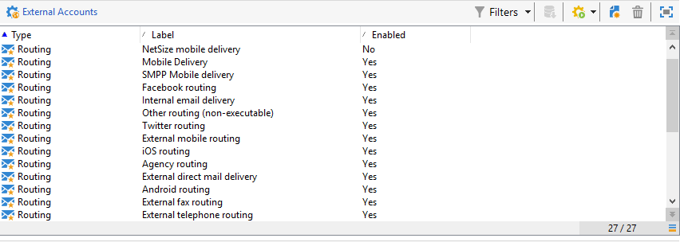

# Contas externas{#external-accounts}

O Adobe Campaign vem com um conjunto de contas externas predefinidas. Para configurar conexões com sistemas externos, é possível criar novas contas externas.

As contas externas são usadas por processos técnicos, como workflows técnicos ou workflows da campanha. Ao configurar uma transferência de arquivos em um workflow ou uma troca de dados com qualquer outro aplicativo (Adobe Target, Experience Manager etc.), você precisa selecionar uma conta externa.

Você pode configurar os seguintes tipos de contas externas:

* [Conta externa de roteamento](#routing-external-account)
* [Conta externa FTP](#ftp-external-account)
* [Conta externa do banco de dados externo](#external-database-external-account)
* [Conta externa do Web Analytics](#web-analytics-external-account)
* [Conta externa de conexão do Facebook](#facebook-connect-external-account)
* [Conta externa da instância de execução](#execution-instance-external-account)
* [Conta externa da Adobe Experience Cloud.](#adobe-experience-cloud-external-account)
* [Conta externa SFTP](#sftp-external-account)
* [Conta externa do Adobe Experience Manager.](#adobe-experience-manager-external-account)
* [Conta externa do Serviço de Armazenamento Simples da Amazon (S3)](#amazon-simple-storage-service--s3--external-account)
* [Conta externa do Microsoft Dynamics CRM](#microsoft-dynamics-crm-external-account)
* [Conta externa da Oracle On Demand](#oracle-on-demand-external-account)
* [Conta externa do Salesforce CRM](#salesforce-crm-external-account)

## Criação de uma conta externa {#creating-an-external-account}

Para criar uma nova conta externa, siga as etapas abaixo. As configurações detalhadas dependem do tipo de conta externa.

1. Na Campanha **[!UICONTROL Explorer]**, selecione **[!UICONTROL Administration]** &#39;>&#39; **[!UICONTROL Platform]** &#39;>&#39; **[!UICONTROL External accounts]**.

   

1. Clique no botão **[!UICONTROL New]**.

   

1. Enter a **[!UICONTROL Label]** and an **[!UICONTROL Internal Name]**.
1. Selecione a conta externa **[!UICONTROL Type]** que deve ser criada.
1. Configure o acesso à conta especificando credenciais dependendo do tipo escolhido da conta externa.

   As informações necessárias geralmente são fornecidas pelo provedor do servidor ao qual você está se conectando.

1. Marque a **[!UICONTROL Enabled]** opção para ativar a conexão.
1. Clique em **[!UICONTROL Save]**.

A conta externa é criada e adicionada à lista de contas externas.

## Conta externa de emails devolvidos {#bounce-mails-external-account}

A conta externa de **Bounce mails** especifica a conta POP3 externa a ser usada para se conectar ao serviço de email. Para obter mais informações sobre essa conta externa, consulte esta [página](../../workflow/using/inbound-emails.md).

Todos os servidores configurados para acesso POP3 podem ser usados para receber emails de retorno.


Para configurar a conta externa do **[!UICONTROL Bounce mails (defaultPopAccount)]**:

* **[!UICONTROL Server]**

   URL do servidor POP3.

* **[!UICONTROL Port]**

   Número da porta de conexão POP3. A porta padrão é 110.

* **[!UICONTROL Account]**

   Nome do usuário.

* **[!UICONTROL Password]**

   Senha da conta do usuário.

* **[!UICONTROL Encryption]**

   Tipo de criptografia escolhida entre **[!UICONTROL By default]**, **[!UICONTROL POP3 + STARTTLS]**, **[!UICONTROL POP3]** ou **[!UICONTROL POP3S]**.

## Conta externa de roteamento {#routing-external-account}

A conta externa **[!UICONTROL Routing]** permite configurar cada canal disponível no Adobe Campaign, dependendo dos pacotes instalados.



Os seguintes canais podem ser configurados:

* [Email](../../installation/using/deploying-an-instance.md#email-channel-parameters)
* [Móvel (SMS)](../../delivery/using/sms-channel.md#creating-an-smpp-external-account)
* [Telefone](../../delivery/using/steps-about-delivery-creation-steps.md#other-channels)
* [Correspondência direta](../../delivery/using/about-direct-mail-channel.md)
* [Agência](../../delivery/using/steps-about-delivery-creation-steps.md#other-channels)
* [Facebook](../../social/using/publishing-on-facebook-walls.md#delegating-write-access-to-adobe-campaign)
* [Twitter](../../social/using/configuring-publishing-on-twitter.md)
* [Canal iOS](../../delivery/using/configuring-the-mobile-application.md)
* [Canal Android](../../delivery/using/configuring-the-mobile-application-android.md)

## Conta externa FTP {#ftp-external-account}

A conta externa FTP permite configurar e testar o acesso a um servidor fora do Adobe Campaign. Para configurar conexões com sistemas externos, como servidores FTP 898 usados para transferências de arquivos, você pode criar suas próprias contas externas. Para obter mais informações, consulte esta [página](../../workflow/using/file-transfer.md).

Para fazer isso, especifique nesta conta externa o endereço e as credenciais usadas para estabelecer a conexão com o servidor FTP.


* **[!UICONTROL Server]**

   Nome do servidor FTP.

* **[!UICONTROL Port]**

   Número da porta de conexão FTP. A porta padrão é 21.

* **[!UICONTROL Account]**

   Nome do usuário.

* **[!UICONTROL Password]**

   Senha da conta do usuário.

* **[!UICONTROL Encryption]**

   Tipo de criptografia escolhida entre **[!UICONTROL None]** ou **[!UICONTROL SSL]**.

Para saber onde localizar essas credenciais, consulte esta [página](https://help.dreamhost.com/hc/en-us/articles/115000675027-FTP-overview-and-credentials).

## Conta externa do banco de dados externo {#external-database-external-account}

Use a conta externa de tipo de banco de dados **** Externo para se conectar a um banco de dados externo. Saiba mais sobre a opção Federated Data Acces (FDA) [nesta seção](../../installation/using/about-fda.md).

Bancos de dados externos compatíveis com a Campanha estão listados na matriz [Compatibilidade](../../rn/using/compatibility-matrix.md)


As configurações de conta externa dependem do mecanismo de banco de dados. Saiba mais nas seguintes seções:

* Configure access to [Azure Synapse](../../installation/using/configure-fda-synapse.md)
* Configure access to [Hadoop](../../installation/using/configure-fda-hadoop.md)
* Configure access to [Oracle](../../installation/using/configure-fda-oracle.md)
* Configure access to [Netezza](../../installation/using/configure-fda-netezza.md)
* Configure access to [SAP HANA](../../installation/using/configure-fda-sap-hana.md)
* Configure access to [Snowflake](../../installation/using/configure-fda-snowflake.md)
* Configure access to [Sybase IQ](../../installation/using/configure-fda-sybase.md)
* Configure access to [Teradata](../../installation/using/configure-fda-teradata.md)

## Conta externa do Web Analytics {#web-analytics-external-account}

A conta externa do **[!UICONTROL Web Analytics (Adobe Analytics - Data connector)]** permite encaminhar os dados do Adobe Analytics para o Adobe Campaign no formato de segmentos. Por outro lado, ele envia indicadores e atributos de campanhas de email entregues pelo Adobe Campaign para o Adobe Analytics – Data Connector.


Para essa conta externa, a fórmula de cálculo para as URLs rastreadas deve ser enriquecidas e a conexão entre as duas soluções deve ser aprovada. Para obter mais informações, consulte esta [página](../../platform/using/adobe-analytics-data-connector.md#step-2--create-the-external-account-in-campaign).

## Conta externa de conexão do Facebook {#facebook-connect-external-account}

A conta externa **[!UICONTROL Facebook Connect]** permite exibir conteúdo personalizado em seus aplicativos do Facebook, facilitando a aquisição de prospects por meio desta rede social.

Para cada aplicativo do Facebook, é necessário criar uma conta externa do tipo **[!UICONTROL Facebook Connect]**. Para obter mais informações, consulte esta [página](../../social/using/creating-a-facebook-application.md#configuring-external-accounts).


* **[!UICONTROL Hosting mode]**

   Modo de hospedagem do aplicativo entre **[!UICONTROL hosted by a partner]** ou **[!UICONTROL hosted by this instance]**.

* **[!UICONTROL Application ID]**

   ID do aplicativo do seu aplicativo do Facebook.

* **[!UICONTROL Application secret]**

   Segredo do aplicativo do seu aplicativo do Facebook.

Se você escolheu o modo hospedado por este modo de instância, o Secure Canvas URL precisa ser colado no campo **jogos do Facebook Web (https)** no Facebook.

Para saber onde localizar essas credenciais, consulte esta [página](https://developers.facebook.com/docs/facebook-login/access-tokens).

## Conta externa da instância de execução {#execution-instance-external-account}

Se você tiver uma arquitetura dividida, precisará especificar as instâncias de execução vinculadas à instância de controle e conectá-las. Os templates de mensagem transacional são implantados nas instâncias de execução


* **[!UICONTROL URL]**

   URL do servidor no qual a instância de execução está instalada.

* **[!UICONTROL Account]**

   O nome da conta deve corresponder ao Agente do Centro de Mensagens conforme definido na pasta do operador.

* **[!UICONTROL Password]**

   A senha da conta conforme definido na pasta do operador.

Para obter mais informações sobre essa configuração, consulte esta [página](../../message-center/using/creating-a-shared-connection.md#control-instance).

## Conta externa da Adobe Experience Cloud.{#adobe-experience-cloud-external-account}

Para se conectar ao console do Adobe Campaign por meio de uma Adobe ID, é necessário configurar a conta externa **[!UICONTROL Adobe Experience Cloud (MAC)]**.


* **[!UICONTROL IMS server]**

   URL do seu servidor IMS. Verifique se as instâncias de estágio e de produção apontam para o mesmo ponto final de produção IMS.

* **[!UICONTROL IMS scope]**

   Os escopos definidos aqui devem ser um subconjunto daqueles provisionados pelo IMS.

* **[!UICONTROL IMS client identifier]**

   ID do seu cliente IMS.

* **[!UICONTROL IMS client secret]**

   Credencial do segredo do cliente IMS.

* **[!UICONTROL Callback server]**

   URL de acesso da instância do Adobe Campaign.

* **[!UICONTROL IMS organization ID]**

   ID da sua organização IMS. Para encontrar o ID da organização, consulte esta [página](https://docs.adobe.com/content/help/pt-BR/core-services/interface/manage-users-and-products/faq.html) (**Onde encontrar a ID da organização IMS?**).

* **[!UICONTROL Association mask]**

   A sintaxe que permitirá que os nomes de configuração no Painel Enterprise sejam sincronizados com os grupos no Adobe Campaign.

* **[!UICONTROL Server]**

   URL da sua instância da Adobe Experience Cloud.

* **[!UICONTROL Tenant]**

   Nome do seu locatário do Adobe Experience Cloud.

Para obter mais informações sobre essa configuração, consulte esta [página](../../integrations/using/configuring-ims.md).

## Conta externa SFTP {#sftp-external-account}

A conta externa SFTP permite configurar e testar o acesso a um servidor fora do Adobe Campaign. Para configurar conexões com sistemas externos, como SFTP usado para transferências de arquivos, você pode criar suas próprias contas externas. Para obter mais informações, consulte esta [página](../../workflow/using/file-transfer.md).


* **[!UICONTROL Server]**

   URL do servidor SFTP.

* **[!UICONTROL Port]**

   Número da porta de conexão FTP. A porta padrão é 22.

* **[!UICONTROL Account]**

   Nome da conta usado para conectar ao servidor SFTP.

* **[!UICONTROL Password]**

   Senha usada para conectar ao servidor SFTP.

## Conta externa do Adobe Experience Manager.{#adobe-experience-manager-external-account}

A conta externa **[!UICONTROL AEM (AEM instance)]** permite gerenciar o conteúdo dos deliveries de email, assim como os formulários diretamente no Adobe Experience Manager.


* **[!UICONTROL Server]**

   URL do servidor Adobe Experience Manager.

* **[!UICONTROL Port]**

   Nome da conta usado para conectar à instância de criação do Adobe Experience Manager.

* **[!UICONTROL Password]**

   Senha usada para se conectar à instância de criação do Adobe Experience Manager.

Para obter mais informações, consulte esta [seção](../../integrations/using/about-adobe-experience-manager.md).

## Conta externa do Serviço de Armazenamento Simples da Amazon (S3){#amazon-simple-storage-service--s3--external-account}

O conector do Serviço de Armazenamento Simples da Amazon (S3) pode ser usado para importar ou exportar dados para o Adobe Campaign. Ele pode ser configurado em uma atividade de workflow. Para obter mais informações, consulte esta [página](../../workflow/using/file-transfer.md).


Como você está configurando essa nova conta externa, é necessário fornecer os seguintes detalhes:

* **[!UICONTROL AWS S3 Account Server]**

   A URL do seu servidor deve ser preenchida da seguinte maneira:

   ```
   <S3bucket name>.s3.amazonaws.com/<s3object path>
   ```

* **[!UICONTROL AWS access key ID]**

   Para saber onde encontrar a ID da chave de acesso AWS, consulte esta [página](https://docs.aws.amazon.com/general/latest/gr/aws-sec-cred-types.html#access-keys-and-secret-access-keys) .

* **[!UICONTROL Secret access key to AWS]**

   Para saber onde encontrar a chave de acesso secreta para o AWS, consulte esta [página](https://aws.amazon.com/fr/blogs/security/wheres-my-secret-access-key/).

* **[!UICONTROL AWS Region]**

   Para saber mais sobre a região do AWS, consulte esta [página](https://aws.amazon.com/about-aws/global-infrastructure/regions_az/).

* A caixa de seleção **[!UICONTROL Use server side encryption]** permite armazenar o arquivo no modo criptografado S3.

Para saber onde encontrar a ID da chave de acesso e a chave de acesso secreta, consulte a [documentação](https://docs.aws.amazon.com/general/latest/gr/aws-sec-cred-types.html#access-keys-and-secret-access-keys) do Amazon Web Services .

## Conta externa do Microsoft Dynamics CRM {#microsoft-dynamics-crm-external-account}

A conta externa **[!UICONTROL Microsoft Dynamics CRM]** permite importar e exportar os dados do Microsoft Dynamics para o Adobe Campaign.

A configuração do conector do Microsoft Dynamics para trabalhar com o Adobe Campaign depende do tipo de implantação.
Com os tipos de implantação **[!UICONTROL On-premise]** e **[!UICONTROL Office 365]**, é necessário fornecer os seguintes detalhes:


* **[!UICONTROL Account]**

   Conta usada para entrar no Microsoft CRM.

* **[!UICONTROL Server]**

   A URL do servidor Microsoft CRM.

* **[!UICONTROL Password]**

   Senha usada para entrar no Microsoft CRM.

* **[!UICONTROL Company name]** para implantação no local e no Office 365

   Nome da sua empresa.

* **[!UICONTROL Organization name]** para implantação no local

   Nome da sua organização.
Nome da organização que pode ser encontrado no painel de recursos de desenvolvedores no campo **[!UICONTROL Unique Name]** do Microsoft Dynamics.

* **[!UICONTROL CRM version]** no local

   Versão da CRM entre **[!UICONTROL Dynamics CRM 2007]**, **[!UICONTROL Dynamics CRM 2015]** ou **[!UICONTROL Dynamics CRM 2016]**.

Com o tipo de implantação **[!UICONTROL Web API]** e autenticação **[!UICONTROL Password credentials]**, é necessário fornecer os seguintes detalhes:


* **[!UICONTROL Account]**

   Conta usada para entrar no Microsoft CRM.

* **[!UICONTROL Server]**

   A URL do servidor Microsoft CRM.

* **[!UICONTROL Client identifier]**

   ID do cliente que pode ser localizado no portal de gerenciamento do Microsoft Azure na categoria **[!UICONTROL Update your code]**, no campo **[!UICONTROL Client ID]**.

* **[!UICONTROL CRM version]**

   Versão da CRM entre **[!UICONTROL Dynamics CRM 2007]**, **[!UICONTROL Dynamics CRM 2015]** ou **[!UICONTROL Dynamics CRM 2016]**.

Com o tipo de implantação **[!UICONTROL Web API]** e autenticação **[!UICONTROL Certificate]**, é necessário fornecer os seguintes detalhes:


* **[!UICONTROL Server]**

   A URL do servidor Microsoft CRM.

* **[!UICONTROL Private Key (Base64 encoded)]**

   Chave privada codificada em Base64

* **[!UICONTROL Custom Key identifier]**

* **[!UICONTROL Key ID]**

* **[!UICONTROL Client identifier]**

   ID do cliente que pode ser localizado no portal de gerenciamento do Microsoft Azure na categoria **[!UICONTROL Update your code]**, no campo **[!UICONTROL Client ID]**.

* **[!UICONTROL CRM version]**

   Versão da CRM entre **[!UICONTROL Dynamics CRM 2007]**, **[!UICONTROL Dynamics CRM 2015]** ou **[!UICONTROL Dynamics CRM 2016]**.

Para obter mais informações sobre essa configuração, consulte esta [página](../../platform/using/crm-connectors.md#example-for-microsoft-dynamics).

## Conta externa da Oracle On Demand {#oracle-on-demand-external-account}

A conta externa do **[!UICONTROL Oracle on demand]** permite importar e exportar dados Oracle para o Adobe Campaign.


Para configurar a conta externa do Oracle On Demand para funcionar com o Adobe Campaign, forneça os seguintes detalhes:

* **[!UICONTROL Account]**

   Conta usada para entrar no Oracle CRM On Demand.

* **[!UICONTROL Server]**

   URL do seu servidor Oracle CRM On Demand.

* **[!UICONTROL Password]**

   A senha usada para entrar no Oracle CRM On Demand.

Para obter mais informações sobre essa configuração, consulte esta [página](../../platform/using/crm-connectors.md#example-for-oracle-on-demand).

## Conta externa do Salesforce CRM {#salesforce-crm-external-account}

A conta externa **[!UICONTROL Salesforce CRM]** permite importar e exportar dados do Salesforce para o Adobe Campaign.


Para configurar a conta externa do Salesforce CRM para funcionar com o Adobe Campaign, você precisa fornecer os seguintes detalhes:

* **[!UICONTROL Account]**

   Conta usada para entrar no Salesforce CRM.

* **[!UICONTROL Password]**

   Senha usada para entrar no Salesforce CRM.

* **[!UICONTROL Client identifier]**

   Para saber onde encontrar o identificador do cliente, consulte esta [página](https://help.salesforce.com/articleView?id=000205876&amp;type=1).

* **[!UICONTROL Security token]**

   Para saber onde encontrar o token de segurança, consulte esta [página](https://help.salesforce.com/articleView?id=000205876&amp;type=1).

* **[!UICONTROL API version]**

   Versão da API entre **[!UICONTROL Version 37]**, **[!UICONTROL Version 21]** ou **[!UICONTROL Version 15]**.

Para essa conta externa, você precisa configurar o Salesforce CRM com o assistente de configuração.

Para obter mais informações sobre essa configuração, consulte esta [página](../../platform/using/crm-connectors.md#example-for-salesforce-com).
