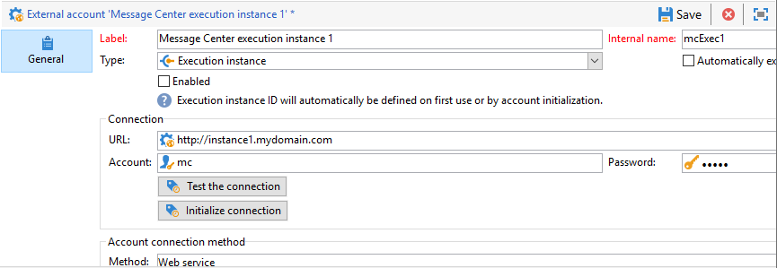

# Contas externas{#external-accounts}


O Adobe Campaign vem com um conjunto de contas externas predefinidas. Para configurar conexões com sistemas externos, você pode criar novas contas externas.

As contas externas são usadas por processos técnicos, como workflows técnicos ou workflows da campanha. Por exemplo, ao configurar uma transferência de arquivos em um workflow ou uma troca de dados com qualquer outro aplicativo (Adobe Target, Experience Manager, etc.), você precisa selecionar uma conta externa.

## Criar uma conta externa {#creating-an-external-account}

Para criar uma nova conta externa, siga as etapas abaixo. As configurações detalhadas dependem do tipo de conta externa.

1. Do Campaign **[!UICONTROL Explorer]**, selecione **[!UICONTROL Administration]** &#39;>&#39; **[!UICONTROL Platform]** &#39;>&#39; **[!UICONTROL External accounts]**.

   

1. Clique no botão **[!UICONTROL New]**.

   

1. Insira um **[!UICONTROL Label]** e uma **[!UICONTROL Internal Name]**.
1. Selecione a conta externa **[!UICONTROL Type]** que deve ser criada.
1. Configure o acesso à conta especificando credenciais dependendo do tipo escolhido da conta externa.

   As informações necessárias geralmente são fornecidas pelo provedor do servidor ao qual você está se conectando.

1. Verifique a **[!UICONTROL Enabled]** opção para ativar a conexão.
1. Clique em **[!UICONTROL Save]**.

A conta externa é criada e adicionada à lista de contas externas.

## Contas externas específicas de campanha

### Mensagens de rejeição {#bounce-mails-external-account}

A conta externa de **Bounce mails** especifica a conta POP3 externa a ser usada para se conectar ao serviço de email. Para obter mais informações sobre essa conta externa, consulte esta [página](../../workflow/using/inbound-emails.md).

Todos os servidores configurados para acesso POP3 podem ser usados para receber emails de retorno.


Para configurar a conta externa do **[!UICONTROL Bounce mails (defaultPopAccount)]**:

* **[!UICONTROL Server]**

  URL do servidor POP3.

* **[!UICONTROL Port]**

  Número da porta de conexão POP3. A porta padrão é 110.

* **[!UICONTROL Account]**

  Nome do usuário.

* **[!UICONTROL Password]**

  Senha da conta do usuário.

* **[!UICONTROL Encryption]**

  Tipo de criptografia escolhida entre **[!UICONTROL By default]**, **[!UICONTROL POP3 + STARTTLS]**, **[!UICONTROL POP3]** ou **[!UICONTROL POP3S]**.

* **[!UICONTROL Function]**

  Email de entrada ou roteador SOAP

>[!IMPORTANT]
>
>Antes de configurar sua conta externa POP3 usando o Microsoft OAuth 2.0, primeiro é necessário registrar seu aplicativo no portal do Azure. Para obter mais informações, consulte [esta página](https://docs.microsoft.com/en-us/azure/active-directory/develop/quickstart-register-app).

Para configurar um POP3 externo usando **Microsoft OAuth 2.0**, verifique a **[!UICONTROL Microsoft OAuth 2.0]** e preencha os seguintes campos:

* **[!UICONTROL Azure tenant]**

  A ID do Azure (ou a ID do diretório (locatário)) pode ser encontrada no **Fundamentos** lista suspensa da visão geral do aplicativo no portal do Azure.

* **[!UICONTROL Azure Client ID]**

  A ID do cliente (ou a ID do aplicativo (cliente)) pode ser encontrada no **Fundamentos** lista suspensa da visão geral do aplicativo no portal do Azure.

* **[!UICONTROL Azure Client secret]**

  A ID do segredo do cliente pode ser encontrada no **Segredos do cliente** coluna da **Certificados e segredos** do aplicativo no portal do Azure.

* **[!UICONTROL Azure Redirect URL]**

  O URL de redirecionamento pode ser encontrado no **Autenticação** do aplicativo no portal do Azure. Ela deve terminar com a seguinte sintaxe `nl/jsp/oauth.jsp`, por exemplo, `https://redirect.adobe.net/nl/jsp/oauth.jsp`.

Depois de inserir suas credenciais diferentes, você pode clicar em **[!UICONTROL Setup the connection]** para concluir a configuração da conta externa.

### Roteamento{#routing-external-account}

A conta externa **[!UICONTROL Routing]** permite configurar cada canal disponível no Adobe Campaign, dependendo dos pacotes instalados.


Os seguintes canais podem ser configurados:

* [Email](#email-routing-external-account)
* [Móvel (SMS)](../../delivery/using/sms-set-up.md#creating-an-smpp-external-account)
* [Telefone](../../delivery/using/steps-about-delivery-creation-steps.md#other-channels)
* [Correspondência direta](../../delivery/using/about-direct-mail-channel.md)
* [Agência](../../delivery/using/steps-about-delivery-creation-steps.md#other-channels)
* [Twitter](../../social/using/about-social-marketing.md)
* [Canal iOS](../../delivery/using/configuring-the-mobile-application.md)
* [Canal Android](../../delivery/using/configuring-the-mobile-application-android.md)

### Roteamento de email {#email-routing-external-account}

A conta externa de roteamento de email é fornecida por padrão, adaptada à sua configuração.

Como cliente local/híbrido, você pode criar novas contas externas de roteamento ou atualizar parâmetros, conforme descrito abaixo. Essa configuração é reservada para usuários especialistas e pode afetar sua capacidade de delivery. Em caso de dúvidas, entre em contato com o Atendimento ao cliente da Adobe ou com o representante da Adobe.

* Você pode usar um **Mid-sourcing**, **Externo** roteamento, ou **Em massa** tipo de roteamento de entrega.

* Para **Em massa** e **Mid-sourcing** modos de entrega, você poderá especificar seus parâmetros de marca na **Marcas** guia. Esses parâmetros são usados para substituir o [parâmetros padrão](../../installation/using/deploying-an-instance.md#email-channel-parameters) para **URL da mirror page** e **Endereço do erro** com configurações específicas à sua marca.

  

* Para configurar uma conta externa Mid-sourcing, consulte [nesta seção](mid-sourcing-server.md)

### Instância de execução  {#execution-instance-external-account}

Se você tiver uma arquitetura dividida, precisará especificar as instâncias de execução vinculadas à instância de controle e conectá-las. Os templates de mensagem transacional são implantados nas instâncias de execução.



* **[!UICONTROL URL]**

  URL do servidor no qual a instância de execução está instalada.

* **[!UICONTROL Account]**

  O nome da conta deve corresponder ao Agente do Centro de Mensagens conforme definido na pasta do operador.

* **[!UICONTROL Password]**

  A senha da conta conforme definido na pasta do operador.

Para obter mais informações sobre essa configuração, consulte esta [página](../../message-center/using/configuring-instances.md#control-instance).

## Acesso a Contas Externas de Sistemas Externos

### FTP {#ftp-external-account}

A conta externa FTP permite configurar e testar o acesso a um servidor fora do Adobe Campaign. Para configurar conexões com sistemas externos, como servidores FTP 898 usados para transferências de arquivos, você pode criar suas próprias contas externas. Para obter mais informações, consulte esta [página](../../workflow/using/file-transfer.md).

Para fazer isso, especifique nesta conta externa o endereço e as credenciais usadas para estabelecer a conexão com o servidor FTP.


* **[!UICONTROL Server]**

  Nome do servidor FTP.

* **[!UICONTROL Port]**

  Número da porta de conexão FTP. A porta padrão é 21.

* **[!UICONTROL Account]**

  Nome do usuário.

* **[!UICONTROL Password]**

  Senha da conta do usuário.

* **[!UICONTROL Encryption]**

  Tipo de criptografia escolhida entre **[!UICONTROL None]** ou **[!UICONTROL SSL]**.

Para saber onde localizar essas credenciais, consulte esta [página](https://help.dreamhost.com/hc/en-us/articles/115000675027-FTP-overview-and-credentials).

### SFTP {#sftp-external-account}

A conta externa SFTP permite configurar e testar o acesso a um servidor fora do Adobe Campaign. Para configurar conexões com sistemas externos, como SFTP usado para transferências de arquivos, você pode criar suas próprias contas externas. Para obter mais informações, consulte esta [página](../../workflow/using/file-transfer.md).


* **[!UICONTROL Server]**

  URL do servidor SFTP.

* **[!UICONTROL Port]**

  Número da porta de conexão FTP. A porta padrão é 22.

* **[!UICONTROL Account]**

  Nome da conta usado para conectar ao servidor SFTP.

* **[!UICONTROL Password]**

  Senha usada para conectar ao servidor SFTP.

Para adicionar chaves SSH no Windows:

1. Crie o **INÍCIO** com o valor definido como o diretório de instalação.

2. Adicione sua chave privada à `/$HOME/.ssh/id_rsa` pasta.

3. Reinicie os serviços do Adobe Campaign.

### Banco de dados externo (FDA) {#external-database-external-account}

Use o **Banco de dados externo** digite conta externa para se conectar a um banco de dados externo. Saiba mais sobre a opção Federated Data Access (FDA) no [nesta seção](../../installation/using/about-fda.md).

Os bancos de dados externos compatíveis com o Campaign estão listados na [Matriz de compatibilidade](../../rn/using/compatibility-matrix.md)


As definições de configuração da conta externa dependem do mecanismo de banco de dados. Saiba mais nas seguintes seções:

* Configurar acesso ao [Verticas analytics](../../installation/using/configure-fda-vertica.md)
* Configurar acesso ao [Snowflake](../../installation/using/configure-fda-snowflake.md)
* Configurar acesso ao [Google BigQuery](../../installation/using/configure-fda-google-big-query.md)
* Configurar acesso ao [Azure synapse](../../installation/using/configure-fda-synapse.md)
* Configurar acesso ao [Hadoop](../../installation/using/configure-fda-hadoop.md)
* Configurar acesso ao [Oracle](../../installation/using/configure-fda-oracle.md)
* Configurar acesso ao [Netezza](../../installation/using/configure-fda-netezza.md)
* Configurar acesso ao [SAP HANA](../../installation/using/configure-fda-sap-hana.md)
* Configurar acesso ao [Snowflake](../../installation/using/configure-fda-snowflake.md)
* Configurar acesso ao [Sybase IQ](../../installation/using/configure-fda-sybase.md)
* Configurar acesso ao [Teradata](../../installation/using/configure-fda-teradata.md)


## Contas externas de Integração de soluções do Adobe

### Adobe Experience Cloud {#adobe-experience-cloud-external-account}

Para se conectar ao console do Adobe Campaign por meio de uma Adobe ID, é necessário configurar a conta externa **[!UICONTROL Adobe Experience Cloud (MAC)]**.


* **[!UICONTROL IMS server]**

  URL do seu servidor IMS. Verifique se as instâncias de estágio e de produção apontam para o mesmo ponto final de produção IMS.

* **[!UICONTROL IMS scope]**

  Os escopos definidos aqui devem ser um subconjunto daqueles provisionados pelo IMS.

* **[!UICONTROL IMS client identifier]**

  ID do seu cliente IMS.

* **[!UICONTROL IMS client secret]**

  Credencial do segredo do cliente IMS.

* **[!UICONTROL Callback server]**

  URL de acesso da instância do Adobe Campaign.

* **[!UICONTROL IMS organization ID]**

  ID da sua organização Para encontrar o ID da organização, consulte [esta página](https://experienceleague.adobe.com/docs/core-services/interface/administration/organizations.html?lang=pt-BR){_blank}.

* **[!UICONTROL Association mask]**

  A sintaxe que permitirá que os nomes de configuração no Painel Enterprise sejam sincronizados com os grupos no Adobe Campaign.

* **[!UICONTROL Server]**

  URL da sua instância da Adobe Experience Cloud.

* **[!UICONTROL Tenant]**

  Nome do seu locatário do Adobe Experience Cloud.

Para obter mais informações sobre essa configuração, consulte [esta página](../../integrations/using/configuring-ims.md).

## Web Analytics {#web-analytics-external-account}

A conta externa do **[!UICONTROL Web Analytics]** permite encaminhar os dados do Adobe Analytics para o Adobe Campaign no formato de segmentos. Por outro lado, ele envia indicadores e atributos de campanhas de email entregues pelo Adobe Campaign para o Adobe Analytics Connector.


Para essa conta externa, a fórmula de cálculo para as URLs rastreadas deve ser enriquecidas e a conexão entre as duas soluções deve ser aprovada. Para obter mais informações, consulte esta [página](../../platform/using/adobe-analytics-connector.md#external-account-classic).

### Adobe Experience Manager {#adobe-experience-manager-external-account}

A conta externa **[!UICONTROL AEM (AEM instance)]** permite gerenciar o conteúdo dos deliveries de email, assim como os formulários diretamente no Adobe Experience Manager.


* **[!UICONTROL Server]**

  URL do servidor Adobe Experience Manager.

* **[!UICONTROL Port]**

  Nome da conta usado para conectar à instância de criação do Adobe Experience Manager.

* **[!UICONTROL Password]**

  Senha usada para se conectar à instância de criação do Adobe Experience Manager.

Para obter mais informações, consulte esta [seção](../../integrations/using/about-adobe-experience-manager.md).

## Contas Externas do Conector CRM

### Microsoft Dynamics CRM {#microsoft-dynamics-crm-external-account}

>[!NOTE]
>
> **[!UICONTROL On-premise]** e **[!UICONTROL Office 365]** os tipos de implantação do agora estão obsoletos. [Saiba mais](../../rn/using/deprecated-features.md).

A conta externa **[!UICONTROL Microsoft Dynamics CRM]** permite importar e exportar os dados do Microsoft Dynamics para o Adobe Campaign.

Saiba mais sobre o conector do Campaign - Microsoft Dynamics CRM neste [página](../../platform/using/crm-ms-dynamics.md).

Com o tipo de implantação **[!UICONTROL Web API]** e autenticação **[!UICONTROL Password credentials]**, é necessário fornecer os seguintes detalhes:


* **[!UICONTROL Account]**

  Conta usada para entrar no Microsoft CRM.

* **[!UICONTROL Server]**

  A URL do servidor Microsoft CRM.

  Para encontrar seu Microsoft CRM **[!UICONTROL Server URL]**, acesse sua conta do Microsoft Dynamics CRM e clique em **Dynamics 365** e selecione seu aplicativo. Você pode então encontrar seus **[!UICONTROL Server URL]** na barra de endereços do navegador, por exemplo, `https://myserver.crm.dynamics.com/`.

* **[!UICONTROL Client identifier]**

  ID do cliente que pode ser localizado no portal de gerenciamento do Microsoft Azure na categoria **[!UICONTROL Update your code]**, no campo **[!UICONTROL Client ID]**.

* **[!UICONTROL CRM version]**

  Escolher **[!UICONTROL Dynamics CRM 365]** Versão do CRM.

Com o tipo de implantação **[!UICONTROL Web API]** e autenticação **[!UICONTROL Certificate]**, é necessário fornecer os seguintes detalhes:


* **[!UICONTROL Server]**

  A URL do servidor Microsoft CRM.

  Para encontrar seu Microsoft CRM **[!UICONTROL Server URL]**, acesse sua conta do Microsoft Dynamics CRM e clique em **Dynamics 365** e selecione seu aplicativo. Você pode então encontrar seus **[!UICONTROL Server URL]** na barra de endereços do navegador, por exemplo, `https://myserver.crm.dynamics.com/`.

* **[!UICONTROL Private Key (Base64 encoded)]**

  Observe que a chave privada precisa ser codificada em Base64.

  Para fazer isso, você pode usar a ajuda de um codificador Base64 ou usar a linha de comando `base64 -w0 private.key` para Linux.

* **[!UICONTROL Custom Key identifier]**

* **[!UICONTROL Key ID]**

* **[!UICONTROL Client identifier]**

  ID do cliente que pode ser localizado no portal de gerenciamento do Microsoft Azure na categoria **[!UICONTROL Update your code]**, no campo **[!UICONTROL Client ID]**.

* **[!UICONTROL CRM version]**

  Versão da CRM entre **[!UICONTROL Dynamics CRM 2007]**, **[!UICONTROL Dynamics CRM 2015]** ou **[!UICONTROL Dynamics CRM 2016]**.

Para obter mais informações sobre essa configuração, consulte esta [página](../../platform/using/crm-connectors.md).

### CRM do Salesforce.com  {#salesforce-crm-external-account}

A conta externa **[!UICONTROL Salesforce CRM]** permite importar e exportar dados do Salesforce para o Adobe Campaign.


Para configurar a conta externa do Salesforce CRM para funcionar com o Adobe Campaign, você precisa fornecer os seguintes detalhes:

* **[!UICONTROL Account]**

  Conta usada para entrar no Salesforce CRM.

* **[!UICONTROL Password]**

  Senha usada para entrar no Salesforce CRM.

* **[!UICONTROL Client identifier]**

  Para saber onde encontrar o identificador do cliente, consulte esta [página](https://help.salesforce.com/articleView?id=000205876&amp;type=1).

* **[!UICONTROL Security token]**

  Para saber onde encontrar o token de segurança, consulte esta [página](https://help.salesforce.com/articleView?id=000205876&amp;type=1).

* **[!UICONTROL API version]**

  Selecione a versão da API.

Para essa conta externa, você precisa configurar o Salesforce CRM com o assistente de configuração.

Para obter mais informações sobre essa configuração, consulte esta [página](../../platform/using/crm-connectors.md).

## Contas externas de transferência de dados

### Serviço de armazenamento simples Amazon (S3) {#amazon-simple-storage-service--s3--external-account}

O conector do Serviço de Armazenamento Simples da Amazon (S3) pode ser usado para importar ou exportar dados para o Adobe Campaign. Ele pode ser configurado em uma atividade de workflow. Para obter mais informações, consulte esta [página](../../workflow/using/file-transfer.md).


Como você está configurando essa nova conta externa, é necessário fornecer os seguintes detalhes:

* **[!UICONTROL AWS S3 Account Server]**

  A URL do seu servidor deve ser preenchida da seguinte maneira:

  ```
  <S3bucket name>.s3.amazonaws.com/<s3object path>
  ```

* **[!UICONTROL AWS access key ID]**

  Para saber onde encontrar a ID da chave de acesso AWS, consulte esta [página](https://docs.aws.amazon.com/general/latest/gr/aws-sec-cred-types.html#access-keys-and-secret-access-keys) .

* **[!UICONTROL Secret access key to AWS]**

  Para saber onde encontrar a chave de acesso secreta para o AWS, consulte esta [página](https://aws.amazon.com/fr/blogs/security/wheres-my-secret-access-key/).

* **[!UICONTROL AWS Region]**

  Para saber mais sobre a região do AWS, consulte esta [página](https://aws.amazon.com/about-aws/global-infrastructure/regions_az/).

* A caixa de seleção **[!UICONTROL Use server side encryption]** permite armazenar o arquivo no modo criptografado S3.

Para saber onde encontrar a ID da chave de acesso e a chave de acesso secreta, consulte a [documentação](https://docs.aws.amazon.com/general/latest/gr/aws-sec-cred-types.html#access-keys-and-secret-access-keys) do Amazon Web Services.

### Armazenamento Azure Blob {#azure-blob-external-account}

A variável **Armazenamento Azure Blob** conta externa pode ser usada para importar ou exportar dados para o Adobe Campaign usando uma **[!UICONTROL Transfer file]** atividade de workflow. Para obter mais informações, consulte esta [seção](../../workflow/using/file-transfer.md).


Para configurar o **[!UICONTROL Azure external account]** para trabalhar com o Adobe Campaign, é necessário fornecer os seguintes detalhes:

* **[!UICONTROL Server]**

  URL do seu servidor de armazenamento Azure Blob.

* **[!UICONTROL Encryption]**

  Tipo de criptografia escolhida entre **[!UICONTROL None]** ou **[!UICONTROL SSL]**.

* **[!UICONTROL Access key]**

  Para saber onde encontrar o seu **[!UICONTROL Access key]**, consulte este [página](https://docs.microsoft.com/en-us/azure/storage/common/storage-account-keys-manage?tabs=azure-portal).
