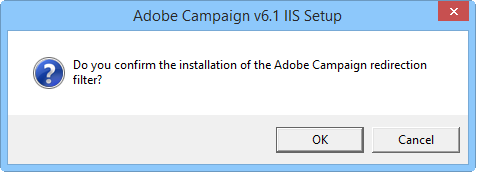
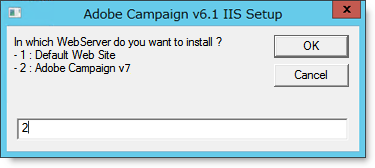
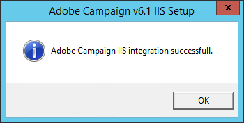

# Integração em um servidor Web para Windows{#integration-into-a-web-server-for-windows}

A Adobe Campaign inclui o Apache Tomcat, que atua como ponto de entrada no servidor de aplicativos via HTTP (e SOAP).

Você pode usar esse servidor Tomcat integrado para atender às solicitações HTTP.

Neste caso:

* a porta de escuta padrão é 8080. Para alterá-lo, consulte [Configuração do Tomcat](../../installation/using/configuring-campaign-server.md#configuring-tomcat).
* Os consoles cliente se conectam usando um URL como [https:// `<computer>`:8080](https://myserver.adobe.com:8080).

No entanto, por motivos de segurança e administração, recomendamos usar um servidor Web dedicado como o principal ponto de entrada para o tráfego HTTP quando o computador que está executando o Adobe Campaign está exposto na Internet e você deseja abrir o acesso ao console fora da rede.

Um servidor Web também permite garantir a confidencialidade dos dados com o protocolo HTTPs.

Da mesma forma, você deve usar um servidor Web quando quiser usar a funcionalidade de rastreamento, que só está disponível como um módulo de extensão de servidor Web.

>[!NOTE]
>
>Se você não usar a funcionalidade de rastreamento, poderá executar uma instalação padrão do Apache ou do IIS com um redirecionamento para a Campanha. O módulo de extensão do servidor Web de rastreamento não é necessário.

## Configuração do servidor Web IIS {#configuring-the-iis-web-server}

O procedimento de configuração de um servidor Web IIS é principalmente gráfico. Envolve o uso de um site (já criado ou pendente) para acessar os recursos do servidor Adobe Campaign: Arquivos Java (.jsp), folhas de estilo (.css, .xsl), imagens (.png), a DLL ISAPI para redirecionamento etc.

As seções a seguir detalham a configuração no IIS 7. A configuração do IIS8 é basicamente a mesma.

Se o servidor Web IIS ainda não estiver instalado no computador, você poderá instalá-lo pelo **[!UICONTROL Add > Remove Programs > Enable or disable Windows functionalities]** menu.

No IIS 7, além dos serviços padrão, é necessário instalar as extensões ISAPI e os filtros ISAPI.


### Etapas de configuração {#configuration-steps}

Aplique as seguintes etapas de configuração:

1. Abra o IIS pelo **[!UICONTROL Control panel > Administrative tools > Services]** menu.
1. Crie e configure o site (Adobe Campaign, por exemplo) dependendo dos parâmetros da sua rede (porta de conexão TCP, host DNS, endereço IP).

   

   É necessário especificar pelo menos o nome do site e o caminho de acesso para o diretório virtual. Como o caminho para acessar o diretório do site não é usado, você pode usar o seguinte diretório.

   ```
   C:\inetpub\wwwroot
   ```

   

1. Um script **VBS** permite que você configure automaticamente os recursos usados pelo servidor Adobe Campaign no diretório virtual que acabamos de criar. Para iniciá-lo, clique no duplo **is_neolane_setup.vbs** localizado na `[INSTALL]\conf` pasta, onde `[INSTALL]` é o caminho para acessar a pasta de instalação do Adobe Campaign.

   

   >[!NOTE]
   >
   >No caso de uma instalação do Windows Server 2008/IIS7, você deve estar conectado como administrador para executar o script VBS ou executar o script como administrador.

   Clique **[!UICONTROL OK]** se o servidor Web for usado como um servidor de redirecionamento de rastreamento, caso contrário, clique em **[!UICONTROL Cancel]**.

   Quando vários sites já estiverem configurados no servidor Web, uma página intermediária será exibida para especificar a qual site a instalação se aplica: insira o número vinculado ao site e clique em **[!UICONTROL OK]**.

   

   Uma mensagem de confirmação deve ser exibida:

   

1. Na **[!UICONTROL Content View]** guia, verifique se o site está configurado corretamente com os recursos da Adobe Campaign:

   

   Se a árvore não for exibida, reinicie o IIS.

### Gerenciamento de direitos {#managing-rights}

Em seguida, você deve definir as configurações de segurança para a DLL ISAPI e para os recursos no diretório de instalação do Adobe Campaign.

Para fazer isso, siga as etapas abaixo:

1. Selecione a **[!UICONTROL Features View]** guia e clique com o duplo no link **Autenticação** .

   

1. Na guia Segurança **do** diretório do site, verifique se o acesso anônimo está ativado. Se necessário, clique no **[!UICONTROL Edit]** link para alterar as configurações.

   

### Iniciar o servidor Web e testar a configuração {#launching-the-web-server-and-testing-the-configuration}

Agora você deve testar se a configuração está correta.

Para isso, execute o seguinte procedimento:

1. Reinicie o servidor IIS usando a linha de comando **iisreset** .
1. Teste o módulo de rastreamento inserindo o seguinte URL em um navegador da Web:

   ```
   https://<computer>/r/test
   ```

   O navegador deve exibir a seguinte resposta:

   ```
   <redir status='OK' date='YYYY/MM/DD HH:MM:SS' build='XXXX' host='myserver.mydomain.com' localHost='localhost'/>
   ```

Para testar a presença do módulo de redirecionamento, execute a seguinte linha de comando:

```
nlserver pdump
```

Deve apresentar as seguintes informações:

```
12:00:33 >   Application server for Adobe Campaign Classic (7.X YY.R build XXX@SHA1) of DD/MM/YYYY
webmdl@default (1644) - 18.2 Mo
```

Você também pode verificar se a DLL ISAPI está carregada corretamente.

Para fazer isso, siga as etapas abaixo:

1. Edite os filtros ISAPI do site da Adobe Campaign clicando no **[!UICONTROL Driver mapping]** ícone.
1. Verifique o conteúdo do filtro ISAPI:

   

## Configurações adicionais {#additional-configurations}

### Alteração do limite de tamanho do arquivo de upload {#changing-the-upload-file-size-limit}

Ao configurar o servidor Web do IIS, um limite de aproximadamente 28 MB é automaticamente definido para arquivos que são carregados no servidor.

Isso pode ter um impacto no Adobe Campaign, principalmente se você deseja carregar arquivos maiores que esse limite.

Por exemplo, se você usar uma atividade **Data loading (file)** type em um fluxo de trabalho para importar um arquivo de 50 MB, um erro impedirá a execução correta do fluxo de trabalho.

Nesse caso, é necessário aumentar esse limite:

1. Abra o IIS pelo **[!UICONTROL Start > (Control panel) > Administration tools]** menu.
1. No painel **Conexões** , selecione o site criado para a instalação do Adobe e, em seguida, clique com o duplo do mouse em **Solicitar filtragem** no painel principal.
1. No painel **Ações** , selecione **Editar configurações** de recurso para poder editar o valor no campo Tamanho **máximo autorizado do conteúdo (bytes)** .

   Por exemplo, para autorizar o carregamento de arquivos de 50 MB, é necessário especificar um valor superior a &quot;52428800&quot; bytes.

>[!NOTE]
>
>Para obter mais informações sobre essa opção do IIS, consulte a seção &quot;Como&quot; da documentação [](https://www.iis.net/configreference/system.webserver/security/requestfiltering/requestlimits)oficial.

### Configuração da exibição da mensagem de erro http {#configuring-http-error-message-display}

Se você usar um servidor IIS versão 6.1, talvez seja difícil ler as mensagens de erro geradas devido a um código HTML indesejado ser exibido na mensagem.

Para corrigir isso e exibir o erro corretamente, aplique a seguinte configuração:

1. Abra o IIS pelo **[!UICONTROL Start > Control Panel > Administrative tools]** menu.
1. No painel **Conexões** , selecione o site criado para sua instalação do Adobe Campaign e clique com o duplo no editor **** de Configuração no painel principal.
1. Na lista suspensa **Seção** , selecione **system.webServer** > **httpErrors**.
1. Selecione o valor **PassThrough** na linha **existenteResponse** .


