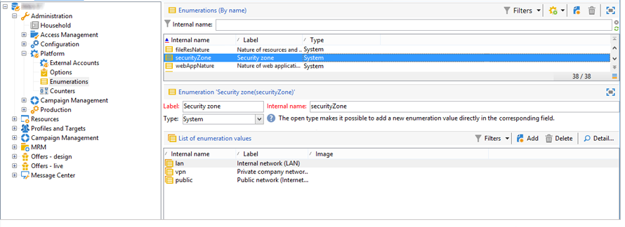

# Definir zonas de segurança (no local){#defining-security-zones}


Cada operador precisa ser vinculado a uma zona para fazer logon em uma instância e o operador IP deve ser incluído nos endereços ou conjuntos de endereços definidos na zona de segurança. A configuração da zona de segurança é realizada no arquivo de configuração do servidor do Adobe Campaign.

Os operadores são vinculados a uma zona de segurança a partir de seu perfil no console, acessível no **[!UICONTROL Administration > Access management > Operators]** nó. [Saiba mais](#linking-a-security-zone-to-an-operator).

>[!NOTE]
>
>Este procedimento é limitado a **no local** implantações.
>
>Como um **hospedado** cliente, se você puder acessar [Painel de controle do Campaign](https://experienceleague.adobe.com/docs/control-panel/using/control-panel-home.html?lang=pt-BR), é possível usar a interface de autoatendimento da Zona de Segurança. [Saiba mais](https://experienceleague.adobe.com/docs/control-panel/using/instances-settings/ip-allow-listing-instance-access.html?lang=pt-BR)
>
>Outro **híbrido/hospedado** os clientes precisam entrar em contato com a equipe de suporte do Adobe para adicionar IP ao incluo na lista de permissões.

## Criar zonas de segurança {#creating-security-zones}

Uma zona é definida por:

* um ou mais intervalos de endereços IP (IPv4 e IPv6)
* um nome técnico associado a cada intervalo de endereços IP

As zonas de segurança são interbloqueadas, o que significa que a definição de uma nova zona dentro de outra zona reduz o número de operadores que podem fazer logon nela, enquanto aumenta os direitos atribuídos a cada operador.

As regiões devem ser definidas durante a configuração do servidor, no **serverConf.xml** arquivo. Todos os parâmetros disponíveis no **serverConf.xml** estão listados em [nesta seção](../../installation/using/the-server-configuration-file.md).

Cada zona define direitos, como:

* Conexão HTTP em vez de HTTPS
* Exibição de erros (erros de Java, JavaScript, C++ etc.)
* Relatório e visualização de webApp
* Autenticação via logon/senha
* Modo de conexão não segura

>[!NOTE]
>
>**Cada operador deve ser vinculado a uma zona**. Se o endereço IP do operador pertencer ao intervalo definido pela região, o operador poderá fazer logon na instância.\
>O endereço IP do operador pode ser definido em várias regiões. Nesse caso, o operador recebe a variável **set** de direitos disponíveis para cada zona.

O pacote pronto para uso **serverConf.xml** O arquivo inclui três zonas: **público, VPN e LAN**.

>[!NOTE]
>
>**A configuração pronta para uso é segura**. No entanto, antes de migrar de uma versão anterior do Adobe Campaign, pode ser necessário reduzir temporariamente a segurança para migrar e aprovar as novas regras.

Exemplo de como definir uma região no **serverConf.xml** arquivo:

```
<securityZone allowDebug="false" allowHTTP="false" label="Public Network" name="public">
<subNetwork label="All addresses" mask="*" name="all"/>

<securityZone allowDebug="true" allowHTTP="false" label="Private Network (VPN)"
              name="vpn" showErrors="true">

  <securityZone allowDebug="true" allowEmptyPassword="true" allowHTTP="true"
                allowUserPassword="false" label="Private Network (LAN)" name="lan"
                sessionTokenOnly="true" showErrors="true">
    <subNetwork label="Lan 1" mask="192.168.0.0/16" name="lan1"/>
    <subNetwork label="Lan 2" mask="172.16.0.0/12" name="lan2"/>
    <subNetwork label="Lan 3" mask="10.0.0.0/8" name="lan3"/>
    <subNetwork label="Localhost" mask="127.0.0.1/16" name="locahost"/>
    <subNetwork label="Lan (IPv6)" mask="fc00::/7" name="lan6"/>
    <subNetwork label="Localhost (IPv6)" mask="::1/128" name="localhost6"/>
  </securityZone>

</securityZone>
</securityZone>
```

Todos os direitos que definem uma região são os seguintes:

* **allowDebug**: permite que um webApp seja executado no modo &quot;depurar&quot;
* **allowEmptyPassword**: autoriza uma conexão com uma instância sem uma senha
* **allowHTTP**: uma sessão pode ser criada sem usar o protocolo HTTPS
* **allowUserPassword**: o token da sessão pode ter o seguinte formato &quot;`<login>/<password>`&quot;
* **sessionTokenOnly**: o token de segurança não é necessário no URL de conexão
* **showErrors**: os erros no lado do servidor são encaminhados e exibidos

>[!IMPORTANT]
>
>Em uma definição de zona, cada atributo com a variável **true** reduz a segurança.

Ao usar o Centro de mensagens, se houver várias instâncias de execução, será necessário criar uma zona de segurança adicional com o **sessionTokenOnly** atributo definido como **true**, em que somente os endereços IP necessários devem ser adicionados. Para obter mais informações sobre a configuração de instâncias, consulte [este documento](../../message-center/using/configuring-instances.md).

## Práticas recomendadas para zonas de segurança {#best-practices-for-security-zones}

Na definição do **lan** zona de segurança, é possível adicionar uma máscara de endereço IP definindo o acesso técnico. Essa adição habilitará o acesso a todas as instâncias hospedadas no servidor.

```
<securityZone allowDebug="true" allowEmptyPassword="false" allowHTTP="true"
                    allowUserPassword="false" label="Private Network (LAN)" name="lan"
                    sessionTokenOnly="true" showErrors="true">
        <subNetwork label="Lan 1" mask="192.168.0.0/16" name="lan1"/>
        <subNetwork label="Lan 2" mask="172.16.0.0/12" name="lan2"/>
        <subNetwork label="Lan 3" mask="10.0.0.0/8" name="lan3"/>
        <subNetwork label="Localhost" mask="127.0.0.1/16" name="locahost"/>
        <subNetwork label="Lan (IPv6)" mask="fc00::/7" name="lan6"/>
        <subNetwork label="Localhost (IPv6)" mask="::1/128" name="localhost6"/>
  
        <!-- Customer internal IPs -->
        <subNetwork id="internalNetwork" mask="a.b.c.d/xx"/>

      </securityZone>
```

Recomendamos definir intervalos de endereço IP diretamente no arquivo de configuração dedicado à instância para operadores que acessam apenas uma instância específica.

No **`config-<instance>.xml`** arquivo:

```
  <securityZone name="public">
   ...
    <securityZone name="vpn">
      <subNetwork id="cus1" mask="a.b.c.d/xx"/>
```

## Sub-redes e proxies em uma zona de segurança {#sub-networks-and-proxies-in-a-security-zone}

A variável **proxy** parâmetro pode ser usado em um **subNetwork** elemento para especificar o uso de proxy em uma zona de segurança.

Quando um proxy é referenciado e uma conexão é inserida por meio desse proxy (visível por meio do cabeçalho HTTP X-Forwarded-For), a zona verificada é a dos clientes do proxy e não a do proxy.

>[!IMPORTANT]
>
>Se um proxy estiver configurado e for possível substituí-lo (ou se não existir), o endereço IP que será testado poderá ser falsificado.
>
>Além disso, retransmissões agora são geradas como proxies. Portanto, é possível adicionar o endereço IP 127.0.0.1 à lista de proxies na configuração da zona de segurança.
>
>Por exemplo: &quot; `<subnetwork label="Lan 1" mask="192.168.0.0/16" name="lan1" proxy="127.0.0.1,10.100.2.135" />`&quot;.

Vários casos podem ocorrer:

* Uma sub-rede é referenciada diretamente na zona de segurança e nenhum proxy é configurado: os usuários da sub-rede podem se conectar diretamente ao servidor do Adobe Campaign.

   

* Um proxy é especificado para uma sub-rede na zona de segurança: os usuários dessa sub-rede podem acessar o servidor Adobe Campaign por meio desse proxy.

   

* Um proxy é incluído em uma sub-rede de zona de segurança: os usuários que têm acesso por meio desse proxy, independentemente da origem, podem acessar o servidor do Adobe Campaign.

   

Os endereços IP de proxies que provavelmente acessarão o servidor do Adobe Campaign devem ser inseridos em **`<subnetwork>`** em questão e a sub-rede de primeiro nível **`<subnetwork name="all"/>`**. Por exemplo, aqui para um proxy cujo endereço IP é 10.131.146.102:

```
<securityZone allowDebug="false" allowHTTP="false" label="Public Network" 
                      name="public">
    <subNetwork label="All addresses" mask="*" name="all"
                      proxy="10.131.146.102,127.0.0.1, ::1"/>

    <securityZone allowDebug="true" allowHTTP="false" label="Private Network (VPN)" 
                      name="vpn" showErrors="true">
        <securityZone allowDebug="true" allowEmptyPassword="false" allowHTTP="true" 
                      allowUserPassword="false" label="Private Network (LAN)" 
                      name="lan" sessionTokenOnly="true" showErrors="true">
            <subNetwork label="Lan proxy" mask="10.131.193.182" name="lan3" 
                      proxy="10.131.146.102,127.0.0.1, ::1"/>
            <subNetwork label="Lan 1" mask="192.168.0.0/16" name="lan1" 
                      proxy="127.0.0.1, ::1"/>

        </securityZone>
    </securityZone>
</securityZone>
```

## Vincular uma zona de segurança a um operador {#linking-a-security-zone-to-an-operator}

Depois que as zonas forem definidas, cada operador deve ser vinculado a uma delas para poder fazer logon em uma instância e o endereço IP do operador deve ser incluído nos endereços ou intervalos de endereços referenciados na zona.

A configuração técnica das zonas é executada no arquivo de configuração do Servidor do Campaign: **serverConf.xml**.

Antes disso, você deve começar configurando o pacote **[!UICONTROL Security zone]** enumeração para vincular um rótulo ao nome interno da zona definida no **serverConf.xml** arquivo.

Essa configuração é feita no explorador do Campaign:

1. Clique no nó **[!UICONTROL Administration > Platform > Enumerations]**.
1. Selecione o **[!UICONTROL Security zone (securityZone)]** enumeração do sistema.

   

1. Para cada zona de segurança definida no arquivo de configuração do servidor, clique no link **[!UICONTROL Add]** botão.
1. No **[!UICONTROL Internal name]** insira o nome da zona definida no campo **serverConf.xml** arquivo. Corresponde à **@name** atributo de `<securityzone>`  elemento. Insira o rótulo vinculado ao nome interno na variável  **Rótulo** campo.

   

1. Clique em OK e salve as modificações.

Depois que as zonas forem definidas e a variável **[!UICONTROL Security zone]** enumeração estiver configurada, será necessário vincular cada operador a uma zona de segurança:

1. Clique no nó **[!UICONTROL Administration > Access management > Operators]**.
1. Selecione o operador para o qual deseja vincular uma zona de segurança e clique no botão **[!UICONTROL Edit]** guia.
1. Acesse a guia **[!UICONTROL Access rights]** e clique no link **[!UICONTROL Edit access parameters...]**.

   

1. Selecione uma zona no **[!UICONTROL Authorized connection zone]** lista suspensa

   

1. Clique em **[!UICONTROL OK]** e salve as modificações para aplicar essas alterações.


## Recomendações

* Certifique-se de que seu proxy reverso não seja permitido na sub-rede. Se for o caso, **all** o tráfego será detectado como proveniente deste IP local, portanto, será confiável.

* Minimize o uso de sessionTokenOnly=&quot;true&quot;:

   * Aviso: se este atributo for definido como verdadeiro, o operador poderá ser exposto a um **Ataque CRSF**.
   * Além disso, o cookie sessionToken não é definido com um sinalizador httpOnly, portanto, algum código JavaScript do lado do cliente pode lê-lo.
   * No entanto, o Centro de Mensagens em várias células de execução precisa de sessionTokenOnly: crie uma nova zona de segurança com sessionTokenOnly definido como &quot;true&quot; e adicione **somente os IPs necessários** nesta zona.

* Quando possível, defina todos allowHTTP, showErrors como false (não para localhost) e confira-os.

   * allowHTTP = &quot;false&quot;: força os operadores a usarem HTTPS
   * showErrors = &quot;false&quot;: oculta erros técnicos (incluindo os SQL). Isso evita a exibição de muitas informações, mas reduz a capacidade do profissional de marketing de resolver erros (sem solicitar mais informações de um administrador)

* Defina allowDebug como true somente nos IPs usados pelos usuários/administradores de marketing que precisam criar pesquisas (em pré-visualização, na verdade), aplicativos da Web e relatórios. Esse sinalizador permite que esses IPs obtenham regras de retransmissão exibidas e os executa.

   * Quando allowDebug é definido como false, a saída é:

      ```
      <redir status='OK' date='...' sourceIP='...'/>
      ```

   * Quando allowDebug está definido como true, a saída é:

      ```
      <redir status='OK' date='...' build='...' OR version='...' sha1='...' instance='...' sourceIP='...' host='...' localHost='...'/>
      ```

* Nunca defina allowEmptyPassword, allowUserPassword, allowSQLInjection como true. Estes atributos estão aqui apenas para permitir uma fácil migração das versões 5 e 6.0:

   * **allowEmptyPassword** permite que os operadores tenham uma senha vazia. Se este for o seu caso, notifique todos os seus operadores para eles definirem uma senha com um prazo. Depois que esse prazo terminar, altere este atributo para falso.

   * **allowUserPassword** permite que os operadores enviem suas credenciais como parâmetros (para que eles sejam registrados por apache/IIS/proxy). Esse recurso foi usado anteriormente para simplificar o uso da API. Você pode verificar em seu guia (ou na especificação) se alguns aplicativos de terceiros usam isso. Em caso afirmativo, você deve notificá-los para alterar a maneira como usam nossa API e remover esse recurso o mais rápido possível.

   * **allowSQLInjection** O permite que o usuário execute injeções de SQL usando uma sintaxe antiga. Este atributo deve ser definido como falso. É possível usar /nl/jsp/ping.jsp?zones=true para verificar a configuração de sua zona de segurança. Esta página exibe o status ativo das medidas de segurança (computadas com esses sinalizadores de segurança) do IP atual.

* HttpOnly cookie/useSecurityToken: consulte **sessionTokenOnly** sinalizador.

* Minimizar IPs adicionados ao incluo na lista de permissões: adicionamos os 3 intervalos para redes privadas em zonas de segurança, de modo rápido e prático. É improvável usar todos esses endereços IP. Portanto, mantenha apenas os que você precisa.

* Atualize o operador webApp/interno para estar acessível somente no host local.
