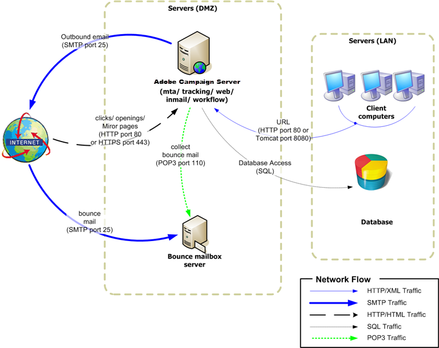

# Implantação independente{#standalone-deployment}


Essa configuração inclui todos os componentes no mesmo computador:

* processo de aplicação (web),
* processo de entrega (mta),
* processo de redirecionamento (rastreamento),
* processo de fluxo de trabalho e tarefas agendadas (wfserver),
* processo de email de devolução (inMail),
* processo de estatísticas (stat).

A comunicação geral entre os processos é realizada de acordo com o seguinte schema:



Esse tipo de configuração pode ser executado ao gerenciar listas de menos de 100.000 recipients e com, por exemplo, as seguintes camadas de software:

* Linux,
* Apache,
* PostgreSQL,
* Qmail.

À medida que o volume cresce, uma variante dessa arquitetura move o servidor de banco de dados para outro computador para melhorar o desempenho.

>[!NOTE]
>
>Um servidor de banco de dados existente também pode ser usado se tiver recursos suficientes.

## Recursos {#features}

### Vantagens {#advantages}

* Custo de configuração totalmente independente e baixo (nenhuma licença faturável é necessária se o software de código aberto listado abaixo for usado).
* Instalação simplificada e configuração de rede.

### Desvantagens {#disadvantages}

* Um computador crítico em caso de incidente.
* Largura de banda limitada ao transmitir mensagens (em nossa experiência, cerca de dezenas de milhares de emails por hora).
* Possível atraso do aplicativo ao transmitir.
* O servidor de aplicativos deve estar disponível externamente (enquanto estiver localizado no DMZ, por exemplo), pois ele hospeda o servidor de redirecionamento.

## Etapas de instalação e configuração {#installation-and-configuration-steps}

### Pré-requisitos {#prerequisites}

* JDK,
* Servidor Web (IIS, Apache),
* Acesso a um servidor de banco de dados,
* Caixa de entrada de devolução acessível via POP3,
* Criação de dois aliases DNS:

   * A primeira pessoa exposta ao público para rastrear e apontar para o computador no seu IP público;
   * o segundo alias exposto a usuários internos para acesso ao console e apontando para o mesmo computador.

* Firewall configurado para abrir SMTP (25), DNS (53), HTTP (80), HTTPS (443), SQL (1521 para Oracle, 5432 para PostgreSQL etc.) portas. Para obter mais informações, consulte [Configuração de rede](../../installation/using/network-configuration.md).

Nos exemplos a seguir, os parâmetros da instância são:

* Nome da instância: **demonstração**
* Máscara de DNS: **console.campaign.net&#42;** (somente para conexões com o console do cliente e para relatórios)
* Banco de dados: **campanha:demo@dbsrv**

### Instalação e configuração (máquina única) {#installing-and-configuring--single-machine-}

Siga as etapas abaixo:

1. Siga o procedimento de instalação do servidor Adobe Campaign: **nlserver** no Linux ou **setup.exe** no Windows.

   Para obter mais informações, consulte [Pré-requisitos da instalação do Campaign no Linux](../../installation/using/prerequisites-of-campaign-installation-in-linux.md) (Linux) e [Pré-requisitos da instalação do Campaign no Windows](../../installation/using/prerequisites-of-campaign-installation-in-windows.md) (Windows).

1. Depois que o servidor do Adobe Campaign for instalado, inicie o servidor de aplicativos (web) usando o comando **nlserver web -tomcat** (o módulo Web permite que você inicie o Tomcat no modo de servidor da Web independente ouvindo na porta 8080) e verifique se o Tomcat inicia corretamente:

   ```
   12:08:18 >   Application server for Adobe Campaign Classic (7.X YY.R build XXX@SHA1) of DD/MM/YYYY
   12:08:18 >   Starting Web server module (pid=28505, tid=-1225184768)...
   12:08:18 >   Tomcat started
   12:08:18 >   Server started
   ```

   >[!NOTE]
   >
   >Na primeira vez que o módulo da Web é executado, ele cria o **config-default.xml** e **serverConf.xml** nos arquivos da **conf** na pasta de instalação. Todos os parâmetros disponíveis no **serverConf.xml** estão listadas neste [seção](../../installation/using/the-server-configuration-file.md).

   Press **Ctrl+C** para interromper o servidor.

   Para obter mais informações, consulte estas seções:

   * Para Linux: [Primeira inicialização do servidor](../../installation/using/installing-packages-with-linux.md#first-start-up-of-the-server),
   * Para Windows: [Primeira inicialização do servidor](../../installation/using/installing-the-server.md#first-start-up-of-the-server).

1. Altere o **interno** senha usando o comando:

   ```
   nlserver config -internalpassword
   ```

   Para obter mais informações, consulte [esta seção](../../installation/using/configuring-campaign-server.md#internal-identifier).

1. Crie o **demonstração** com as máscaras DNS para rastreamento (neste caso, **tracking.campaign.net**) e acesso aos consoles do cliente (neste caso, **console.campaign.net**). Há duas maneiras de fazer isso:

   * Crie a instância por meio do console:

      

      Para obter mais informações, consulte [Criar uma instância e fazer logon](../../installation/using/creating-an-instance-and-logging-on.md).

      ou

   * Crie a instância usando linhas de comando:

      ```
      nlserver config -addinstance:demo/tracking.campaign.net*,console.campaign.net*
      ```

      Para obter mais informações, consulte [Criação de uma instância](../../installation/using/command-lines.md#creating-an-instance).

1. Edite o **config-demo.xml** (criado na etapa anterior ao lado de **config-default.xml**) e certifique-se de que o **mta** (entrega), **wfserver** (workflow), **inMail** (emails de devolução) e **stat** (estatísticas) os processos são ativados. Em seguida, configure o endereço do servidor de estatísticas:

   ```
   <?xml version='1.0'?>
   <serverconf>  
     <shared>    
       <!-- add lang="eng" to dataStore to force English for the instance -->    
       <dataStore hosts="tracking.campaign.net*,console.campaign.net*">      
         <mapping logical="*" physical="default"/>    
       </dataStore>  </shared>  
       <mta autoStart="true" statServerAddress="localhost"/>
       <wfserver autoStart="true"/>  
       <inMail autoStart="true"/>  
       <sms autoStart="false"/>  
       <listProtect autoStart="false"/>
   </serverconf>
   ```

   Para obter mais informações, consulte [esta seção](../../installation/using/configuring-campaign-server.md#enabling-processes).

1. Edite o **serverConf.xml** e especifique o domínio de delivery, em seguida, especifique os endereços IP (ou host) dos servidores DNS usados pelo módulo MTA para responder consultas DNS do tipo MX.

   ```
   <dnsConfig localDomain="campaign.com" nameServers="192.0.0.1, 192.0.0.2"/>
   ```

   >[!NOTE]
   >
   >O **nameServers** é usado somente no Windows.

   Para obter mais informações, consulte [Configuração do servidor do Campaign](../../installation/using/configuring-campaign-server.md).

1. Copie o programa de configuração do console do cliente (**setup-client-7.XX**, **YYYY.exe** para v7 ou **setup-client-6.XX**, **YYYY.exe** para v6.1) para o **/datakit/nl/eng/jsp** pasta. [Saiba mais](../../installation/using/client-console-availability-for-windows.md).

1. Siga o procedimento de integração do servidor Web (IIS, Apache) descrito nas seguintes seções:

   * Para Linux: [Integração em um servidor Web para Linux](../../installation/using/integration-into-a-web-server-for-linux.md)
   * Para Windows: [Integração em um servidor Web para Windows](../../installation/using/integration-into-a-web-server-for-windows.md)

1. Inicie o site e teste o redirecionamento usando a URL: https://tracking.campaign.net/r/test.

   O navegador deve exibir a seguinte mensagem:

   ```
   <redir status="OK" date="AAAA/MM/JJ HH:MM:SS" build="XXXX" host="tracking.campaign.net" localHost="localhost"/>
   ```

   Para obter mais informações, consulte estas seções:

   * Para Linux: [Iniciar o servidor Web e testar a configuração](../../installation/using/integration-into-a-web-server-for-linux.md#launching-the-web-server-and-testing-the-configuration)
   * Para Windows: [Iniciar o servidor Web e testar a configuração](../../installation/using/integration-into-a-web-server-for-windows.md#launching-the-web-server-and-testing-the-configuration)

1. Inicie o servidor do Adobe Campaign (**net start nlserver6** no Windows, **/etc/init.d/nlserver6 start** no Linux) e execute o comando **pdump nlserver** mais uma vez para verificar a presença de todos os módulos ativados.

   >[!NOTE]
   >
   >A partir da versão 20.1, recomendamos usar o seguinte comando (para Linux): **systemctl start nlserver**

   ```
   12:09:54 >   Application server for Adobe Campaign Classic (7.X YY.R build XXX@SHA1) of DD/MM/YYYY
   syslogd@default (7611) - 9.2 MB
   stat@demo (5988) - 1.5 MB
   inMail@demo (7830) - 11.9 MB
   watchdog (27369) - 3.1 MB
   mta@demo (7831) - 15.6 MB
   wfserver@demo (7832) - 11.5 MB
   web@default (28671) - 40.5 MB
   ```

   Esse comando também permite saber a versão e o número da build do servidor Adobe Campaign instalado no computador.

1. Teste a **nlserver web** módulo que usa o URL: https://console.campaign.net/nl/jsp/logon.jsp

   Esse URL permite que você acesse a página de download do programa de configuração do cliente.

   Insira o **interno** faça logon e a senha associada ao acessar a página de controle de acesso. [Saiba mais](../../installation/using/client-console-availability-for-windows.md).

   

1. Inicie o console do cliente do Adobe Campaign (na página de download anterior ou inicializado diretamente no servidor para uma instalação do Windows), defina o URL da conexão do servidor como https://console.campaign.net e conecte usando o **interno** fazer logon.

   Consulte [esta página](../../installation/using/creating-an-instance-and-logging-on.md) e [esta seção](../../installation/using/configuring-campaign-server.md#internal-identifier).

   O assistente de criação de banco de dados é exibido quando você faz logon pela primeira vez:

   

   Siga as etapas no assistente e crie o banco de dados associado à instância de conexão.

   Para obter mais informações, consulte [Criação e configuração do banco de dados](../../installation/using/creating-and-configuring-the-database.md).

   Depois que o banco de dados for criado, faça logoff.

1. Faça logon novamente no console do cliente usando o **administrador** fazer logon sem uma senha e iniciar o assistente de implantação ( **[!UICONTROL Tools > Advanced]** ) para concluir a configuração da instância.

   Para obter mais informações, consulte [Implantação de uma instância](../../installation/using/deploying-an-instance.md).

   Os principais parâmetros a serem definidos são:

   * Delivery por email: endereços de remetente e resposta e a caixa de entrada de erro para email de devolução.
   * Rastreamento: Preencha a URL externa usada para o redirecionamento e a URL interna, clique em **Registro no(s) servidor(es) de rastreamento** e depois validá-lo no **demonstração** do servidor de rastreamento.

      Para obter mais informações, consulte [Configuração de rastreamento](../../installation/using/deploying-an-instance.md#tracking-configuration).

      

      Como o servidor do Adobe Campaign é usado como o servidor de aplicativos e o servidor de redirecionamento, a URL interna usada para coletar logs de rastreamento e URLs de transferência é uma conexão interna direta com o Tomcat (https://localhost:8080).

   * Gerenciamento de devolução: Insira os parâmetros para manipular emails de devolução (não tome a variável **Emails de devolução não processados** em conta).
   * Acesso de: Forneça os dois URLs para relatórios, formulários web e mirror pages.

      
