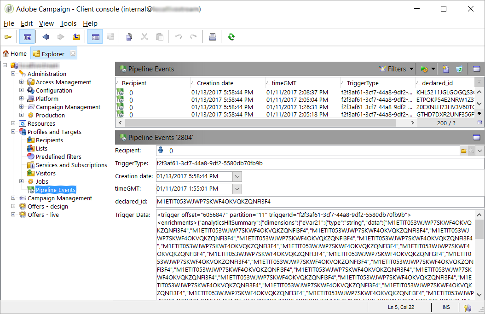
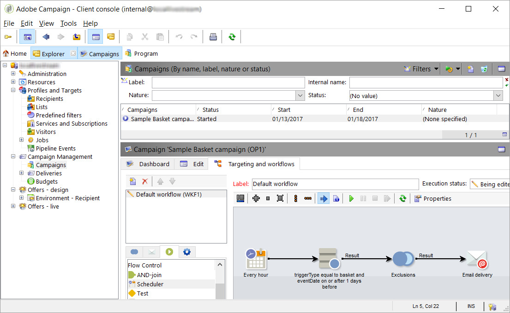

# Sobre os acionadores da Adobe Experience Cloud{#about-adobe-experience-triggers}

[!DNL Triggers] é uma integração entre o Adobe Campaign e o Adobe Analytics usando o pipeline. O pipeline recupera as ações ou acionadores dos usuários do seu site. O abandono do carrinho é um exemplo de acionador. Os acionadores são processados no Adobe Campaign para enviar emails em tempo quase real.

O [!DNL Triggers] executa ações de marketing em um curto intervalo de tempo após a ação de um usuário. O tempo médio de resposta é de menos de uma hora.

Ele permite integrações mais ágeis, pois a configuração é mínima e não há envolvimento de terceiros.
Também aceita grandes volumes de tráfego sem afetar o desempenho das atividades de marketing. Como exemplo, a integração pode processar um milhão de acionadores por hora.

## [!DNL Triggers] arquitetura {#triggers-architecture}

### O que é pipeline? {#pipeline-explanation}

>[!CAUTION]
>
>Somente as soluções da Adobe Cloud podem produzir e consumir eventos a partir dos serviços de pipeline da Adobe. Os sistemas externos à Adobe não podem.

Pipeline é um sistema de mensagens hospedado na Experience Cloud que utiliza o [Apache Kafka](http://kafka.apache.org/). É uma maneira de transmitir dados facilmente entre soluções. Além disso, o pipeline é uma fila de mensagens em vez de um banco de dados. Os produtores enviam eventos no pipeline e os consumidores escutam o fluxo e fazem o que quiserem com o evento. Os eventos são guardados apenas por alguns dias. O objetivo é ouvir 24 horas por dia, 7 dias por semana e processar eventos imediatamente.

### Como funciona o pipeline? {#how-pipeline-work}

O processo [!DNL pipelined] está sempre em execução no servidor de marketing do Adobe Campaign. Ele se conecta ao pipeline, recupera os eventos e os processa imediatamente.

O processo [!DNL pipelined] faz logon na Experience Cloud usando um serviço de autenticação e envia uma chave privada. O serviço de autenticação retorna um token. O token é usado para a autenticação ao recuperar os eventos. Os [!DNL Triggers] são recuperados de um serviço web REST usando uma simples solicitação GET. A resposta é o formato JSON. Os parâmetros para a solicitação incluem o nome do acionador e um ponteiro que indica a última mensagem recuperada. O processo [!DNL pipelined] trabalha com ele automaticamente.

## Usar a integração dos acionadores da Adobe Experience Cloud com o Adobe Campaign Classic

Estas são algumas das práticas recomendadas do [!DNL Triggers]:

* Os dados do [!DNL Trigger] precisam ser armazenados à medida que chegam ao Campaign. Eles não devem ser processados diretamente para não criar latência.
* O carimbo de data e hora deve ser verificado na mensagem e não na base de dados.
* Use TriggerTimestamp e a ID do acionador para remover duplicações.

>[!CAUTION]
>
>O exemplo abaixo não é fornecido imediatamente. Este é um exemplo específico de várias possíveis implementações.

Os eventos de pipeline são baixados automaticamente. Esses eventos podem ser monitorados usando um formulário.

O nó do evento pipeline não está incorporado e precisa ser adicionado, assim como o formulário relacionado precisa ser criado no Campaign. Essas operações são restritas unicamente a usuários especialistas. Para obter mais informações, consulte as seções: [Hierarquia de navegação](../../configuration/using/about-navigation-hierarchy.md) e [Edição de formulários](../../configuration/using/editing-forms.md).

Um query recorrente de workflow de campanha nos acionadores inicia um delivery se corresponder aos critérios de marketing.

