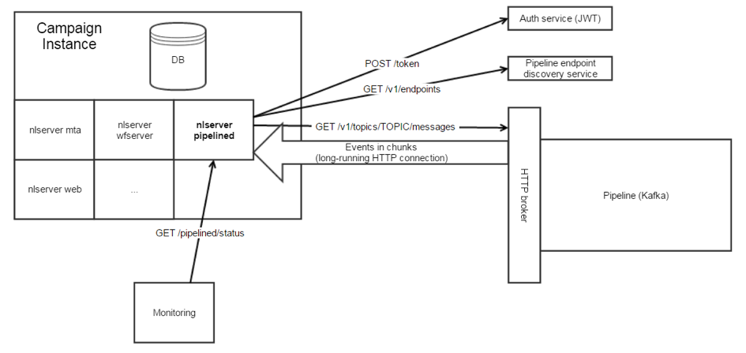

# Trabalhar com acionadores do Campaign e da Experience Cloud{#about-adobe-experience-triggers}

[!DNL Triggers] é uma integração entre o Adobe Campaign e o Adobe Analytics usando o pipeline. O pipeline recupera as ações ou acionadores dos usuários do seu site. O abandono do carrinho é um exemplo de acionador. Os acionadores são processados no Adobe Campaign para enviar emails em tempo quase real.

>[!CAUTION]
>
>Esse recurso não está disponível para uso imediato como parte do produto. Para esta implementação, trabalhe com seu representante da Adobe/atendimento ao cliente. Em seguida, você poderá seguir as etapas detalhadas nesta [página](../../integrations/using/configuring-pipeline.md#prerequisites).

O [!DNL Triggers] realiza ações de marketing em um curto intervalo de tempo após a ação do usuário. O tempo médio de resposta é de menos de uma hora.

Ele permite integrações mais ágeis, pois a configuração é mínima e não há envolvimento de terceiros.
Também aceita grandes volumes de tráfego sem afetar o desempenho das atividades de marketing. Como exemplo, a integração pode processar um milhão de acionadores por hora.

 Saiba como [criar um acionador da Experience Cloud](https://experienceleague.adobe.com/docs/experience-cloud/triggers/create.html?lang=pt-BR) e identificar, definir e monitorar comportamentos críticos de consumidores.

## Arquitetura de [!DNL Triggers] {#triggers-architecture}

O processo [!DNL pipelined] está sempre em execução no servidor de marketing do Adobe Campaign. Ele se conecta ao pipeline, recupera os eventos e os processa imediatamente.



O processo [!DNL pipelined] faz logon na Experience Cloud usando um serviço de autenticação e envia uma chave privada. O serviço de autenticação retorna um token. O token é usado para a autenticação ao recuperar os eventos.

## Pré-requisitos {#adobe-io-prerequisites}

Antes de iniciar esta implementação, verifique se você tem:

* um **identificador de organização** válido: o ID da organização é o identificador exclusivo da Adobe Experience Cloud, que é usado, por exemplo, para o serviço de VisitorID e para o Logon único (SSO) no IMS. [Saiba mais](https://experienceleague.adobe.com/docs/core-services/interface/administration/organizations.html?lang=pt-BR)
* um **Acesso de desenvolvedor** para sua organização. O administrador de sistema da organização precisa seguir o procedimento **Adicionar desenvolvedores a um único perfil de produto** detalhado [nesta página](https://helpx.adobe.com/br/enterprise/using/manage-developers.html) para fornecer acesso de desenvolvedor ao `Analytics - {tenantID}` do Perfil do produto do Adobe Analytics que está associado ao Triggers.

## Etapas de implementação {#implement}

Para implementar acionadores do Campaign e da Experience Cloud, siga as etapas abaixo:

1. Crie um projeto OAuth. [Saiba mais](oauth-technical-account.md#oauth-service)

1. Adicione suas credenciais do projeto OAuth no Adobe Campaign. [Saiba mais](oauth-technical-account.md#add-credentials)

1. Atualize o tipo de autenticação para Projeto do Developer Console no arquivo de configuração **config-&lt; instance-name >.xml** do seguinte modo:

   ```
   <pipelined ... authType="imsJwtToken"  ... />
   ```

   Em seguida, execute um `config -reload` e reinicie o [!DNL pipelined] para aplicar as alterações.

