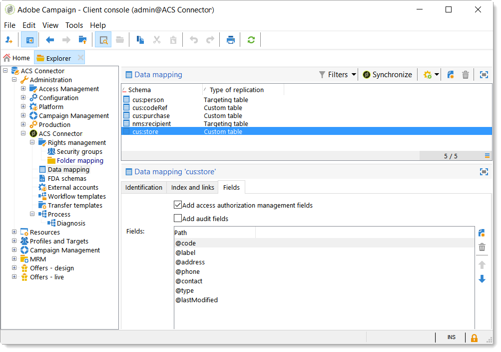

# Princípios do conector ACS e ciclo de dados{#acs-connector-principles-and-data-cycle}

## Introdução {#introduction}

O ACS Connector conecta o Adobe Campaign v7 e o Adobe Campaign Standard. É um recurso integrado no Campaign v7 que replica automaticamente os dados no Campaign Standard, unindo o melhor das duas aplicações. O Campaign v7 tem ferramentas avançadas para gerenciar o banco de dados de marketing principal. A replicação de dados do Campaign v7 permite que o Campaign Standard potencialize os dados avançados em um ambiente simples.

Com o ACS Connector, o Campaign Standard continua sendo usado pelos profissionais de marketing digital para projetar, direcionar e executar campanhas, enquanto o Campaign v7 é personalizado para usuários orientados a dados, como profissionais de marketing de banco de dados.

>[!IMPORTANT]
>
>O ACS Connector só está disponível como parte da oferta do Adobe Campaign Prime. Para obter mais informações sobre como obter uma licença do Adobe Campaign Prime, entre em contato com o gerente da sua conta.
>
>O ACS Connector só está disponível para arquiteturas hospedadas e híbridas. Ele não está disponível para instalações completas no local.
>
>Para usar esse recurso, você deve se conectar ao Campaign com uma Adobe ID (IMS). Consulte [Conectando-se por meio de uma Adobe ID](../../integrations/using/about-adobe-id.md).

Este documento apresenta os recursos do ACS Connector. As seções abaixo fornecem informações sobre como o recurso replica dados e instruções sobre como trabalhar com perfis replicados.

* [Process](#process): visão geral do ACS Connector e como a replicação de dados é gerenciada.
* [Implementation](#implementation): visão geral de como começar a usar o ACS Connector, bem como instruções sobre como replicar dados básicos e avançados.
* [Synchronizing profiles](../../integrations/using/synchronizing-profiles.md): instruções sobre como replicar perfis e como criar deliveries com eles.
* [Synchronizing audiences](../../integrations/using/synchronizing-audiences.md): instruções sobre como direcionar uma lista de recipients no Campaign v7 e, em seguida, replicar a lista para o Campaign Standard como um público.
* [Synchronizing web applications](../../integrations/using/synchronizing-web-applications.md): instruções sobre como vincular aplicações web do Campaign v7 ao Campaign Standard.
* [Troubleshooting the ACS Connector](../../integrations/using/troubleshooting-the-acs-connector.md): analise as respostas para problemas comuns.

>[!NOTE]
>
>O ACS Connector está incluído com o Campaign v7 sob o contrato de licença. Para usar o ACS Connector, verifique se você pode alternar entre o Campaign v7 e o Campaign Standard. Se você não tiver certeza da sua versão e seus recursos incluídos, entre em contato com o administrador.

## Processo {#process}

### Replicação de dados {#data-replication}

O ACS Connector replica os seguintes itens periodicamente do Campaign v7 para o Campaign Standard:

* **Recipients**
* **Subscrições**
* **Serviços**
* **Páginas de aterrissagem**

Por padrão, a replicação periódica do ACS Connector ocorre uma vez a cada 15 minutos. A extensão da replicação periódica pode ser ajustada às suas necessidades. Entre em contato com seu consultor se alterações forem necessárias.

A replicação de dados para recipients, assinaturas, serviços e landing pages é incremental, o que significa que somente novos recipients e modificações nos recipients existentes são replicados do Campaign v7 para o Campaign Standard. No entanto, a replicação para um público ocorre em uma única instância. Você pode criar um público no Campaign v7 e depois replicá-lo uma vez para o Campaign Standard. A replicação é imediata e não pode ser configurada para atualizações regulares. Para obter instruções, consulte [Sincronizar públicos](../../integrations/using/synchronizing-audiences.md).

>[!NOTE]
>
>Seja paciente com a replicação inicial de um banco de dados grande, pois pode levar várias horas. No entanto, as replicações subsequentes são incrementais e mais rápidas.

O ACS Connector replica os seguintes itens periodicamente do Campaign Standard para o Campaign v7:

* **[!UICONTROL Delivery IDs]**
* **[!UICONTROL Email broad logs]**
* **[!UICONTROL Email tracking logs]**

A replicação de IDs de delivery e logs de email permitem acessar o histórico de deliveries e o rastreamento de dados dos seus recipients do v7 do Campaign v7.

>[!IMPORTANT]
>
>Somente os broadlogs de e-mail e os logs de rastreamento são replicados do Campaign Standard para o Campaign v7.

### Sincronização de dados {#data-synchronization}

O ACS Connector sincroniza quarentenas entre o Campaign v7 e o Campaign Standard.

Por exemplo, um perfil que foi replicado do Campaign v7 para o Campaign Standard inclui um endereço de email. Se o endereço de email for colocado em quarentena pelo Campaign Standard, os dados serão passados para o Campaign v7 durante a próxima sincronização. Para obter mais informações sobre quarentenas, consulte a [Gestão de quarentena](../../delivery/using/understanding-quarantine-management.md) e [Quarentenas do Campaign Standard](https://experienceleague.adobe.com/docs/campaign-standard/using/testing-and-sending/monitoring-messages/understanding-quarantine-management.html?lang=pt-BR).

### Uso de perfis replicados {#using-replicated-profiles}

Os perfis replicados podem ser usados pelo Campaign Standard e o Campaign v7 para workflows para construção do target em campanhas de marketing.

Para instruções sobre como enviar um delivery no Campaign Standard usando perfis replicados, consulte [Sincronizar perfis](../../integrations/using/synchronizing-profiles.md). Instruções adicionais são fornecidas para compartilhar os dados de unsubscription entre o Campaign v7 e o Campaign Standard.

### Limitações {#limitations}

Os perfis replicados estão prontamente disponíveis para deliveries, mas têm determinadas limitações no Campaign Standard. Analise os itens abaixo para saber como gerencia-los.

* **Perfis somente leitura para o Campaign Standard**: os perfis replicados são somente leitura no Campaign Standard. No entanto, você pode editar recipients no Campaign v7 e as modificações são atualizadas automaticamente no Campaign Standard pelo ACS Connector.
* **Perfis criados no Campaign Standard**: o Conector ACS replica os dados do recipient em uma direção, do Campaign v7 para o Campaign Standard. Portanto, os perfis originados no Campaign Standard não são replicados para o Campaign v7.
* **Dados básicos do recipient para o Campaign Standard**: o Conector ACS replica dados do recipient adequados para o Campaign Standard. Ele inclui nomes de recipients, endereços, endereços de email, números de celular, números de telefone fixo e outras informações de contato pertinentes. Se campos de recipients adicionais e tabelas de target personalizadas disponíveis no Campaign v7 forem decisivos para o seu workflow, entre em contato com seu consultor.
* **Importação de perfis em quarentena**: listas de perfis que não desejam ser contatados podem ser importadas para o Campaign v7 ou para o Campaign Standard como perfis em quarentena. O status dos perfis está incluído na sincronização de quarentena entre aplicações e eles não serão usados nos deliveries.
* **Cancelar a assinatura de um serviço no Campaign Standard**: a opção de cancelar a assinatura de um delivery não é sincronizada do Campaign Standard para o Campaign v7. No entanto, você pode configurar um delivery no Campaign Standard para direcionar seu link de unsubscription para o Campaign v7. O perfil de um recipient que clica no link de unsubscription é atualizado no Campaign v7 e os dados são replicados para o Campaign Standard. Consulte [Alteração do link de cancelamento de subscrição](../../integrations/using/synchronizing-profiles.md#changing-the-unsubscription-link).
* Somente os broadlogs de e-mail e os logs de rastreamento são replicados do Campaign Standard para o Campaign v7.

### Faturamento {#billing}

O faturamento não é afetado pela escolha de aplicação para enviar deliveries, Campaign v7 ou Campaign Standard. As informações de cobrança são reconciliadas entre o Campaign v7 e o Campaign Standard. Portanto, se enviar deliveries ao mesmo recipient usando ambos os aplicações, ele ainda será contado como um perfil ativo.

## Implementação {#implementation}

Existem dois tipos de implementação para o ACS Connector. Ambos são sempre realizados pela equipe Adobe Campaign Consulting.

>[!IMPORTANT]
>
>Esta seção destina-se somente usuários especialistas, para fornecer uma visão geral do processo de implementação e suas principais etapas.
>
>Não tente, por qualquer meio, executar qualquer uma dessas implementações você mesmo. É estritamente reservado para os consultores do Adobe Campaign.

A **implementação básica** permite replicar recipients (campos prontos para uso), serviços e subscrições, aplicações web e públicos-alvo. Essa é uma replicação unidirecional do Campaign v7 para o Campaign Standard.

A **implementação avançada** permitirá executar casos de uso mais complexos, por exemplo, se tiver campos de recipients adicionais ou tabelas de recipients personalizados (tabela de transações por exemplo). Consulte [Implementação avançada](#advanced-implementation).

### Instalação do pacote {#installing-the-package}

Para usar o recurso, o pacote **[!UICONTROL ACS Connector]** precisa ser instalado. Isso é sempre realizado pelo administrador técnico ou consultor da Adobe.

Todos os elementos técnicos relacionados ao ACS Connector estão disponíveis no nó **[!UICONTROL Administration > ACS Connector]** do explorador.

### Workflows técnicos e de replicação {#technical-and-replication-workflows}

Após a instalação do pacote, dois workflows técnicos ficam disponíveis em **[!UICONTROL Administration > ACS Connector > Process]**.

>[!IMPORTANT]
>
>Nunca tente modificar esses workflows. Eles nunca devem estar em erro ou em pausa. Se isso acontecer, entre em contato com o consultor do Adobe Campaign.

* **[!UICONTROL `[ACS] Quarantine synchronization`]** (quarantineSync): este workflow sincroniza todas as informações de quarentena. Todas as novas quarentenas no Campaign v7 são replicadas no Campaign Standard. Todas as novas quarentenas do Campaign Standard são replicadas no Campaign v7. Isso garante que todas as regras de exclusão sejam sincronizadas entre o Campaign v7 e o Campaign Standard.
* **[!UICONTROL `[ACS] Security group synchronization`]** (securityGroupSync): este workflow é usado para conversão de direitos. Consulte [Conversão de direitos](#rights-conversion).

Os workflows de replicação a seguir estão disponíveis como modelos &quot;prontos para serem usados&quot;. Eles precisam ser implementados pelo seu consultor do Adobe Campaign.

* **[!UICONTROL `[ACS] Profile replication`]** (newProfileReplication): esse workflow incremental replica os recipients para o Campaign Standard. Por padrão, ele replica todos os campos de recipients prontos para uso. Consulte [Campos de recipient padrão](#default-recipient-fields).
* **[!UICONTROL `[ACS] Service replication`]** (newServiceReplication): esse workflow incremental replica os serviços escolhidos para o Campaign Standard. Consulte o caso de uso [Sincronizar aplicações web](../../integrations/using/synchronizing-web-applications.md).
* **[!UICONTROL `[ACS] Landing pages replication`]** (newLandingPageReplication): esse workflow incremental replica as aplicações Web selecionados para o Campaign Standard. As aplicações Web do Campaign v7 aparecerão como páginas iniciais no Campaign Standard. Consulte o caso de uso [Sincronizar aplicações web](../../integrations/using/synchronizing-web-applications.md).
* **[!UICONTROL `[ACS] New replication`]** (newReplication): esse workflow incremental é um exemplo que pode ser usado para replicar uma tabela personalizada. Consulte [Implementação avançada](#advanced-implementation).
* **[!UICONTROL `[ACS] Delivery-message replication`]** (newDlvMsgQualification): esse workflow incremental replica mensagens de delivery do Campaign Standard para o Campaign v7.
* **[!UICONTROL `[ACS] Profile delivery log replication`]** (newRcpDeliveryLogReplication): este workflow incremental replica IDs de delivery, registros abrangentes de e-mail e logs de rastreamento de e-mail do Campaign Standard para o Campaign v7. Somente leva em conta deliveries enviadas do Campaign Standard para perfis que fazem parte da tabela nms:recipients do Campaign v7.
* **[!UICONTROL `[ACS] New delivery log replication`]** (newRcpDeliveryLogReplication): este workflow incremental replica IDs de delivery, registros abrangentes de e-mail e logs de rastreamento de e-mail do Campaign Standard para o Campaign v7. Somente leva em conta deliveries enviadas do Campaign Standard para perfis que fazem parte de uma tabela específica (para definir, diferente de nms:recipients) do Campaign v7.

### Campos de recipient padrão {#default-recipient-fields}

Se houverem campos adicionais ou tabelas personalizadas (tabela de transações, por exemplo), elas não serão replicadas por padrão. As necessidades de configuração avançadas devem ser executadas. Consulte [Implementação avançada](#advanced-implementation).

Abaixo estão a lista de campos de recipients que são replicados com a implementação básica. Estes são os campos prontos para uso:

<table> 
 <tbody> 
  <tr> 
   <td> <strong>Rótulo</strong>  </td> 
   <td> <strong>Nome interno</strong>  </td> 
  </tr> 
  <tr> 
   <td> Source Id  </td> 
   <td> @sourceId  </td> 
  </tr> 
  <tr> 
   <td> Data de criação  </td> 
   <td> @created  </td> 
  </tr> 
  <tr> 
   <td> Data de modificação  </td> 
   <td> @lastModified  </td> 
  </tr> 
  <tr> 
   <td> Email  </td> 
   <td> @email  </td> 
  </tr> 
  <tr> 
   <td> Sobrenome  </td> 
   <td> @lastName  </td> 
  </tr> 
  <tr> 
   <td> Nome  </td> 
   <td> @firstName  </td> 
  </tr> 
  <tr> 
   <td> Nome do meio  </td> 
   <td> @middleName  </td> 
  </tr> 
  <tr> 
   <td> Celular  </td> 
   <td> @mobilePhone  </td> 
  </tr> 
  <tr> 
   <td> Data de nascimento  </td> 
   <td> @birthDate  </td> 
  </tr> 
  <tr> 
   <td> Sexo  </td> 
   <td> @gender  </td> 
  </tr> 
  <tr> 
   <td> Saudação  </td> 
   <td> @salutation  </td> 
  </tr> 
  <tr> 
   <td> Não mais entrar em contato (por qualquer canal)  </td> 
   <td> @blacklist  </td> 
  </tr> 
  <tr> 
   <td> Não mais contatar por e-mail  </td> 
   <td> @blackListEmail  </td> 
  </tr> 
  <tr> 
   <td> Não mais contatar por SMS  </td> 
   <td> @blackListMobile  </td> 
  </tr> 
  <tr> 
   <td> Telefone  </td> 
   <td> @phone  </td> 
  </tr> 
  <tr> 
   <td> Fax  </td> 
   <td> @fax  </td> 
  </tr> 
  <tr> 
   <td> Endereço 1 (apartamento)  </td> 
   <td> [location/@address1]  </td> 
  </tr> 
  <tr> 
   <td> Endereço 2  </td> 
   <td> [location/@address2]  </td> 
  </tr> 
  <tr> 
   <td> Endereço 3 (Número e rua)  </td> 
   <td> [location/@address3]  </td> 
  </tr> 
  <tr> 
   <td> Endereço 4 (município)  </td> 
   <td> [location/@address4]  </td> 
  </tr> 
  <tr> 
   <td> CEP/Código Postal  </td> 
   <td> [location/@zipCode]  </td> 
  </tr> 
  <tr> 
   <td> Cidade  </td> 
   <td> [location/@cidade]  </td> 
  </tr> 
  <tr> 
   <td> Código de Estado/Província  </td> 
   <td> [location/@stateCode]  </td> 
  </tr> 
  <tr> 
   <td> Código do país  </td> 
   <td> [location/@countryCode]  </td> 
  </tr> 
 </tbody> 
</table>

### Conversão de direitos {#rights-conversion}

Os direitos são tratados de forma diferente no Campaign v7 e Campaign Standard. No Campaign v7, o gerenciamento de direitos é com base em pastas, enquanto o Campaign Standard é baseado no acesso à unidade (unidades organizacionais/geográficas). Um usuário do Campaign Standard pertence ao grupo de segurança que contém o contexto de restrição. Portanto, o sistema de direitos do Campaign v7 precisa ser convertido para corresponder ao Campaign Standard. Há várias maneiras de executar a conversão de direitos. Abaixo há um exemplo de implementação.

1. Em **[!UICONTROL Administration > ACS Connector > Rights management > Security groups]**, use o botão **[!UICONTROL Synchronize]** para recuperar todos os grupos de segurança do Campaign Standard. Os grupos do Campaign Standard iniciais são excluídos.

   

1. Se o gerenciamento de direitos for baseado em pastas, vá para **[!UICONTROL Administration > ACS Connector > Rights management > Folder mapping]** e mapeie cada pasta necessária com um grupo de segurança.

   

1. Os workflows de replicação usam essas informações e adicionam as unidades organizacionais/geográficas correspondentes a cada objeto a ser replicado.

### Implementação avançada {#advanced-implementation}

Esta seção descreve algumas das possibilidades de implementação avançada.

>[!IMPORTANT]
>
>Essas informações só podem ser usadas como diretrizes gerais. Contate o consultor do Adobe Campaign para a implementação.

A implementação avançada adicionará workflows de replicação personalizados, dependendo das necessidades do cliente. Veja alguns exemplos:

* Replicação de delivery
* Replicação de campanha
* Replicação de programas
* Replicação de membros de origem
* Replicação transacional
* etc.

**Replicação dos campos estendidos dos recipients**

Com a implementação básica, os campos de recipients iniciais são replicados. Se quiser replicar campos personalizados adicionados ao schema de recipients, será necessário identificá-los.

1. Em **[!UICONTROL Administration > ACS Connector > Data mapping]**, crie um mapeamento de direcionamento na tabela **[!UICONTROL nms:recipient]**.

   

1. Selecione os campos adicionais que deseja replicar e outras informações necessárias (índice, links, chaves de identificação).

   

1. Abra o workflow de replicação de perfil dedicado (não o template, mas a própria instância do workflow). Modifique as atividades **[!UICONTROL Query]** e **[!UICONTROL Update data]** para incluir esses campos. Consulte [Workflows técnicos e de replicação](#technical-and-replication-workflows).

   

   

**Replicação de tabelas de perfil personalizadas**

Com a implementação básica, a tabela de recipients inicial é replicada. Se adicionou tabelas de recipients personalizadas, veja a seguir como identificá-las.

1. Em **[!UICONTROL Administration > ACS Connector > Data mapping]**, crie um mapeamento de direcionamento na tabela de perfil personalizada.

   

1. Defina os dados de identificação, o índice, os links e os campos que deseja replicar.

   

1. Se o gerenciamento de direitos for com base em pastas, vá para **[!UICONTROL Administration > ACS Connector > Rights management > Folder mapping]** e defina um grupo de segurança para as pastas vinculadas às tabelas personalizadas. Consulte [Conversão de direitos](#rights-conversion).
1. Use o workflow **[!UICONTROL New replication]** (não o modelo, mas a própria instância do fluxo de trabalho) para incluir a tabela personalizada e os campos a serem replicados. Consulte [Workflows técnicos e de replicação](#technical-and-replication-workflows).
