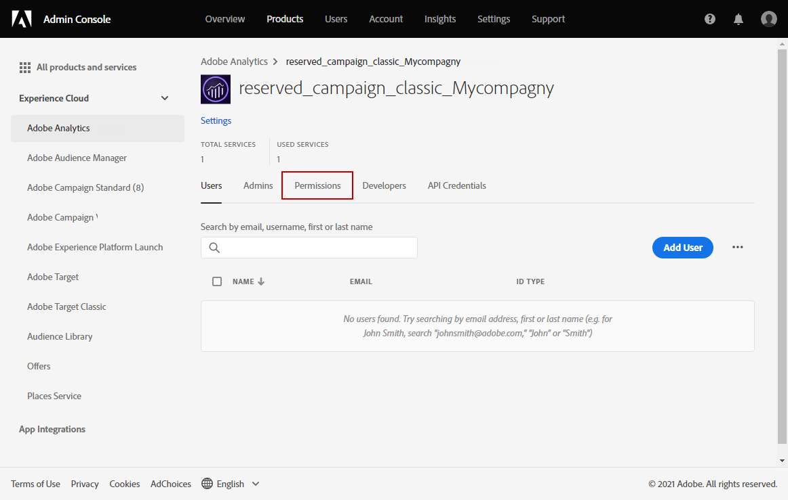

# Provisionamento do conector do Adobe Analytics {#adobe-analytics-connector-provisioning}

>[!CAUTION]
>
> Essas etapas só devem ser executadas por implementações híbridas e no local.
>
>Para implementações do Managed Services hospedadas e do Campaign, entre em contato com a equipe de [Atendimento ao cliente da Adobe](https://helpx.adobe.com/br/enterprise/admin-guide.html/enterprise/using/support-for-experience-cloud.ug.html).

A integração entre a autenticação do Adobe Campaign Classic e do Adobe Analytics é compatível com o Adobe Identity Management Service (IMS):

* Se estiver gerenciando uma conta externa migrada, será necessário implementar o Adobe IMS e se conectar ao Adobe Campaign por meio de uma Adobe ID.

  Observe que o usuário conectado por meio de uma Adobe ID IMS precisa ser o proprietário da conta do **Conector de dados** no Adobe Analytics e ter as permissões para o **Perfil do produto** mencionadas [abaixo](#analytics-product-profile).

O problema foi que o proprietário do conector de dados era um usuário diferente do que estava conectado ao Campaign e tentou fazer a integração com o Analytics.

* Se estiver implementando um novo conector, a implementação do Adobe IMS é opcional. Sem um usuário do Adobe ID, o Adobe Campaign usará um usuário técnico para sincronizar com o Adobe Analytics.

Para que essa integração funcione, é necessário criar um perfil de produto do Adobe Analytics que será usado exclusivamente para o conector do Analytics. Em seguida, será necessário criar um projeto do Console do desenvolvedor.

>[!AVAILABILITY]
>
> A credencial de conta de serviço (JWT) está sendo descontinuada pela Adobe. As integrações do Campaign com soluções e aplicativos Adobe agora devem usar a credencial de servidor para servidor OAuth.  
>
> * Se você implementou integrações de entrada com o Campaign, é necessário migrar a conta técnica conforme detalhado [nesta documentação](https://developer.adobe.com/developer-console/docs/guides/authentication/ServerToServerAuthentication/migration/#_blank). As [credenciais da conta de serviço (JWT)](oauth-technical-account.md) já existentes continuarão funcionando até terça-feira, 30 de junho de 2025. 
>
> * Se você tiver implementado integrações de saída, como a integração Campaign-Analytics ou a integração do Experience Cloud Triggers, elas continuarão a funcionar até 30 de junho de 2025. No entanto, antes dessa data, você deve atualizar seu ambiente do Campaign para a v7.4.1 e migrar sua conta técnica para o OAuth.

## Criar um perfil de produto do Adobe Analytics {#analytics-product-profile}

O perfil de produto determina o nível de acesso que um usuário tem nos diferentes componentes do Analytics.

Se você já tiver um Perfil de produto do Analytics, ainda deverá criar um novo perfil de produto do Adobe Analytics para ser usado exclusivamente para o conector do Analytics. Isso garantirá que o perfil de produto seja definido com as permissões corretas para essa integração.

Para obter mais informações sobre perfis de produto, consulte a [documentação do Admin Console](https://helpx.adobe.com/mt/enterprise/admin-guide.html).

1. No [Admin Console](https://adminconsole.adobe.com/), selecione seu Adobe Analytics **[!UICONTROL Product]**.

   

1. Clique em **[!UICONTROL New Profile]**.

   

1. Adicione um **[!UICONTROL Product profile name]**, sugerimos usar a seguinte sintaxe: `reserved_campaign_classic_<Company Name>`. Em seguida, clique em **[!UICONTROL Next]**.

   Esse **[!UICONTROL Product profile]** deve ser usado exclusivamente para o Analytics Connector, a fim de evitar erros de configuração.

1. Abra o **[!UICONTROL Product profile]** recém-criado e selecione a guia **[!UICONTROL Permissions]**.

   

1. Configure os diferentes recursos clicando em **[!UICONTROL Edit]** e selecione as permissões a serem atribuídas a seu **[!UICONTROL Product profile]** clicando no ícone de adição (+).

   Para obter mais informações sobre como gerenciar permissões, consulte a [documentação do Admin Console](https://helpx.adobe.com/mt/enterprise/using/manage-permissions-and-roles.html).

1. Para o recurso **[!UICONTROL Report Suites]**, adicione os **[!UICONTROL Report Suites]** que serão necessários para uso posterior.

   Se você não tiver conjuntos de relatórios, poderá criá-los seguindo [estas etapas](../../integrations/using/gs-aa.md).

   

1. Para o recurso **[!UICONTROL Metrics]**, adicione as **[!UICONTROL Metrics]** que serão necessárias para configuração posterior.

   Se necessário, você pode ativar a opção Incluir automaticamente, que adicionará todos os itens de permissões na lista incluída e adicionará automaticamente novos itens de permissão.

   

1. Para o recurso **[!UICONTROL Dimensions]**, adicione as **[!UICONTROL Dimensions]** necessárias para configurações futuras.

   Verifique se as dimensões escolhidas correspondem às que serão configuradas na conta externa e estão alinhadas com o número eVars correspondente do Adobe Analytics.

1. Para o recurso **[!UICONTROL Report Suite Tools]**, adicione as seguintes permissões:

   * **[!UICONTROL Report suite Mgmt]**
   * **[!UICONTROL Conversion variables]**
   * **[!UICONTROL Success events]**
   * **[!UICONTROL Custom data Warehouse report]**
   * **[!UICONTROL Data sources manager]**
   * **[!UICONTROL Classifications]**

1. Para o recurso **[!UICONTROL Analytics Tools]**, adicione as seguintes permissões:

   * **[!UICONTROL Code Manager - Web services]**
   * **[!UICONTROL Logs - Web services]**
   * **[!UICONTROL Web services]**
   * **[!UICONTROL Web service access]**
   * **[!UICONTROL Calculated metric creation]**
   * **[!UICONTROL Segment creation]**

O perfil de produto está agora configurado. Em seguida, é necessário criar o projeto OAuth.

## Criar projeto OAuth {#create-adobe-io}

Para continuar com a configuração do conector do Adobe Analytics, acesse o Adobe Developer Console e crie um projeto OAuth de “servidor para servidor”.

Consulte [esta página](oauth-technical-account.md#oauth-service) para obter a documentação detalhada.

## Configuração e utilização {#adobe-analytics-connector-usage}

Saiba como trabalhar com o Adobe Campaign e o Adobe Analytics na [documentação do Adobe Campaign v8](https://experienceleague.adobe.com/en/docs/campaign/campaign-v8/connect/ac-aa){target="_blank"}.