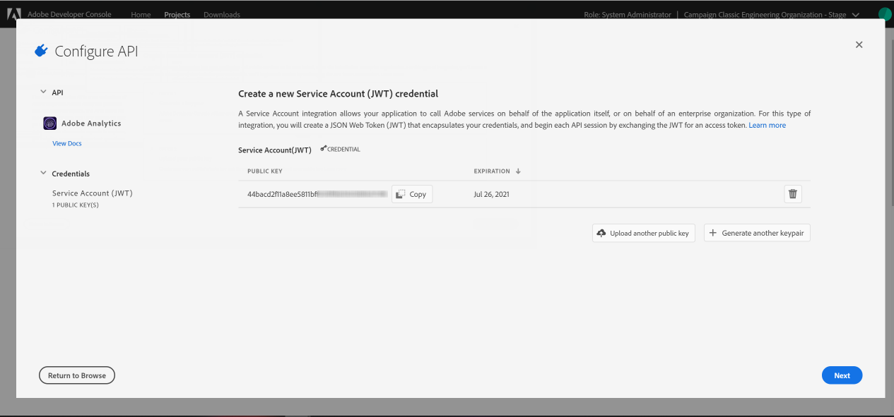

# Configuração do Adobe I/O para acionadores da Adobe Experience Cloud {#configuring-adobe-io}

>[!CAUTION]
>
>Se você estiver usando uma versão mais antiga da integração de acionadores por meio da autenticação oAuth, **será necessário mudar para o Adobe I/O conforme descrito abaixo**.
>Observe que, durante a migração para o [!DNL Adobe I/O], alguns acionadores de entrada podem ser perdidos.
>
>O modo de autenticação oAuth herdado com o Campaign será desativado em **18 de agosto de 2021** para ambientes híbridos e no local e em **30 de novembro de 2021** para ambientes hospedados. [Saiba mais](https://experienceleaguecommunities.adobe.com/t5/adobe-analytics-discussions/adobe-analytics-legacy-api-end-of-life-notice/td-p/385411)


## Pré-requisitos {#adobe-io-prerequisites}

Essa integração se aplica somente a partir das **[!DNL Gold Standard]versões do Campaign Classic 20.3, 20.2.4, 19.1.8 e 11**.

Antes de iniciar esta implementação, verifique se você tem:

* um **identificador de organização** valido: o identificador de organização do Identity Management System (IMS) é o identificador exclusivo da Adobe Experience Cloud, usado por exemplo para o serviço VisitorID e o IMS Single-Sign On (SSO). [Saiba mais](https://experienceleague.adobe.com/docs/core-services/interface/manage-users-and-products/organizations.html?lang=pt-BR)
* um **Acesso de desenvolvedor** para sua organização. O administrador do sistema da IMS Org precisa seguir o procedimento **Adicionar desenvolvedores a um único perfil de produto**
detalhado [nesta página](https://helpx.adobe.com/br/enterprise/admin-guide.html/enterprise/using/manage-developers.ug.html) para fornecer acesso de desenvolvedor ao `Analytics - {tenantID}` Perfil de produto do Adobe Analytics associado aos acionadores.

## Etapa 1: criar/atualizar projeto do Adobe I/O {#creating-adobe-io-project}

1. Acesse [!DNL Adobe I/O] e faça logon com o acesso do desenvolvedor da Organização IMS.

   >[!NOTE]
   >
   > Verifique se você está conectado ao portal correto da organização.

1. Extraia o identificador do cliente (ID do cliente) de integração existente do arquivo de configuração da instância ims/authIMSTAClientId. Um atributo não existente ou vazio indica que o identificador do cliente não está configurado.

   >[!NOTE]
   >
   >Se o identificador do cliente estiver vazio, será possível **[!UICONTROL Create a New project]** diretamente no Adobe I/O.

1. Identifique o projeto existente usando o identificador do cliente extraído. Procure projetos existentes com o mesmo identificador do cliente que o extraído na etapa anterior.

   

1. Selecione **[!UICONTROL + Add to Project]** e escolha **[!UICONTROL API]**.

   

1. Na janela **[!UICONTROL Add an API]**, selecione **[!UICONTROL Adobe Analytics]**.

   

1. Escolha **[!UICONTROL Service Account (JWT)]** como o tipo de autenticação.

   

1. Se a ID do cliente estiver vazia, selecione **[!UICONTROL Generate a key pair]** para criar um par de chaves público e privado.

   As chaves serão baixadas automaticamente com uma data de expiração padrão de 365 dias. Depois de expirar, você precisará criar um novo par de chaves e atualizar a integração no arquivo de configuração. Usando a Opção 2, você pode optar por criar e fazer upload manualmente da **[!UICONTROL Public key]** com uma data de expiração mais longa.

   >[!CAUTION]
   >
   >Você deverá salvar o arquivo config.zip quando o prompt de download for exibido, pois não será possível baixá-lo novamente.

   

1. Clique em **[!UICONTROL Next]**.

   

1. Escolha qualquer **[!UICONTROL Product profile]** existente ou crie um novo, se necessário. Nenhuma permissão é necessária para este **[!UICONTROL Product profile]**. Para obter mais informações sobre [!DNL Analytics] **[!UICONTROL Product Profiles]**, consulte a [documentação do Adobe Analytics](https://experienceleague.adobe.com/docs/analytics/admin/admin-console/home.html?lang=pt-BR#admin-console).

   Em seguida, clique em **[!UICONTROL Save configured API]**.

   

1. Em seu projeto, selecione **[!UICONTROL Adobe Analytics]** e copie as seguintes informações em **[!UICONTROL Service Account (JWT)]**:

   * **[!UICONTROL Client ID]**
   * **[!UICONTROL Client Secret]**
   * **[!UICONTROL Technical account ID]**
   * **[!UICONTROL Organization ID]**

   

>[!CAUTION]
>
>O certificado do Adobe I/O expirará após 12 meses. Você precisa gerar um novo par de chaves todo ano.

## Etapa 2: adicionar as credenciais do projeto no Adobe Campaign {#add-credentials-campaign}

>[!NOTE]
>
>Esta etapa não será necessária se o identificador do cliente não estiver vazio na [Etapa 1: criar/atualizar projeto do Adobe I/O](#creating-adobe-io-project).

A chave privada deve ser codificada no formato base64 UTF-8. Para fazer isso:

1. Use a chave privada gerada na [Etapa 1: criar/atualizar a seção Projeto do Adobe I/O](#creating-adobe-io-project). A chave privada precisa ser a mesma usada para criar a integração.

1. Codifique a chave privada usando o seguinte comando: `base64 ./private.key > private.key.base64`. Isso salvará o conteúdo base64 em um novo arquivo `private.key.base64`.

   >[!NOTE]
   >
   >Às vezes, uma linha extra pode ser adicionada automaticamente ao copiar/colar a chave privada. Lembre-se de removê-la antes de codificar sua chave privada.

1. Copie o conteúdo do arquivo `private.key.base64`.

1. Faça logon via SSH em cada container em que a instância do Adobe Campaign está instalada e adicione as credenciais do Projeto no Adobe Campaign executando o comando a seguir como usuário`neolane`. Isso inserirá as credenciais **[!UICONTROL Technical Account]** no arquivo de configuração da instância.

   ```
   nlserver config -instance:<instance name> -setimsjwtauth:Organization_Id/Client_Id/Technical_Account_ID/<Client_Secret>/<Base64_encoded_Private_Key>
   ```

## Etapa 3: atualizar a tag de pipeline {#update-pipelined-tag}

>[!NOTE]
>
>Essa etapa não será necessária se o identificador do cliente não estiver vazio na [Etapa 1: criar/atualizar projeto do Adobe I/O](#creating-adobe-io-project).

Para atualizar a tag [!DNL pipelined], é necessário atualizar o tipo de autenticação para o projeto do Adobe I/O no arquivo de configuração **config-&lt; instance-name >.xml** da seguinte maneira:

```
<pipelined ... authType="imsJwtToken"  ... />
```

Em seguida, execute um `config -reload` e uma reinicialização do [!DNL pipelined] para que as alterações sejam consideradas.
