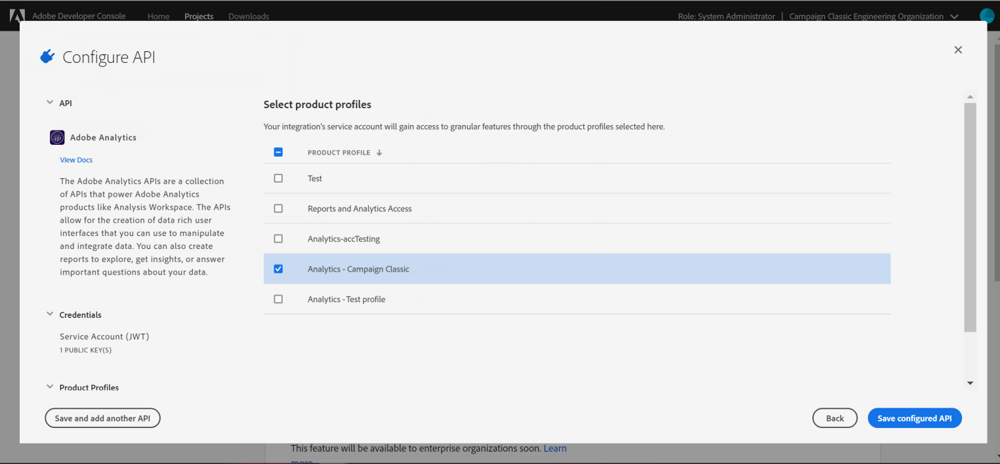

# Configuração do Adobe I/O para acionadores da Adobe Experience Cloud {#configuring-adobe-io}

>[!CAUTION]
>
>Se você estiver usando uma versão mais antiga da integração de acionadores por meio da autenticação oAuth, **será necessário mover para o Adobe I/O conforme descrito abaixo**. O modo de autenticação do oAuth herdado será desativado em 30 de abril de 2021. [Saiba mais](https://experienceleaguecommunities.adobe.com/t5/adobe-analytics-discussions/adobe-analytics-legacy-api-end-of-life-notice/td-p/385411)
>
>Observe que durante essa mudança para o Adobe I/O, alguns acionadores recebidos podem ser perdidos.

## Pré-requisitos {#adobe-io-prerequisites}

Essa integração se aplica somente a partir das **versões Campaign Classic 20.3, 20.2.4, 19.1.8 e Gold Standard 11**.

Antes de iniciar esta implementação, verifique se você tem:

* um **identificador de organização** valido: o identificador de organização do Identity Management System (IMS) é o identificador exclusivo da Adobe Experience Cloud, usado por exemplo para o serviço VisitorID e o IMS Single-Sign On (SSO). [Saiba mais](https://experienceleague.adobe.com/docs/core-services/interface/manage-users-and-products/organizations.html?lang=pt-BR)
* um **Acesso de desenvolvedor** para sua organização.  Se você precisar solicitar os privilégios de Administrador do Sistema da IMS Org, siga o procedimento detalhado [nesta página](https://helpx.adobe.com/enterprise/admin-guide.html/enterprise/using/manage-developers.ug.html) e forneça esse acesso a todos os perfis do produto.

## Etapa 1: Criar/atualizar projeto do Adobe I/O {#creating-adobe-io-project}

1. Acesse o Adobe I/O e faça logon com o direito Administrador do sistema para o IMS Organization.

   >[!NOTE]
   >
   > Verifique se você está conectado ao portal correto do Organization.

1. Extraia o identificador do cliente de integração existente (ID do cliente) do arquivo de configuração da instância ims/authIMSTAClientId. Um atributo não existente ou vazio indica que o identificador do cliente não está configurado.

   >[!NOTE]
   >
   >Se o identificador do cliente estiver vazio, será possível **[!UICONTROL Create a New project]** diretamente no Adobe I/O.

1. Identifique o projeto existente usando o identificador do cliente extraído. Procure projetos existentes com o mesmo identificador do cliente que o extraído na etapa anterior.

   

1. Selecione **[!UICONTROL + Add to Project]** e escolha **[!UICONTROL API]**.

   

1. Na janela **[!UICONTROL Add an API]**, selecione **[!UICONTROL Adobe Analytics]**.

   

1. Escolha **[!UICONTROL Service Account (JWT)]** como o tipo de autenticação.

   

1. Se a ID do cliente estava vazia, selecione **[!UICONTROL Generate a key pair]** para criar um par de chaves públicas e privadas.

   

1. Carregue sua chave pública e clique em **[!UICONTROL Next]**.

   

1. Escolha o perfil de produto chamado **Analytics-&lt; Org Name >** e clique em **[!UICONTROL Save configured API]**.

   

1. Em seu projeto, selecione **[!UICONTROL Service Account (JWT)]** e copie as seguintes informações:
   * **[!UICONTROL Client ID]**
   * **[!UICONTROL Client Secret]**
   * **[!UICONTROL Technical account ID]**
   * **[!UICONTROL Organization ID]**

   

>[!CAUTION]
>
>O certificado Adobe I/O expirará após 12 meses. Você precisa gerar um novo par de chaves todos os anos.

## Etapa 2: adicionar as credenciais do projeto no Adobe Campaign {#add-credentials-campaign}

Para adicionar as credenciais do projeto no Adobe Campaign, execute o seguinte comando como usuário “neolane” em todos os containers da instância do Adobe Campaign para inserir as credenciais **[!UICONTROL Technical Account]** no arquivo de configuração da instância.

```
nlserver config -instance:<instance name> -setimsjwtauth:Organization_Id/Client_Id/Technical_Account_ID/<Client_Secret>/<Base64_encoded_Private_Key>
```

>[!NOTE]
>
>Você deve codificar a chave privada no formato base64 UTF-8. Lembre-se de remover a nova linha da chave antes de codificá-la, exceto para a chave privada. A chave privada precisa ser a mesma usada para criar a integração. Para testar a codificação base64 da chave privada, você pode usar [este site](https://www.base64encode.org/).

## Etapa 3: atualizar tag de pipeline {#update-pipelined-tag}

Para atualizar a tag [!DNL pipelined], é necessário atualizar o tipo de autenticação para o projeto do Adobe I/O no arquivo de configuração **config-&lt; instance-name >.xml** da seguinte maneira:

```
<pipelined ... authType="imsJwtToken"  ... />
```
