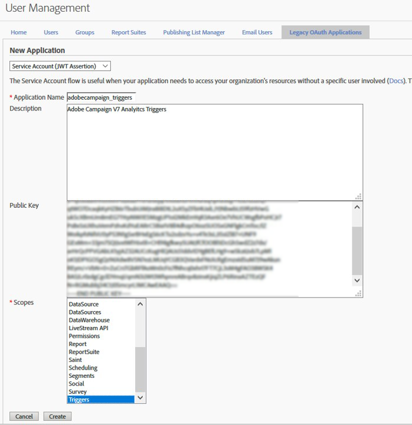

# Configuração de pipeline {#configuring-pipeline}

Parâmetros de autenticação, como ID do cliente, chave privada e ponto de entrada de autenticação, são configurados nos arquivos de configuração da instância.
A lista de acionadores que serão processados é configurada em uma opção. Ela está no formato JSON.
O acionador é processado imediatamente usando o código Javascript. Ele é salvo em uma tabela de banco de dados em tempo real, sem nenhum processamento adicional.
Os acionadores são usados para segmentação por um workflow de campanha que envia emails. A campanha é configurada para que um cliente que tenha ambos os eventos de acionador receba um email.

## Pré-requisitos {#prerequisites}

O uso de [!DNL Experience Cloud Triggers] no Campaign exige:

* Adobe Campaign versão 6.11 build 8705 ou posterior.
* Adobe Analytics Ultimate, Premium, Foundation, OD, Select, Prime, Mobile Apps, Select ou Standard.

As configurações de pré-requisito são:

* Criação de um arquivo de chave privada e, em seguida, a criação do aplicativo oAuth registrado com essa chave.
* Configuração dos acionadores no Adobe Analytics.

A configuração do Adobe Analytics está fora do escopo deste documento.

O Adobe Campaign exige as seguintes informações do Adobe Analytics:

* O nome do aplicativo oAuth.
* O IMSOrgId, o identificador do cliente da Experience Cloud.
* Os nomes dos acionadores configurados no Analytics.
* O nome e o formato dos campos de dados que serão reconciliados com o banco de dados de Marketing.

Parte dessa configuração é um desenvolvimento personalizado e requer o seguinte:

* Conhecimento prático de análise JSON, XML e Javascript no Adobe Campaign.
* Conhecimento prático das APIs QueryDef e Writer.
* Noções de trabalho de criptografia e autenticação usando chaves privadas.

>[!NOTE]
>
>Como a edição do código JS requer habilidades técnicas, não tente sem a compreensão adequada. <br>Os acionadores são salvos em uma tabela do banco de dados. Dessa forma, os dados de acionadores podem ser usados com segurança pelos operadores de marketing em workflows de direcionamento.

## Arquivos de autenticação e configuração {#authentication-configuration}

A autenticação é necessária, pois o pipeline está hospedado na Adobe Experience Cloud.
Se o servidor de marketing estiver hospedado no local, deverá ser autenticado quando fizer logon no pipeline para ter uma conexão segura.
Ele usa um par de chaves públicas e privadas. Esse processo tem a mesma função de um usuário/senha, porém é mais seguro.

### IMSOrgId {#imsorgid}

O IMSOrgId é o identificador do cliente na Adobe Experience Cloud.
Defina-o no arquivo serverConf.xml da instância, sob o atributo IMSOrgId.
Exemplo:

```
<redirection IMSOrgId="C5E715(…)98A4@AdobeOrg" (…)
```

### Geração de chaves {#key-generation}

A chave é um par de arquivos. Está no formato RSA com 4096 bytes de comprimento. Pode ser gerado com uma ferramenta de código aberto, como OpenSSL. Cada vez que a ferramenta é executada, uma nova chave é gerada aleatoriamente.
Por uma questão de comodidade, as etapas são listadas abaixo:

* ```openssl genrsa -out <private_key.pem> 4096```

* ```openssl rsa -pubout -in <private_key.pem> -out <public_key.pem>```

Exemplo de arquivo private_key.pem:

```
----BEGIN RSA PRIVATE KEY----
MIIEowIBAAKCAQEAtqcYzt5WGGABxUJSfe1Xy8sAALrfVuDYURpdgbBEmS3bQMDb
(…)
64+YQDOSNFTKLNbDd+bdAA+JoYwUCkhFyvrILlgvlSBvwAByQ2Lx
----END RSA PRIVATE KEY----
```

Exemplo de arquivo public_key.pem:

```
----BEGIN PUBLIC KEY----
MIIBIjANBgkqhkiG9w0BAQEFAAOCAQ8AMIIBCgKCAQEAtqcYzt5WGGABxUJSfe1X
(…)
EwIDAQAB
----END PUBLIC KEY----
```

>[!NOTE]
>
>As chaves não devem ser geradas pelo PuttyGen; a melhor opção é o OpenSSL.

### Criação de clientes Auth na Adobe Experience Cloud {#oauth-client-creation}

Um aplicativo do tipo JWT precisa ser criado fazendo logon no Adobe Analytics na conta correta da organização em **[!UICONTROL Admin]** > **[!UICONTROL User Management]** > **[!UICONTROL Legacy Oath application]**.

Siga estas etapas:

1. Selecione o **[!UICONTROL Service Account (JWT Assertion)]**.
1. Insira o **[!UICONTROL Application Name]**.
1. Registre o **[!UICONTROL Public key]**.
1. Selecione o acionador **[!UICONTROL Scopes]**.

   

1. Clique em **[!UICONTROL Create]**, marque o **[!UICONTROL Application ID]** e crie **[!UICONTROL Application Secret]**.

   

### Registro do nome do aplicativo no Adobe Campaign Classic {#application-name-registration}

A ID da aplicação do cliente oAuth criada deve ser configurada no Adobe Campaign. Você pode fazer isso editando o arquivo de configuração da instância no elemento [!DNL pipelined], especificamente o atributo appName.

Exemplo:

```
<pipelined autoStart="true" appName="applicationID" authPrivateKey="@qQf146pexBksGvo0esVIDO(…)"/>
```

### Criptografia de chave {#key-encription}

Para ser usada por [!DNL pipelined], a chave privada deve ser criptografada. A criptografia é feita usando a função cryptString Javascript e deve ser executada na mesma instância como [!DNL pipelined].

Uma mostra da criptografia de chave privada com JavaScript está disponível nesta [página](../../integrations/using/pipeline-troubleshooting.md).

A chave privada criptografada deve estar registrada no Adobe Campaign. Você pode fazer isso editando o arquivo de configuração da instância no elemento [!DNL pipelined], especificamente o atributo authPrivateKey.

Exemplo:

```
<pipelined autoStart="true" appName="applicationID" authPrivateKey="@qQf146pexBksGvo0esVIDO(…)"/>
```

### Início automático do processo de pipeline {#pipelined-auto-start}

O processo [!DNL pipelined] deve ser iniciado automaticamente.
Para fazer isso, defina o elemento no arquivo de configuração como autostart=&quot;true&quot;:

```
<pipelined autoStart="true" appName="applicationID" authPrivateKey="@qQf146pexBksGvo0esVIDO(…)"/>
```

### Reinicialização do processo de pipeline {#pipelined-restart}

Também pode ser iniciado manualmente usando a linha de comando:

```
nlserver start pipelined@instance
```

É necessário reiniciar para que as alterações entrem em vigor:

```
nlserver restart pipelined@instance
```

Em caso de falha, procure por erros na saída padrão (se você tiver iniciado manualmente) ou no arquivo de log do [!DNL pipelined]. Consulte a seção Resolução de problemas neste documento para obter mais informações sobre a resolução de problemas.

### Opções de configuração de pipeline {#pipelined-configuration-options}

| Opção | Descrição |
|:-:|:-:|
| appName | ID do aplicativo OAuth (ID do aplicativo) registrado no Adobe Analytics (onde a chave pública foi carregada): Admin > Gerenciamento de usuários > Aplicativo Legacy Oath. Consulte esta [seção](../../integrations/using/configuring-pipeline.md#oauth-client-creation). |
| authGatewayEndpoint | URL para obter &quot;tokens de gateway&quot;. <br> Padrão: https://api.omniture.com |
| authPrivateKey | Chave privada (parte pública carregada no Adobe Analytics (consulte esta seção). AES criptografado com a opção XtkSecretKey: xtk.session.EncryptPassword(&quot;PRIVATE_KEY&quot;); |
| disableAuth | Desabilitar autenticação (a conexão sem tokens de gateway é aceita somente por alguns pontos de entrada do Pipeline de desenvolvimento)  |
| discoverPipelineEndpoint | URL para descobrir o ponto de entrada de Serviços de pipeline que será usado para este locatário. Padrão: https://producer-pipeline-pnw.adobe.net |
| dumpStatePeriodSec | O período entre 2 despejos do estado interno do processo em var/INSTANCE/pipelined.json Internal state também está acessível sob demanda em http://INSTANCE/pipelined/status (porta 7781). |
| forcedPipelineEndpoint | Desative a descoberta do PipelineServicesEndpoint e force-a |
| monitorServerPort | O processo [!DNL pipelined] escuta essa porta para fornecer o estado interno do processo em http://INSTANCE/pipelined/status (porta 7781). |
| pointerFlushMessageCount | Quando esse número de mensagens é processado, os deslocamentos são salvos no banco de dados. O padrão é 1000 |
| pointerFlushPeriodSec | Após esse período, os deslocamentos serão salvos no banco de dados. O padrão é 5 (segundos) |
| processingJSThreads | Número de mensagens de processamento de threads dedicados com conectores JS personalizados. O padrão é 4 |
| processingThreads | Número de mensagens de processamento de threads dedicados com código incorporado. O padrão é 4 |
| retryPeriodSec | Atraso entre tentativas (se houver erros de processamento). O padrão é 30 (segundos) |
| retryValiditySec | Descarte a mensagem se ela não for processada com êxito após esse período (muitas tentativas). O padrão é 300 (segundos) |
