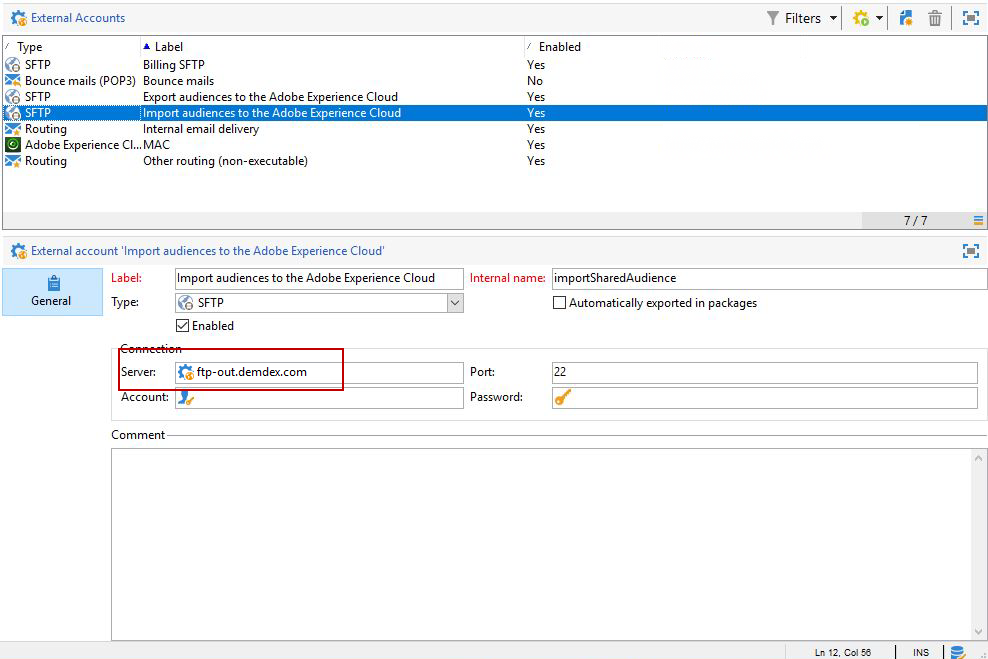

# Configuração da integração de públicos compartilhados no Adobe Campaign{#configuring-shared-audiences-integration-in-adobe-campaign}

Depois do envio dessa solicitação, a Adobe continuará a provisionar a integração e irá entrar em contato para fornecer detalhes e informações para você finalizar a configuração:

1. [Etapa 1: configurar ou verificar as contas externas no Adobe Campaign](#step-1--configure-or-check-the-external-accounts-in-adobe-campaign)
1. [Etapa 2: configurar a Fonte de dados](#step-2--configure-the-data-source)
1. [Etapa 3: configurar o servidor de rastreamento do Campaign](#step-3--configure-campaign-tracking-server)
1. [Etapa 4: configurar o Serviço de ID de visitante](#step-4--configure-the-visitor-id-service)

>[!IMPORTANT]
>
>Se você estiver usando o domínio demdex e seguir a sintaxe **ftp-out.demdex.com** para a conta externa de importação e **ftp-in.demdex.com** para a conta externa de exportação, será necessário adaptar apropriadamente sua implementação e ir para o conector do Serviço de Armazenamento Simples (S3) da Amazon para importar ou exportar dados. Para obter mais informações sobre como configurar suas contas externas com o Amazon S3, consulte esta [seção](../../integrations/using/configuring-shared-audiences-integration-in-adobe-campaign.md#step-1--configure-or-check-the-external-accounts-in-adobe-campaign).

## Etapa 1: configurar ou verificar as contas externas no Adobe Campaign {#step-1--configure-or-check-the-external-accounts-in-adobe-campaign}

Primeiro, precisamos configurar ou verificar as contas externas no Adobe Campaign como descrito a seguir:

1. Clique no ícone **[!UICONTROL Explorer]**.
1. Vá para **[!UICONTROL Administration > Platform > External accounts]**. As contas SFTP mencionadas devem ter sido configuradas pela Adobe e as informações necessárias devem ter sido comunicadas a você.

   * **[!UICONTROL importSharedAudience]**: conta dedicada à importação de públicos.
   * **[!UICONTROL exportSharedAudience]**: conta dedicada à exportação de públicos.

   

1. Selecione a conta externa **[!UICONTROL Export audiences to the Adobe Marketing Cloud]**.

1. No menu suspenso **[!UICONTROL Type]**, selecione **[!UICONTROL AWS S3]**.

1. Forneça os seguintes detalhes:

   * **[!UICONTROL AWS S3 Account Server]**
O URL do servidor deve ser preenchido da seguinte maneira:

      ```
      <S3bucket name>.s3.amazonaws.com/<s3object path>
      ```

   * **[!UICONTROL AWS access key ID]**
Para saber onde encontrar a ID da chave de acesso AWS, consulte esta [página](https://docs.aws.amazon.com/general/latest/gr/aws-sec-cred-types.html#access-keys-and-secret-access-keys).

   * **[!UICONTROL Secret access key to AWS]**
Para saber onde encontrar a chave de acesso secreta para o AWS, consulte esta [página](https://aws.amazon.com/fr/blogs/security/wheres-my-secret-access-key/).

   * **[!UICONTROL AWS Region]**
Para saber mais sobre a região do AWS, consulte esta [página](https://aws.amazon.com/about-aws/global-infrastructure/regions_az/).
   

1. Clique em **[!UICONTROL Save]** e configure a conta externa **[!UICONTROL Import audiences from the Adobe Marketing Cloud]** conforme detalhado nas etapas anteriores.

Suas contas externas estão configuradas.

## Etapa 2: configurar a Fonte de Dados {#step-2--configure-the-data-source}

A **ID do Visitante – Recipient** é criada no Audience Manager. Esta é uma fonte de dados pronta para uso configurada por padrão para a ID do Visitante. Os segmentos criados a partir do Campaign farão parte dessa fonte de dados.

Para configurar a fonte de dados do **[!UICONTROL Recipient - Visitor ID]**:

1. No nó **[!UICONTROL Explorer]**, selecione **[!UICONTROL Administration > Platform > AMC Data sources]**.
1. Selecione **[!UICONTROL Recipient - Visitor ID]**.
1. Digite o **[!UICONTROL Data Source ID]** e **[!UICONTROL AAM Destination ID]** fornecidos pela Adobe.

   

## Etapa 3: configurar o servidor de rastreamento do Campaign {#step-3--configure-campaign-tracking-server}

Para a configuração da integração com o Serviço Principal de Pessoas ou o Audience Manager, também é necessário configurar o servidor de rastreamento do Campaign.

Certifique-se de que o Servidor de Rastreamento do Campaign está registrado no domínio (CNAME). Você pode encontrar mais informações sobre delegação de nome de domínio [neste artigo](https://experienceleague.adobe.com/docs/deliverability-learn/deliverability-best-practice-guide/additional-resources/product-specific-resources/campaign/ac-domain-name-setup.html?lang=pt-BR).

## Etapa 4: configurar o Serviço de ID de visitante {#step-4--configure-the-visitor-id-service}

Se o serviço de ID do visitante nunca foi configurado em suas propriedades da Web ou sites, consulte este [documento](https://experienceleague.adobe.com/docs/id-service/using/implementation/setup-aam-analytics.html?lang=pt-BR) para saber como configurar o serviço ou este [vídeo](https://helpx.adobe.com/marketing-cloud/how-to/email-marketing.html#step-two).

Sua configuração e provisionamento estão finalizados, a integração agora pode ser usada para importar e exportar públicos ou segmentos.
