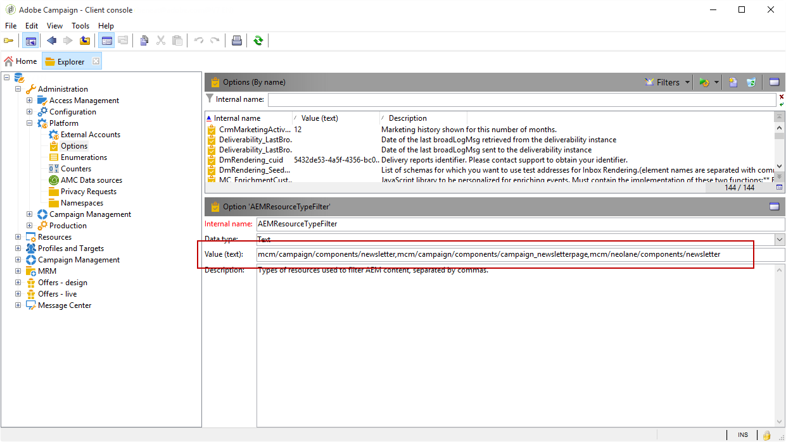

# Configurar a integração Campaign-AEM{#configuring-the-integration}


## Etapas de configuração no Adobe Campaign {#configuring-in-adobe-campaign}

Para usar essas duas soluções em conjunto, você deve configurá-las para se conectarem.

Siga as etapas abaixo para iniciar a configuração no Adobe Campaign:

1. [Instale o pacote de integração do AEM no Adobe Campaign.](#install-the-aem-integration-package-in-adobe-campaign)
1. [Configurar a conta externa](#configure-the-external-account)
1. [Configurar a filtragem de recursos do AEM](#configure-aem-resources-filtering)

Para configurações avançadas como gestão de campos e blocos de personalização. Consulte a [documentação](https://helpx.adobe.com/br/experience-manager/6-5/sites/administering/using/campaignonpremise.html) do Adobe Experience Manager.

### Instale o pacote de integração do AEM no Adobe Campaign. {#install-the-aem-integration-package-in-adobe-campaign}

Primeiro, é preciso instalar o pacote **[!UICONTROL AEM integration]**.

1. Na instância do Adobe Campaign, selecione **[!UICONTROL Tools]** na barra de ferramentas superior.
1. Selecione **[!UICONTROL Tools > Advanced > Import package...]**.

   

1. Selecione **[!UICONTROL Install a standard package]**.
1. Marque **[!UICONTROL AEM integration]** e clique no botão **[!UICONTROL Next]**.

   

1. Na próxima janela, clique no botão **[!UICONTROL Start]** para iniciar a instalação do pacote. Feche a janela após finalizar a instalação.

### Configuração da zona de segurança para o operador do AEM {#configure-the-security-zone-for-aem-operator}

O pacote **[!UICONTROL AEM integration]** define o operador **[!UICONTROL aemserver]** no Campaign. Este operador será usado para conectar o servidor do Adobe Experience Manager ao Adobe Campaign.

É necessário configurar uma zona de segurança para este operador se conectar ao Adobe Campaign pelo Adobe Experience Manager.

>[!CAUTION]
>
>É altamente recomendável criar uma zona de segurança dedicada ao AEM para evitar problemas de segurança. Para obter mais informações, consulte o [Guia](../../installation/using/security-zones.md) de instalação.

Se a sua instância do Campaign for hospedada pela Adobe, entre em contato com a equipe de [Atendimento ao cliente da Adobe](https://helpx.adobe.com/br/enterprise/admin-guide.html/enterprise/using/support-for-experience-cloud.ug.html). Se você estiver usando o Campaign no local, siga as etapas abaixo:

1. Abra o arquivo de configuração **serverConf.xml**.
1. Acesse o atributo **allowUserPassword** da zona de segurança selecionada e configure-o como **true**.

   Isso permitirá que o Adobe Experience Manager se conecte ao Adobe Campaign pelo login/senha.

### Configurar a conta externa {#configure-the-external-account}

O pacote **[!UICONTROL AEM integration]** criou a conta externa para o Adobe Experience Cloud. É necessário configurá-lo para se conectar com a sua instância do Adobe Experience Manager.

Para configurar a conta externa do AEM, siga as etapas abaixo:

1. Clique no botão **[!UICONTROL Explorer]**.

   

1. Selecione **[!UICONTROL Administration > Platform > External accounts]**.
1. Na lista **[!UICONTROL External account]**, selecione **[!UICONTROL AEM instance]**.
1. Insira os parâmetros para sua instância de criação do AEM:

   * **[!UICONTROL Server]**
   * **[!UICONTROL Account]**
   * **[!UICONTROL Password]**

   >[!NOTE]
   >
   >Certifique-se de que o endereço do **[!UICONTROL Server]** não termine com uma barra à direita.

   

1. Marque a caixa **[!UICONTROL Enabled]**.
1. Clique no botão **[!UICONTROL Save]**.

### Configurar a filtragem de recursos do AEM {#configure-aem-resources-filtering}

A opção **AEMResourceTypeFilter** é usada para filtrar tipos de recursos do Experience Manager que podem ser usados no Adobe Campaign. Isso permite que o Adobe Campaign recupere o conteúdo do Experience Manager especificamente projetado para ser usado somente no Adobe Campaign.

Para verificar se a opção **[!UICONTROL AEMResourceTypeFilter]** está configurada:

1. Clique no botão **[!UICONTROL Explorer]**.
1. Selecione **[!UICONTROL Administration > Platform > Options]**.
1. Na lista **[!UICONTROL Options]**, selecione **[!UICONTROL AEMResourceTypeFilter]**.
1. No campo **[!UICONTROL Value (text)]**, o caminho deve ser o seguinte:

   ```
   mcm/campaign/components/newsletter,mcm/campaign/components/campaign_newsletterpage,mcm/neolane/components/newsletter
   ```

   Ou em alguns casos:

   ```
   mcm/campaign/components/newsletter
   ```

   

## Etapas de configuração no Adobe Experience Manager {#configuring-in-adobe-experience-manager}

Siga as etapas abaixo para iniciar a configuração no Adobe Experience Manager:

1. Configure a **replicação** para replicar da instância de criação do AEM para a instância de publicação do AEM.

   Para saber como configurar a replicação, consulte a [documentação](https://helpx.adobe.com/br/experience-manager/6-5/sites/deploying/using/replication.html) do Adobe Experience Manager.

1. Conecte o Adobe Experience Manager ao Adobe Campaign configurando um **Serviço na Nuvem** dedicado.

   Para saber como conectar ambas as soluções pelos Serviços na Nuvem, consulte a [documentação](https://helpx.adobe.com/br/experience-manager/6-5/sites/administering/using/campaignonpremise.html#ConfiguringAdobeExperienceManager) do Adobe Experience Manager .

1. Configure o **serviço Externalizador**.

   Para saber como configurá-lo, consulte a [documentação](https://helpx.adobe.com/br/experience-manager/6-5/sites/developing/using/externalizer.html) do Adobe Experience Manager.
