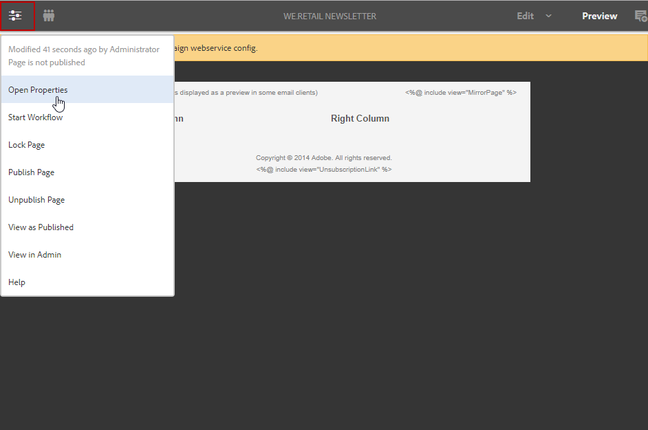
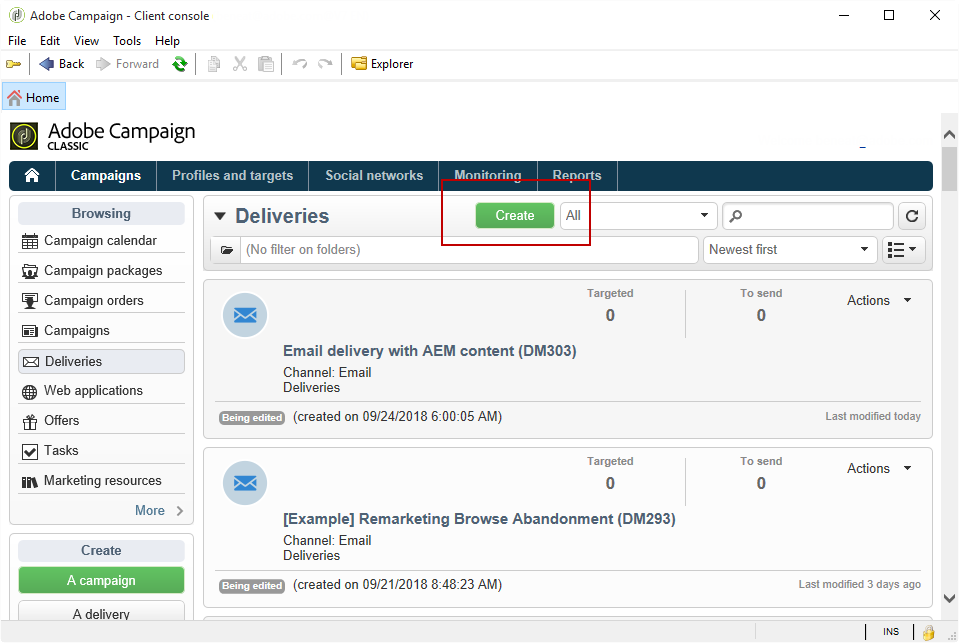
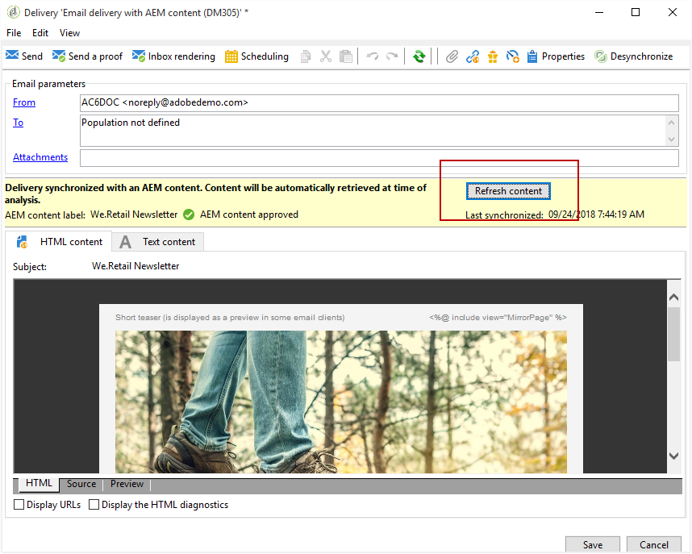

# Criação de boletim informativo no Experience Manager{#creating-an-experience-manager-newsletter}

Essa integração pode ser usada para criar um boletim informativo no Adobe Experience Manager que será usado no Adobe Campaign como parte de uma campanha de email.

Para obter um exemplo mais detalhado sobre como usar essa integração, consulte este [guia com o passo a passo](https://helpx.adobe.com/br/campaign/kb/acc-aem.html).

**No Adobe Experience Manager:**

1. Na instância do autor do AEM, clique no logotipo do **Adobe Experience** no lado superior esquerdo da página e selecione **[!UICONTROL Sites]**.

   

1. Selecione **[!UICONTROL Campaigns > Name of your brand (here We.Retail) > Main Area > Email campaigns]**.
1. Clique no botão **[!UICONTROL Create]** no lado superior direito da página e selecione **[!UICONTROL Page]**.

   

1. Selecione o modelo **[!UICONTROL Adobe Campaign Email (AC 6.1)]** e nomeie o informativo.
1. Depois que a página é criada, acesse o menu **[!UICONTROL Page information]** e clique em **[!UICONTROL Open Properties]**.

   

1. Na guia **[!UICONTROL Cloud Services]**, selecione **[!UICONTROL Adobe Campaign]** como **[!UICONTROL Cloud service configuration]** e sua instância do Adobe Campaign na segunda lista suspensa.

   

1. Edite seu conteúdo de email adicionando componentes, por exemplo, campos de personalização do Adobe Campaign.
1. Com o email pronto, acesse o menu **[!UICONTROL Page information]** e clique em **[!UICONTROL Start workflow]**.

   

1. Na primeira lista suspensa, selecione **[!UICONTROL Publish to Adobe Campaign]** como modelo de workflow e clique em **[!UICONTROL Start workflow]**.

   

1. Em seguida, como a etapa anterior, inicie o workflow **[!UICONTROL Approve for Campaign]**.
1. Um aviso de isenção de responsabilidade aparece na parte superior da página. Clique em **[!UICONTROL Complete]** para confirmar a revisão e clique em **[!UICONTROL Ok]**.

   

1. Clique novamente em **[!UICONTROL Complete]** e selecione **[!UICONTROL Newsletter approval]** no menu suspenso **[!UICONTROL Next Step]**.

   

Seu boletim informativo agora está pronto e sincronizado no Adobe Campaign.

**No Adobe Campaign:**

1. Na guia **[!UICONTROL Campaigns]**, clique em **[!UICONTROL Deliveries]** e em **[!UICONTROL Create]**.

   

1. No menu suspenso **[!UICONTROL Delivery template]**, selecione o modelo **[!UICONTROL Email delivery with AEM content (mailAEMContent)]**.

   

1. Adicione um **[!UICONTROL Label]** ao delivery e clique em **[!UICONTROL Continue]**.
1. Clique no botão **[!UICONTROL Synchronize]**.

   Se esse botão não aparecer na interface, clique no botão **[!UICONTROL Properties]** e selecione a guia **[!UICONTROL Advanced]**. O campo **[!UICONTROL Content editing mode]** deve ser definido no **[!UICONTROL AEM]** com sua instância do AEM no campo **[!UICONTROL AEM account]**.

   

1. Selecione o delivery criado anteriormente no Adobe Experience Manager e clique em **[!UICONTROL Ok]**.
1. Clique no botão **[!UICONTROL Refresh content]** assim que algumas alterações forem feitas no delivery do AEM.

   

O email agora está pronto para ser enviado ao seu público-alvo.
