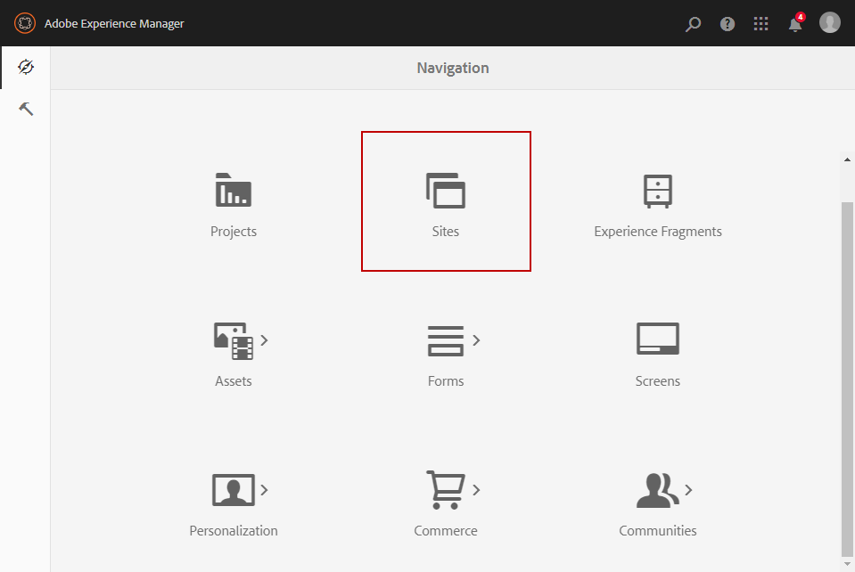
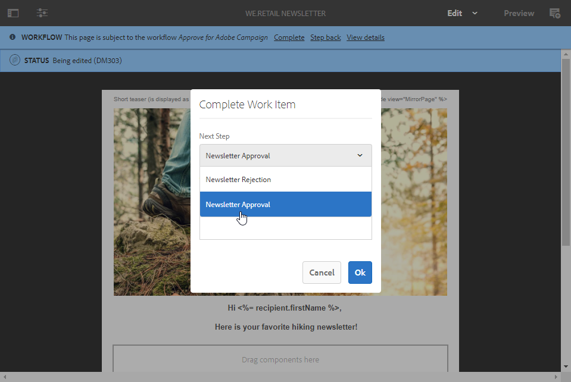

# Criação de boletim informativo no Experience Manager{#creating-an-experience-manager-newsletter}

Essa integração pode ser usada para criar um boletim informativo no Adobe Experience Manager que será usado no Adobe Campaign como parte de uma campanha de email.

Para obter um exemplo mais detalhado sobre como usar essa integração, consulte este [guia com o passo a passo](https://docs.campaign.adobe.com/doc/AC/getting_started/EN/aem.html).

**No Adobe Experience Manager:**

1. Na instância de criação do AEM, clique no logotipo **Adobe Experience** no lado superior esquerdo da página e selecione **[!UICONTROL Sites]**.

   

1. Select **[!UICONTROL Campaigns > Name of your brand (here We.Retail) > Master Area > Email campaigns]**.
1. Click the **[!UICONTROL Create]** button in the upper right side of the page then select **[!UICONTROL Page]**.

   

1. Select the **[!UICONTROL Adobe Campaign Email (AC 6.1)]** template and name your newsletter.
1. Once your page is created, access the **[!UICONTROL Page information]** menu and click **[!UICONTROL Open Properties]**.

   

1. In the **[!UICONTROL Cloud Services]** tab, select **[!UICONTROL Adobe Campaign]** as **[!UICONTROL Cloud service configuration]** and your Adobe Campaign instance in the second drop-down.

   

1. Edite seu conteúdo de email adicionando componentes como, por exemplo, campos de personalização do Adobe Campaign.
1. When your email is ready, access the **[!UICONTROL Page information]** menu and click **[!UICONTROL Start workflow]**.

   

1. From the first drop-down, select **[!UICONTROL Publish to Adobe Campaign]** as workflow model and click **[!UICONTROL Start workflow]**.

   

1. Then, as the previous step, launch the **[!UICONTROL Approve for Campaign]** workflow.
1. Um aviso de isenção de responsabilidade aparece na parte superior da página. Click **[!UICONTROL Complete]** to confirm the review and click **[!UICONTROL Ok]**.

   

1. Clique novamente **[!UICONTROL Complete]** e selecione **[!UICONTROL Newsletter approval]** no **[!UICONTROL Next Step]** menu suspenso.

   

Seu boletim informativo agora está pronto e sincronizado no Adobe Campaign.

**No Adobe Campaign:**

1. Na **[!UICONTROL Campaigns]** guia, clique em **[!UICONTROL Deliveries]** e em **[!UICONTROL Create]**.

   

1. Na lista **[!UICONTROL Delivery template]** suspensa, selecione o **[!UICONTROL Email delivery with AEM content (mailAEMContent)]** modelo.

   

1. Add a **[!UICONTROL Label]** to your delivery and click **[!UICONTROL Continue]**.
1. Clique no botão **[!UICONTROL Synchronize]**.

   If this button does not appear in your interface, click the **[!UICONTROL Properties]** button and select the **[!UICONTROL Advanced]** tab. The **[!UICONTROL Content editing mode]** field should be set to **[!UICONTROL AEM]** with your AEM instance in the **[!UICONTROL AEM account]** field.

   

1. Select the delivery previously created in Adobe Experience Manager and click **[!UICONTROL Ok]**.
1. Click the **[!UICONTROL Refresh content]** button as soon as some changes are made to your AEM delivery.

   

Seu email agora está pronto para ser enviado ao seu público.
