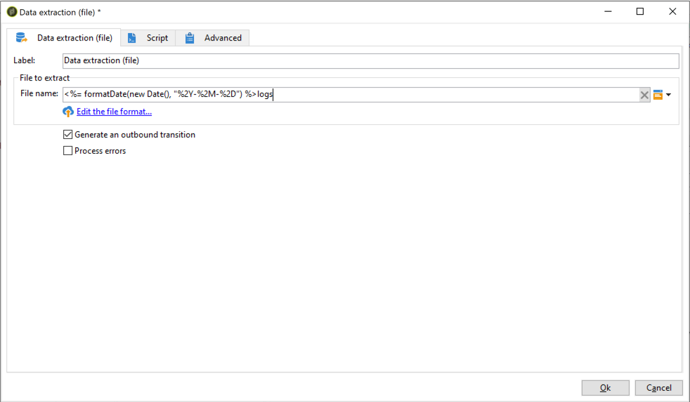

# Exportar dados do Campaign para a Adobe Experience Platform {#sources}

Para exportar dados do Campaign Classic para a Plataforma de dados do cliente em tempo real (RTCDP) da Adobe, primeiro é necessário criar um fluxo de trabalho no Campaign Classic para exportar para seu local de armazenamento de blobs do S3 ou do Azure os dados que você deseja compartilhar.

Depois que o fluxo de trabalho tiver sido configurado e os dados forem enviados para o local de armazenamento, será necessário conectar o local de armazenamento de blobs do S3 ou do Azure como uma **Origem** na Adobe Experience Platform.

>[!NOTE]
>
>Observe que é recomendável exportar apenas os dados gerados pelo Campaign (por exemplo, envios, aberturas, cliques etc.) para a Adobe Experience Platform. Os dados assimilados de uma fonte de terceiros (como seu CRM) devem ser importados diretamente para a Adobe Experience Platform.

## Criar um fluxo de trabalho de exportação no Campaign Classic

Para exportar dados do Campaign Classic para o local de armazenamento de blobs do S3 ou do Azure Blob, você precisa criar um fluxo de trabalho para direcionar os dados que deseja exportar e enviá-los para o local de armazenamento.

Para fazer isso, adicione e configure:

* Uma atividade **[!UICONTROL Data extraction (file)]** para extrair os dados direcionados em um arquivo CSV. Para obter mais informações sobre como configurar esta atividade, consulte [esta seção](../../workflow/using/extraction--file-.md).

   

* Uma atividade **[!UICONTROL File transfer]** para transferir o arquivo CSV para o local de armazenamento. Para obter mais informações sobre como configurar uma atividade , consulte [esta seção](../../workflow/using/file-transfer.md).

   

Como exemplo, o fluxo de trabalho abaixo extrai logs regularmente em um arquivo CSV e o transfere para um local de armazenamento.

## Conectar seu local de armazenamento como uma Origem

As principais etapas para conectar seu local de armazenamento de blobs do S3 ou do Azure como uma **Origem** na Adobe Experience Platform estão listadas abaixo. Informações detalhadas sobre cada uma dessas etapas estão disponíveis na [Documentação dos conectores de origem](https://experienceleague.adobe.com/docs/experience-platform/sources/home.html?lang=pt-BR).

1. No menu **[!UICONTROL Sources]** da Adobe Experience Platform, crie uma conexão com o local de armazenamento:

   * [Criar uma conexão de origem do Amazon S3](https://experienceleague.adobe.com/docs/experience-platform/sources/ui-tutorials/create/cloud-storage/s3.html?lang=pt-BR)
   * [Conector de blob do Azure](https://experienceleague.adobe.com/docs/experience-platform/sources/connectors/cloud-storage/blob.html?lang=pt-BR)

   >[!NOTE]
   >
   >O local de armazenamento pode ser Amazon S3, SFTP com senha, SFTP com chave SSH ou conexões de blob do Azure. O método preferido para enviar dados para o Adobe Campaign é por meio do Amazon S3 ou Blob do Azure:

   

1. Configure um fluxo de dados para uma conexão em lote de armazenamento na nuvem. Um fluxo de dados é uma tarefa agendada que recupera e assimila dados do local de armazenamento para um conjunto de dados da Adobe Experience Platform. Essas etapas permitem configurar a assimilação de dados do local de armazenamento, incluindo a seleção de dados e o mapeamento dos campos CSV para um esquema XDM.

   Informações detalhadas estão disponíveis [nesta página](https://experienceleague.adobe.com/docs/experience-platform/sources/ui-tutorials/dataflow/cloud-storage.html?lang=pt-BR).

   

1. Após a configuração da Origem, a Adobe Experience Platform importará o arquivo do local de armazenamento fornecido.

   Essa operação pode ser agendada de acordo com suas necessidades. Recomendamos executar a exportação até 6 vezes por dia, dependendo da carga já presente na instância.
