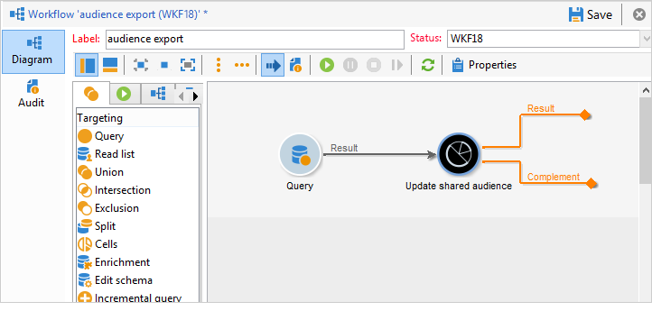
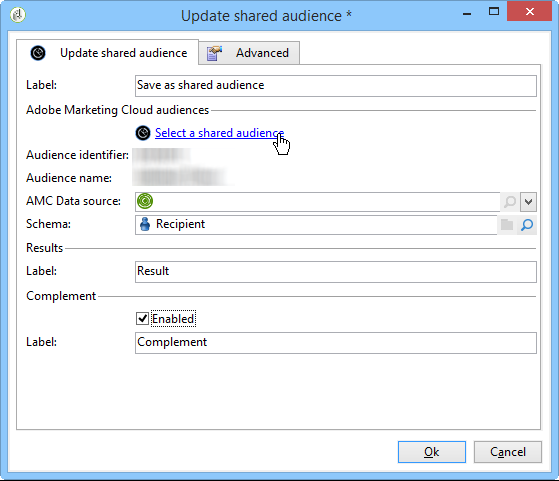

# Importação e exportação de públicos{#importing-and-exporting-audiences}

## Importação de um público {#importing-an-audience}

Você pode importar públicos/segmentos do Audience Manager ou do Serviço principal de pessoas para o Adobe Campaign através das listas de recipients.

1. Go to the **[!UICONTROL Profiles and Targets]** > **[!UICONTROL Lists]** node in the Adobe Campaign explorer.
1. In the action bar, select **[!UICONTROL New]** > **[!UICONTROL Create a shared audience...]**.

   

1. Na janela que abre, clique em **[!UICONTROL Select a shared audience]** para abrir a lista de audiences/segmentos compartilhados disponíveis nas outras soluções da Adobe Experience Cloud.
1. Selecione um público e confirme. As informações do público são concluídas automaticamente.

   Observe que para poder importar público compartilhado, o produto **[!UICONTROL Audience library]** dever ter sido atribuído a você no console do administrador e você deve ser um administrador no Audience Manager. Para obter mais informações, consulte a [documentação do console do administrador](https://helpx.adobe.com/br/enterprise/managing/user-guide.html).

   

1. Selecione a fonte de dados AMC no campo **[!UICONTROL AMC Data source]** para definir o tipo de dados esperado.

   

1. Salve o público.

O público é importado por meio de um workflow técnico. A lista importada contém elementos que podem ser reconciliados usando a fonte de dados da AMC. Os elementos que não são reconhecidos pelo Adobe Campaign não são importados.

O processo de importação leva de 24 a 36 horas para sincronizar, quando os segmentos são importados diretamente do Serviço principal de pessoas ou do Audience Manager. Após esse período, é possível encontrar e usar seu novo público no Adobe Campaign.

>[!NOTE]
>
>Se você estiver importando públicos do Adobe Analytics para o Adobe Campaign, esses públicos precisam ser compartilhados primeiro no Serviço Principal de Pessoas ou no Audience Manager. Esse processo leva de 12 a 24 horas, e deve ser adicionado ao tempo de sincronização de 24 a 36 horas com o Campaign.
>
>Nesse caso específico, o período de compartilhamento de público pode durar até 60 horas. Para obter mais informações sobre o compartilhamento de público do Adobe Analytics no Serviço Principal de Pessoas e no Audience Manager, consulte esta [documentação](https://docs.adobe.com/content/help/en/analytics/components/segmentation/segmentation-workflow/seg-publish.html).

Os dados do público são substituídos completamente sempre quando sincronizados. Apenas segmentos podem ser importados. Dados granulares, incluindo pares chave-valor, características e regras não são compatíveis.

## Exportação de um público {#exporting-an-audience}

Você pode exportar um público do Adobe Campaign para o Audience Manager ou o Serviço Principal de Pessoas usando um workflow. Os processos para criar e usar um workflow são detalhados [neste documento](../../workflow/using/building-a-workflow.md). Os públicos exportados são salvos como segmentos no Serviço principal de pessoas:

1. Criação de um novo workflow para construção do target
1. Usando as diferentes atividades disponíveis, target de conjunto de recipients.
1. After the targeting, drag and drop an **[!UICONTROL Update shared audience]** activity, then open it.

   

1. Define the audience that you want to export via the **[!UICONTROL Select a shared audience]** option. Na janela que abre, você pode selecionar um público existente ou criar um novo público.

   Se você selecionar um público existente, somente os novos registros serão adicionados ao público.

   Para exportar sua lista de recipients para um novo público, preencha o campo **[!UICONTROL Segment name]** e depois clique em **[!UICONTROL Create]** antes de selecionar o público recém-criado.

   Conclua a operação clicando no símbolo de seleção na parte superior direita da janela e, em seguida, no botão **[!UICONTROL OK]**.

1. Select the **[!UICONTROL AMC Data source]** to specify the expected data type. O schema é determinado automaticamente.

   

1. Salve o público.

O público é então exportado. A atividade de público salva tem duas transições de saída. A transição principal contém os recipients que foram exportados com êxito. A transição adicional contém os recipients que não puderam ser mapeados com uma ID de visitante ou ID declarada.

A sincronização entre o Adobe Campaign e o Serviço principal de pessoas leva de 24 a 36 horas. Após esse período, é possível encontrar seu novo público no Serviço principal de pessoas e reutilizá-lo em outras soluções da Adobe Experience Cloud. Para obter mais informações sobre como usar um público compartilhado do Adobe Campaign no Serviço principal de pessoas da Adobe, consulte esta [documentação](https://docs.adobe.com/content/help/en/core-services/interface/audiences/t-audience-create.html).

>[!NOTE]
>
>Para serem reconciliados, os registros devem ter uma ID da Adobe Experience Cloud (&#39;ID do visitante&#39; ou &#39;ID declarada&#39;). Os registros que não têm uma ID da Adobe Experience Cloud são ignorados ao exportar e importar públicos.

