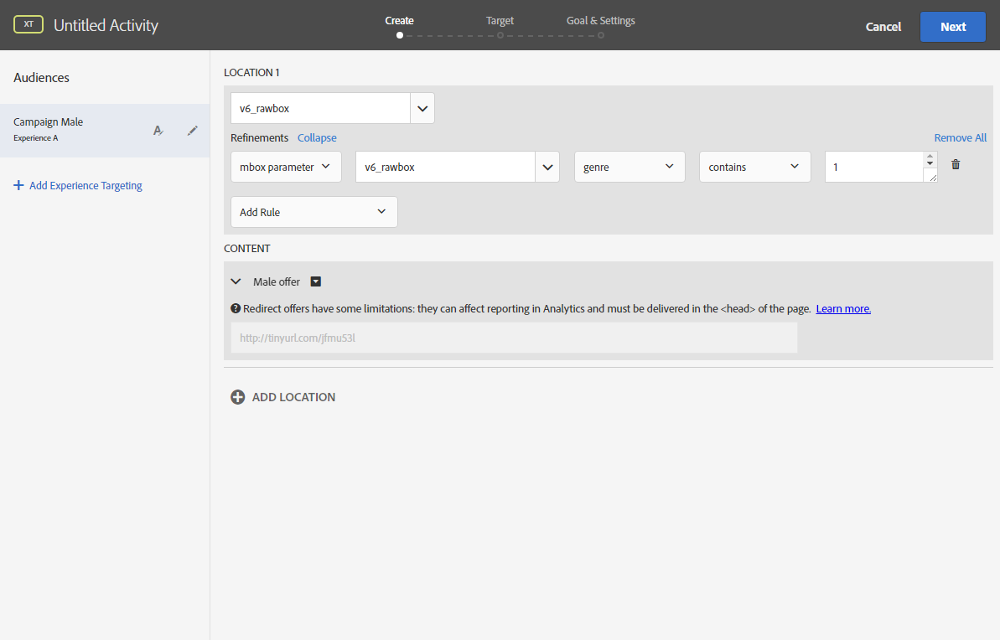

# Inserção de uma imagem dinâmica{#inserting-a-dynamic-image}

Essa seção detalha as etapas a serem executadas no Adobe Campaign para integrar uma imagem do Adobe Target em um email.

Você deve executar as seguintes ações no Adobe Target previamente:

* Crie uma ou várias [ofertas de redirecionamento](https://marketing.adobe.com/resources/help/en_US/tnt/help/t_Creating_a_Redirect_Offer.html), em que você deve especificar a URL da imagem que usará.
* Crie um ou vários [públicos](https://marketing.adobe.com/resources/help/en_US/target/target/t_create-audience.html)para definir o target da atividade.
* Crie uma atividade [baseada no formulário de experiência de compositor](https://marketing.adobe.com/resources/help/en_US/tnt/help/t_Creating_an_A_B_Test.html) , na qual você deve selecionar um rawbox e especificar várias experiências, dependendo do número de ofertas de redirecionamento criadas. Para cada experiência, você deve selecionar uma das ofertas de redirecionamento criadas.

   Para especificar essas experiências, você pode criar segmentos usando informações do Adobe Campaign. Para usar dados do Adobe Campaign nas regras de seleção da oferta, especifique os dados no rawbox no Adobe Target.

Para inserir uma imagem do Adobe Target em um delivery do Adobe Campaign:

1. Crie um delivery de email
1. Nos campos de personalização disponíveis, selecione **[!UICONTROL Include > Dynamic image served by Adobe Target]**.

   

1. Na janela que é aberta, selecione a imagem que será exibida por padrão no email. Você pode especificar a URL da imagem ou utilizar uma [imagem compartilhada](../../integrations/using/sharing-assets-with-adobe-experience-cloud.md).
1. Insira o nome do rawbox especificado no Adobe Target.
1. Enter a URL in the **[!UICONTROL Landing Page]** field if you want the default image to redirect to a default landing page. Essa URL é somente para os casos que a imagem padrão é exibida no email final e é opcional.
1. Se você usar permissões do Enterprise em suas configurações no Adobe Target, adicione a propriedade correspondente nesse campo. Saiba mais sobre as permissões do Target Enterprise [nesta página](https://marketing.adobe.com/resources/help/en_US/target/target/properties-overview.html). Este campo é opcional e não é necessário se você não usar permissões do Enterprise no Target.
1. In **[!UICONTROL Additional decision parameters]**, specify the mapping between the fields defined in the Adobe Target segments and the Adobe Campaign fields. Os campos do Adobe Campaign usados devem ter sido especificados no rawbox.

   

   A definição de um parâmetro no Adobe Target é realizada pelo rawbox criado ao integrar a imagem do Target no Adobe Campaign e a opção **Refinamentos**.

   

   O exemplo mostrado aqui demonstra como definir experiências diferentes para homens e mulheres.

Você também pode definir vários casos com base no domínio e no endereço de email do usuário. Os dados são automaticamente recuperados do navegador do usuário quando o email é aberto.

Ao pré-visualizar seu email, você pode ver, ao selecionar perfis diferentes, que a imagem inseriu alterações, dependendo dos parâmetros especificados na atividade do Adobe Target e do Adobe Campaign.

Você pode medir os resultados enviados no Adobe Target.

