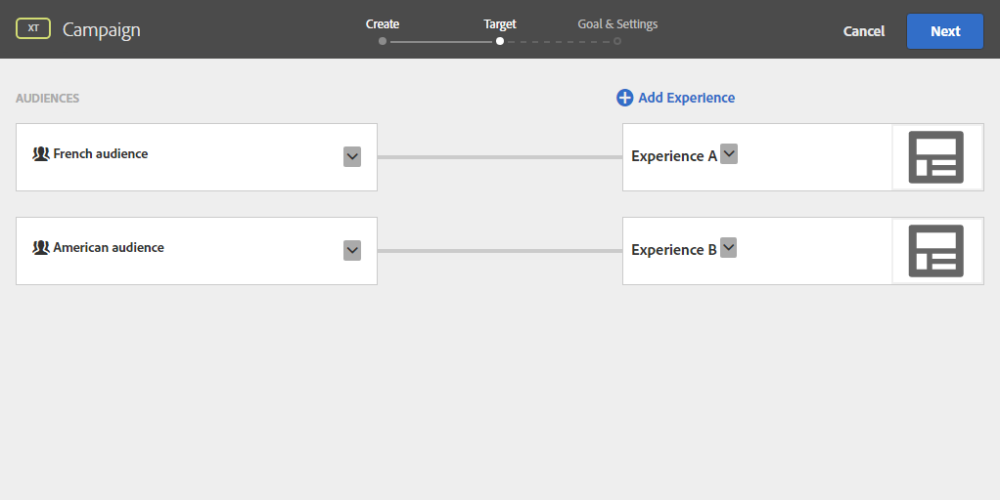

# Inserir conteúdo dinâmico do Público alvo {#inserting-a-dynamic-image}

Neste guia, apresentaremos como integrar uma oferta dinâmica do Target em um e-mail no Adobe Campaign.

Queremos criar uma entrega que inclua um bloco de imagens que será alterado dinamicamente de acordo com o país do recipient. Os dados são enviados com cada solicitação mbox e dependem do endereço IP do visitante.

Neste e-mail, queremos que uma das imagens varie dinamicamente de acordo com as seguintes experiências do usuário:

* O e-mail é aberto na França.
* O e-mail é aberto nos Estados Unidos.
* Se nenhuma dessas condições se aplicar, uma imagem padrão será exibida.

Para que isso funcione, precisamos executar as seguintes etapas no Adobe Campaign e no Target:

1. [Como inserir a oferta dinâmica em um e-mail](../../integrations/using/inserting-a-dynamic-image.md#inserting-dynamic-offer)
1. [Criação de ofertas de redirecionamento](../../integrations/using/inserting-a-dynamic-image.md#create-redirect-offers)
1. [Criação de públicos-alvo](../../integrations/using/inserting-a-dynamic-image.md#audiences-target)
1. [Como criar uma atividade de segmentação por experiência](../../integrations/using/inserting-a-dynamic-image.md#creating-targeting-activity)
1. [Pré-visualização e envio de e-mail](../../integrations/using/inserting-a-dynamic-image.md#preview-send-email)

## Como inserir a oferta dinâmica em um e-mail {#inserting-dynamic-offer}

No Adobe Campaign, depois de definir o destino e o conteúdo do seu e-mail, você pode inserir uma imagem dinâmica do Target.

Para fazer isso, especifique o URL da imagem padrão, o nome do local e os campos que você deseja transferir para o Target.

No Adobe Campaign, há duas maneiras de inserir uma imagem dinâmica do Target em um e-mail:

* Se você estiver usando o editor de conteúdo digital, escolha uma imagem existente e selecione **[!UICONTROL Insert]** > **[!UICONTROL Dynamic image served by Adobe Target]** na barra de ferramentas.

   

* If you are using the standard editor, place the cursor where you want to insert the image and select **[!UICONTROL Include]** > **[!UICONTROL Dynamic image served by Adobe Target...]** from the personalization drop-down menu.

   

### Como definir os Parâmetros da Imagem {#defining-image-parameters}

* The **[!UICONTROL Default image]**&#39;s URL: The image that will be displayed when none of the conditions are fulfilled. Você também pode selecionar uma imagem da sua biblioteca de recursos.
* The **[!UICONTROL Target location]**: Enter a name for your dynamic offer&#39;s location. Você terá que selecionar este local na sua atividade do público-alvo.
* A **[!UICONTROL Landing Page]**: Se desejar que a imagem padrão seja redirecionada para uma landing page padrão. Essa URL é somente para os casos que a imagem padrão é exibida no email final e é opcional.
* The **[!UICONTROL Additional decision parameters]**: Specify the mapping between the fields defined in the Adobe Target segments and the Adobe Campaign fields. Os campos do Adobe Campaign usados devem ter sido especificados no rawbox. Em nosso exemplo, adicionamos o campo País.

Se você usar permissões do Enterprise em suas configurações no Adobe Target, adicione a propriedade correspondente nesse campo. Saiba mais sobre as permissões do Target Enterprise [nesta página](https://marketing.adobe.com/resources/help/en_US/target/target/properties-overview.html).

## Criação de ofertas de redirecionamento {#create-redirect-offers}

No Público alvo, você pode criar diferentes versões da sua oferta. Dependendo da experiência de cada usuário, uma oferta de redirecionamento pode ser criada e você pode especificar a imagem que será exibida.

Em nosso caso, precisamos de duas ofertas de redirecionamento, a terceira (a padrão) deve ser definida no Adobe Campaign.

1. Para criar uma nova oferta de redirecionamento no Público alvo Standard, na guia **[!UICONTROL Content]** , clique em **[!UICONTROL Code offers]**.

1. Clique em **[!UICONTROL Create]** e em **[!UICONTROL Redirect Offer]**.

   

1. Insira um nome para a oferta e a URL de sua imagem.

   

1. Siga o mesmo procedimento para a oferta de redirecionamento restante. Para obter mais informações, consulte esta [página](https://docs.adobe.com/help/en/target/using/experiences/offers/offer-redirect.html).

## Criação de públicos-alvo {#audiences-target}

No Público alvo, você precisa criar as duas audiências nas quais as pessoas que visitam sua oferta serão categorizadas para que os diferentes conteúdos sejam entregues. Para cada público, adicione uma regra para definir quem poderá ver a oferta.

1. Para criar uma nova audiência no Público alvo, na **[!UICONTROL Audiences]** guia, clique em **[!UICONTROL Create Audience]**.

   

1. Adicione um nome à sua audiência.

   

1. Clique **[!UICONTROL Add a rule]** e selecione uma categoria. A regra usa critérios específicos para direcionar os visitantes. É possível refinar as regras adicionando condições ou criando novas regras em outras categorias.

1. Siga o mesmo procedimento para os públicos restantes.

## Como criar uma atividade de segmentação por experiência {#creating-targeting-activity}

No Público alvo, precisamos criar uma atividade de direcionamento de experiência, definir as diferentes experiências e associá-las às ofertas correspondentes.

### Como definir o público {#defining-the-audience}

1. Para criar uma atividade de direcionamento de experiência, na **[!UICONTROL Activities]** guia, clique em **[!UICONTROL Create Activity]** e em **[!UICONTROL Experience Targeting]**.

   

1. Selecione **[!UICONTROL Form]** como **[!UICONTROL Experience Composer]**.

1. Escolha uma audiência clicando no **[!UICONTROL Change audience]** botão.

   

1. Selecione a audiência criada nas etapas anteriores.

   

1. Crie outra experiência clicando em **[!UICONTROL Add Experience Targeting]**.

### Como definir a localização e o conteúdo {#defining-location-content}

Adicione um conteúdo para cada público:

1. Selecione o nome do local escolhido ao inserir a oferta dinâmica no Adobe Campaign.

   

1. Clique no botão suspenso e selecione **[!UICONTROL Change Redirect Offer]**.

   

1. Selecione a oferta de redirecionamento que você criou anteriormente. 

   

1. Siga as mesmas etapas para a segunda experiência.

### Como definir a atividade {#defining-activity}

The **[!UICONTROL Target]** window summarizes your activity. Se necessário, você pode adicionar outras experiências.

The **[!UICONTROL Goal & Settings]** window allows you to personalize your activity by setting a priority, an objective, or a duration.

The **[!UICONTROL Reporting Settings]** section lets you select an action and edit the parameters that will determine when your goal is achieved.

## Visualizar e enviar o email no Campaign Classic {#preview-send-email}

No Adobe Campaign, agora você pode visualizar seu e-mail e testar sua renderização em diferentes recipients. Você notará que a imagem muda de acordo com as diferentes experiências criadas. To learn more on email creation, refer to this [page](../../delivery/using/defining-the-email-content.md).

Agora você está pronto para enviar seu e-mail, incluindo uma oferta dinâmica do público-alvo.

