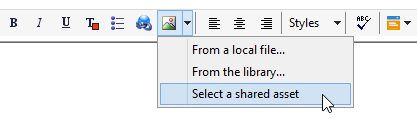
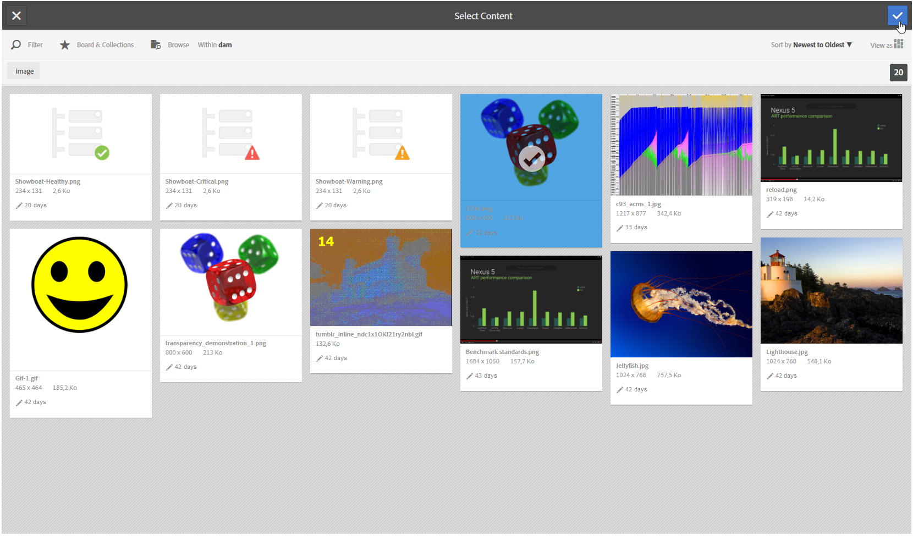

# Inserção de um ativo compartilhado{#inserting-a-shared-asset}

Os ativos compartilhados da Adobe Experience Cloud podem ser usados em seus emails e páginas de destino da seguinte maneira:

1. Crie um novo email ou uma nova página de destino.

   Se você usar ativos da biblioteca do Adobe Experience Manager Assets, use um modelo de entrega criado ao [configurar a integração](../../integrations/using/configuring-access-to-assets.md#integrating-with-aem-assets).

   Se não tiver esse modelo específico, assegure-se de que nas **Propriedades** da entrega a **[!UICONTROL Content editing mode]** (guia **[!UICONTROL Advanced]**) esteja definida como **DCE** e que a conta externa do AEM usada para acessar a biblioteca de recursos do AEM Assets seja fornecida.

1. Na janela de edição, selecione a opção para adicionar uma imagem:

   * Se estiver usando o [modo de edição padrão](https://experienceleague.adobe.com/pt-br/docs/campaign/campaign-v8/send/emails/defining-the-email-content#adding-images){target="_blank"}, selecione **[!UICONTROL Image]** > **[!UICONTROL Select a shared asset]**.

     

   * Se estiver usando o [modo de edição avançado](../../web/using/about-campaign-html-editor.md) (DCE), vá para um bloco de imagem e, por meio do menu contextual, selecione **[!UICONTROL Select a shared asset]**.

     

     >[!NOTE]
     >
     >Não é possível inserir imagens compartilhadas do Adobe Campaign no [acesso Web](../../platform/using/adobe-campaign-workspace.md#console-and-web-access) ao usar DCE.

1. Na janela de seleção que é aberta, selecione uma imagem e depois confirme.

   As imagens disponíveis são da biblioteca da Adobe Experience Cloud ou da biblioteca do AEM Assets, dependendo de como a instância da Adobe Campaign é configurada. Consulte a seção [Configurar acesso ao Assets](../../integrations/using/configuring-access-to-assets.md).

   

>[!NOTE]
>
>Se você usar a integração com o Adobe Target, poderá usar uma imagem compartilhada como uma imagem padrão. Consulte [esta página](../../integrations/using/integrating-with-adobe-target.md).
