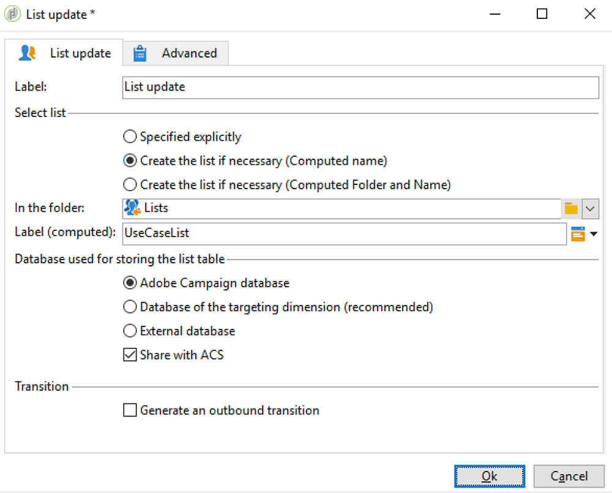
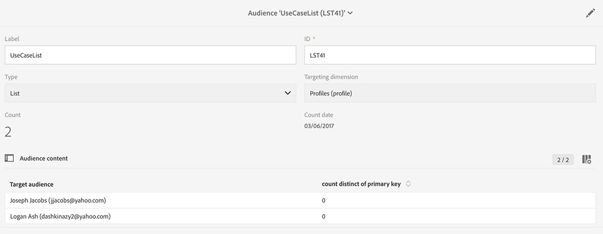

# Sincronia de público{#synchronizing-audiences}

Você pode criar uma lista sofisticada usando os recursos avançados do Campaign v7 e compartilhar essa lista como um público diretamente e em tempo real com o Campaign Standard (incluindo dados adicionais) de forma contínua. O usuário do Campaign Standard pode então consumir o público no Adobe Campaign Standard.

Targets complexos envolvendo dados adicionais que não são replicados no Campaign Standard só podem ser alcançados usando o Campaign v7.

Você também pode simplesmente compartilhar listas de recipients ou dados provenientes de um conector como o Microsoft Dynamics com o Campaign Standard.

Esse caso de uso mostra como preparar o target de seu delivery no Campaign v7 e como reutilizar esse destino e seus dados adicionais em um delivery criado e enviado com o Adobe Campaign Standard.

>[!NOTE]
>
>Você também pode enriquecer dados usando agregações e coleções no Adobe Campaign Standard se todos os dados que você precisa já forem replicados.

## Pré-requisitos {#prerequisites}

Para isso, é necessário:

* Os recipients armazenados no banco de dados do Campaign v7 e sincronizados com o Campaign Standard. Consulte a seção [Sincronia de perfis](../../integrations/using/synchronizing-profiles.md).
* Dados adicionais, como assinaturas ou transações armazenadas em tabelas relacionadas a nms:recipients no banco de dados do Campaign v7. Esses dados podem ser dos schemas de OOB ou em tabelas personalizadas do Campaign v7. Por padrão, eles não estão disponíveis no Campaign Standard, pois não são sincronizados.
* Direito para executar workflows no Campaign v7 e Campaign Standard.
* Direita para criar e executar um workflow no Campaign Standard.

## Criação de um workflow para construção do target com dados adicionais no Campaign v7 {#create-a-targeting-workflow-with-additional-data-in-campaign-v7}

Targets complexos envolvendo dados adicionais que não são replicados no Campaign Standard só podem ser alcançados usando o Campaign v7.

Quando o target e seus dados adicionais forem definidos, é possível salvá-lo como uma lista que pode ser compartilhada com o Campaign Standard.

>[!NOTE]
>
>Este é um exemplo. Dependendo dos requisitos, você pode simplesmente fazer um query de uma lista de recipients e compartilhá-la com ACS sem nenhum processamento adicional. Você também pode usar outras atividades de gestão de dados para preparar seu target final.

Para obter o público final e seus dados adicionais:

1. Crie um novo workflow a partir de **[!UICONTROL Profiles and Targets]** > **[!UICONTROL Jobs]** > **[!UICONTROL Targeting workflows]**.
1. Adicione uma atividade **[!UICONTROL Query]** e selecione os destinatários para enviar o email final. Por exemplo, todos os recipients entre 18 e 30 anos que moram na França.

   

1. Adicionar dados adicionais dentro do query. Para obter mais informações, consulte a seção [Adição de dados](../../workflow/using/query.md#adding-data).

   Este exemplo mostra como adicionar um agregado para contar quantos deliveries um recipient recebeu em um ano.

   Em **[!UICONTROL Query]** , selecione **[!UICONTROL Add data...]**.

   

1. Selecione **[!UICONTROL Data linked to the filtering dimension]** e clique em **[!UICONTROL Next]**.

   

1. Escolha **[!UICONTROL Data linked to the filtering dimension]**, selecione o nó **[!UICONTROL Recipient delivery logs]** e clique em **[!UICONTROL Next]**.

   

1. Selecione **[!UICONTROL Aggregates]** no campo **[!UICONTROL Data collected]** e clique em **[!UICONTROL Next]**.

   

1. Adicione uma condição de filtragem para considerar apenas os logs criados nos últimos 365 dias e clique em **[!UICONTROL Next]**.

   

1. Defina as colunas de output. Aqui, a única coluna necessária é a que conta o número de deliveries. Para fazer isso:

   * Selecione a opção **[!UICONTROL Add]** na direita da janela.
   * Na janela **[!UICONTROL Select field]**, clique em **[!UICONTROL Advanced selection]**.
   * Selecione **[!UICONTROL Aggregate]** e depois **[!UICONTROL Count]**. Marque a opção **[!UICONTROL Distinct]** e clique em **[!UICONTROL Next]**.
   * Na lista de campos, selecione o campo usado para a função **Contagem** . Escolha um campo que sempre deve estar preenchido, por exemplo, o campo **[!UICONTROL Primary key]**, e clique em **[!UICONTROL Finish]**.
   * Altere a expressão na coluna **[!UICONTROL Alias]**. Esse alias permitirá recuperar facilmente a coluna adicionada no delivery final. Por exemplo, **NBdeliveries**.
   * Clique em **[!UICONTROL Finish]** e salve a atividade de configuração de **[!UICONTROL Query]**.

   

1. Salve o workflow. A próxima seção demonstra como compartilhar o público com o ACS.

## Compartilhamento do target com o Campaign Standard {#share-the-target-with-campaign-standard}

Uma vez definido o público alvo, é possível compartilhá-lo com ACS por meio de uma atividade **[!UICONTROL List update]**.

1. No workflow criado anteriormente, adicione uma atividade **[!UICONTROL List update]** e especifique a lista que deseja atualizar ou criar.

   Especifique a pasta na qual deseja salvar a lista no Campaign v7. As listas estão sujeitas ao mapeamento de pastas definido durante a implementação, que pode ter impacto em sua visibilidade uma vez compartilhado no Campaign Standard. Consulte a seção [Conversão de direitos](../../integrations/using/acs-connector-principles-and-data-cycle.md#rights-conversion).

1. Verifique se a opção **[!UICONTROL Share with ACS]** está marcada. Ela é marcada por padrão.

   

1. Salve e execute o workflow.

   O target e seus dados adicionais são salvos em uma lista no Campaign v7 e compartilhados imediatamente como uma lista de público no Campaign Standard. Somente os perfis replicados são compartilhados com ACS.

Se ocorrer um erro na atividade **[!UICONTROL List update]**, significa que a sincronização com o Campaign Standard pode ter falhado. Para ver mais detalhes do que deu errado, acesse **[!UICONTROL Administration]** > **[!UICONTROL ACS Connector]** > **[!UICONTROL Process]** > **[!UICONTROL Diagnosis]**. Esta pasta contém workflows de sincronização acionados pela execução da atividade **[!UICONTROL List update]**. Consulte a seção [Solução de problemas do conector ACS](../../integrations/using/troubleshooting-the-acs-connector.md).

## Recuperação de dados no Campaign Standard e seu uso em um delivery {#retrieve-the-data-in-campaign-standard-and-use-it-in-a-delivery}

Depois que o fluxo de trabalho de direcionamento é executado no Campaign v7, é possível encontrar o público da lista no modo somente leitura do menu **[!UICONTROL Audiences]** no Campaign Standard.

Ao criar um workflow de delivery no Campaign Standard, é possível usar esse público e os dados adicionais contidos em um delivery.

1. Crie um novo fluxo de trabalho pelo menu **[!UICONTROL Marketing activities]**.
1. Adicione uma atividade **[!UICONTROL Read audience]** e selecione o público compartilhado anteriormente pelo Campaign v7.

   Essa atividade é usada para recuperar os dados do público selecionado. Se necessário, também é possível aplicar um **[!UICONTROL Source Filtering]** adicional, usando a guia relativa a esta atividade.

1. Adicione uma atividade **[!UICONTROL Email delivery]** e a configure como qualquer outra [atividade de delivery de email](https://docs.adobe.com/content/help/pt-BR/campaign-standard/using/managing-processes-and-data/channel-activities/email-delivery.html).
1. Abra o conteúdo do delivery.
1. Insira um campo de personalização Localize o nó **[!UICONTROL Additional data (targetData)]** na janela popup. Esse nó contém os dados adicionais do público calculados no workflow inicial para construção do target. Você pode usá-los como qualquer outro campo de personalização.

   Para este exemplo, os dados adicionais provenientes do workflow original para construção do target são o número de deliveries enviados a cada recipient nos últimos 365 dias. O alias NBdeliveries especificado no workflow para construção do target está visível aqui.

   

1. Salve o delivery e o workflow.

   O workflow agora está pronto para ser executado. O delivery será analisado e pronto para ser enviado.

   

## Envio e monitoramento do delivery {#send-and-monitor-your-delivery}

Quando o delivery e seu conteúdo estiverem prontos, envie o delivery, conforme descrito com mais detalhes [nesta seção](https://docs.adobe.com/content/help/pt-BR/campaign-standard/using/managing-processes-and-data/channel-activities/email-delivery.html):

1. Execute o workflow de delivery. Essa etapa prepara o email para envio.
1. No painel de delivery, confirme manualmente se o delivery pode ser enviado.
1. Monitore relatórios e logs de delivery:

   * **No Campaign Standard**: acesse [reports](https://docs.adobe.com/content/help/pt-BR/campaign-standard/using/reporting/about-reporting/about-dynamic-reports.html) e [logs](https://docs.adobe.com/content/help/pt-BR/campaign-standard/using/testing-and-sending/monitoring-messages/monitoring-a-delivery.html) relacionados como em qualquer delivery.
   * **no Campaign v7 e no Campaign Standard**: IDs de delivery, logs amplos de email e de rastreamento de email são sincronizados com o Campaign v7. Você pode obter a visão de 360° das campanhas de marketing do Campaign v7.

      As quarentenas são sincronizados automaticamente de volta ao Campaign v7. Isso possibilita que as informações não entregues sejam consideradas para o próximo target realizado no Campaign v7.

      Você pode encontrar mais informações sobre gestão de quarentena no Campaign Standard [nesta seção](https://docs.adobe.com/content/help/pt-BR/campaign-standard/using/testing-and-sending/monitoring-messages/understanding-quarantine-management.html).

