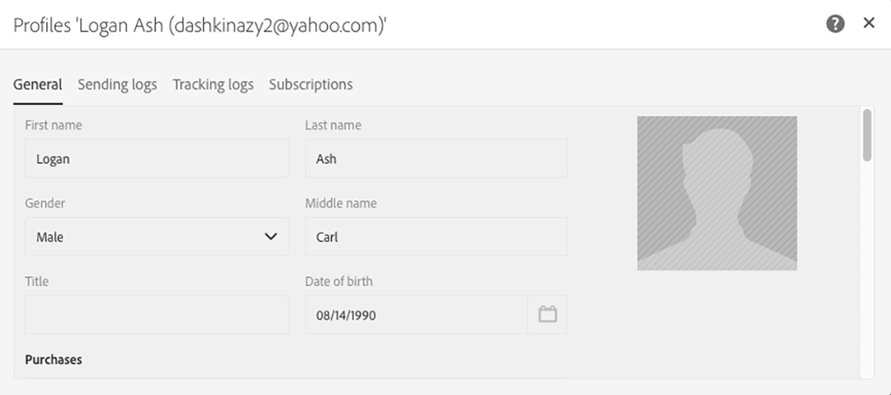
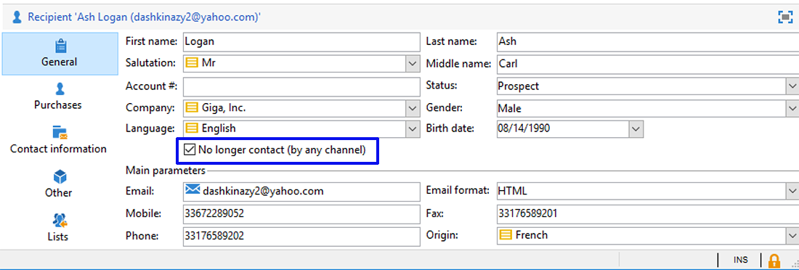

# Sincronizar perfis{#synchronizing-profiles}

O ACS Connector replica dados do Campaign v7 para o Campaign Standard. Os dados recebidos do Campaign v7 podem ser usados no Campaign Standard para criar deliveries. É possível ver como os perfis são sincronizados executando as operações listadas abaixo.

* **Add new recipients**: crie um novo recipient no Campaign v7 e confirme se um perfil correspondente foi replicado para o Campaign Standard. Consulte [Criar um novo recipient](#creating-a-new-recipient).
* **Atualizar recipients**: edite um novo recipient no Campaign v7 e exiba o perfil correspondente no Campaign Standard para confirmar se a atualização foi replicada. Consulte [Editar um recipient](#editing-a-recipient).
* **Criar um fluxo de trabalho no Campaign Standard**: crie um fluxo de trabalho no Campaign Standard que inclui uma consulta com um público ou perfis replicados do Campaign v7. Consulte [Criar um fluxo de trabalho](#creating-a-workflow).
* **Criar um delivery no Campaign Standard**: siga o fluxo de trabalho até a conclusão para enviar um delivery. Consulte [Criar um delivery](#creating-a-delivery).
* **Verify the unsubscription link**: use uma aplicação web do Campaign v7 para confirmar que a escolha do recipient de cancelar a subscrição de um serviço será enviada ao banco de dados do Campaign v7. A opção para parar de receber o serviço é replicada para o Campaign Standard. Consulte [Alterar o link de cancelamento de subscrição](#changing-the-unsubscription-link).

## Pré-requisitos {#prerequisites}

As seções a seguir descrevem como o ACS Connector ajuda a adicionar e editar recipients no Campaign v7 e, em seguida, usá-los em uma delivery do Campaign Standard. O ACS Connector requer o seguinte:

* Recipientes no Campaign v7 replicados para o Campaign Standard.
* Direitos de usuário para executar workflows no Campaign v7 e Campaign Standard.
* Direitos de usuário para criar e executar uma delivery no Campaign Standard.

## Alterar o link de cancelamento de subscrição {#changing-the-unsubscription-link}

Quando um recipient clica no link de cancelar subscrição em um e-mail enviado pelo Campaign Standard, o perfil correspondente no Campaign Standard é atualizado. Para fazer com que um perfil replicado inclua a escolha de um usuário para cancelar a subscrição de um serviço, as informações devem ser enviadas para o Campaign v7 em vez do Campaign Standard. Para executar a alteração, o cancelamento de subscrição do serviço é vinculado a uma aplicação Web do Campaign v7, em vez do Campaign Standard..

>[!NOTE]
>
>Peça ao consultor para configurar a aplicação Web para o cancelamento de subscrição do serviço antes de seguir as etapas abaixo.

## Criar um novo recipient {#creating-a-new-recipient}

1. Crie um novo recipient no Campaign v7 para replicação no Campaign Standard. Insira o máximo possível de informações, incluindo o sobrenome, nome, endereço de email e endereço postal do recipient. No entanto, não escolha uma **[!UICONTROL Salutation]**, já que ela será adicionada na próxima seção, [Editar um recipient](#editing-a-recipient). Para obter mais informações, consulte [Adicionar recipients](../../platform/using/adding-profiles.md).

   

1. Confirme se o novo recipient foi adicionado ao Campaign Standard. Ao revisar o perfil, verifique se os dados inseridos no Campaign v7 também estão disponíveis no Campaign Standard. Para saber onde encontrar perfis no Campaign Standard, consulte [Noções básicas de navegação](https://experienceleague.adobe.com/docs/campaign-standard/using/getting-started/discovering-the-interface/interface-description.html?lang=pt-BR).

   

   Por padrão, a replicação periódica do ACS Connector ocorre uma vez a cada 15 minutos. Para obter mais informações, consulte [Replicação de dados](../../integrations/using/acs-connector-principles-and-data-cycle.md#data-replication).

## Editar um recipient {#editing-a-recipient}

As etapas abaixo para alterar um ponto único de dados oferecem um exemplo simples de como o Campaign v7 se torna o banco de dados principal do Campaign Standard ao usar a replicação de dados. Modificar ou excluir dados replicados no Campaign v7 tem o mesmo efeito nos dados correspondentes no Campaign Standard.

1. Escolha o recipient recém-criado em [Criar um novo destinatário](#creating-a-new-recipient) e edite o nome dele. Por exemplo, escolha uma **[!UICONTROL Salutation]** para o recipient (por exemplo, Sr. ou Sra.). Para obter mais informações, consulte [Editar um perfil](../../platform/using/editing-a-profile.md).

   

1. Confirme se o nome do recipient foi atualizado no Campaign Standard. Para saber onde encontrar perfis no Campaign Standard, consulte [Noções básicas de navegação](https://experienceleague.adobe.com/docs/campaign-standard/using/getting-started/discovering-the-interface/interface-description.html).

   

   Por padrão, a replicação periódica do ACS Connector ocorre uma vez a cada 15 minutos. Para obter mais informações, consulte [Replicação de dados](../../integrations/using/acs-connector-principles-and-data-cycle.md#data-replication).

## Criar um fluxo de trabalho {#creating-a-workflow}

Os perfis e os serviços replicados do Campaign v7 estão disponíveis para os profissionais de marketing digital para aproveitar os dados avançados do Campaign Standard. As instruções abaixo demonstram como adicionar uma consulta a um workflow do Campaign Standard e, em seguida, usá-lo com o banco de dados replicado.

Para obter mais informações e instruções completas sobre workflows do Campaign Standard, consulte [Workflows](../../workflow/using/about-workflows.md).

1. Vá para o Campaign Standard e clique em **[!UICONTROL Marketing Activities]**.
1. Clique em **[!UICONTROL Create]** no canto superior direito.
1. Clique em **[!UICONTROL Workflow]**.
1. Clique em **[!UICONTROL New workflow]** e **[!UICONTROL Next]**.
1. Digite um nome para o workflow no campo **[!UICONTROL Label]** bem como informações adicionais, caso necessário. Clique em **[!UICONTROL Next]**.
1. A partir de **[!UICONTROL Targeting]** à esquerda, arraste um target **[!UICONTROL Query]** para o espaço de trabalho.

   

1. Clique duas vezes na atividade **[!UICONTROL Query]** e escolha um parâmetro que possa ser usado com o banco de dados replicado. Por exemplo, é possível:

   * Arraste **[!UICONTROL Profiles]** para o espaço de trabalho. Use o menu suspenso do campo para escolher **[!UICONTROL Is external resource]** e encontrar perfis que foram replicados do Campaign v7.
   * Arraste outros parâmetros da consulta para direcionar ainda mais os perfis replicados.

## Criar um delivery {#creating-a-delivery}

>[!NOTE]
>
>As instruções para criar o delivery dão continuidade ao fluxo de trabalho iniciado em [Criar um fluxo de trabalho](#creating-a-workflow).

Os profissionais de marketing digital podem utilizar uma aplicação Web do Campaign v7 para certificar que a escolha de um recipient de cancelar a subscrição de um serviço é enviada ao banco de dados do Campaign v7. Depois que o recipient clicar no link cancelar a subscrição, a opção para parar de receber o serviço é replicada do Campaign v7 para o Campaign Standard. Para obter detalhes adicionais, consulte [Alterar o link de cancelamento de subscrição](#changing-the-unsubscription-link).

Siga as etapas abaixo para adicionar uma delivery de e-mail a um workflow existente com o serviço de cancelamento de subscrição criado no Campaign v7. Para obter mais informações e instruções completas sobre workflows do Campaign Standard, consulte este [documento](../../workflow/using/about-workflows.md).

>[!NOTE]
>
>Peça ao consultor para configurar a aplicação Web para o cancelamento de subscrição do serviço antes de seguir as etapas abaixo.

1. Clique em **[!UICONTROL Channels]** à esquerda.
1. Arraste **[!UICONTROL Email delivery]** para o workflow existente no espaço de trabalho.

   

1. Clique duas vezes na atividade **[!UICONTROL Email delivery]** e escolha **[!UICONTROL Single send email]** ou **[!UICONTROL Recurring email]**. Selecione as opções e clique em **[!UICONTROL Next]**.
1. Clique em **[!UICONTROL Send via email]** e **[!UICONTROL Next]**.

   

1. Insira um nome para o delivery no campo **[!UICONTROL Label]** e informações adicionais, caso seja necessário. Clique em **[!UICONTROL Next]**.

   

1. No campo **[!UICONTROL Subject]**, insira o assunto que aparecerá na caixa de entrada do email do recipient.
1. Clique em **[!UICONTROL Change content]** para adicionar um modelo HTML.

   

1. Escolha o conteúdo que inclui o link para cancelar a subscrição do serviço. Clique em **[!UICONTROL Confirm]**.

   

1. O link de cancelamento de subscrição atual deve ser substituído por um novo que usa a aplicação Web criada pelo seu consultor. Localize o link de cancelamento de subscrição na parte inferior do conteúdo do e-mail e clique nele uma vez. Clique no ícone da lixeira para excluir o link.

   

1. Clique dentro da mesma área de conteúdo e digite **Unsubscription link**.

   

1. Realce o texto com o cursor e clique no ícone de corrente.
1. Clique em **[!UICONTROL Link to a landing page]**.

   

1. Clique no ícone da pasta para escolher a página inicial.

   

1. Escolha a aplicação web criada pelo consultor e clique em **[!UICONTROL Confirm]**.

   

1. Clique em **[!UICONTROL Create]**.
1. Retorne ao workflow clicando no nome do delivery.

   

1. Clique em **[!UICONTROL Start]** para enviar o delivery. O ícone de delivery de email pisca para indicar que está sendo preparado para o delivery.

   

1. Clique duas vezes no canal **[!UICONTROL Email delivery]** e escolha **[!UICONTROL Confirm]** para enviar o email. Clique em **[!UICONTROL OK]** para enviar as mensagens.

   

## Verificar o serviço de cancelamento de subscrição {#verifying-the-unsubscription-service}

Siga as instruções em [Criar um fluxo de trabalho](#creating-a-workflow) e [Criar um delivery](#creating-a-delivery) antes de seguir para as etapas abaixo.

1. O recipient clica no link de cancelamento de subscrição na delivery do e-mail.

   

1. O recipient confirma o cancelamento de subscrição.

   

1. Os dados do recipient no Campaign v7 são atualizados para refletir que o usuário cancelou a subscrição. Confirme se a caixa **[!UICONTROL No longer contact (by any channel)]** está marcada para o recipient. Para saber como exibir um recipient no Campaign v7, consulte [Edição de um perfil](../../platform/using/editing-a-profile.md).

   

1. Vá para o Campaign Standard e abra os detalhes do perfil do recipient. Confirme se uma caixa de seleção aparece ao lado de **[!UICONTROL No longer contact (by any channel)]**. Para saber onde encontrar perfis no Campaign Standard, consulte [Noções básicas de navegação](https://experienceleague.adobe.com/docs/campaign-standard/using/getting-started/discovering-the-interface/interface-description.html).

   
