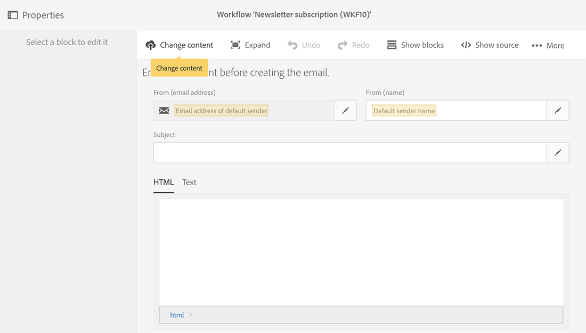

# Sincronia de perfis{#synchronizing-profiles}

O ACS Connector replica dados do Campaign v7 para o Campaign Standard. Os dados recebidos do Campaign v7 podem ser usados no Campaign Standard para criar deliveries. É possível ver como os perfis são sincronizados executando as operações listadas abaixo.

* **Adicionar novos destinatários**: Crie um novo destinatário no Campaign v7 e confirme se um perfil correspondente foi replicado para o Campaign Standard. See [Creating a new recipient](#creating-a-new-recipient).
* **Atualizar destinatários**: Edite um novo destinatário no Campaign v7 e exiba o perfil correspondente no Campaign Standard para confirmar que a atualização foi replicada. Consulte [Edição de um destinatário](#editing-a-recipient).
* **Crie um fluxo de trabalho no Campaign Standard**: Crie um fluxo de trabalho no Campaign Standard que inclua uma consulta com um público-alvo ou perfis replicados do Campaign v7. Consulte [Criação de um fluxo de trabalho](#creating-a-workflow).
* **Crie uma entrega no Campaign Standard**: Siga o fluxo de trabalho até a conclusão para enviar uma entrega. Consulte [Criação de uma entrega](#creating-a-delivery).
* **Verifique o link** de cancelamento de assinatura: Use um aplicativo da Web Campaign v7 para garantir que a opção do destinatário de cancelar a assinatura de um serviço seja enviada para o banco de dados Campaign v7. A opção para parar de receber o serviço é replicada para o Campaign Standard. See [Changing the unsubscription link](#changing-the-unsubscription-link).

## Pré-requisitos {#prerequisites}

As seções a seguir descrevem como o ACS Connector ajuda a adicionar e editar recipients no Campaign v7 e, em seguida, usá-los em uma delivery do Campaign Standard. O ACS Connector requer o seguinte:

* Recipientes no Campaign v7 replicados para o Campaign Standard.
* Direitos de usuário para executar workflows no Campaign v7 e Campaign Standard.
* Direitos de usuário para criar e executar uma delivery no Campaign Standard.

## Aprovação do link de cancelamento de subscrição {#changing-the-unsubscription-link}

Quando um recipient clica no link de cancelar subscrição em um e-mail enviado pelo Campaign Standard, o perfil correspondente no Campaign Standard é atualizado. Para fazer com que um perfil replicado inclua a escolha de um usuário para cancelar a subscrição de um serviço, as informações devem ser enviadas para o Campaign v7 em vez do Campaign Standard. Para executar a alteração, o cancelamento de subscrição do serviço é vinculado a uma aplicação Web do Campaign v7, em vez do Campaign Standard..

>[!NOTE]
>
>Peça ao consultor para configurar a aplicação Web para o cancelamento de subscrição do serviço antes de seguir as etapas abaixo.

## Criação de um novo recipient {#creating-a-new-recipient}

1. Crie um novo recipient no Campaign v7 para replicação no Campaign Standard. Insira o máximo possível de informações, incluindo o sobrenome, nome, endereço de email e endereço postal do recipient. However, do not choose a **[!UICONTROL Salutation]** since it will be added in the next section, [Editing a recipient](#editing-a-recipient). Para obter mais informações, consulte [Adicionando recipients](../../platform/using/adding-profiles.md).

   

1. Confirme se o novo recipient foi adicionado ao Campaign Standard. Ao revisar o perfil, verifique se os dados inseridos no Campaign v7 também estão disponíveis no Campaign Standard. Para saber onde encontrar perfis no Campaign Standard, consulte [Noções básicas de navegação](https://docs.adobe.com/content/help/en/campaign-standard/using/getting-started/discovering-the-interface/interface-description.html).

   

   Por padrão, a replicação periódica do ACS Connector ocorre uma vez a cada 15 minutos. Para obter mais informações, consulte Replicação [de](../../integrations/using/acs-connector-principles-and-data-cycle.md#data-replication)dados.

## Edição de um recipient {#editing-a-recipient}

As etapas abaixo para alterar um ponto único de dados oferecem um exemplo simples de como o Campaign v7 se torna o banco de dados mestre para o Campaign Standard ao usar a replicação de dados. Modificar ou excluir dados replicados no Campaign v7 tem o mesmo efeito nos dados correspondentes no Campaign Standard.

1. Escolha o destinatário recém-criado em [Criar um novo destinatário](#creating-a-new-recipient) e edite o nome do destinatário. For example, choose a **[!UICONTROL Salutation]** for the recipient (e.g. Mr. or Mrs.). Para obter mais informações, consulte [Edição de um perfil](../../platform/using/editing-a-profile.md).

   

1. Confirme se o nome do recipient foi atualizado no Campaign Standard. Para saber onde encontrar perfis no Campaign Standard, consulte [Noções básicas de navegação](https://docs.adobe.com/content/help/en/campaign-standard/using/getting-started/discovering-the-interface/interface-description.html).

   

   Por padrão, a replicação periódica do ACS Connector ocorre uma vez a cada 15 minutos. Para obter mais informações, consulte Replicação [de](../../integrations/using/acs-connector-principles-and-data-cycle.md#data-replication)dados.

## Criação de um workflow {#creating-a-workflow}

Os perfis e os serviços replicados do Campaign v7 estão disponíveis para os profissionais de marketing digital para aproveitar os dados avançados do Campaign Standard. As instruções abaixo demonstram como adicionar uma consulta a um workflow do Campaign Standard e, em seguida, usá-lo com o banco de dados replicado.

Para obter mais informações e instruções completas sobre workflows do Campaign Standard, consulte [Workflows](https://docs.adobe.com/content/help/en/campaign-standard/using/managing-processes-and-data/about-workflows-and-data-management/workflow-data-and-processes.html).

1. Go to Campaign Standard and click **[!UICONTROL Marketing Activities]**.
1. Click **[!UICONTROL Create]** on the upper right.
1. Clique em **[!UICONTROL Workflow]**.
1. Clique em **[!UICONTROL New workflow]** e **[!UICONTROL Next]**.
1. Enter a name for the workflow in the **[!UICONTROL Label]** field and additional information if needed. Clique em **[!UICONTROL Next]**.
1. From **[!UICONTROL Targeting]** on the left, drag a **[!UICONTROL Query]** target to the workspace.

   

1. Double click the **[!UICONTROL Query]** activity and choose a parameter that can be used with the replicated database. Por exemplo, é possível:

   * Drag **[!UICONTROL Profiles]** to the workspace. Use the field pull-down menu to choose **[!UICONTROL Is external resource]** to find profiles that were replicated from Campaign v7.
   * Arraste outros parâmetros da consulta para direcionar ainda mais os perfis replicados.

## Criação de um delivery.{#creating-a-delivery}

>[!NOTE]
>
>The instructions for creating the delivery continue the workflow started with [Creating a workflow](#creating-a-workflow).

Os profissionais de marketing digital podem utilizar uma aplicação Web do Campaign v7 para certificar que a escolha de um recipient de cancelar a subscrição de um serviço é enviada ao banco de dados do Campaign v7. Depois que o recipient clicar no link cancelar a subscrição, a opção para parar de receber o serviço é replicada do Campaign v7 para o Campaign Standard. Para obter detalhes adicionais, consulte [Alteração do link](#changing-the-unsubscription-link)de cancelamento de assinatura.

Siga as etapas abaixo para adicionar uma delivery de e-mail a um workflow existente com o serviço de cancelamento de subscrição criado no Campaign v7. Para obter mais informações e instruções completas sobre workflows do Campaign Standard, consulte este [documento](https://docs.adobe.com/content/help/en/campaign-standard/using/managing-processes-and-data/about-workflows-and-data-management/workflow-data-and-processes.html).

>[!NOTE]
>
>Peça ao consultor para configurar a aplicação Web para o cancelamento de subscrição do serviço antes de seguir as etapas abaixo.

1. Click **[!UICONTROL Channels]** on the left.
1. Drag **[!UICONTROL Email delivery]** to the existing workflow in the workspace.

   

1. Clique duas vezes na **[!UICONTROL Email delivery]** atividade e escolha **[!UICONTROL Single send email]** ou **[!UICONTROL Recurring email]**. Selecione suas opções e clique em **[!UICONTROL Next]**.
1. Clique em **[!UICONTROL Send via email]** e em **[!UICONTROL Next]**.

   

1. Enter a name for the delivery in the **[!UICONTROL Label]** field and additional information if needed. Clique em **[!UICONTROL Next]**.

   

1. In the **[!UICONTROL Subject]** field, enter the subject that will appear in the recipient&#39;s email inbox.
1. Click **[!UICONTROL Change content]** to add an HTML template.

   

1. Escolha o conteúdo que inclui o link para cancelar a subscrição do serviço. Clique em **[!UICONTROL Confirm]**.

   

1. O link de cancelamento de subscrição atual deve ser substituído por um novo que usa a aplicação Web criada pelo seu consultor. Localize o link de cancelamento de subscrição na parte inferior do conteúdo do e-mail e clique nele uma vez. Clique no ícone da lixeira para excluir o link.

   

1. Clique dentro da mesma área de conteúdo e digite **Unsubscription link**.

   

1. Realce o texto com o cursor e clique no ícone de corrente.
1. Clique em **[!UICONTROL Link to a landing page]**.

   

1. Clique no ícone da pasta para escolher a página inicial.

   

1. Choose the web application created by the consultant and click **[!UICONTROL Confirm]**.

   

1. Clique em **[!UICONTROL Create]**.
1. Retorne ao workflow clicando no nome da delivery.

   

1. Click **[!UICONTROL Start]** to send the delivery. O ícone de delivery de e-mail pisca para indicar que está sendo preparado para delivery.

   

1. Double click the **[!UICONTROL Email delivery]** channel and choose **[!UICONTROL Confirm]** to send the email. Click **[!UICONTROL OK]** to send the messages.

   

## Verificação do serviço de cancelamento de subscrição {#verifying-the-unsubscription-service}

Siga as instruções em [Criar um fluxo de trabalho](#creating-a-workflow) e [Criar uma entrega](#creating-a-delivery) antes de seguir para as etapas abaixo.

1. O recipient clica no link de cancelamento de subscrição na delivery do e-mail.

   

1. O recipient confirma o cancelamento de subscrição.

   

1. Os dados do recipient no Campaign v7 são atualizados para refletir que o usuário cancelou a subscrição. Confirm that the box **[!UICONTROL No longer contact (by any channel)]** is checked for the recipient. Para saber como exibir um recipient no Campaign v7, consulte [Edição de um perfil](../../platform/using/editing-a-profile.md).

   

1. Vá para o Campaign Standard e abra os detalhes do perfil do recipient. Confirme se uma caixa de seleção é exibida ao lado de **[!UICONTROL No longer contact (by any channel)]**. Para saber onde encontrar perfis no Campaign Standard, consulte [Noções básicas de navegação](https://docs.adobe.com/content/help/en/campaign-standard/using/getting-started/discovering-the-interface/interface-description.html).

   

